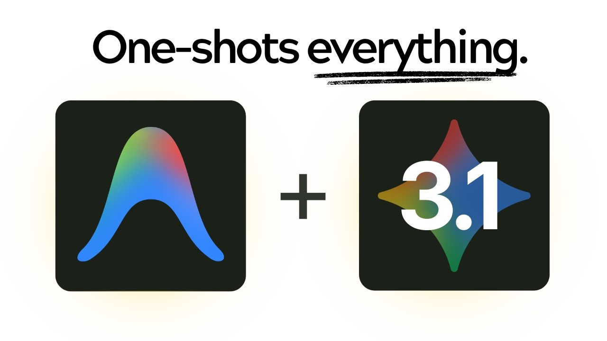
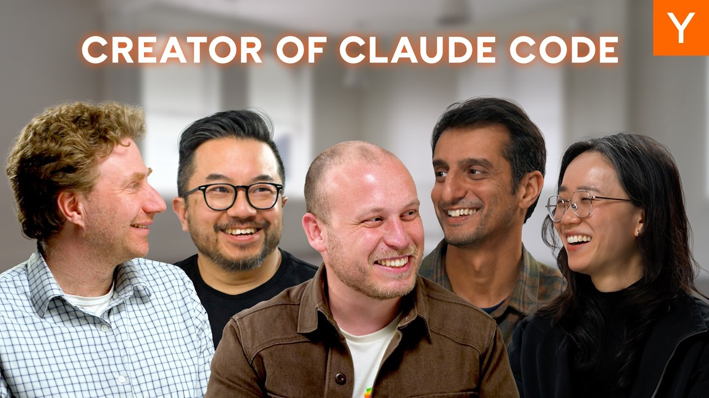

## TLDR

OpenClaw became the fastest-growing GitHub repo ever (200K stars in 84 days) and an entire ecosystem of agent skills, memory systems, and sales automations is forming around it. YC coined "20x companies" — startups with 5 engineers outcompeting 100-person teams through relentless AI automation. This is the pattern we help founders build. If they're not thinking in agents yet, they're already behind — and that's our opening.

## The Big Picture

### OpenClaw Is Building a Platform, Not a Chatbot

OpenClaw crossed 200K GitHub stars in 84 days — the fastest any software repo has ever grown. But the real story isn't the repo. It's what people are building on top: [autonomous agents managing inboxes via Telegram](https://x.com/code_rams/status/2025630269559185648), [outbound sales systems booking 100+ calls per month](https://x.com/iamliamsheridan/status/2025277677708451965), and [skill-based architectures](https://x.com/jordymaui/status/2024251460553199935) that are replacing multi-agent setups entirely. One builder went from spending hundreds per week on multi-agent API calls to [$90/month by switching to a single agent with specialized skills](https://x.com/jordymaui/status/2024251460553199935).

**Your angle with founders:** "Are you stitching together point solutions, or building on something with an ecosystem? The agents people are shipping on top of OpenClaw are wild — but they all need infrastructure underneath. That's the conversation."

### YC Says the Future Is "20x Companies"

Garry Tan [introduced the concept at YC](https://www.youtube.com/watch?v=rWUWfj_PqmM): startups that beat incumbents 20x their size by automating every internal function with AI, not just one. Giga ML closed DoorDash with 4-5 engineers against 100+ person competitors. Legion Health grew 4x revenue with zero net new hires — 3 people handling thousands of patients. These are exactly the AI-native startups we're built to support — small teams, massive compute needs, and they qualify for Google for Startups Cloud credits from day one.

**Your angle with founders:** "Giga ML is closing DoorDash with 5 people — they've got agents handling sales, support, and ops, all running on cloud infrastructure. What would your company look like if you spun up an agent for every function? That's what Agent Builder and ADK are for — and we'll give you up to $350K in credits to figure it out."

## Builder's Corner

### One-Shot Landing Pages Are Now Trivial

Gemini 3.1 Pro is [generating pixel-perfect cinematic landing pages](https://www.youtube.com/watch?v=czLrUyA_Bh4) — scroll animations, frosted glass, luxury typography — in a single prompt. A 16-year-old wrote the prompt. Nick Saraev built a CLI that walks through a Q&A then generates the entire site. This is our model, our platform — worth sharing with any founder who's still spending weeks on a marketing site.

**Why founders care:** Design cost just collapsed to near-zero. Forward this video to a founder who's waiting on their dev team to ship a landing page.

### Boris Cherny Ships 20 PRs a Day Without Touching Code

The creator of Claude Code [hasn't manually edited code since Opus 4.5](https://www.youtube.com/watch?v=PQU9o_5rHC4). He runs 10-15 parallel sessions daily and lands ~20 PRs per day. The Plugins feature was entirely built by a swarm of agents over a weekend — an engineer gave Claude a spec and a task board, and agents self-organized to ship it. Anthropic's engineering productivity grew 150% since launch. Worth noting: Claude is available in our Model Garden via Vertex AI — founders building with Claude can run it on our infrastructure.

**Why founders care:** This is what AI-native development actually looks like. The compounding advantage for startups adopting these patterns now is real.

## Founder Watch

### Rork Max — a16z Bets $2.8M on Replacing Xcode

Rork [abandoned React Native for native Swift](https://x.com/aakashgupta/status/2024704259489747266) and chose Claude Code + Opus 4.6 over GPT-5. The pitch: one-shot native app generation for all Apple platforms from a browser. There are 34M registered Apple developers, and Xcode is a 21-year-old IDE with zero competitive pressure to modernize. If this works, the IDE/build system/simulator complexity collapses into a website.

**Conversation starter:** "Rork just raised $2.8M to replace Xcode with AI. Are any of your developers still fighting their toolchain instead of shipping?"

### A Cardiologist Placed 3rd Out of 13,000 at Anthropic's Hackathon

A practicing physician [built postvisit.ai in 7 days](https://x.com/trajektoriePL/status/2024774752116658539) — an AI care platform with a reverse scribe and patient companion. No engineering background. Built entirely with Claude and a massive context window. This is the "everyone is a builder" moment — and healthcare AI startups are exactly the kind of founders entering our pipeline right now.

**Conversation starter:** "A cardiologist just beat 13,000 people at a coding hackathon. Are non-engineers on your team building with AI yet?"

## Quick Hits

- **[SaaS is getting unbundled by agents](https://x.com/johnrushx/status/2025735534698578218)** — builders are replacing 30+ subscription tools with a single agent interface. This is why Agent Builder and ADK matter — the pattern needs managed infrastructure.
- **[Only 0.3% of 8.1B people pay for AI](https://x.com/NoahEpstein_/status/2025604838617170268)** — the adoption gap is enormous. Seven concrete startup ideas in the thread, all of which need cloud infrastructure to scale.
- **[Prompt repetition boosts accuracy from 21% to 97%](https://x.com/aakashgupta/status/2023998053737541636)** — Google Research tested 7 models: pasting the same prompt twice is a nearly free accuracy boost.

## Try This Week

Forward the [Gemini landing page video](https://www.youtube.com/watch?v=czLrUyA_Bh4) to a founder who's spending too long on their marketing site. Then ask: "If Gemini can do this in one prompt, what else in your workflow is taking longer than it should?" It opens the door to a broader conversation about AI-native operations — and that's where credits, compute, and platform become real.

---

*Sources: 48 bookmarks, 3 videos from the AI content library. [Archive](/archive)*
