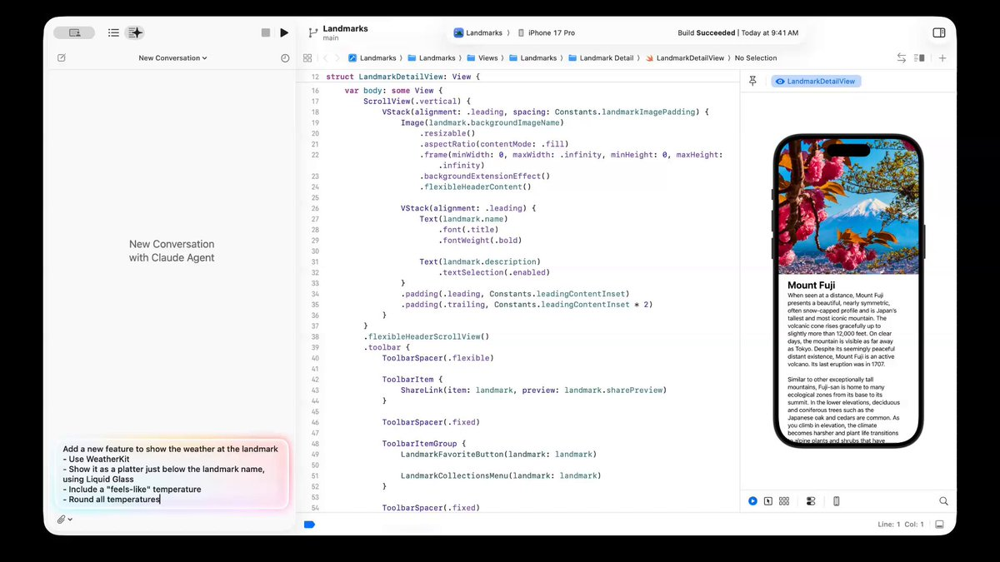
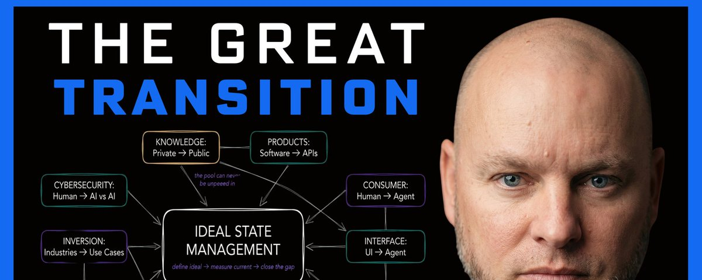
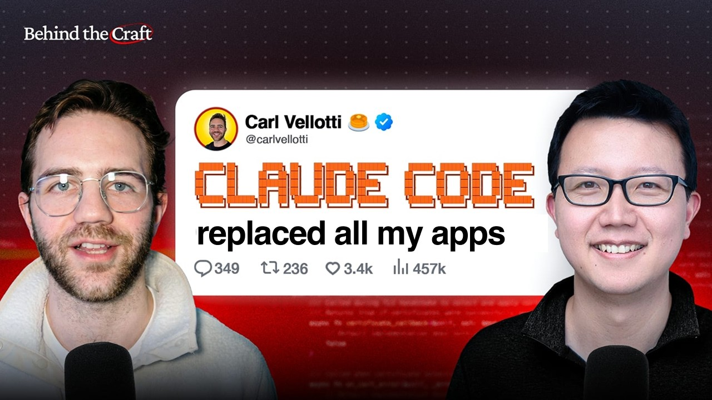

## TLDR

Apple shipped Claude Code natively in Xcode while Cursor's $29B valuation wobbles. Block cut 4,000 employees, deployed an AI agent across operations, and posted their best quarter ever. The developer toolchain and the org chart are both being rewritten by agents — simultaneously.

## The Big Picture: The Agent Infrastructure Shift

### Apple Bakes Claude Code into Xcode — Cursor Wobbles

Apple integrated Claude Code, Codex, and MCP support directly into Xcode 26.3. [(1 min read)](https://x.com/minchoi/status/2027409663822561632) Meanwhile, Cursor's $29B valuation is looking fragile — entire engineering teams are canceling, and [the trip back down could be just as fast](https://x.com/aakashgupta/status/2027246737568813476) (1 min read). When Apple ships your competitor's technology natively, the standalone IDE play gets harder.

**Your angle:** "Apple just baked Claude Code into Xcode. Cursor's at $29B but teams are canceling. Where are your devs placing their bets?"

### Block Cuts 4,000, Posts Best Quarter — Powered by AI Agents

Block cut 4,000 employees, posted record results, stock surged 23% — powered by Goose, an open-source AI agent built on Anthropic's MCP. [(1 min read)](https://x.com/AnishA_Moonka/status/2027145722387472737) Daniel Miessler's "Great Transition" framework [(1.5 hr deep dive)](https://x.com/DanielMiessler/status/2027734353871298632) explains why this is just the start: the ideal employee count is trending to zero.

**Your angle:** "Block replaced 4,000 roles with an AI agent and had their best quarter. What does your org chart look like in 12 months?"

### OpenClaw Creator: 80% of Apps Will Disappear

Peter Steinberger says most apps are just data management — and agents running locally on your machine can handle that better than a dedicated UI. [(22 min watch)](https://www.youtube.com/watch?v=4uzGDAoNOZc) The real moat, he argues, isn't models or interfaces — it's memory and personalization.

**Your angle:** "If 80% of apps are just data management, what does that mean for your product roadmap?"

## Builder's Corner

### Claude Code + MCP = Your Entire Workflow, Automated

A step-by-step tutorial shows how to connect Claude Code to Google Workspace, Slack, and Reddit via MCP servers — pulling calendar events, Linear issues, and auto-updating sprint docs. [(42 min watch)](https://www.youtube.com/watch?v=1B3Ffo8snfY) This isn't just coding automation; it's business operations automation.

**Why founders care:** Imagine Claude handling half your team's routine communication and updates. That's what MCP integration unlocks.

## Founder Watch: General-Purpose AI Beats Specialized Tools

### Agent Infrastructure Replaces $27k/mo in Salaries

One team replaced $27,000/month in salaries by building agent infrastructure. [(1 min read)](https://x.com/ericosiu/status/2027819009882857769) The moat isn't the individual agents — it's the orchestration layer that manages them.

**Conversation starter:** "Are you looking at agents as tools, or as a fundamental shift in how you staff operations?"

### Lawyers Ditch Legal AI for Plain Claude

Lawyers are dropping specialized products like Harvey and CoCounsel in favor of general-purpose Claude — teaching it how they practice law. One used it for construction doc review and [it caught a 20% garage ramp grade that would scrape vehicles](https://x.com/zackbshapiro/status/2027393196880241072) (1 min read). General-purpose is beating specialized.

**Conversation starter:** "If lawyers are building Claude-native workflows instead of buying legal SaaS, what does that mean for specialized tools in your industry?"

### Fundraising Masterclass: pmarca, Ron Conway, Parker Conrad

50-minute lecture that will teach you more about raising capital than a 2-year MBA. [(Tweet)](https://x.com/Founder_Mode_/status/2027200771578601972) Worth forwarding to any founder prepping for their next round.

## Quick Hits

- **[Perplexity now powers 100M+ Samsung phones](https://x.com/cryptopunk7213/status/2027131287283040488) (1 min read)** — Rolling out as the default AI assistant for Bixby, challenging Google's mobile AI distribution.
- **[Only 2.5% of AI agent tasks complete successfully](https://x.com/NoahEpstein_/status/2027354556468748562) (1 min read)** — Human-curated skills help; self-generated skills offer zero benefit.
- **[Hegseth calls Anthropic "a master class in arrogance"](https://x.com/SecWar/status/2027507717469049070) (1 min read)** — Pentagon demands full unrestricted AI access. The company behind Claude Code is now in a public fight with Defense.

## Try This Week

Forward the [Claude Code for PMs tutorial](https://www.youtube.com/watch?v=1B3Ffo8snfY) (42 min watch) to a founder who's still managing projects manually. The MCP setup alone — auto-pulling calendar, Linear, and Slack into one workflow — is a concrete demo of what agents can do today.

## Our Play

### DeepMind's "Zero-Human Company" Is Already Running

Google DeepMind's "Intelligent AI Delegation" paper reveals their Zero-Human Company production system has been live since January 2026. [(1 min read)](https://x.com/BrianRoemmele/status/2027268778266943964) This isn't a research paper — it's a signal about where Google is heading internally.

### ADK: Agent Design Patterns You Can Use Today

New Google Cloud Tech tutorial walks through Single, Sequential, and Parallel agent patterns using the Agent Development Kit (ADK). [(8 min watch)](https://www.youtube.com/watch?v=GDm_uH6VxPY) Practical building blocks for the agent infrastructure everyone's talking about this week.

*Connect to this week:* DeepMind's running the zero-employee system. ADK gives builders the patterns to start. The infrastructure shift from Big Picture is what Google is tooling for.

---

*Sources: 64 bookmarks, 6 videos from the AI content library. [Archive](/archive)*
