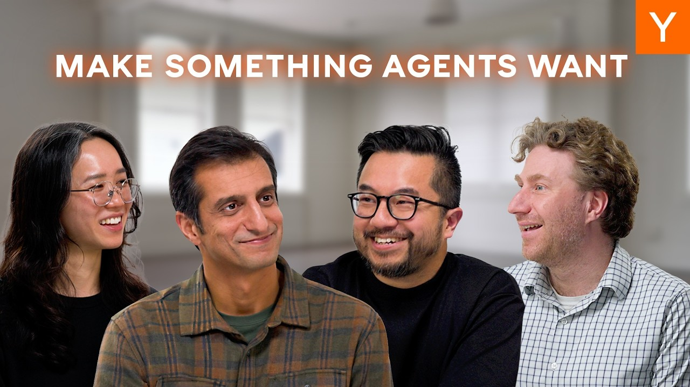
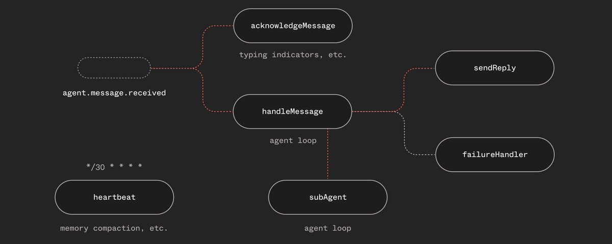
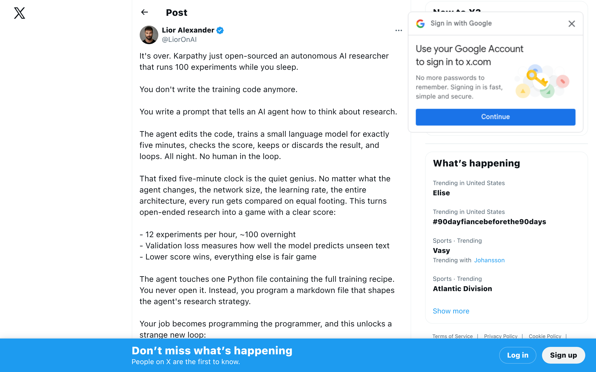
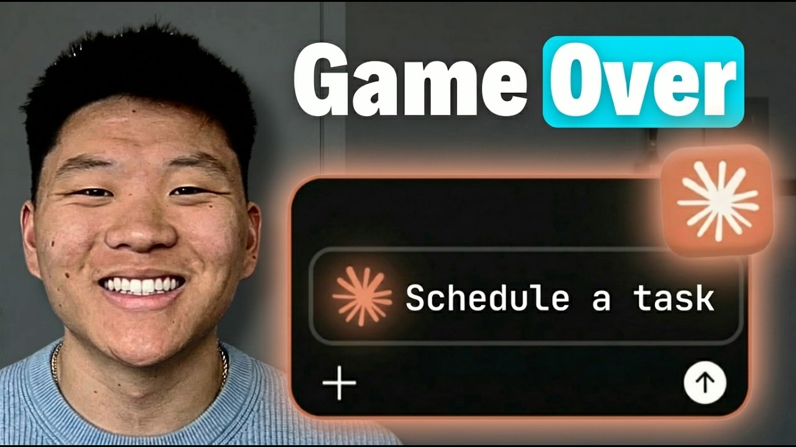

## TLDR

Non-technical CEOs are automating entire businesses with AI agents — staying up till 2am running four concurrent Claude Code workers. The industry converged on "agent harnesses" as the architecture that actually works. And multi-agent tools are shipping to real users faster than anyone predicted.

## The Big Picture: The Harness Era Begins

### Non-Technical CEOs Are Running Agent Businesses at 2am

YC's latest Lightcone episode dropped a line that should make every founder pause: [non-technical CEOs are now automating entire businesses with AI agents (23 min watch)](https://www.youtube.com/watch?v=Q8wVMdwhlh4). Former engineering managers who hadn't coded in a decade are up till 2-3am running four concurrent Claude Code workers. The shift isn't from Cursor to Claude Code — it's from "advanced autocomplete" to agents making decisions autonomously. MoltBook launched as the first AI-only community where agents interact without any humans at all.

**Your angle:** "YC is seeing non-technical founders run entire companies with agents at 2am. What's your team automating beyond code?"

### The Industry Locks In on Agent Harnesses

Something clicked this week. Dan Farrelly says [agents need harnesses, not frameworks](https://x.com/djfarrelly/status/2028556984396452250). Aaron Levie (Box CEO) calls the [agent harness a "force multiplier"](https://x.com/levie/status/2028711992320835686). Kishan argues [Stripe and Ramp need their own coding agents](https://x.com/kishan_dahya/status/2028971339974099317), not generic tools. When a startup founder, a Fortune 500 CEO, and an enterprise architect all say the same thing in the same week — that's architecture locking in.

**Your angle:** "Everyone landed on 'harness, not framework' this week. Have you picked your agent architecture, or still experimenting?"

### Karpathy Open-Sources an Overnight Research Lab

Andrej Karpathy [open-sourced an autonomous AI researcher](https://x.com/LiorOnAI/status/2030376700337643742) that runs 100 experiments while you sleep. Separately, Google is [open-sourcing infrastructure used to help Gemini evolve itself](https://x.com/crazydonkey200/status/2030452390345036030). The research loop is going autonomous — and the tools to do it are free.

**Your angle:** "If experiments can run overnight without humans, what does your R&D timeline look like in a year?"

## Builder's Corner

### Claude Code Becomes a 24/7 Employee

Three features shipped in a week that change what's possible. [Scheduled tasks (10 min watch)](https://www.youtube.com/watch?v=BlNJFa3Btm8) run full agent sessions on a cron — not scripts. [Loops (9 min watch)](https://www.youtube.com/watch?v=OUyfxhFtGCo) monitor things every few minutes for up to three days. [Skills 2.0 (30 min watch)](https://www.youtube.com/watch?v=Wxf9oqxODU0) solves "did the agent actually follow my instructions?" The key difference from traditional automation: if a scheduled script hits an error, it stops. A scheduled agent debugs itself and keeps going.

**Why founders care:** Self-healing automation means fewer ops engineers babysitting workflows.

### Data Agents Replace an Entire Analytics Team

Jamie Quint (built Notion's original data stack) published [a guide to building data agents that replace semantic layers](https://x.com/jamiequint/status/2029705203457609785). His stack: Claude Agent SDK + dbt + Slack. Sub-agents read dbt models dynamically. Self-scoring SQL catches bad queries before they reach anyone. Result: planned hiring of 4-5 data analysts cut to 1.

**Why founders care:** One well-built data agent just replaced a Series A analytics team.

## Founder Watch

### Pencil — 100K Users in Eight Weeks for Multi-Agent Design

Tom (CEO of Pencil) built a tool where [six AI agents design apps together in real-time (33 min watch)](https://www.youtube.com/watch?v=w4RY7PnfRU8) — each with its own visible cursor on screen. Plugins for VS Code, Cursor, and AntiGravity. Bring-your-own-agent support. 100K users in eight weeks.

**Conversation starter:** "A design tool with six AI agents just hit 100K users in two months. Are you seeing multi-agent tools show up in your users' workflows?"

### Anthropic vs. The Pentagon — Dario Responds

Last week, Hegseth called Anthropic "a master class in arrogance." This week, Dario Amodei went on [The Economist to explain (7 min watch)](https://www.youtube.com/watch?v=0Q5J8UB3mXE) why Anthropic drew lines on autonomous weapons and mass surveillance. His framing: product safety, not politics — like an aircraft supplier saying "this isn't rated for those conditions." The Trump administration responded by banning federal agencies from Anthropic tools.

**Conversation starter:** "The company behind the most popular coding agent just got banned from federal use. Does that change anything for founders building on Claude?"

## Quick Hits

- **[OpenAI CEO confirms they're building a social network](https://x.com/gregisenberg/status/2029690445548847367)** — Sam Altman goes after X directly. Distribution play, not just a model play.
- **[The era of $5k/month developers is here](https://x.com/WasimShips/status/2029518413326524756)** — AI compressed dev costs so much that SaaS unit economics need rewriting.
- **["You're not building AI agents — you're building LLM wrappers"](https://x.com/aaryan_kakad/status/2028186694932214187)** — A useful framework for evaluating how autonomous your agent actually is.

## Try This Week

Forward the [YC "AI Agent Economy" episode (23 min watch)](https://www.youtube.com/watch?v=Q8wVMdwhlh4) to a founder who thinks agents are just for engineers. The part about non-technical CEOs staying up till 2am running agent businesses will reframe what "automation" actually means now.

## Our Play

### ADK Integrations Ecosystem Connects Agents to Real Workflows

Google opened ADK to [a curated set of third-party integrations](https://developers.googleblog.com/supercharge-your-ai-agents-adk-integrations-ecosystem/) — GitHub, Linear, Notion, MongoDB, Pinecone, and a dozen more. A few lines of code and your ADK agent connects to developer workflows, project management, databases, and observability. This is Google building the connective tissue for the harness architecture the rest of the industry is converging on.

### Cloud Next Is Six Weeks Out

April 22-24 in Las Vegas. With agent harnesses dominating this week's conversation and ADK integrations expanding, expect Cloud Next to push hard on the agent infrastructure story. Worth flagging to any founder planning their Q2 build decisions.

*Connect to this week:* The industry locked in on harnesses. Google's ADK just plugged into the tools those harnesses need to connect to. That's the infrastructure play.

---

*Sources: 90 bookmarks, 21 videos from the AI content library. [Archive](/archive)*
