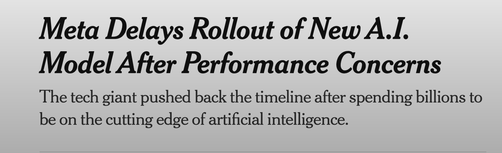
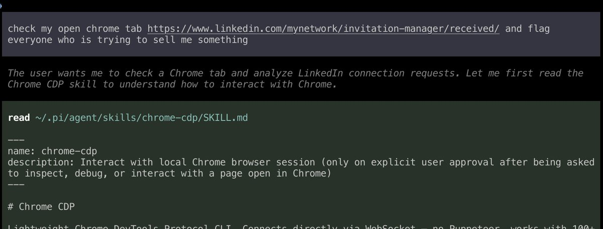
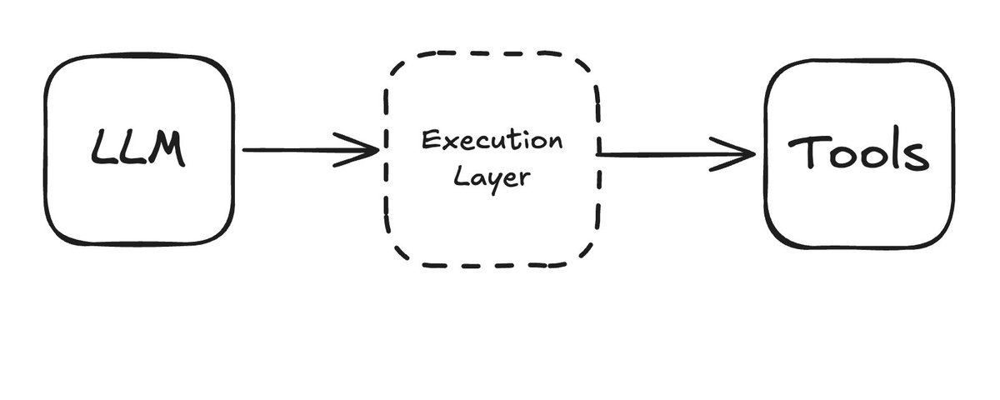

## TLDR

Production agents are hitting an infrastructure wall — 80% of the work isn't AI at all. Meta is reportedly considering licensing Google's Gemini instead of building their own next model — with $135B in capex on the line. And a Sydney data engineer with zero biology training used ChatGPT and AlphaFold to design an mRNA cancer vaccine that shrank his dog's tumors by 75%.

## The Big Picture: The Infrastructure Wall

### Production Agents Have a Hidden 80% Problem

Five invisible layers are killing agents in production: data engineering, state management, retry/recovery, cost governance, and observability. [The breakdown (1 min read)](https://x.com/asmah2107/status/2032782212303598066) includes a sobering example — a travel agent demo costs $0.12 per task, but at production scale that same architecture burns $48K per day. Budget circuit breakers and per-task cost attribution aren't nice-to-haves. They're survival.

**Your angle:** "Everyone demos great agents. How's your cost governance set up for when that $0.12 task runs a million times?"

### Meta May License Gemini Instead of Building Their Own

Reports surfaced that [Meta is delaying their next AI model and may license Gemini instead (1 min read)](https://x.com/cryptopunk7213/status/2032254470311035359) — with [$135B in AI capex (1 min read)](https://x.com/aakashgupta/status/2032318026884972836) on the line. This is the company that built LLaMA. If Meta — with more compute, data, and AI talent than nearly anyone — is considering licensing rather than training, it says something about how expensive and risky the frontier model race has become. For founders choosing which model ecosystem to build on, this changes the calculus.

**Your angle:** "Meta built LLaMA and they're still considering licensing Gemini. When founders ask 'should we train our own model?' — that's your answer."

## Builder's Corner

### Chrome 146: The Browser Is Now an Agent Workspace

Chrome 146 shipped [official MCP support (1 min read)](https://x.com/xpasky/status/2032252486145253865) — one toggle exposes your live browsing session to CLI agents. No custom extensions. No re-authenticating. Your agent browses with your cookies, your sessions, your logged-in state. This is the plumbing that makes browser automation actually work.

**Why founders care:** Agents that can browse the real web — not sandboxed versions — unlock a completely different class of automation.

### The Execution Layer: Agents Need More Than Bash

Rhys Sullivan argues [bash was the accidental first execution layer for agents (1 min read)](https://x.com/RhysSullivan/status/2030903539871154193), but it can't handle shared auth state, approval workflows, scoped tool access, or destructive vs. read-only permissions. His answer: a typed TypeScript environment with proxy objects, virtual filesystems, and KV stores. Open source. His line: "2026 is the year of the execution layer."

**Why founders care:** If your agents are running on bash, they're one bad command from a production incident. The execution layer is the guardrail.

## Founder Watch

### MiroFish — 20-Year-Old Builds a Civilization Simulator, Gets $4.1M

A developer [built MiroFish in 10 days (1 min read)](https://x.com/k1rallik/status/2032837113247395992) — a simulation engine that generates thousands of digital humans with personality, memory, and behavior. Hit #1 on GitHub trending. 22K+ stars. 3M views on the announcement. Chen Tianqiao invested $4.1M. The "God's Eye View" feature: inject variables — rate cuts, CEO resignations — and watch the population reorganize in real time.

**Conversation starter:** "A 20-year-old just built a civilization simulator in 10 days and raised $4.1M. What could your team build in 10 days if agents handled the scaffolding?"

### A Data Engineer Used ChatGPT to Design an mRNA Cancer Vaccine

Paul Conyngham — a Sydney data engineer with zero biology training — used ChatGPT and AlphaFold to design a personalized mRNA cancer vaccine for his rescue dog Rosie after conventional treatment failed. [UNSW's RNA Institute built it in under two months (1 min read)](https://x.com/IterIntellectus/status/2032858964858228817). The tennis ball-sized tumor on her leg [shrank by 75% (5 min read)](https://fortune.com/2026/03/15/australian-tech-entrepreneur-ai-cancer-vaccine-dog-rosie-unsw-mrna/). Total cost: about $3,000. The head of UNSW's RNA Institute said it's "democratizing the whole process." This is the most visceral example yet of what happens when AI tools reach people who have the problem but not the traditional credentials.

**Conversation starter:** "A data engineer just designed an mRNA cancer vaccine with ChatGPT and AlphaFold — no biology background. What problems is your team not solving because they think they need specialists?"

## Quick Hits

- **[Anthropic one-shotted a $200K ARR business (1 min read)](https://x.com/qrimeCapital/status/2032223313540391057)** — Built the functionality directly into Claude. Platform risk is moving faster than ever.
- **[Claude's inline interactive visuals ship (1 min read)](https://x.com/_heyrico/status/2032728107418075189)** — Charts, diagrams, and flowcharts rendered directly in conversation. Thinking aids, not polished deliverables.
- **["Prompting is temporary — structure is permanent" (1 min read)](https://x.com/vishisinghal_/status/2032368817981305196)** — 331K-view thread on the 4-component Claude Code anatomy: CLAUDE.md, skills, hooks, progressive docs.

## Try This Week

Forward the [Fortune story about the mRNA dog vaccine (5 min read)](https://fortune.com/2026/03/15/australian-tech-entrepreneur-ai-cancer-vaccine-dog-rosie-unsw-mrna/) to a founder in health, biotech, or any field where credentialed gatekeeping is the norm. Then ask: "If a data engineer can design a cancer vaccine with AI, what problems in your industry are waiting for someone who just asks the right questions?"

## Our Play

### Google Completes $32B Wiz Acquisition

Google [closed the $32B acquisition of Wiz (1 min read)](https://x.com/MollySOShea/status/2031752320397308111) — the largest acquisition in Google's history. Wiz went from a $6M seed to $32B exit. For founders in the security and cloud infrastructure space, this signals Google is investing aggressively beyond AI models — the full cloud stack, including security, is the play.

### Gemini Embedding 2: Multimodal RAG Goes Native

Google dropped Gemini Embedding 2 — [the first natively multimodal embedding model (15 min watch)](https://www.youtube.com/watch?v=hem5D1uvy-w). Text, images, video, and audio in one vector database with semantic understanding across media types. A demo shows a full multimodal RAG pipeline built in one session: PDF ingestion with diagram retrieval, image-based project matching, and video analysis. For founders building search or knowledge systems, the multimodal ceiling just disappeared.

*Connect to this week:* The infrastructure problem from Big Picture is real — but the building blocks keep getting more powerful. Google's moves this week — $32B on cloud security, multimodal embeddings for builders, and Meta potentially licensing Gemini — all point in the same direction: the platform bet is deepening.

---

*Sources: 96 bookmarks, 5 videos from the AI content library. [Archive](/archive)*
