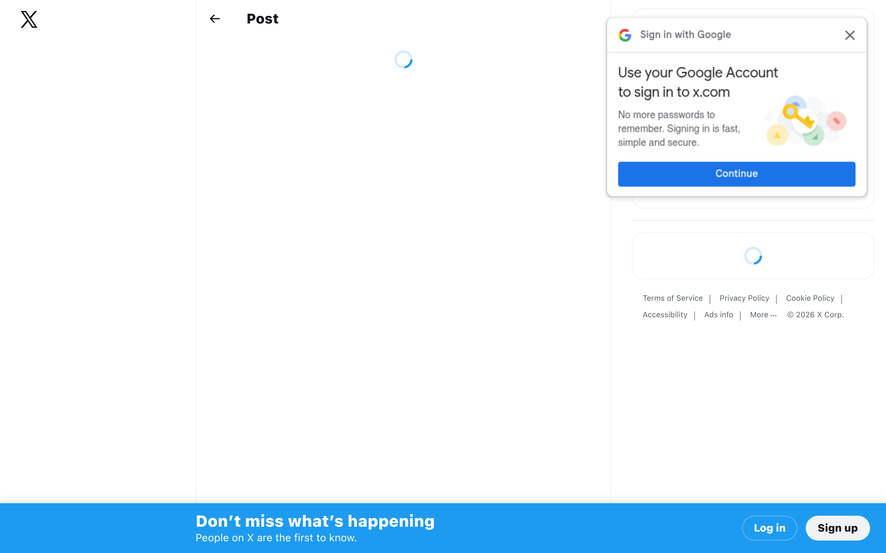

## TLDR

The two-person team is the new department — one pirate, one architect, both vibe coding. Software's value is collapsing toward zero, and the only companies surviving are the ones selling outcomes or experiences. Meanwhile, AI coding agents just hit their first real infrastructure wall: staging environments built for one human at a time.

## The Big Picture: The Disappearing Middle

### The Two-Person Team

Dan Shipper laid out a new team model for 2026: [two people — one pirate and one architect (2 min read)](https://x.com/danshipper/status/2035842017553465814). The pirate moves as fast as possible, shipping features by vibe coding. The architect turns what the pirate discovers into a reliable machine — also vibe coding, but slower and more deliberate. Every product needs a pirate. Most only need an architect once you've found product-market fit. This isn't a metaphor. This is the literal team structure.

**Your angle with founders:** "If your team is still structured around roles that existed before agents could code — what would it look like if you rebuilt from scratch with two people?"

### Software's Value Is Approaching Zero

Animesh Koratana dusted off Pine & Gilmore's 1998 "Progression of Economic Value" to explain [which startups survive AI (4 min read)](https://x.com/akoratana/status/2035783146223096223). Coffee beans cost 2 cents as a commodity, $5 at Starbucks. AI is compressing the bottom of the stack — software as product approaches zero. Two types survive: Outcome Companies (charge for results, not access) and Experience Companies (sell moments that can't be automated). Separately, Koratana argues [Salesforce is dying (1 min read)](https://x.com/akoratana/status/2035050678687867079) — and the same framework explains why.

**Your angle with founders:** "Are you selling a tool, or are you selling the outcome? Because tools are heading toward free."

## Builder's Corner

### Parallel Agents Just Broke Staging

At Browser Use, they run millions of parallel coding agents. Larsen Cundric spotted the bottleneck nobody planned for: [dev throughput 10x'd but validation stayed flat (3 min read)](https://x.com/larsencc/status/2035773341873963091). Hundreds of concurrent code changes. One staging environment. Agents sit idle in CI queues. The productivity gains evaporate. His fix: ephemeral, per-agent staging environments. Staging was built for one-person-ships-one-thing workflows. That assumption just broke.

**Why founders care:** If your agents are faster than your CI pipeline, you've just moved the bottleneck from code to infrastructure.

## Founder Watch

### Algorithmic Executive Power Is Here

The first serious articulation of [the CEO agent (3 min read)](https://x.com/_The_Prophet__/status/2035863788025733276) — a private cognition layer that watches the org, digests information faster than any staff, drafts strategy, stress-tests decisions, and spots anomalies. Fewer interpreters. Fewer relays. Cleaner line of sight into product, finance, talent, and risk. This isn't replacing the CEO — it's compressing the time between signal and command.

**Conversation starter:** "If you could give every exec a private AI that watches the entire org in real time — what decisions would get faster?"

### YC W26: The Batch That Tells You Where AI Is Going

Chris Lu [analyzed all YC W26 companies (1 min read)](https://x.com/chris__lu/status/2035789607824929033) — a visual breakdown of what the latest batch tells us about the future. YC batches are the earliest directional signal for what founders are actually building, months before it hits the press. If you sell to startups, this is your scouting report.

**Conversation starter:** "Have you looked at what YC just funded? It's the closest thing to a preview of what your next customer base looks like."

## Quick Hits

- **[Claude does a year of bookkeeping in 20 minutes (1 min read)](https://x.com/aitrendz_xyz/status/2035619620162609631)** — Upload bank statements to Claude Opus 4.6, get categorized income and expenses. One prompt.
- **[HF Papers API turns research into a skill (2 min read)](https://x.com/koylanai/status/2035787531586064663)** — Five parallel searches with keyword variants, triage by relevance, fetch full paper content. The gap between paper published and practitioner applies is shrinking.

## Try This Week

Look at your team through Dan Shipper's pirate/architect lens. Ask: who's the person who moves fastest and finds what works? That's your pirate. Who turns messy discoveries into reliable systems? That's your architect. If one person is doing both — they're probably slow at both. Try splitting the roles this week on one project and see what happens.

## Our Play

### Gemini 3.1 Pro Drops — Smarter Baseline for Complex Work

Google launched [Gemini 3.1 Pro in preview](https://cloud.google.com/blog/topics/inside-google-cloud/whats-new-google-cloud) — a noticeably smarter model for complex problem-solving, available in Vertex AI, AI Studio, and Gemini CLI. Alongside it, Gemini 3.1 Flash-Lite ships as the fastest, most cost-efficient model in the Gemini 3 series. For founders building multi-model stacks, having both a smart heavy hitter and a fast cheap workhorse from the same provider matters — especially when the alternative is stitching together APIs from three different vendors.

### Cloud Next Is One Month Out

[Google Cloud Next 2026](https://www.wokeey.com/events/google-cloud-next-2026.html) hits Las Vegas April 22–24. Agent Designer just went to preview. Agent Engine Sessions and Memory Bank just went GA. The agent stack is filling in fast — and Next is where the full picture comes together.

*Connect to this week:* The two-person team and the staging bottleneck both point the same direction — the infrastructure around AI agents matters as much as the agents themselves. Google's agent stack (Designer, Engine, Memory) is building exactly that layer.

---

*Sources: 85 bookmarks, 4 videos, 66 podcast episodes from the AI content library. [Archive](/archive)*
