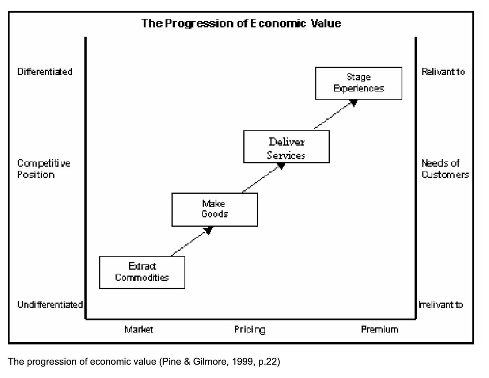

## TLDR

The most AI-native startups are now spending more on AI tools than on payroll — and the top Claude Code user burned $150K in tokens last month. Meanwhile, Anthropic did $6 billion in revenue in a single month, and Dan Shipper says the only team structure that makes sense in 2026 is two people: one pirate, one architect, both vibe coding.

## The Big Picture: The Budget Is Shifting

### AI Tool Spend Is Overtaking Payroll

Hard Fork this week dove into a pattern that should reframe every startup conversation: [the most AI-native companies are spending more on AI tools than they are on payroll (60 min listen, 25:20)](https://www.youtube.com/watch?v=Prm_V51XbPg&t=1520s). The top individual Claude Code user spent over $150K on tokens last month. Some engineers are "getting in trouble for spending too much on Claude." Companies are outstripping their AI budgets. And here's the kicker: employees at frontier labs who get unlimited free tokens effectively can't afford to leave — because their token consumption would bankrupt any other employer.

**Your angle with founders:** "What's your team's monthly token spend? Because the startups moving fastest are spending more on AI tools than salaries — and most haven't built cost governance yet."

### Software's Value Is Approaching Zero

Animesh Koratana dusted off Pine & Gilmore's 1998 "Progression of Economic Value" to explain [which startups survive AI (4 min read)](https://x.com/akoratana/status/2035783146223096223). Coffee beans cost 2 cents as a commodity, $5 at Starbucks. AI is compressing the bottom of the stack — software as product approaches zero. Two types survive: Outcome Companies (charge for results, not access) and Experience Companies (sell moments that can't be automated). He separately argues [Salesforce is dying (1 min read)](https://x.com/akoratana/status/2035050678687867079) — the same framework explains why.

**Your angle with founders:** "Are you selling a tool, or are you selling the outcome? Because tools are heading toward free."

## Builder's Corner

### Parallel Agents Just Broke Staging

At Browser Use, they run millions of parallel coding agents. Larsen Cundric spotted the bottleneck: [dev throughput 10x'd but validation stayed flat (3 min read)](https://x.com/larsencc/status/2035773341873963091). Hundreds of concurrent code changes. One staging environment. Agents sit idle in CI queues. His fix: ephemeral, per-agent staging environments. Karpathy put it differently on No Priors this week: ["You are the bottleneck in the system that is max capability" (4:41)](https://www.youtube.com/watch?v=kwSVtQ7dziU&t=281s). The infrastructure around agents — not the agents themselves — is where things break.

**Why founders care:** If your agents are faster than your CI pipeline, you've just moved the bottleneck from code to infrastructure.

## Founder Watch

### Anthropic: $6 Billion in a Single Month

On My First Million, Shaan Puri broke down the numbers: ["Anthropic did $6 billion in revenue in a single month — more than Snowflake or Databricks, two of the greatest software companies of the last 20 years" (5:45)](https://www.youtube.com/watch?v=DXAeN0q3eOc&t=345s). Then he quoted Dario Amodei: "If I bet on another 10x but we only grow 5x in a year, we could go bankrupt." Anthropic is simultaneously the fastest-growing enterprise AI company and one wrong bet from collapse. That's the frontier model business.

**Conversation starter:** "Anthropic just did more revenue in one month than Snowflake does in a quarter. Where do you think that spend is coming from — and what's it replacing?"

### The Two-Person Team

Dan Shipper laid out [the new team model for 2026 (2 min read)](https://x.com/danshipper/status/2035842017553465814): two people — one pirate and one architect. The pirate moves fast, shipping by vibe coding. The architect turns discoveries into reliable systems — also vibe coding, but slower and more deliberate. Every product needs a pirate. Most only need an architect once you've found product-market fit.

**Conversation starter:** "Dan Shipper says every product just needs two people now. How many of your team's roles exist because of pre-AI assumptions?"

## Quick Hits

- **[Claude does a year of bookkeeping in 20 minutes (1 min read)](https://x.com/aitrendz_xyz/status/2035619620162609631)** — Upload bank statements to Claude Opus 4.6, get categorized income and expenses. One prompt.
- **[HF Papers API turns research into a skill (2 min read)](https://x.com/koylanai/status/2035787531586064663)** — Five parallel searches with keyword variants, triage by relevance, fetch full paper content. The gap between paper published and practitioner applies is shrinking.

## Try This Week

Ask a founder: "What's your monthly AI token spend per engineer?" Most won't know. That's the point. Hard Fork reported companies are "outstripping their budgets" because nobody is tracking this. The startups that figure out AI cost governance early will have a structural advantage — the same way cloud cost optimization separated winners from losers in the last era.

## Our Play

### Gemini 3.1 Pro Drops — Smarter Baseline for Complex Work

Google launched [Gemini 3.1 Pro in preview](https://cloud.google.com/blog/topics/inside-google-cloud/whats-new-google-cloud) — a noticeably smarter model for complex problem-solving, available in Vertex AI, AI Studio, and Gemini CLI. Alongside it, Gemini 3.1 Flash-Lite ships as the fastest, most cost-efficient model in the Gemini 3 series — built for high-volume workloads where cost matters most. When teams are spending more on tokens than payroll, having a cost-efficient option for high-volume tasks isn't a nice-to-have.

### Cloud Next Is One Month Out

[Google Cloud Next 2026](https://www.wokeey.com/events/google-cloud-next-2026.html) hits Las Vegas April 22–24. Agent Designer just went to preview. Agent Engine Sessions and Memory Bank just went GA. The agent stack is filling in fast — and Next is where the full picture comes together.

*Connect to this week:* AI budgets overtaking payroll and staging environments breaking under agent load both point the same direction — the infrastructure around AI is where the real investment is happening. Google's agent stack (Designer, Engine, Memory) and cost-efficient models (Flash-Lite) are built for exactly this moment.

---

*Sources: 85 bookmarks, 4 videos, 66 podcast episodes from the AI content library. [Archive](/archive)*
