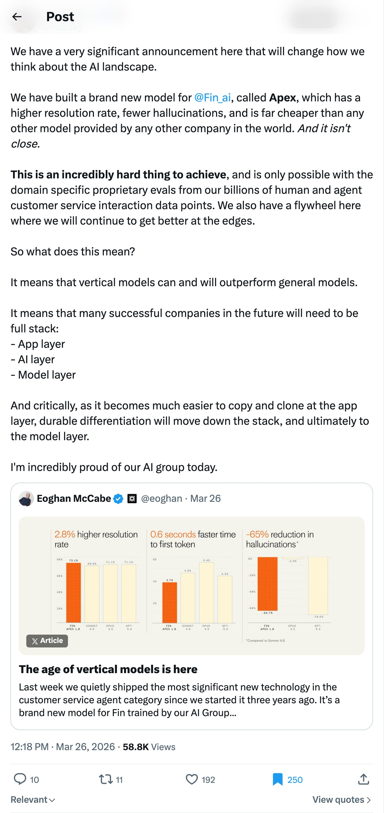
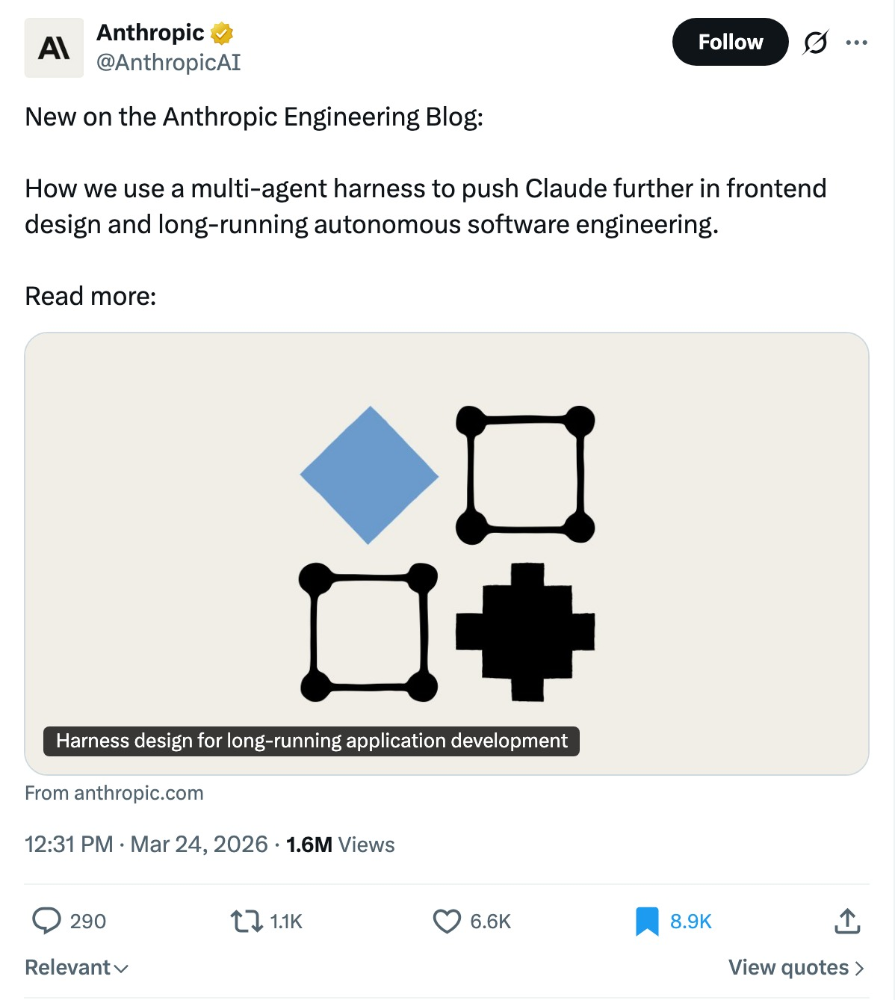

## TLDR

The traditional SaaS model is facing major headwinds as AI agents and generated software increasingly replace existing apps, with vertical AI models outperforming general ones for domain-specific tasks. OpenAI killed Sora to go all-in on Codex while Anthropic flipped the enterprise market — now capturing 73% of new enterprise AI spending. Meanwhile, Andrej Karpathy says the bottleneck in AI development has shifted entirely to human instruction quality, and Stripe just launched a CLI to handle all AI agent billing.

## The Big Picture: SaaS Disruption & Vertical AI

### SaaS Is Being Agent-Eaten and Replaced by Generated Software

The "SaaSpocalypse" is happening, with Guillermo Rauch noting [at Vercel almost every internal SaaS app has been replaced with generated apps or agent interfaces (1 min read)](https://x.com/rauchg/status/2036447879985037495). This shift is driven by a massive demand for customized software. On the Lightcone (YC) podcast, Emergent founder Makund explains [that SaaS faces headwinds from agent-first workflows and the desire for custom software (40 min watch, 0:32:00)](https://www.youtube.com/watch?v=8SVocWnDHwE&t=1920s). His team, for example, [replaced Asana internally with their own AI-built tool (40 min watch, 0:30:10)](https://www.youtube.com/watch?v=8SVocWnDHwE&t=1810s), saving $3K-$4K per month.

**Your angle with founders:** "How much of your SaaS spend could be replaced by a single, well-built agent or a custom app your own team can generate overnight?"

### Vertical AI Outperforms General Models as the "API Tax" Rises

Intercom's CPO, Paul Adams, highlighted that [domain-specific vertical AI models are outperforming general models (2 min read)](https://x.com/Padday/status/2037202485647958289), noting their Apex model for customer service beats GPT 5.4 and Opus 4.5. This aligns with a growing sentiment on the AI Daily Brief podcast that the ["API tax" for general models is starting to look like the cloud markup of 10 years ago (28 min watch, 0:28:44)](https://podcasters.spotify.com/pod/show/nlw/episodes/Anthropic-Accidentally-Revealed-Their-Most-Powerful-Model-Ever-e3h2l87&t=1724s), leading companies to switch to fine-tuned open models for a fraction of the cost.

**Your angle with founders:** "Are you paying for a general model to do specialized work? We're seeing more companies fine-tune open models for better performance and far lower cost."

## The AI Lab Power Shift: OpenAI Retreats to Code, Anthropic Eats Enterprise

### OpenAI Kills Sora, Goes All-In on Coding

OpenAI is in full "code red" mode — and this time they're cutting products to prove it. The company [shut down Sora](https://podcasters.spotify.com/pod/show/nlw/episodes/Work-AGI-is-the-Only-AGI-that-Matters-e3gvn96), its AI video generator that was reportedly burning **$15 million per day** while generating less than $500K/month in revenue. Those GPUs are being redirected to Codex, which just got a [major plugin upgrade with unlimited usage limits reset across all plans](https://podcasters.spotify.com/pod/show/nlw/episodes/Anthropic-Accidentally-Revealed-Their-Most-Powerful-Model-Ever-e3h2l87). Disney also [walked away from its planned $1 billion investment](https://podcasters.spotify.com/pod/show/nlw/episodes/Work-AGI-is-the-Only-AGI-that-Matters-e3gvn96) in OpenAI.

Behind the scenes, OpenAI has finished training a new model codenamed **SPUD** and renamed its products division to "AGI Deployment." As new CEO of Applications Fiji Simo put it on the AI Daily Brief: *"When new bets start to work, like we're seeing now with Codex, it's very important to double down on them and avoid distractions."*

On the BG2 Pod, OpenAI's Nick Turley revealed that [ChatGPT was originally meant to be a one-month demo that they'd wind down (64 min watch, 0:02:00)](https://www.youtube.com/watch?v=MIKej1HCRW0&t=120s) — and that the biggest ongoing constraint is GPU allocation: *"It's really painful to have real user demand for products that you can't serve."*

### Anthropic Flips the Enterprise Market

While OpenAI reshuffles, Anthropic is eating their lunch in enterprise. According to data cited on Pivot, Anthropic now captures **73% of new enterprise AI spending**, up from a 40/60 split just months ago. Their ARR surged to **$19 billion** — adding $6 billion in February alone — while OpenAI's stood at $20 billion at year-end 2025. The gap is closing fast.

And Anthropic isn't done scaling up. A [data leak revealed Claude Mythos](https://podcasters.spotify.com/pod/show/nlw/episodes/Anthropic-Accidentally-Revealed-Their-Most-Powerful-Model-Ever-e3h2l87), described internally as *"by far the most powerful AI model we've ever developed"* and *"very expensive for us to serve and will be very expensive for our customers to use."* The company is [reportedly discussing an IPO as early as Q4 2026](https://podcasters.spotify.com/pod/show/nlw/episodes/Anthropic-Accidentally-Revealed-Their-Most-Powerful-Model-Ever-e3h2l87).

Meanwhile, the Pentagon designated Anthropic as a "supply chain risk" after the company publicly challenged a contract dispute. A federal judge called the move ["troubling" and potentially a First Amendment violation](https://podcasters.spotify.com/pod/show/nlw/episodes/Work-AGI-is-the-Only-AGI-that-Matters-e3gvn96).

**Your angle with founders:** "OpenAI kills Sora overnight, Anthropic's next model is 'very expensive to serve' — if your stack is locked to one lab's roadmap, you're at their mercy. The companies winning right now, like Intercom and Cursor, are fine-tuning open models on their own infra for better performance at a fraction of the cost. That's exactly what Vertex AI and Cloud GPUs are built for."

## Builder's Corner

### Anthropic Unveils Multi-Agent Harness for Long-Running Autonomous Engineering

Anthropic shared how they achieve [long-running autonomous software engineering with a multi-agent harness (1 min read)](https://x.com/AnthropicAI/status/2036481033621623056) — a planner, generator, and evaluator working together. A breakdown by The AI Automators explains this [GAN-inspired architecture separates the agent doing work from the agent judging it (17 min watch)](https://www.youtube.com/watch?v=9d5bzxVsocw), providing more tractable feedback loops and overcoming challenges like "context anxiety" and "poor self-evaluation."

**Why founders care:** This is a blueprint for building more reliable, autonomous agents that can tackle complex, multi-hour engineering tasks.

### Karpathy's "Skill Issue" Shifts the AI Development Bottleneck to Humans

On the No Priors podcast, Andrej Karpathy described how his coding workflow flipped from 80/20 writing code to [2/98 delegating to agents (67 min watch, 0:02:00)](https://www.youtube.com/watch?v=kwSVtQ7dziU&t=120s). His core thesis: "Everything is skill issue." When agents fail, it's almost always the human's instructions or agent configuration that's lacking, not the model's capability. He noted LLMs are so adept at arguing any direction that [he uses them as devil's advocates to form better opinions (1 min read)](https://x.com/karpathy/status/2037921699824607591).

**Why founders care:** The bottleneck isn't the AI model, it's how your team designs prompts and agent instructions.

## Founder Watch

### Stripe CLI Automates AI Agent Billing and Infrastructure Payments

Stripe, which processed $1.9T last year, just launched a [new CLI that lets AI agents provision and pay for every service (Vercel, Supabase, Neon, etc.) with one command (2 min read)](https://x.com/aakashgupta/status/2037952113008115970). This directly addresses Andrej Karpathy's previous point about the painful wiring of services for agents, routing all agent billing through Stripe.

**Conversation starter:** "Karpathy noted how messy AI infra billing is becoming. Does your current setup allow agents to provision and pay for services autonomously?"

### YC CEO Garry Tan Ships 10K+ Lines of Code/Day with "gstack"

YC CEO Garry Tan is reportedly [shipping 10,000-20,000 lines of production code per day using "gstack" (2 min read)](https://x.com/MillieMarconnni/status/2037848645949898979) — a system of 20 AI specialists running across every sprint phase, which he's open-sourced for free. This is a massive leap in developer productivity, demonstrating how multi-agent systems are redefining coding output.

**Conversation starter:** "Garry Tan's team is pushing 20,000 lines of code a day with AI specialists. What's the biggest bottleneck in your team's current development velocity?"

### Google Voice API Puts AI Agents in Charge of Call Centers

Google's new voice API, with sub-second latency and 90+ languages, is reportedly [replacing receptionists with a simple Python script (1 min read)](https://x.com/DataChaz/status/2037524832255148052). This creates a massive opportunity for founders to [build AI agents for specific niches like dental offices or salons (2 min read)](https://x.com/the_smart_ape/status/2037280981141307577) to handle FAQs and bookings, charging $1K/month for a service that typically costs $3K/month with human receptionists.

**Conversation starter:** "A voice AI agent can replace a $3K/month human receptionist for $1K. What's one area of your business where a voice agent could handle first-line customer interaction?"

## Quick Hits

- **[Mistral's open-source TTS beats ElevenLabs (1 min read)](https://x.com/TheGeorgePu/status/2037930340975538184)** — The new text-to-speech model runs locally for free on just 3GB of RAM, outperforming paid services.
- **[Google Colab now runs in VS Code (1 min watch)](https://x.com/heyrimsha/status/2037918330900853149)** — Get free T4 GPU access directly in your local VS Code environment, connecting to Google's servers.
- **[One CLI offers 47,000 verified agent integrations (1 min watch)](https://x.com/RoundtableSpace/status/2038258626641719740)** — Access 250+ apps with agentic actions, ensuring agents never hallucinate API knowledge.

## Try This Week

Build a voice AI agent for a niche vertical (e.g., dental clinics, salons) using Google's new voice API to handle FAQs and bookings. Target a $1K/month service fee, knowing human receptionists cost $3K/month. [Source (1 min read)](https://x.com/DataChaz/status/2037524832255148052)

## Our Play

### TurboQuant Compression Dramatically Lowers LLM Inference Costs

Google Research unveiled [TurboQuant, a new algorithm that compresses LLM KV cache by 6x+ with an 8x speedup (1 min read)](https://x.com/GoogleResearch/status/2036533564158910740) and zero accuracy loss. As Aakash Gupta noted, [this 3-bit KV cache compression changes the entire cost structure of AI inference (2 min read)](https://x.com/aakashgupta/status/2037044131906895933), attacking the variable cost that often "kills you" in LLM deployments.

### Google's Voice AI Goes Live: Gemini 3.1 Flash Powers Real-time Dialogue

Building on this week's signal about AI transforming call centers, Google's Gemini 3.1 Flash Live real-time voice model has been [deployed to customers, with Home Depot already using it (28 min watch, 0:04:15)](https://podcasters.spotify.com/pod/show/nlw/episodes/Anthropic-Accidentally-Revealed-Their-Most-Powerful-Model-Ever-e3h2l87&t=255s). This brings sub-second latency and multi-lingual capabilities, making truly natural conversational AI accessible for business automation.

*Connect to this week:* Both TurboQuant and the Gemini 3.1 Flash Live deployments underscore Google's focus on foundational innovations that make advanced AI capabilities (like real-time voice agents) dramatically more cost-efficient and performant, essential for founders navigating the "API tax" and the rising demand for AI-driven automation.

---

*Sources: 12 bookmarks, 8 podcast episodes from the AI content library. [Archive](/archive)*