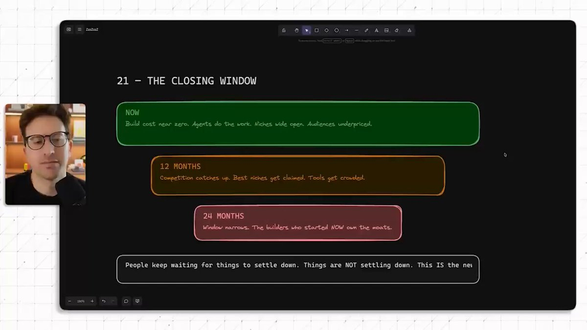
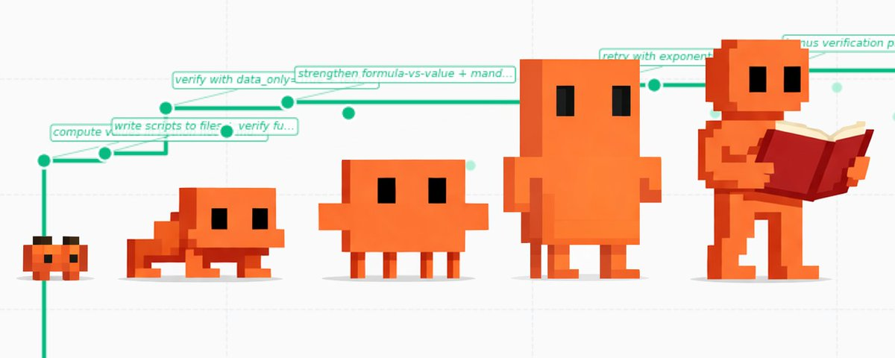
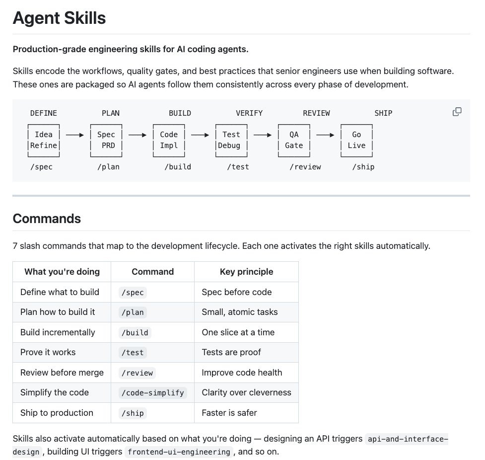

## TLDR

Jack Dorsey's Block is entirely redesigning its organization around AI, signaling a shift from hierarchy to "intelligence." This is happening amidst a "best time in history" for AI-native startups, where the cost of building is near zero. Meanwhile, agents are learning to self-optimize and adapt through continual learning, pushing the boundaries of autonomous software development, but also revealing a new challenge: developer burnout from managing multiple AI workflows.

## The Big Picture: Reimagining Organizations & Agent Evolution

### Block Redesigns the Organization: From Hierarchy to Intelligence

Jack Dorsey's Block (Square, Cash App) is rethinking its entire organizational design, moving [from traditional hierarchies to "intelligence-first" structures (5 min read)](https://x.com/jack/status/2039003879841362278). Inspired by Sequoia's insight that speed is the best predictor of startup success, Block is harnessing AI to increase this speed as a compounding competitive advantage, shifting beyond merely using AI as a productivity enhancer.

**Your angle with founders:** "Jack Dorsey is redesigning Block around AI-augmented decision-making. How are you thinking about AI's impact on your team's structure and speed, not just individual productivity?"

### The Golden Window: Near-Zero Cost to Build an AI Startup

The market is buzzing about "the best time in history to build a startup." Thanks to AI, the cost of building an MVP is effectively zero, with [agents doing the work and niche audiences underpriced (1 min read)](https://x.com/startupideaspod/status/2040599043362214351). Founders only need an idea, a laptop, and an LLM to build businesses that run 24/7 with 95% margins. This unprecedented opportunity window is estimated to last 12-24 months before competition intensifies.

**Your angle with founders:** "With the cost of building an AI-native startup nearing zero, what's your competitive advantage? Are you leveraging this 'golden window' to ship faster and capture market share?"

### Agents That Learn: Self-Optimizing & Continual Improvement

The next frontier for agents is self-optimization. AutoAgent, the first open-source library for autonomously improving agents, [hit #1 on SpreadsheetBench and TerminalBench (3 min read)](https://x.com/kevingu/status/2039843234760073341) after 24 hours of self-optimization—without human engineering. LangChain founder Harrison Chase emphasizes that continual learning for agents happens at three layers: [the model, the harness (code driving the agent), and the context (information available per-session) (3 min read)](https://x.com/hwchase17/status/2040467997022884194).

**Your angle with founders:** "If agents can continuously improve themselves without human intervention, what does that mean for your development cycles and the 'harness engineering' bottleneck you're currently facing?"

## Builder's Corner: Google-Tier Agent Engineering

### Addy Osmani's Agent Skills: Google-Tier Engineering Workflows for AI Coding Agents

Addy Osmani (Google) has released Agent Skills, a collection of [19 engineering skills and 7 slash commands (e.g., `/spec`, `/plan`, `/test`, `/ship`) (2 min read)](https://x.com/DataChaz/status/2040357775830814798) that embed senior engineer workflows and quality gates directly into AI coding agents. This open-source tool, installable via `npx skills add addyosmani/agent-skills`, bakes in Google engineering culture principles like Shift Left and Chesterton's Fence, working with Claude Code, Cursor, Antigravity, and other Markdown-compatible agents.

**Why founders care:** This provides a blueprint for integrating robust engineering best practices into your agent workflows, elevating the quality and reliability of AI-generated code.

## Founder Watch

### Block Open-Sources Goose: A Free, LLM-Agnostic Coding Agent

Jack Dorsey's Block just open-sourced [Goose, a full autonomous AI coding agent with 35.3K GitHub stars (2 min read)](https://x.com/heynavtoor/status/2040702196401197358). Unlike commercial alternatives, Goose is free, offers no vendor lock-in, and works with any LLM (Claude, GPT, Gemini, Llama, DeepSeek). Written in Rust, it can read entire codebases, write/edit/refactor, run shell commands, and execute/debug code, signalling a major move into open-source agent infrastructure.

**Conversation starter:** "Block just dropped an open-source, LLM-agnostic coding agent. How are you thinking about the cost and control trade-offs between proprietary LLM tools and increasingly powerful open-source agents?"

### The "OpenClaw" Opportunity: High Demand for Secure Personal AI Assistants

Simon Willison notes "the demand for a personal digital assistant is enormous," despite the known security risks. He believes [building a *safe* OpenClaw—a personal AI assistant (Lenny's Podcast, 100min, 1:14:40)](https://www.youtube.com/watch?v=wc8FBhQtdsA) that can access emails and take actions without leaking data or deleting files—is "the biggest opportunity in AI right now." This demand persists even with the complexity of getting such systems running securely.

**Conversation starter:** "Everyone wants a personal AI assistant, but few trust them with sensitive data. What's your approach to building secure, trustworthy agents that handle highly personal or proprietary information?"

### Developer Burnout: Managing Agents Is Mentally Exhausting

Django co-creator Simon Willison, with 25 years of engineering experience, finds that [using coding agents well is "mentally exhausting" (Lenny's Podcast, 100min, 0:01:25)](https://www.youtube.com/watch?v=wc8FBhQtdsA), leading to burnout by 11 AM if running multiple parallel agents. He observes that while AI amplifies experienced engineers and accelerates new hires, "people in the middle" of their careers are "probably in the most trouble" as they lack senior amplification or junior-level boosts.

**Conversation starter:** "Your most experienced engineers are leveraging AI for 95% of their code but are also reporting burnout. How are you helping your team manage the cognitive load of interacting with advanced agents?"

## Quick Hits

-   **[fieldtheory: Sync X Bookmarks Locally for AI Agents (1 min read)](https://x.com/andrewfarah/status/2040535589771149379)** — An open-source CLI tool to download and sync X bookmarks locally, making them accessible for AI agents to use as context.
-   **[Data Labeling Companies Buying Pre-2022 GitHub Repos (Lenny's Podcast, 100min, 0:44:40)](https://www.youtube.com/watch?v=wc8FBhQtdsA)** — AI is generating so much code that data labeling companies are acquiring "artisanal human-written code" from pre-2022 GitHub repositories to train models.
-   **[LLM Search Integrations Replacing Google Search (Lenny's Podcast, 100min, 0:56:40)](https://www.youtube.com/watch?v=wc8FBhQtdsA)** — Simon Willison reports he now uses LLM search integrations (via Claude, ChatGPT, or Gemini) almost exclusively for research, as they perform 5 parallel searches and synthesize results.

## Try This Week

Experiment with creating a personal research repository on GitHub, as advocated by Simon Willison. Even small, documented experiments can build a "backlog of things that worked or didn't work" that you can feed to LLMs as context to solve new problems, creating a compounding knowledge effect. [Source (Lenny's Podcast, 100min, 1:20:00)](https://www.youtube.com/watch?v=wc8FBhQtdsA)

## Our Play

### Gemini Models as a Competitive Hub in a Multi-LLM World

Simon Willison's habit of [switching between OpenAI, Anthropic, and Gemini models (Lenny's Podcast, 100min, 0:51:00)](https://www.youtube.com/watch?v=wc8FBhQtdsA) based on performance and cost highlights the multi-LLM reality. Gemini models, accessible via Vertex AI, offer a powerful, cost-effective alternative for coding, image generation, and multimodal tasks, allowing founders to dynamically choose the best model for their needs without vendor lock-in.

### Securing Agent Workflows: GCP's Answer to Local Agent Risks

As developers increasingly run powerful AI agents, the [security risks of running them locally (Lenny's Podcast, 100min, 0:49:00)](https://www.youtube.com/watch?v=wc8FBhQtdsA) are apparent. Google Cloud offers secure, managed environments like Cloud Run and Vertex AI for deploying containerized agents, ensuring data isolation and enterprise-grade security, allowing founders to experiment with "YOLO mode" agents in a controlled "aquarium" without exposing local systems to risk.

*Connect to this week:* As Block pioneers AI-first organizations and developers grapple with agent complexity, Google Cloud's flexible Gemini models and secure deployment environments offer the foundational infrastructure for building, scaling, and iterating on next-gen AI applications.

---

*Sources: 10 bookmarks, 1 podcast episode from the AI content library. [Archive](/archive)*