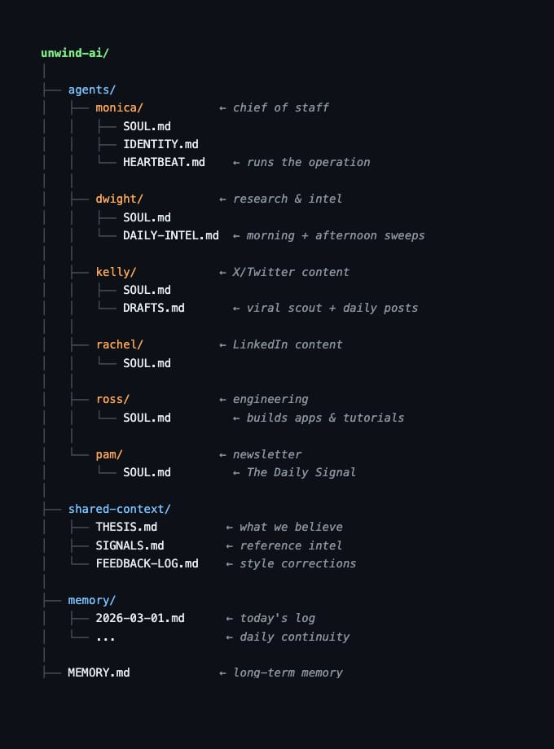
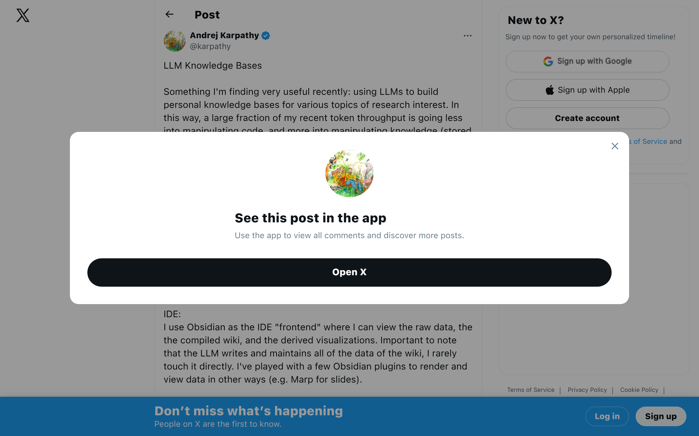

## TLDR

AI coding agents have crossed an inflection point, leading to the rise of "dark factories" where software is built and tested almost entirely by AI, not humans. But this comes with a warning: prompt injection remains fundamentally unsolved, posing a "Challenger disaster" level risk to AI security, and managing these agents is mentally exhausting. Meanwhile, the "zero-human company" concept is gaining traction as companies become mere directories of intercommunicating agents.

## The Big Picture: The New Org Chart & AI's Unseen Dangers

### "Dark Factories" & the Looming "Challenger Disaster" of AI

Coding agents have crossed an inflection point, with Django co-creator Simon Willison now reporting [95% of his code is AI-generated, often on his phone (Lenny's Podcast, 100 min, 0:00:27)](https://www.youtube.com/watch?v=wc8FBhQtdsA). This shift has led to "dark factories" where [StrongDM and others are using agent swarms to simulate end-users for QA (Lenny's Podcast, 100 min, 0:22:00)](https://www.youtube.com/watch?v=wc8FBhQtdsA), essentially building and testing software without humans writing or reading the code. However, Willison warns of an inevitable "Challenger disaster of AI," where [institutional confidence in increasingly unsafe systems will lead to a major incident (Lenny's Podcast, 100 min, 0:02:10)](https://www.youtube.com/watch?v=wc8FBhQtdsA).

**Your angle with founders:** "We're seeing companies spending $10K/day on tokens for AI-driven QA. Is your team preparing for a world where AI tests your code, and how are you thinking about the security risks?"

### Prompt Injection Remains Unsolved, Posing "Lethal Trifecta" Threat

Simon Willison argues that [prompt injection is fundamentally unsolvable (Lenny's Podcast, 100 min, 0:58:30)](https://www.youtube.com/watch?v=wc8FBhQtdsA), not just difficult, because LLMs cannot perfectly distinguish instructions from user input. He highlights the "lethal trifecta": when an agent has access to private data, is exposed to malicious instructions, and has an exfiltration channel. This makes [autonomous email-replying agents fundamentally unsafe today (Lenny's Podcast, 100 min, 0:59:00)](https://www.youtube.com/watch?v=wc8FBhQtdsA). Aaron Levie echoes this, stating the [ultimate rate limiter on agent productivity is security and compliance (2 min read)](https://x.com/levie/status/2039216522028257549).

**Your angle with founders:** "If AI can't perfectly distinguish an instruction from a malicious input, how are you isolating your agents and protecting private data as you move toward autonomous workflows?"

### The Directory is the New Company: Zero-Human Orgs Emerge

The concept of a "zero-human company" is taking hold. What a one-person AI agent company looks like in 2026: [6 AI agents, 20 cron jobs, 0 human employees (1 min read)](https://x.com/Saboo_Shubham_/status/2028328693911912841). Vadim explains, ["The org chart is dead. The directory is the new company," with every role as a `.md` file (1 min read)](https://x.com/VadimStrizheus/status/2027953432326197508). New open-source tools like [Paperclip let you `npx paperclipai onboard` to launch an agent-based org, with a CEO agent approving hiring a Coder (1 min read)](https://x.com/dotta/status/2029239759428780116).

**Your angle with founders:** "The mental model of 'company as directory' is gaining traction. How are you thinking about structuring your agent workflows to resemble a functional organization, and what does that mean for your team?"

## Builder's Corner: Context as Code & The Automated Researcher

### Karpathy's LLM Knowledge Bases: Building a Personal AI-Powered Wiki

Andrej Karpathy is building [personal LLM knowledge bases by indexing raw documents, then having an LLM "compile" a wiki of `.md` files (4 min read)](https://x.com/karpathy/status/2039805659525644595) with summaries, backlinks, and health checks. This allows the LLM to research complex questions autonomously. He even [open-sourced an autonomous AI researcher (2 min read)](https://x.com/LiorOnAI/status/2030376700337643742) that edits code, trains a small LM for 5 minutes, checks scores, and loops, completing ~100 experiments overnight.

**Why founders care:** This is a blueprint for turning your team's collective knowledge into an AI-queryable, self-improving asset that can accelerate product and research cycles.

### Context Engineering: Structure Your Claude Code Project for Efficiency

The efficiency of Claude Code depends heavily on structure. Founders are adopting a "context as code" approach, using `CLAUDE.md` as repo memory (purpose, map, rules), `.claude/skills/` for reusable workflows, and `.claude/hooks/` for guardrails (formatters, tests). As Nainsi Dwivedi puts it: ["Prompting is temporary. Structure is permanent" (3 min read)](https://x.com/NainsiDwiv50980/status/2030179099587531216). This includes techniques like [subagents for tasks needing 3+ files to save thousands of tokens (2 min read)](https://x.com/Suryanshti777/status/2029116582438523253) and [progressive disclosure for skills (1 min read)](https://x.com/zarazhangrui/status/2029092514435932647) to drastically reduce context loaded.

**Why founders care:** Optimizing your Claude Code project structure isn't just about saving tokens; it's about building repeatable, efficient, and reliable AI workflows.

## Founder Watch

### Perplexity Computer Benchmarks Against Consulting Firms

Perplexity has benchmarked its "Computer" agent against McKinsey, Harvard, MIT, and BCG deliverables across 16,000 queries. Their Pro offering at $20/month costs less than one hour of junior consultant billing and comes with [400+ connectors to Salesforce, Snowflake, and Google Slides with one prompt (3 min read)](https://x.com/aakashgupta/status/2040844170999517597). This AI is the "connective tissue" that enterprise customers are demanding.

**Conversation starter:** "Perplexity's AI is performing like a junior consultant for $20/month. Are you seeing this kind of AI agent replace knowledge work in your industry yet?"

### SaaS UIs Collapse to Text Fields; Moats Shift to APIs & Data

Linear, PostHog, and Attio have [replaced their homepages with a single text field (3 min read)](https://x.com/aakashgupta/status/2040692672529383702). When the interface collapses to a prompt, the only thing that matters is your API surface, data model, and integrations. Salesforce requires 6 weeks of training, but a chat bar has zero switching cost. Winners in this shift are companies like Snowflake, Databricks, and Stripe with deep data engines.

**Conversation starter:** "If your homepage is just a text field, what does that mean for your product's moat? Is your data model and API surface strong enough to compete in a chat-first world?"

### Cursor Discovers Novel Math Solution Autonomously

Cursor, a code-generating AI agent, [discovered a novel solution to a complex math research problem (1 min read)](https://x.com/mntruell/status/2028903020847841336) that yielded stronger results than the official human-written solution. The same autonomous harness built a browser from scratch and ran for four days, suggesting agent coordination techniques generalize beyond just coding tasks.

**Conversation starter:** "An AI agent solved a math research problem better than humans. Where else are you seeing agents move beyond code to tackle abstract, complex challenges?"

## Quick Hits

- **[Tome offers local AI meeting transcription for Obsidian (1 min read)](https://x.com/ErickSky/status/2038301058338812119)** — The macOS app transcribes Zoom/Meet/Teams locally and outputs Markdown notes directly to your Obsidian vault, 100% private and open source.
- **[Google Workspace CLI offers 40+ agent skills (1 min read)](https://x.com/addyosmani/status/2029372736267805081)** — Access Google Drive, Gmail, Calendar, and every Workspace API for both humans and agents.
- **[npm axios supply chain attack highlights dependency risks (2 min read)](https://x.com/karpathy/status/2038849654423798197)** — A malicious version of the popular npm package axios was found, prompting Andrej Karpathy to argue for safer package management defaults.

## Try This Week

Set up a "Voice DNA" file and "Critic Agent" for Claude Code using the provided templates to ensure consistent writing style and automated self-correction in your team's AI-generated content. This can kill the editing step for many drafts. [Source (5 min read)](https://x.com/itsolelehmann/status/2028497454635888982)

## Our Play

### Gemini 3.1 Flash-Lite Delivers Cost-Efficient, Flexible Compute

Google AI just announced [Gemini 3.1 Flash-Lite, offering dramatically lower costs at $0.25/1M input tokens and $1.50/1M output (1 min read)](https://x.com/GoogleAI/status/2028873512203489483), alongside 45% faster output compared to Gemini 2.5 Flash. With flexible thinking levels to control compute, this model is designed for high-volume, cost-sensitive AI tasks while still handling complex workloads.

### Google DeepMind Open-Sources "Simply" for Automated Research

Connecting to Karpathy's autonomous researcher, Google DeepMind has [open-sourced "Simply," part of their infrastructure for automated research (1 min read)](https://x.com/crazydonkey200/status/2030452390345036030) aimed at evolving Gemini itself. This provides a more complex yet minimal approach to SOTA LLM pre/post-training, making advanced AI experimentation more accessible.

*Connect to this week:* Both Gemini 3.1 Flash-Lite and DeepMind's "Simply" showcase Google Cloud's commitment to making cutting-edge AI more efficient and accessible, directly addressing the cost concerns of high-volume agent workloads and the demand for autonomous research infrastructure.

---

*Sources: 17 bookmarks, 1 podcast episode from the AI content library. [Archive](/archive)*