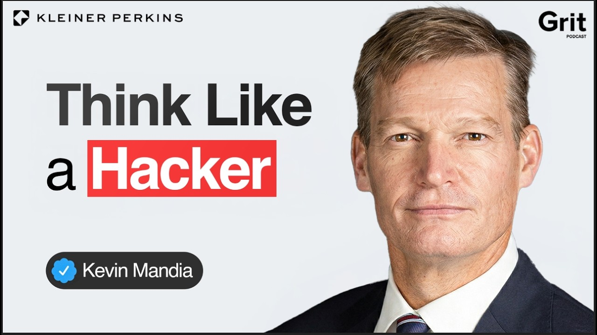
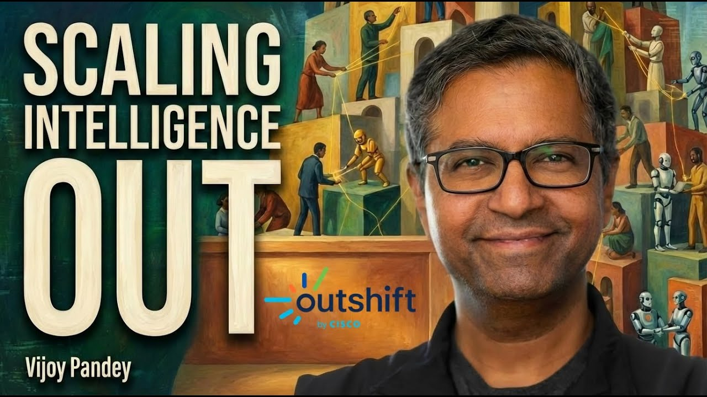
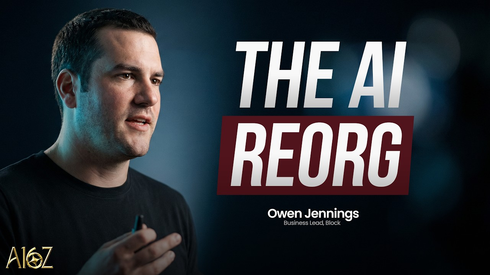
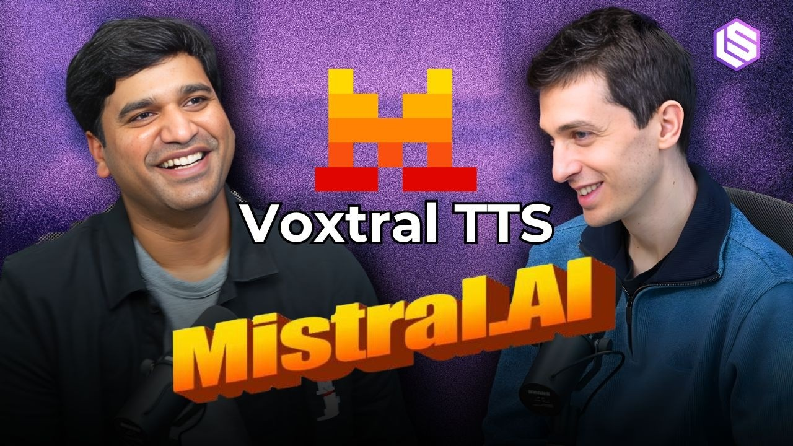

## TLDR

AI is fundamentally reshaping the software and security landscape, from generative UIs making hardcoded interfaces obsolete to the urgent need for autonomous defense against AI-driven attacks. This massive shift is driving unprecedented investment into AI infrastructure, even as compute remains scarce and a "boom and bust" cycle begins to emerge for startups. Meanwhile, top labs like Anthropic are leveraging AI to automate their own growth, while companies like Linear and ClickHouse are making strategic bets on agent-native architecture and data infrastructure.

## The Big Picture: Reimagining Organizations & Agent Evolution

### The AI Infrastructure Paradox: Compute Scarcity Meets Boom & Bust

Marc Andreessen notes that "every dollar right now that's being put in the ground is turning into revenue right away" for AI infrastructure, with [everyone starved for compute capacity (Marc Andreessen on Latent Space, 77min, 0:29:40)](https://www.youtube.com/watch?v=knx2wrILP1M). Yet, Professor Steve (DOAC) warns that the current massive investment is unsustainable, creating a [classic "boom and bust" cycle with a 90% AI startup failure rate (Professor Steve on DOAC, 94min, 1:11:32)](https://www.youtube.com/watch?v=PUO51DoSEqk) and 95% of enterprise AI pilots failing to reach production. Interestingly, older hardware is gaining value: [Google is running "very old TPUs very profitably" (Marc Andreessen on Latent Space, 77min, 0:33:40)](https://www.youtube.com/watch?v=knx2wrILP1M) as software improvements outpace chip depreciation.

**Your angle with founders:** "Everyone's pouring money into AI infrastructure, but the failure rate for AI startups is hitting 90%. How are you navigating this paradox, balancing ambitious scale with cost-efficiency and proven paths to production?"

### Autonomous AI Defense: The Only Way to Fight AI-Driven Attacks

Kevin Mandia, founder of Mandiant, starkly states that "within two years all attacks are going to be AIdriven." He argues that because the speed of AI offense is "incomprehensible," [defense **must** be autonomous, with "no human in the loop" to combat AI-born threats (Kevin Mandia on Grit, 63min, 0:00)](https://www.youtube.com/watch?v=_ZEsfZ-K_TY). This implies a radical shift in cybersecurity, where human reaction times are simply too slow to keep pace.

**Your angle with founders:** "If all cyberattacks are going AI-driven in two years, how are you preparing your defense to be fully autonomous? Are your current security models designed for human speed or AI speed?"

### The Internet of Cognition: Horizontal Scaling for Agent Collaboration

Cisco's Vijoy Pandey contends that the industry has over-indexed on vertical scaling (bigger models) and needs to unlock "the second axis, which is the horizontal axis" — [agents collaborating across a decentralized "Internet of Cognition" (Vijoy Pandey on The Cognitive Revolution, 98min, 0:22:42)](https://www.youtube.com/watch?v=6tKfi0NnzTA). This future requires new higher-order protocols for agents to share context, build trust, and solve complex, longer-duration tasks across diverse cloud and on-prem environments.

**Your angle with founders:** "Are you thinking beyond bigger models to how your agents will collaborate? How will they share context and build trust in a decentralized 'Internet of Cognition'?"

## Builder's Corner

### Generative UI is Here: The End of Hardcoded Interfaces

Block's Owen Jennings signals a major shift: "generative UI is here." He describes products like Block's "Moneybot" for Cash App, which dynamically generates charts and visualizations on the fly based on user queries—[it's "not actually in the code itself" (Owen Jennings on a16z Podcast, 28min, 0:24:20)](https://www.youtube.com/watch?v=krdrkl38nRw). This points to a future where user interfaces are composed by AI, rather than hardcoded, within the next six months.

**Why founders care:** This redefines how you build products, moving from static UI to dynamic, AI-composed experiences. It allows for unprecedented personalization and speed, but demands new approaches to testing and QA for non-deterministic outputs.

### Fine-Tuning: The Data Moat for AI Applications

Mistral's Guiam argues that while closed models are good for prototyping, [fine-tuning models on proprietary customer data is "10x cheaper" and significantly better (Guiam on Latent Space, 55min, 0:31:55)](https://www.youtube.com/watch?v=SUjA25ijcNs) for production workloads. This approach helps companies leverage decades of their own data, address privacy concerns, and achieve superior performance compared to simply providing context at inference.

**Why founders care:** Fine-tuning on your unique data could be your most defensible AI moat, delivering better performance at a fraction of the cost, and keeping your sensitive data in-house.

## Founder Watch

### Anthropic Automates Growth with Claude: 1 to 19 Billion ARR in 14 Months

Anthropic's Head of Growth, Amol Evasari, shares that the company went [from $1 billion to $19 billion ARR in just 14 months (Amol Evasari on Lenny's Podcast, 113min, 0:00:08)](https://www.youtube.com/watch?v=k-H4nsOTuxU). Now, they're using Claude itself for an internal initiative called "Cash" (Claude Accelerates Sustainable Hypergrowth) to automate their own growth experimentation, driving results and signaling a new frontier in AI-powered business scaling.

**Conversation starter:** "Anthropic's growth is unprecedented, and they're using Claude to automate their own growth experiments. How are you thinking about deploying AI beyond your core product to accelerate your own business operations and strategy?"

### ClickHouse Migrates Off DataDog, LLMs Recommend Them for Replatforming

Aaron Katz, CEO of ClickHouse, revealed they internally migrated their observability infrastructure from DataDog due to [high "seven-figure" costs (Aaron Katz on Gradient Dissent, 44min, 0:30:15)](https://www.youtube.com/watch?v=b7fGSA9mVYI). He also notes a surprising trend: [every LLM he asks about replatforming companies suggests ClickHouse (Aaron Katz on Gradient Dissent, 44min, 0:26:07)](https://www.youtube.com/watch?v=b7fGSA9mVYI), demonstrating how AI is influencing critical infrastructure decisions for enterprises.

**Conversation starter:** "ClickHouse ditched DataDog over costs, and LLMs are now recommending their platform. Are you seeing AI influence your infrastructure decisions, or are you still relying on traditional vendor evaluations for critical systems?"

### Linear Builds Its Own AI Agent Backbone, Citing External Control Issues

Karri Saarinen, co-founder of Linear, explains that many SaaS companies "got AI wrong" by superficially adding chatbots. Linear, however, is building its [own integrated coding agents, which have context of an organization's work and allow for "cloud conductor" guided coding (Karri Saarinen on AI & I, 53min, 0:31:07)](https://www.youtube.com/watch?v=8QcW9-dal0g). This move addresses the "tough" problem of not being in control when relying on external agents, aiming for a smoother, end-to-end workflow with usage-based billing.

**Conversation starter:** "Linear is building its own AI agent backbone to control context and workflow. Are you seeing similar control limitations with third-party agents, and is that driving you to build more in-house AI infrastructure?"

## Quick Hits

-   **[Personal Knowledge Bases Using LLMs (1 min read)](https://x.com/himanshustwts/status/2040477663387893931)** — A visualization of Andrej Karpathy's "idea file" architecture, leveraging LLMs for highly hackable and experimental personal information management.
-   **[App Founders vs TikTok Meme (1 min read)](https://x.com/ErnestoSOFTWARE/status/2040904608940208290)** — A humorous take on app founders realizing they no longer need to rely on content-creator marketing to build successful AI-driven products.

## Try This Week

Find a small, repetitive coding or content generation task that an engineer on your team is doing manually. Challenge them to automate it with an AI agent this week, leveraging tools like Claude Code or Goose, and aim to remove human code entirely. The host of DOAC podcast shared that [Spotify "haven't written a human line of code since December" (DOAC, 94min, 1:27:03)](https://www.youtube.com/watch?v=PUO51DoSEqk), illustrating the potential for "dark factory" development.

## Our Play

### Accelerating AI-Native Development with Gemini Code Assist & Vertex AI

The rise of generative UI (Block's "Moneybot") and companies like Spotify moving to "no human code" highlights a massive shift in development. Google Cloud's [Gemini Code Assist](https://cloud.google.com/products/gemini-code-assist) helps teams generate, test, and deploy code faster, while [Vertex AI Model Garden](https://cloud.google.com/vertex-ai/docs/start/explore-models) gives founders access to Gemini and 200+ open models for building dynamic, AI-composed experiences. For startups navigating the infrastructure paradox, this means moving from idea to production without locking into a single model provider.

### Autonomous Security & Agent Orchestration for the "Internet of Cognition"

Kevin Mandia's stark warning about AI-driven cyberattacks demands autonomous defense, and Cisco's vision for an "Internet of Cognition" requires robust agent security and communication. Google Cloud's [Security Command Center](https://cloud.google.com/security/products/security-command-center) — built on Mandiant's threat intelligence — delivers AI-powered detection and autonomous response. Coupled with [Vertex AI Agent Builder](https://cloud.google.com/products/agent-builder) and support for Google's A2A protocol, GCP offers the secure, scalable backbone for building and orchestrating collaborative multi-agent systems across cloud and on-prem environments.

*Connect to this week:* As compute scarcity and AI-driven attacks redefine the market, Google Cloud's integrated AI platform — from Gemini Code Assist for rapid development to Mandiant-powered autonomous security and agent orchestration on Vertex AI — provides the infrastructure for founders to innovate, scale, and secure their AI-native businesses.

---

*Sources: 2 bookmarks, 15 podcast episodes from the AI content library. [Archive](/archive)*