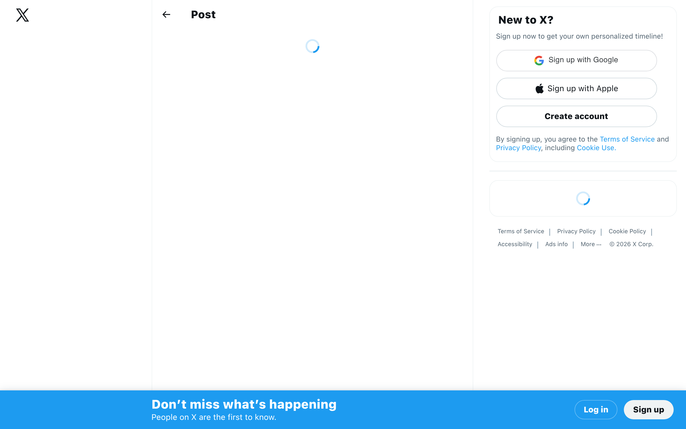
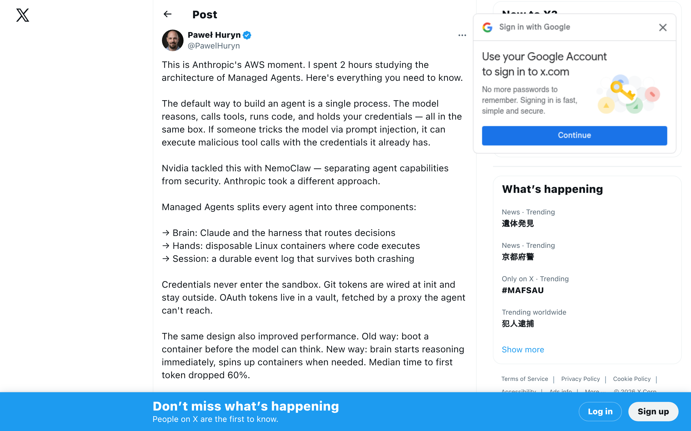
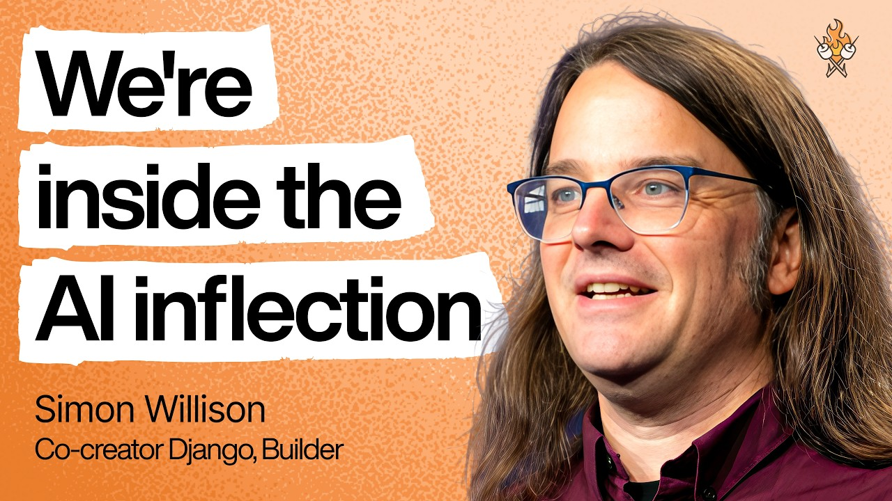
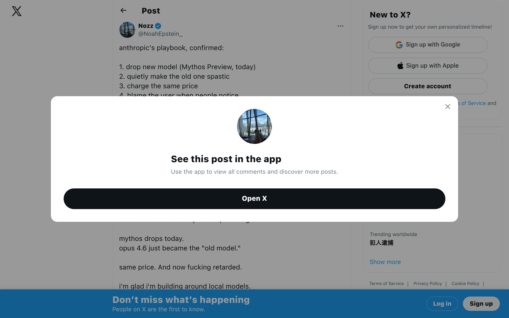
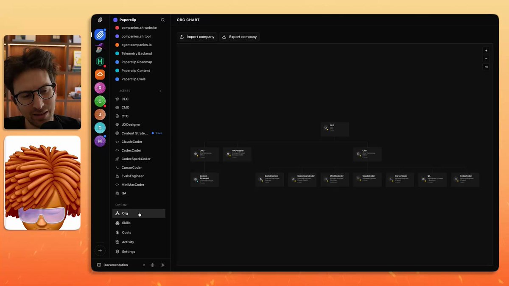

## TLDR

Anthropic hit a staggering $30B revenue run rate, fueled by its new Managed Agents and a platform strategy that’s disrupting early agent startups. This week, we're seeing the AI industry face critical questions about its core purpose and leadership ethics, while the shift to AI-native organizations means executive roles are changing and "dark factories" of code are emerging. Founders are navigating new pathways to exit through productized AI agencies and grappling with model degradation, underscoring the urgency of strategic compute and security.

## The Big Picture: Redefining AI's Trajectory & Organizational DNA

### Anthropic's Agent Gambit & $30B Ramp: A New AI Economy Blueprint

Anthropic has reached an unprecedented **$30B revenue run rate**, adding $11B in just one month and surpassing OpenAI in scale, with over 1,000 enterprises paying $1M+ annually for its models [Anthropic Blog (1 min read)](https://www.anthropic.com/news/google-broadcom-partnership-compute), [Aakash Gupta (4 min read)](https://x.com/aakashgupta/status/2041283873108332878). This surge is concurrent with the launch of **Claude Managed Agents**, a move that an analyst claims has "mass-obsoleted every agent orchestration startup" by handling 90% of infrastructure complexity [Aakash Gupta (3 min read)](https://x.com/aakashgupta/status/2041940149328834748), [Vox (2 min read)](https://x.com/Voxyz_ai/status/2042217947356148180). This isn't just growth; it's a strategic play where model providers absorb the agent stack, challenging the notion of standalone agent startups and intensifying the "hyperscaler war" for compute needed to fuel this demand [Brad Gerstner on All-In (90min, 0:43:01)](https://www.youtube.com/watch?v=DVBJQQCjgXU).

**Your angle with founders:** "Anthropic's $30B run rate and Managed Agents are a blueprint for the new AI economy. Are you building on a platform, or risking getting 'mass-obsoleted' by the model providers who are now owning the entire agent stack?"

### AI's Existential Debate: Curing Cancer vs. Products & The Compute Bottleneck

DeepMind CEO Demis Hassabis, Nobel Prize winner for AlphaFold, reflects that if he "had my way, I would have left AI in the lab for longer... Maybe cured cancer" before the commercial AI race redirected focus to products [Ricardo (4 min read)](https://x.com/Ric_RTP/status/2042230439788638487). He frames AGI as "10x the industrial revolution at 10x the speed," likely within five years, but identifies **compute as the biggest bottleneck** for both scaling existing ideas and experimenting with new algorithmic innovations [Demis Hassabis on 20VC (32min)](https://www.youtube.com/watch?v=SSya123u9Yk). This underscores a critical tension between scientific breakthroughs, rapid commercialization, and the foundational resource limits for truly transformative AI.

**Your angle with founders:** "Demis Hassabis says AGI is likely within five years but compute is the biggest bottleneck. How are you thinking about your compute strategy, not just for scaling, but for the fundamental algorithmic R&D that will differentiate you?"

### The Org Chart Reshuffle: Executive Compression & AI-Native Teams

The rise of AI tools is triggering "executive compression," pushing CTOs back into individual contributor roles at leading AI labs like Anthropic [Aakash Gupta (2 min read)](https://x.com/aakashgupta/status/2042684298671853903). Postman's founder similarly advises to "kill your org chart for AI," advocating for wide spans of control, direct work with ICs, and projects led by high-agency staff engineers [Ivan Burazin (2 min read)](https://x.com/ivanburazin/status/2041199368296931595). Legendary investor Keith Rabois adds that the traditional Product Manager role is becoming obsolete, with future success lying in business acumen and knowing "what to build," not just managing process [Keith Rabois on Lenny's Podcast (83min, 0:00)](https://www.youtube.com/watch?v=xCd9ykretlg).

**Your angle with founders:** "With AI reshaping org charts, are you thinking about executive compression and shifting roles? How can your most senior technical talent get closer to the code, and what new 'superpowers' does that unlock?"

## Builder's Corner

### Agent Harness Wars & Managed Agents: Model-Provider-Led Infra

The new Claude Managed Agents from Anthropic reveal a deep technical strategy: a "Brain/Hands/Session" split that allows the model (Brain) to reason immediately while execution (Hands) happens in disposable containers, dramatically cutting latency and improving reliability [Paweł Huryn (3 min read)](https://x.com/PawelHuryn/status/2042008828334764162). This "thin harness" philosophy, where the model makes most decisions, contrasts with thicker, more explicit control architectures like LangGraph [Akshay Pachaar (5 min read)](https://x.com/akshay_pachaar/status/2042586319390674994). OpenAI echoes this, with engineers focused on "harness engineering" and letting agents boot their own stack, treating human attention as the true bottleneck [Ryan Lopopolo on Latent Space (78min, 0:10:15)](https://www.youtube.com/watch?v=CeOXx-XTYek).

**Why founders care:** The choice of agent harness—thick or thin, managed or open-source—directly impacts your agent's performance, reliability, and the engineering overhead. Understanding these architectures helps you decide whether to build, buy, or leverage model-provided infrastructure.

### The 'Dark Factory' Comes Alive: AI Writing 95% of Code

The "dark factory" of software development is here: "95% of the code that I produce, I didn't type it myself," notes one AI engineer, often coding on his phone while walking the dog [Simon Willis on Lenny's Podcast (100min, 0:04:50)](https://www.youtube.com/watch?v=wc8FBhQtdsA). Another founder reports getting the "first 80% from AI" for blog posts and coding [Peter Yang on a16z Podcast (30min, 0:19:50)](https://www.youtube.com/watch?v=UE8jx4dvlSQ). This rapidly shifts the bottleneck from writing code to ideation and debugging, with predictions that 95% of all code will be AI-generated in the next few years [David Sacks on All-In (90min, 0:37:34)](https://www.youtube.com/watch?v=DVBJQQCjgXU).

**Why founders care:** If 95% of code is soon AI-generated, your competitive advantage shifts. You need to focus on identifying *what to build*, rigorous testing of AI-generated code, and optimizing for the human-AI collaboration that defines the remaining 5%.

## Founder Watch

### Sam Altman's Trust Crisis & OpenAI's Legal Gauntlet

A New Yorker investigation, based on over 100 interviews and internal documents, alleges a "consistent pattern of... Lying" by Sam Altman, with former OpenAI board members describing a "sociopathic lack of concern for consequences of deceiving someone" [Ryan (5 min read)](https://x.com/ohryansbelt/status/2041151473984123274), [Katie Miller (2 min read)](https://x.com/KatieMiller/status/2041265590942220459). This comes as the Musk vs. Altman trial (April 27) looms, questioning whether OpenAI's conversion from non-profit to for-profit (now eyeing an $850B IPO) is legal, potentially impacting the legal foundation of the entire AI industry for companies built on public benefit promises [Ricardo (5 min read)](https://x.com/Ric_RTP/status/2041874516872151478).

**Conversation starter:** "With the New Yorker investigation and the upcoming Musk vs. Altman trial, trust and governance are front and center for AI companies. How are you building trust and transparency into your company's foundation and product, especially if you're working with a non-profit mission?"

### Productized AI Agencies: The Clearest Path to a $10M+ Exit

Greg Isenberg lays out a detailed playbook for achieving a **$10M+ software exit in two years** by starting a productized AI agency [Greg Isenberg (4 min read)](https://x.com/gregisenberg/status/2041865199485936018). The strategy involves picking one painful deliverable for a specific buyer (e.g., SEO content for e-commerce), building an AI workflow, selling it on a $3-5K/month retainer with 80%+ margins, and then using the agency as R&D to productize into a SaaS. This capital-efficient model can lead to $1.9M ARR in two years with a projected 5-8x revenue exit.

**Conversation starter:** "Many founders are looking for capital-efficient paths to exit. Have you considered the 'productized AI agency' model as a launchpad for your SaaS, leveraging AI to achieve high margins and rapid product validation?"

### Model Degradation Spurs Local AI Adoption

Data from 6,852 Claude Code sessions reveal a concerning **degradation in Claude Opus 4.6**, with thinking depth dropping 67% and "lazy behavior violations" increasing [Noah Epstein (2 min read)](https://x.com/NoahEpstein_/status/2041861090645049768). This quiet degradation, prior to a new product launch, has prompted some developers to shift towards local models like Gemma 4 and GLM that "don't get quietly worse." This highlights the critical importance of model reliability and control for founders.

**Conversation starter:** "Are you tracking model performance degradation? With reports of Claude Opus's capabilities quietly declining, are you exploring strategies like local models or fine-tuning to ensure the long-term reliability of your AI applications?"

### Non-Tech Companies Are AI-Native Too: The Roofing Example

It's not just tech startups adopting AI agents. A roofing company is using AI agents to pull satellite imagery, cross-reference hail damage, and feed warm leads directly to its sales team [Mario Nawfal (1 min read)](https://x.com/RoundtableSpace/status/2039345791077371921). This non-tech business is leveraging AI agents for core operations, demonstrating a widespread horizontal adoption pattern that bypasses traditional tech-first approaches.

**Conversation starter:** "A roofing company is using AI agents to find hail damage and generate leads. Where in your business, perhaps outside your core tech, could AI agents be deployed to automate critical operations and create a competitive edge?"

## Quick Hits

-   **[AWS S3 Files: Native Filesystem for AI Agents (1 min read)](https://x.com/apsdehal/status/2041675091524935973)** — Amazon's S3 Files mounts any S3 bucket as a native NFS, offering close-to-open consistency and simplifying durable storage for agent runtimes.
-   **[Meta's Muse Spark: Natively Multimodal Reasoning (1 min read)](https://x.com/AIatMeta/status/2041910285653737975)** — Meta AI launched Muse Spark, their first natively multimodal reasoning model with tool-use and multi-agent orchestration, now available on meta.ai with a private API preview.
-   **[AI Avatar with Permanent Character Consistency (1 min read)](https://x.com/joshua_xu_/status/2041894304617263128)** — Avatar V introduces an AI avatar model that maintains consistent character and mannerisms from a 15-second recording, creating lifelike video from any photo.

## Try This Week

Install `claude-usage`, an open-source local dashboard, to track your Claude Code token consumption. Share the insights with your team to kickstart a conversation about prompt efficiency, agent loop optimization, and overall cost management as you build with AI. Remember, unseen costs are uncontrolled costs.

## Our Play

### The Secure & Scalable Backbone for Agent Innovation

Anthropic's Managed Agents and its $30B ramp highlight the urgent need for a secure, scalable platform that can handle massive agent compute demands while ensuring safety. Google Cloud's [Vertex AI Agent Builder](https://cloud.google.com/products/agent-builder) provides the managed infrastructure for building and orchestrating custom agents, supporting the open [A2A protocol](https://cloud.google.com/products/agent-builder#features) for inter-agent communication. For the "cyber reckoning" warned by industry leaders, our [Security Command Center](https://cloud.google.com/security/products/security-command-center), powered by Mandiant threat intelligence, delivers AI-native detection and autonomous response to secure these complex agent ecosystems. This infrastructure, coupled with high-performance [TPUs](https://cloud.google.com/tpu) and [Google for Startups Cloud](https://cloud.google.com/startup/programs) credits, directly addresses the compute bottlenecks and security concerns that define this new AI era.

*Connect to this week:* As model providers enter the agent infrastructure game and AI-driven cyber threats escalate, Google Cloud offers the enterprise-grade platform to build, secure, and scale your agent innovations, ensuring both performance and trust.

### Empowering 'Dark Factory' Developers with Gemini & Open Models

The "dark factory" of AI-generated code and the shifting roles in AI-native organizations demand tools that amplify developer productivity and empower the "IC-led" revolution. [Gemini Code Assist](https://cloud.google.com/products/gemini-code-assist) provides comprehensive code generation, testing, and deployment support to accelerate development, allowing teams to focus on ideation rather than boilerplate. Developers can leverage [Vertex AI Model Garden](https://cloud.google.com/vertex-ai/docs/start/explore-models) to access Gemini and over 200 open-source models, crucial for avoiding single-model lock-in and mitigating the risks of model degradation. By providing choice and powerful assistance, Google Cloud supports founders in building the lean, efficient, AI-native teams that define today's successful startups.

*Connect to this week:* With 95% of code potentially AI-generated, Google Cloud provides the tools and model choice—from Gemini Code Assist to a diverse Model Garden on Vertex AI—to empower your engineers to build faster, smarter, and with greater control in the age of the 'dark factory.'

---

*Sources: 23 bookmarks, 12 podcast episodes from the AI content library. [Archive](/archive)*