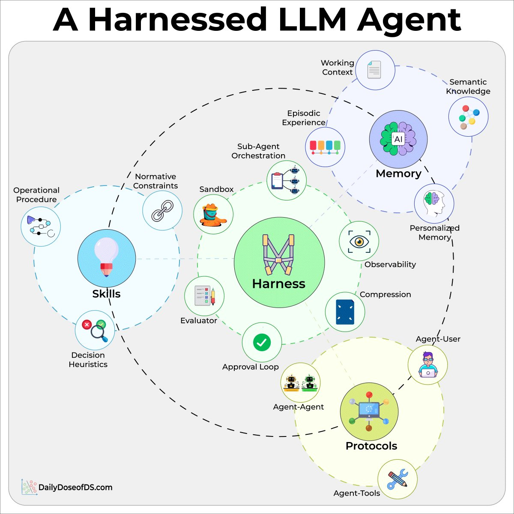
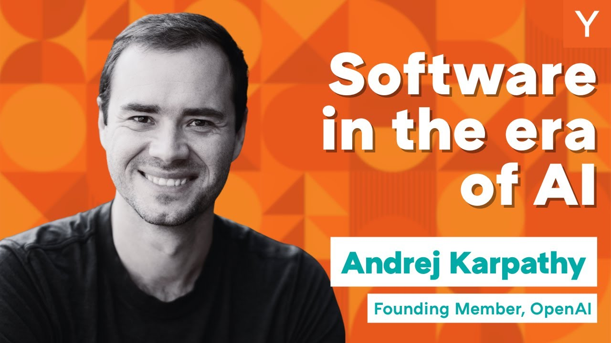
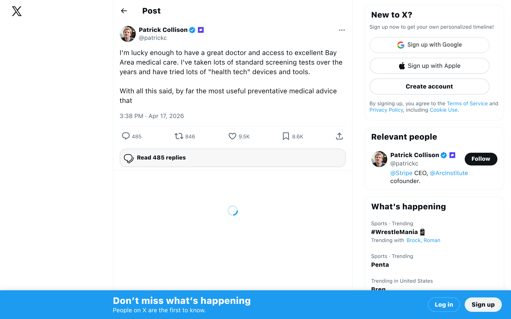
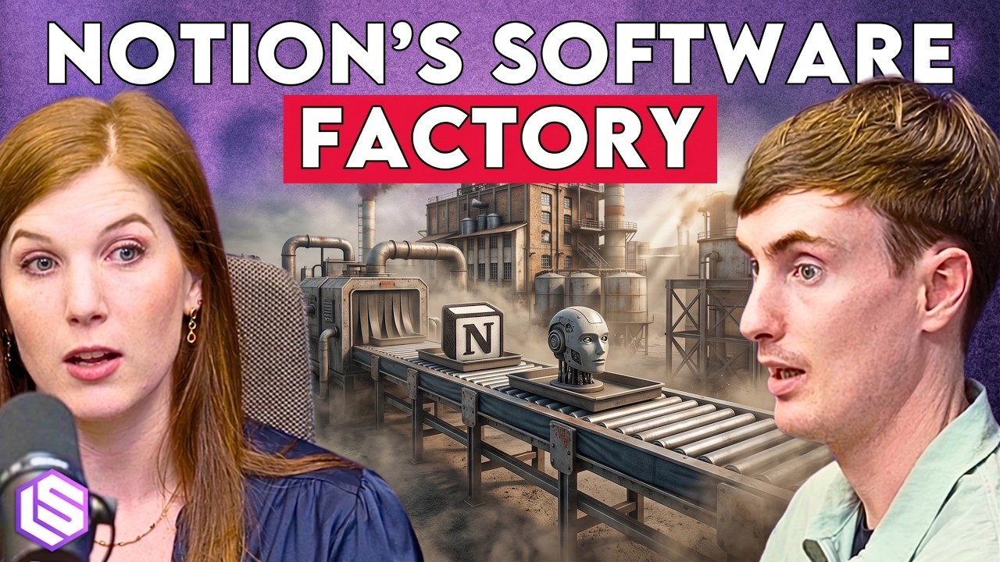
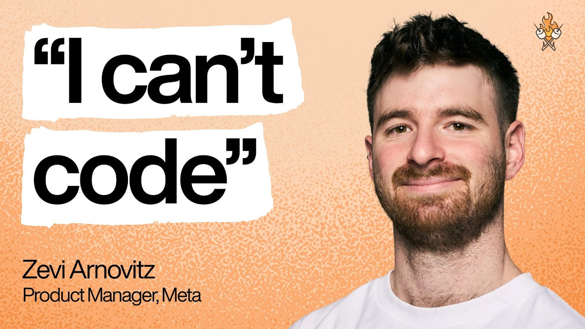

## TLDR

The AI economy is flipping: VCs say the next $1T company will "sell work, not software," driving a wave of agent-first startups and headless SaaS. This ambition is running headfirst into the "datacenter wars," where compute scarcity is forcing frontier labs to self-build infrastructure. Developers are navigating an inverted agent architecture where "code is free, context is moat," and even non-technical PMs are shipping products using multi-model AI workflows.

## The Big Picture: AI Economics Flip & Infrastructure Crunch

### Sequoia's "$1T Thesis": Sell Work, Not Software

Sequoia Capital predicts the next $1T company will **sell work, not software**, capturing the ~6x larger services market with software margins [Guillermo Flor (2 min read)](https://x.com/guilleflorvs/status/2044474540558827903). This means building "AI accounting firms" instead of "AI for accountants," with smaller teams, higher margins, and no churn from bad UX because there's no UX. Agent-native startups are already treating traditional SaaS providers like Salesforce as "dumb backends," becoming the agent themselves and driving outcome-based pricing that will redefine entire vertical industries [Greg Isenberg (3 min read)](https://x.com/gregisenberg/status/2045485535154647386).

**Your angle with founders:** "Sequoia is saying the next $1T company will sell work, not software. What 'work' is your team doing today that an agent could completely own, allowing you to capture the services dollar with software-like margins?"

### The Datacenter Wars: Compute Scarcity Forces AI Labs to Self-Build

Frontier AI labs like OpenAI and Anthropic are facing a critical compute crunch, reaching limits with hyperscalers and **being forced to build their own data centers** [Chamath Palihapitiya on All-In (91min, 0:27:40)](https://www.youtube.com/watch?v=SFdqX7IY7RY). Anthropic's astonishing growth from $1B to $30B ARR in a year, with projections hitting $80-100B, underscores the massive compute demand fueling this shift [David Sacks on All-In (91min, 0:22:00)](https://www.youtube.com/watch?v=SFdqX7IY7RY), [Scott Galloway on Pivot (55min, 0:25:28)](https://www.youtube.com/watch?v=V1RrzWQZb10). This "datacenter war" is intensified by public opposition to new data center construction and a fundamental scarcity of electricity and land, which could see 30 states ban them outright [Chamath Palihapitiya on All-In (91min, 0:39:20)](https://www.youtube.com/watch?v=SFdqX7IY7RY).

**Your angle with founders:** "The biggest AI labs are self-building data centers because hyperscalers are hitting limits. If you're planning exponential compute growth, how are you hedging against that scarcity? Are you exploring hybrid solutions, or looking for partners who can guarantee scalable capacity for your models?"

### Salesforce Goes Headless 360: The API Is The UI

Salesforce has launched **Headless 360, making its API the UI** and exposing its entire platform for AI agents [Marc Benioff (1 min read)](https://x.com/Benioff/status/2044981547267395620). This means AI agents can now directly access data, workflows, and tasks across Salesforce, Agentforce, and Slack without needing a browser, enabling faster builds and agentic operations. This move signals a broader shift where every enterprise SaaS company is expected to go headless within 18 months, enabling new "agent-native" startups to treat them as programmable backends [Greg Isenberg (3 min read)](https://x.com/gregisenberg/status/2045485535154647386).

**Your angle with founders:** "Salesforce just went headless, exposing its entire platform as an API for agents. If you're building an agent-native application, which enterprise SaaS platforms are you seeing open up their API surfaces, and how are you leveraging them as programmable backends?"

## Builder's Corner: The Shifting AI Development Paradigm

### "Code is Free, Context is Moat": Harness Design Inverts Architecture

A deep dive into "harnessed LLM agents" reveals an inverted architecture: the model is deliberately thin, and intelligence is pushed outward to a harness that composes memory, skills, and protocols at runtime [Akshay Pachaar (3 min read)](https://x.com/akshay_pachaar/status/2045510648474530263). An OpenAI staff engineer reinforces this, arguing that **code is free, but context, guardrails, and feedback loops are the true moat** for AI coding agents [Rohit (1 min read)](https://x.com/rohit4verse/status/2045569399990501413). This means focusing on the surrounding system — sandboxing, observability, evaluation, and approval loops — rather than just the model itself.

**Why founders care:** If code is free, your competitive advantage shifts from writing lines of code to designing the surrounding system that gives your AI context and guardrails. Are you investing in building that harness and the feedback loops, or just chaining LLM calls? The game has changed from writing code to engineering the environment around the code-generating AI.

### The '1960s of Computing': Karpathy on Software 3.0 & LLMs as OS

Andrej Karpathy introduces Software 3.0, where **LLMs are operating systems** — the LLM is the CPU, the context window is RAM, and it orchestrates memory, compute, and tools through natural language prompts [Andrej Karpathy on Y Combinator (40min)](https://www.youtube.com/watch?v=LCEmiRjPEtQ). He argues we're in the "1960s of computing" for AI: LLMs are too expensive for personal computing and remain centralized in the cloud with time-sharing. This means the personal computing revolution for AI hasn't happened yet, but will fundamentally reshape how we think about programming and AI's capabilities.

**Why founders care:** Karpathy's framing of LLMs as operating systems changes everything about where you build and how you "program." If you're building prompts and agents, you're a Software 3.0 programmer. But with LLMs still centralized and expensive, your cloud infrastructure choices for scaling and cost efficiency are more critical than ever, influencing whether you can ride this wave or get left behind in the "1960s."

## Founder Watch

### Patrick Collison Unleashes Coding Agents on His Genome

Stripe CEO Patrick Collison revealed that **unleashing coding agents on his genome provided the most useful preventative medical advice** he's ever received [Patrick Collison (3 min read)](https://x.com/patrickc/status/2045164908912968060). For less than $100 in analysis, he discovered a 30x higher melanoma predisposition and identified specific supplements. This points to a future of personalized medicine driven by AI, far exceeding current human capabilities. Echoing this, one founder sequenced their genome at home, tracing multigenerational autoimmune conditions with open-source DNA models, emphasizing privacy-first approaches [Seth Howes (2 min read)](https://x.com/SethSHowes/status/2045289299269070978).

**Conversation starter:** "Patrick Collison says coding agents on his genome gave him better preventative medical advice than any doctor. Are you thinking about how AI can unlock personalized insights from highly complex data sets, even if those data sets are 'human'?"

### Notion's AI Strategy: Agents Drive Search, Open Models Fill Gaps

Notion's AI strategy involves **building for agents, not just humans**, with the majority of their traffic eventually coming from agents using their interface [Notion team on Latent Space (86min, 0:31:40)](https://www.youtube.com/watch?v=ATt7QJgt-2k). They prioritize "give models what they want" in terms of environment and context, focusing on being the best place for collaborative notes, not the best agent harness. Facing challenges with LLM provider inconsistencies and opaque pricing, Notion is **investing in open-source models** to fill gaps in the intelligence-price-latency triangle and re-architecting retrieval systems as agents now drive most search traffic [Notion team on Latent Space (86min, 1:20:41)](https://www.youtube.com/watch?v=ATt7QJgt-2k).

**Conversation starter:** "Notion is building its product for agents first and filling capability gaps with open-source models. How are you balancing proprietary model reliance with open-source flexibility, especially as agents become a bigger part of your user base?"

### Non-Technical PM Builds Products with AI: Meta's Zevy Arnowitz

Zevy Arnowitz, a Product Manager at Meta with zero technical background, is **building and shipping products using Cursor + Claude Code**, treating LLMs as a "non-sycophantic CTO" [Zevy Arnowitz on Lenny's Podcast (75min)](https://www.youtube.com/watch?v=1em64iUFt3U). His workflow involves extensive use of slash commands (reusable prompts) and having multiple LLMs review each other's code. This illustrates how AI is collapsing traditional job titles and enabling non-engineers to become hands-on builders, a trend that will see many PMs become "dinosaurs" if they don't adapt to a "builder's mindset" [Nikhyl Singhal on Lenny's Podcast (96min, 0:06:55)](https://www.youtube.com/watch?v=yUohoaC8_Hs).

**Conversation starter:** "A Meta PM with a music background is shipping products without writing code, using AI as their 'CTO.' Are the non-technical people on your team already building with AI? What tools do they need to go from idea to shipped product?"

## Quick Hits

-   **[LangChain Co-founder: Memory as a Moat (2 min read)](https://x.com/rohit4verse/status/2044472761343774992)** — LangChain's co-founder states that agent memory, built with four markdown files and a cron job, can be a real moat, enabling persistent agent intelligence.
-   **[Claude Code Routines: Triggers Are the Product (3 min read)](https://x.com/gregisenberg/status/2044163870567346331)** — Claude Code Routines let you tell Claude what to do with specific triggers, running 24/7 on Anthropic's servers, highlighting that "the model is the commodity, the trigger is the product" for agent-native startups.
-   **[X API Price Changes: Owned Reads Drop to $0.001/Request (2 min read)](https://x.com/Xclusiv/status/2045562091273077036)** — X API is dropping "Owned Reads" to $0.001/request, making it significantly cheaper to access your own data for AI applications, while other write/URL-based calls increase.

## Try This Week

Andrej Karpathy and Boris Cherny (creator of Claude Code) both advocate for minimalist, goal-driven prompting. This week, try creating a `CLAUDE.md` (or `GEMINI.md`) file for your next coding task with just four principles: `Think before coding`, `Simplicity first`, `Surgical changes`, and `Goal-driven execution` [Tech with Mak (3 min read)](https://x.com/techNmak/status/2043683120319520806). See if less scaffolding leads to better, more focused AI outputs.

## Our Play

### GCP's AI Infrastructure: Doubling Down on Inference & Efficiency

The "datacenter wars" and compute scarcity are driving critical decisions for AI labs. Google Cloud's [Amin Vahdat on This Week in Startups (28min)](https://www.youtube.com/watch?v=k4sHsw55uEo) reveals Google's relentless focus on inference efficiency, making things "twice as fast in 3 months" and compounding to over 10x in a year. This rapidly dropping cost of intelligence (3x/year) means founders are now limited by imagination, not compute, shifting the bottleneck. For companies needing reliable, scalable inference without building their own data centers, our continuous efficiency gains across [TPUs](https://cloud.google.com/tpu) and [Gemini models](https://cloud.google.com/gemini) on Vertex AI provide the backbone to scale without hitting capacity walls.

*Connect to this week:* As compute scarcity forces AI labs to self-build, Google Cloud is doubling down on inference efficiency and cost reduction, providing a scalable, imagination-unbottling platform for your AI innovations.

### Beyond LLMs: GCP's Platform for Verifiable & Custom AI

The emergence of "inverted" agent architectures and the need for deterministic AI signals a move beyond generic LLMs for critical tasks. The Logical Intelligence team notes a market gap for **deterministic, verifiable AI** that LLMs can't fill due to high compute for "guessing games" and lack of transparency [Eve on AI & I (54min, 0:02:23)](https://www.youtube.com/watch?v=Q-i8ZSUCtIc). Meanwhile, Neo4j, which internally fine-tunes models for graph queries, **defaults to Gemini** for its text-to-Cypher translations, highlighting the practical application of our models in specialized domains [Emil Eifrem on Latent Space (49min, 0:18:41)](https://www.youtube.com/watch?v=yyuVR-ML9X8). Google Cloud's [Vertex AI](https://cloud.google.com/vertex-ai) provides the flexibility to build and deploy custom models, including specialized architectures or fine-tuned Gemini models, enabling enterprises to develop private, custom AI solutions with the verifiability and data governance they need.

*Connect to this week:* As the need for custom, verifiable AI grows and "code is free, context is moat," Google Cloud empowers founders to build beyond generic LLMs, leveraging Vertex AI and Gemini for highly specialized, transparent, and custom AI applications.

---

*Sources: 26 bookmarks, 9 videos, 8 podcast episodes from the AI content library. [Archive](/archive)*