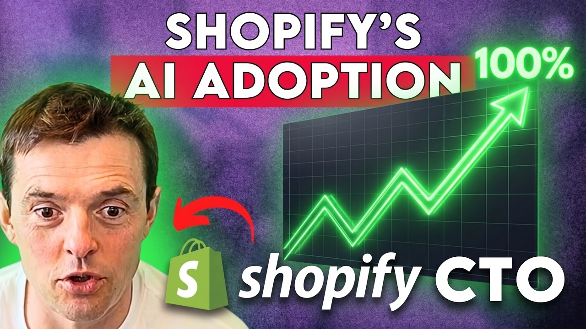

## TLDR

Compute scarcity is forcing frontier AI labs into multi-cloud strategies and massive self-builds, with hyperscalers planning a trillion-dollar buildout. Simultaneously, AI agents are driving a deflationary wave across SaaS, collapsing traditional app categories into single prompts as performance, not just code, becomes the new bottleneck. For builders, understanding model "harnesses" and non-transformer architectures is more critical than ever.

## The Big Picture: Compute as the New Battleground

### Compute Scarcity: Hyperscalers' Trillion-Dollar Buildout

The AI market is "power constrained," with OpenAI reportedly missing targets due to compute and power supply issues, not lack of demand [Chamath Palihapitiya on All-In (81min, 0:16:11)](https://www.youtube.com/watch?v=fpC4sbawSzQ). This crunch is forcing hyperscalers like Amazon, Microsoft, Google, and Meta to plan a staggering **$725 billion in capital expenditures in 2026**, projected to hit $1 trillion across the industry [Jason Calcanis on All-In (81min, 0:52:50)](https://www.youtube.com/watch?v=fpC4sbawSzQ). Some AI companies, like Baseten, are already deploying across 18 different clouds with 90 clusters to access compute, citing "fundamental limitations" with hyperscaler scale and "uncomfortably high utilization" of existing GPUs [Tuhin Srivastava on No Priors (43min, 0:39:10)](https://www.youtube.com/watch?v=XAbKflCncDo).

**Your angle with founders:** "Hyperscalers are pouring a trillion dollars into AI compute, yet even big players are hitting capacity limits. If compute access is the new strategic advantage, how are you ensuring your AI models have reliable, scalable infrastructure to avoid getting 'compute gated'?"

### SaaS Deflation: Agents Collapse App Categories

AI agents are crushing vertical SaaS solutions, enabling enterprises to "spin up an alternative" to off-the-shelf software and triggering a "SaaS debt bomb" for incumbents [Chamath Palihapitiya on All-In (91min, 0:26:07)](https://www.youtube.com/watch?v=1bCXCxrDsCs). SAP's CTO Philipp Herzig declares, "The time is clearly over where you design software that requires the intelligence to sit in front of the computer" [Philipp Herzig on No Priors (40min, 16:50)](https://www.youtube.com/watch?v=5u7AjPardvo). Andrej Karpathy reinforces this, noting that entire app categories are collapsing into single prompts, making his menu-translation app obsolete [Andrej Karpathy on Sequoia Capital (30min, 12:34)](https://www.youtube.com/watch?v=96jN2OCOfLs). This shift is driving companies like Replit to enable non-developers to build and deploy apps with natural language, with their CEO stating "the SaaS apocalypse is justified" for many tools [Amjad Masad on 20VC (49min, 0:30:10)](https://www.youtube.com/watch?v=pN-CK54ms2c).

**Your angle with founders:** "AI agents are dissolving entire SaaS categories into prompts. What does this mean for your product roadmap? Are you building an app, or a system that enables users to just *ask* for what they need, moving towards an 'action-based' paradigm?"

## Builder's Corner: Beyond the Model

### The LLM Harness: Why Prompting is Just 5% of the Game

The performance of an AI agent is 95% dependent on its "harness"—the prompt engineering, scaffolding, and surrounding system—rather than the base model's intelligence alone [Yasser Elsaid on Latent Space (61min, 0:17:46)](https://www.youtube.com/watch?v=CSYWbbP_OkY). Boris Cherny, creator of Claude Code, highlighted 9 common patterns that waste 73% of tokens, emphasizing the need for meticulous harness design [Boris Cherny (1 min read)](https://x.com/Mnilax/status/2050321700802408552). Shopify's Mikhail Parakhin reinforces this, noting that effective agent design involves fewer agents with high-quality critique loops, even if it increases latency, leading to much higher code quality than many parallel, uncommunicating agents [Mikhail Parakhin on Latent Space (75min, 0:52)](https://www.youtube.com/watch?v=RrkGoX3Cw7o). Karpathy notes that infrastructure and documentation must become "agent-native," written for the agent first, humans second [Andrej Karpathy on Sequoia Capital (30min, 20:10)](https://www.youtube.com/watch?v=96jN2OCOfLs).

**Why founders care:** If the model is a commodity, your moat is in how you build around it. How are you designing your agent harnesses and feedback loops to maximize model capability and minimize token waste, and what tooling are you using to make your infrastructure "agent-native"?

### Non-Transformer AI: Liquid Neural Networks Challenge the Stack

While transformers dominate, Shopify is finding **Liquid Neural Networks (LNNs) to be a genuinely competitive non-transformer architecture** internally, especially for search and long-context distilling [Mikhail Parakhin on Latent Space (75min, 1:03:00)](https://www.youtube.com/watch?v=RrkGoX3Cw7o). LNNs, specifically, show promise for low-latency applications and model distillation. This highlights that the AI architecture landscape is still evolving, and non-transformer approaches are gaining ground for specific use cases, offering new avenues for efficiency and performance. Researchers are also finding that "recursion at inference time" is a crucial next scaling law for improving reasoning, allowing tiny recursive models (7M parameters) to solve problems that much larger models cannot [Francois Shaard on Lightcone (YC) (38min, 36:03)](https://www.youtube.com/watch?v=DGtUUMNYLcc).

**Why founders care:** Don't get locked into a single architectural paradigm. If smaller, non-transformer models can deliver better performance and efficiency for specialized tasks, are you exploring diverse architectures and the tooling to deploy them? The fastest, cheapest intelligence might not always come from the largest models.

## Founder Watch

### Noetik: AI Tackles 90%+ Cancer Drug Failure Rate

Noetik is leveraging custom AI models and massive, proprietary human patient data to address the **90-95% failure rate of cancer drugs in clinical trials**, primarily due to poor patient selection [Ron Alfa on Latent Space (86min, 0:03:52)](https://www.youtube.com/watch?v=uqM8qjbLRHA). Their approach focuses on modeling at the functional tissue level, rather than individual cells, and has led to a $50 million licensing deal with GSK for their OctoVC virtual cell foundation model. This demonstrates AI's transformative potential in deep tech sectors requiring intentional, high-quality data generation.

**Conversation starter:** "9 out of 10 cancer drugs fail due to poor patient selection. Noetik is using AI and unique data to fix this. Are there 'unsolvable' problems in your industry that become tractable if you apply AI with a bespoke data strategy?"

### Gojiberry AI Hits $2M ARR with Agent-Driven Growth

Gojiberry AI, a rapidly growing startup, just announced it **hit $2 million ARR (Annual Recurring Revenue)**, a significant leap from €0 just a few months prior [Romàn (3 min read)](https://x.com/romanbuildsaas/status/2047825608030494758). This rapid growth in a short timeframe highlights the accelerating pace at which AI-native companies can achieve substantial revenue milestones, often by automating core business functions with agents and leveraging efficient growth strategies.

**Conversation starter:** "Gojiberry AI went from zero to $2M ARR in just months. What's the fastest way your team could reach your next big revenue milestone if you ruthlessly leveraged AI agents to accelerate sales or operations?"

## Quick Hits

-   **[Notion Product Head: First 10% of Every Project is Free (88 min watch)](https://www.youtube.com/watch?v=mCO-D3pkviM)** — Max Schoening, Head of Product at Notion, says AI dramatically reduces effort for the initial stages of product development, making the first 10% of any project almost free.
-   **[Google Cloud Backlog Doubles with 63% Growth (58 min read)](https://www.youtube.com/watch?v=UcDLJ3GXtzo)** — Google Cloud hit $20 billion, up 63% year-on-year, with its backlog doubling, demonstrating significant momentum in the AI and cloud infrastructure market.
-   **[ChatGPT 5.5 "Clean" & Outperforming Opus 4.7 (81 min watch)](https://www.youtube.com/watch?v=fpC4sbawSzQ)** — OpenAI's new GPT 5.5 is getting strong product reviews and appears to be outperforming Anthropic's Opus 4.7, with users reportedly shifting coding usage to GPT 5.5.

## Try This Week

Andrej Karpathy's personal workflow involves building **LLM Knowledge Bases** from his reading, then asking questions across them for synthesis [Andrej Karpathy (3 min read)](https://x.com/karpathy/status/2039805659525644595). Try this pattern yourself: feed your weekly reading (briefings, articles, docs) into a personal wiki or agent-accessible knowledge base and query it for insights or connections you might have missed.

## Our Play

### Scaling AI: Delivering Capacity and Cost Efficiency for Exponential Growth

The market's insatiable demand for compute and the "trillion-dollar buildout" highlight the urgent need for scalable, cost-efficient AI infrastructure. Google Cloud is aggressively responding, with our **Cloud backlog doubling and 63% year-on-year growth to $20 billion** [Scott Galloway on Pivot (58min, 0:23:45)](https://www.youtube.com/watch?v=UcDLJ3GXtzo). Our dedication to inference efficiency means continually making things faster, leveraging our specialized [TPUs](https://cloud.google.com/tpu) (which are **two times cheaper than Nvidia's GPUs** [Scott Galloway on Pivot (58min, 0:52:15)](https://www.youtube.com/watch?v=UcDLJ3GXtzo)) and optimized [Gemini models](https://cloud.google.com/gemini) on Vertex AI. This allows founders to scale their AI innovations without hitting capacity walls or facing unpredictable costs that limit their ambition, directly addressing the compute scarcity that's becoming the ultimate moat.

*Connect to this week:* As compute becomes the ultimate battleground, Google Cloud's proven growth and efficiency in AI infrastructure ensure founders can confidently scale their ambitious models and agentic applications.

### Agent-Native Development: Building Verifiable AI on Vertex

The shift to "action-based" AI products and the collapse of traditional app categories demand new approaches to software development. Google Cloud's [Vertex AI](https://cloud.google.com/vertex-ai) empowers founders to build sophisticated "harnesses" around models, enabling complex agentic workflows and verifiable AI. Replit, a leading AI development platform, explicitly uses **Google's Gemini models for price-performance sensitive tasks**, at one point sending more tokens to Google than Anthropic [Amjad Masad on 20VC (49min, 0:12:03)](https://www.youtube.com/watch?v=pN-CK54ms2c). This demonstrates how Vertex AI, with its diverse [Model Garden](https://cloud.google.com/vertex-ai/docs/start/model-garden) and robust MLOps tools, is the ideal platform for building these critical agent orchestration layers, allowing founders to focus on outcome-driven, "action-based" products rather than just code.

*Connect to this week:* With "harnesses" now defining AI product quality, Google Cloud's Vertex AI and Gemini models provide the flexible, high-performance foundation for founders to build robust, agent-native applications and verifiable AI.

---

*Sources: 161 bookmarks, 2 videos, 50 podcast episodes from the AI content library. [Archive](/archive)*