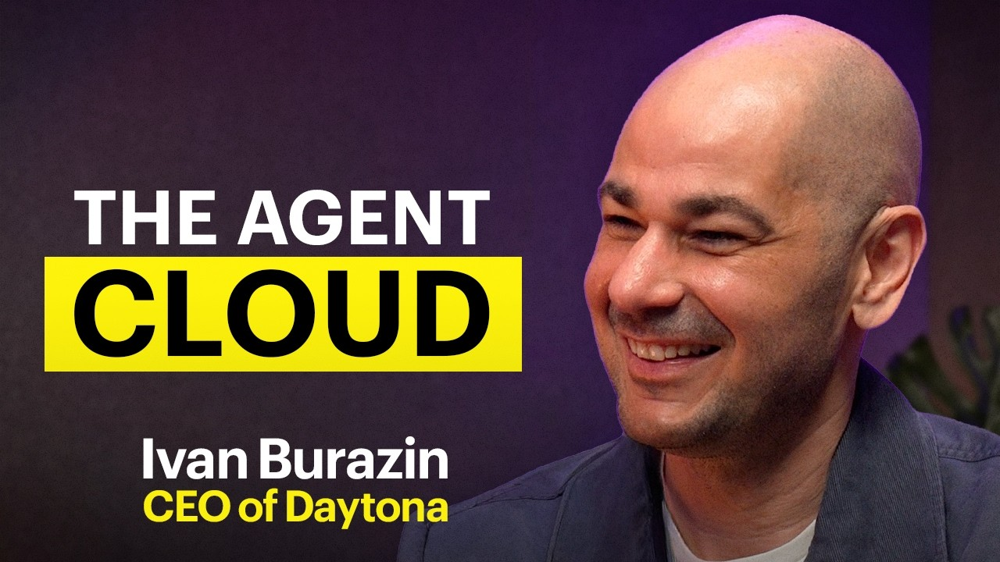
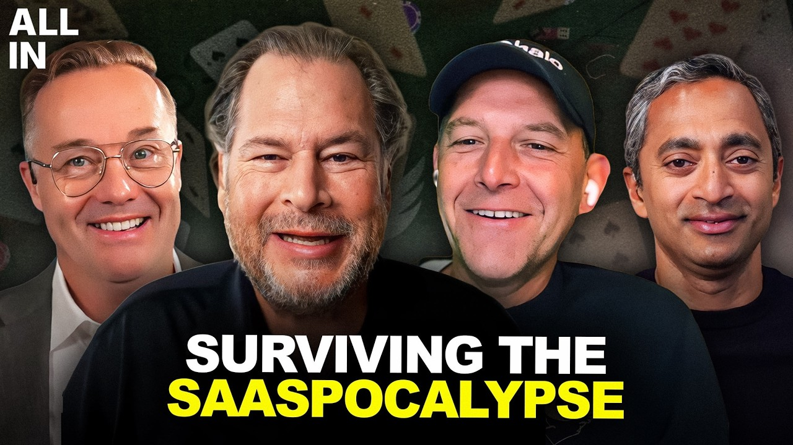
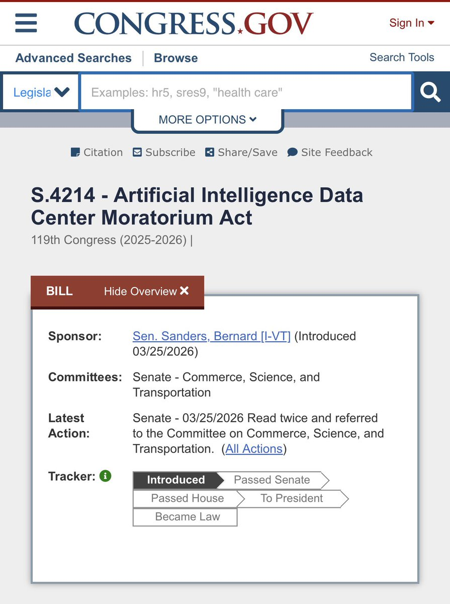

## TLDR

-   **Stateful agents need a new cloud — GCP just shipped most of it.** Agent Engine Runtime, Memory Bank, and GKE Agent Sandbox close the gap Daytona has been pitching against AWS and Azure.
-   **Abridge's distillation playbook runs end-to-end on GEAP.** Cross-vendor teacher (Claude Opus 4.7 → Gemma 4 student) is GEAP-only — Bedrock distillation can't use Claude as teacher into a Gemini/Gemma student.
-   **Compute is supply-gated, and 1-week Provisioned Throughput is the founder-friendly hedge.** PT on Gemini now ships in 1-week terms (alongside 1-month, 1-year). 20–45% off on-demand at full utilization.
-   **LeCun left Meta to bet against LLMs.** Narrow signal — only matters for the robotics / physical-AI / autonomous-systems corner of your book.
-   **GCP plays this week:** Agent Engine Runtime + Memory Bank for the stateful-agent conversation; cross-vendor distillation pipeline for the "we want to own our model" conversation; 1-week PT + Anthropic-on-GEAP-with-1M-context + $750M agentic-AI partner fund for the AWS-displacement conversation.

## The Big Picture

### Stateful Agents Need a New Cloud — and GEAP Has the Answer

The pitch you're going to hear from founders this quarter: traditional cloud was built for stateless request-response. Every API call is independent, every server is interchangeable, scale is horizontal. That works beautifully for SaaS. It breaks the moment an AI agent needs to *remember* anything — last week's preferences, this morning's tool calls, the user it's serving — across requests. Ivan Burazin, CEO of Daytona, has been making this case loudly: AWS and Azure can't retrofit it, the whole architecture has to change [Ivan Burazin on The MAD Podcast (66 min, 0:06:54)](https://www.youtube.com/watch?v=kMXJrzAa5fM).

He's right about the problem. He's selling against the wrong cloud.

Picture the four pieces you'd actually need to build a real agent product: a place where the brain can run for hours without losing context; a place to remember things about each user across sessions; a place to safely execute code the model just wrote; and a place to burst out parallel sub-tasks. On GEAP those map to **Agent Engine Runtime** (the long-lived reasoning loop — write your agent once with the open-source ADK framework, ship it as a versioned endpoint), **Memory Bank** (cross-session memory scoped per user, with multi-tenant isolation baked in at the IAM layer), **GKE Agent Sandbox** (kernel-isolated execution for model-generated code — currently Preview), and **Cloud Run Worker Pools** (the async fan-out). One framework, four targets, all composable.

The point worth landing for a founder: this isn't "Google glued products together." It's one open framework that decides where each piece of your agent runs — and you stay inside your own VPC the whole time. The Daytona / E2B-style sandbox-as-a-third-party-SaaS pattern means your code execution layer lives somewhere else; the IAM perimeter has a hole in it. That's the comparison point.

**Honest read.** AWS Bedrock AgentCore shipped this scope first (Oct 2025) and is fully GA — give them the credit. Daytona is genuinely faster on raw cold-start than GKE Agent Sandbox today. Where GCP wins is the *unified* surface and the IAM-level memory isolation — that one matters a lot for multi-tenant SaaS founders who can't afford "we filter at the application layer."

**Your angle with founders:**
1. "What's the longest-lived session your agent has today — minutes or hours? When that scales to a thousand concurrent users, where does state actually live, and what happens when the process restarts?"
2. "When your agent generates code and executes it, what's actually isolating that from your production environment? Is your sandbox running inside your VPC or somewhere else?"
3. "If you're multi-tenant, how are you enforcing one user's memory can't leak into another's — at the application layer, or somewhere stronger?"

**Where the GCP opportunity is:**
- **Founders on DIY agent stacks (Lambda + DynamoDB + ECS, or similar duct-tape):** the migration story is "one framework, four managed surfaces, all in your VPC." Lead with simplification, not cost.
- **Founders using Daytona or E2B for sandboxing:** honest concession that those are faster on raw cold-start today; push on VPC posture and compliance if that's the actual constraint.
- **Founders already on AWS AgentCore:** harder displacement. Push on framework openness (ADK is open-source) and Memory Bank's IAM-Condition multi-tenancy.

### How Abridge's Distillation Playbook Maps to GEAP

A founder running an AI product in production hits two walls fast: frontier-model APIs are too slow for real-time use cases, and per-token cost compounds at scale. Abridge ($5.3B healthcare AI, ~80M patient-clinician conversations a year) solved both by *distilling* — using a top-tier model as a "teacher" to train a smaller, faster model they own and serve themselves [Shiv Rao on 20VC (69 min, 0:25:29)](https://www.youtube.com/watch?v=byZkrYBF-N0).

This is the playbook a lot of your customers are quietly asking about right now, and most of them think it requires a two-month MLOps build. It doesn't anymore. On GEAP, distillation is a managed workflow: pick a teacher in Model Garden, generate synthetic training data from it, fine-tune a smaller student model, evaluate the student against the teacher, deploy it to a managed endpoint. The whole thing lives in one project on one IAM — not four different services you stitched together.

The detail worth landing in a founder conversation: **GEAP is the only hyperscaler where Claude can be the teacher for a Gemma or Gemini student**. AWS Bedrock distillation locks you into Anthropic teaching Anthropic. That cross-vendor flexibility matters for regulated verticals — pick the highest-accuracy teacher available regardless of vendor (often Claude for medical/legal language), then own a smaller student that runs in your VPC for the production loop. GEAP wraps the whole thing in VPC Service Controls, BAA-covered storage, and confidential-compute inference on Blackwell GPUs (the inference layer still Preview), which is the part that makes the HIPAA story actually defensible.

**Your angle with founders:**
1. "Are you on a frontier API in production today? Have you priced what your inference bill looks like at 10x your current usage?"
2. "What's the latency you'd need to unlock the use case you're holding back on? Is the model the constraint, or the network round-trip?"
3. "If distilling were a one-week managed workflow instead of a two-month MLOps project, would you start with it?"

**Where the GCP opportunity is:** Regulated-vertical founders (healthcare, financial services, legal) who are actively considering moving off frontier APIs for compliance. The full stack — cross-vendor teacher options + VPC-SC + confidential inference + Vertex AI Search for Healthcare for FHIR-aware retrieval — doesn't exist as one product on AWS or Azure today.

### The Compute Squeeze

Senator Bernie Sanders and Rep. Alexandria Ocasio-Cortez introduced a bill this week to pause *all* AI data center construction [Garry Tan (1 min read)](https://x.com/garrytan/status/2054904105018237125) — translating a public mood where 70% of Americans now oppose new local data center construction [AI Daily Brief (32 min, 0:08:20)](https://podcasters.spotify.com/pod/show/nlw/episodes/RIP-Golden-Age-of-Agent-Experimentation-2026-2026) — onto a semiconductor shortage now projected to last through 2030 [AI Daily Brief (27 min, 0:28:13)](https://podcasters.spotify.com/pod/show/nlw/episodes/AI-Inequality-e3jg00q). Every hyperscaler is supply-constrained, including GCP.

**Your angle with founders:**
1. "How many GPUs short are you for next quarter? When you forecast 2027, are you assuming you can actually *get* the inference capacity — or hoping?"
2. "If GPU supply tightens in Q3, who in your vendor's customer base gets de-prioritized first — you, or their bigger customers?"

**Where the GCP opportunity is:**
- **1-week Provisioned Throughput on Gemini** (new this quarter — alongside 1-month and 1-year). A Series A founder can lock burst capacity through a product launch without a yearly commit. PT cuts per-token cost 20–45% at full utilization vs on-demand.
- **Don't overclaim capacity.** GCP is supply-constrained too. Frame as "which provider locks in your commitment in writing," not "we have spare GPUs."

## Founder Watch

### Yann LeCun (AMI Labs) — Betting Against LLMs

LeCun left Meta to start AMI Labs, arguing LLMs are a dead-end for real-world intelligence and betting on **world models + the JEPA architecture** for robotics and manufacturing [Yann LeCun on Unsupervised Learning (82 min, 0:06:50)](https://www.youtube.com/watch?v=ngBraLDqzdI). **Narrow signal:** only matters for the robotics, manufacturing, and autonomous-systems corner of your book — physical-AI founders building beyond text. Don't force the angle on LLM-product founders.

### Jake Stout (Serval) — The Cost of Inaction in Enterprise Software

Jake Stout, CEO of Serval — an AI-native **ITSM platform** (IT Service Management — a modern AI-first replacement for ServiceNow or Jira Service Management) — argues the "cost of inaction" for enterprises *not* embracing AI is now enormous. He positions velocity and talent density as the only durable moats, pushing teams to "ship a product before they can have a meeting to talk about shipping a product." Serval is targeting Fortune 20 accounts directly [Jake Stout on Unsupervised Learning (55 min, 0:12:47)](https://www.youtube.com/watch?v=Q0bxRANHjFY).

**Conversation starter:** "Stout calls ITSM uniquely vulnerable to AI disruption because the workflows themselves change weekly. Which function in *your* customer stack do you think is next for an AI 'rip and replace' — and what's actually slowing the swap?"

## Quick Hits

-   **[Google DeepMind reinvented the mouse pointer (1 min read)](https://x.com/kimmonismus/status/2054248695462232424)** — Sees what you're pointing at, understands context, responds to voice. Hints at the post-GUI agent interface.
-   **[OpenAI launched a personal finance feature in ChatGPT (1 min read)](https://x.com/kimmonismus/status/2055320528198521041)** — Pro users in US, invoices/payments/financial analysis. Direct fintech-startup pressure.
-   **[AI-generated ads perform as well as human-created ads (1 min read)](https://x.com/ericseufert/status/2055288581334131093)** — Until consumers suspect it's AI; then performance drops. Authenticity is the moat.

## Try This Week

Pick one founder who's doing fine-tuning or distillation today and ask: *"What's your distillation pipeline look like — teacher, student, eval, deployment? And what would change if all four steps lived in one project, on one IAM, with cross-vendor teacher options (including Claude as teacher for an open-source student)?"* That's the GEAP differentiator. Listen for friction points around eval and deployment — those map directly to Vertex AI Evaluation Service and confidential-compute endpoints (G4/C4).

## Our Play

### The Three Concrete Plays This Week

**(1) Forward Deployed Engineers + the $750M agentic AI partner fund.** Google Cloud is hiring hundreds of FDEs across US, London, Paris, Hong Kong, plus a $750M agentic-AI partner fund (announced at Cloud Next, April 22) deployed via Accenture, Capgemini, Cognizant, Deloitte, HCLTech, PwC, and TCS [Google Cloud press release (1 min read)](https://www.googlecloudpresscorner.com/2026-04-22-Google-Cloud-Commits-750-Million-to-Accelerate-Partners-Agentic-AI-Development). Direct counter to OpenAI's $10B+ consulting JV and Anthropic's $1.5B+ arm — engineers in the customer's office writing production AI code, funded out of Google, no consulting markup.

**(2) Anthropic-on-GEAP with 1M-token context.** Claude Opus 4.7, Opus 4.6, Sonnet 4.6 — all GA on GEAP with **1M-token context windows on GEAP** (longer than Anthropic offers direct on those models), same per-token pricing, single GCP invoice, inside the customer's VPC-SC perimeter, same IAM as Gemini. The founder framing: "you get both leading frontier model families on one platform with one security posture."

**(3) Provisioned Throughput in 1-week terms (new).** PT on Gemini used to mean 1-month or 1-year commits. As of this quarter, **1-week terms are GA**. Lock capacity through a product launch without a yearly contract. Break-even threshold: ~$50/day single-model spend.

*Connect to this week:* Founders are processing compute scarcity, the FDE arms race, the Anthropic rug pull, and the agent-infra question simultaneously. GEAP converts each into a concrete shipping product — committed capacity, FDE-led deployment, multi-model optionality, stateful agent runtime — not a slogan.

### Autonomous Defense — Mandiant + Model Armor + Confidential Computing

Kevin Mandia on Grit: human-in-the-loop defense is no longer viable against AI-driven attacks; breach times now measured in minutes [Kevin Mandia on Grit (63 min, 0:00:05)](https://www.youtube.com/watch?v=_ZEsfZ-K_TY). The GCP stack is unusually integrated: **Model Armor** runs as a runtime guardrail layer for prompt injection and data leakage across Gemini and third-party Claude/Llama equally; **Mandiant** ships M-Trends 2026 plus continuous red-teaming services for AI models and agents; **Confidential Computing** now covers NVIDIA RTX PRO 6000 Blackwell (G4) and Intel TDX (C4, both Preview). No other hyperscaler ships this stack as one product — AWS has Bedrock Guardrails but no in-house Mandiant equivalent; Azure has Content Safety but no in-house IR practice.

---

*Sources: this week's podcast extraction + bookmarks (May 12–18). GEAP product specifics sourced from canonical [Google Cloud docs](https://docs.cloud.google.com/agent-builder/agent-engine/memory-bank/overview), the [Cloud Next 2026 GEAP launch blog](https://cloud.google.com/blog/products/ai-machine-learning/introducing-gemini-enterprise-agent-platform), [GKE Agent Sandbox docs](https://docs.cloud.google.com/kubernetes-engine/docs/concepts/machine-learning/agent-sandbox), [Long-running agents with ADK](https://developers.googleblog.com/build-long-running-ai-agents-that-pause-resume-and-never-lose-context-with-adk/), and current [Vertex AI tuning docs](https://cloud.google.com/vertex-ai/generative-ai/docs/models/gemini-use-supervised-tuning). [Archive](/archive)*
