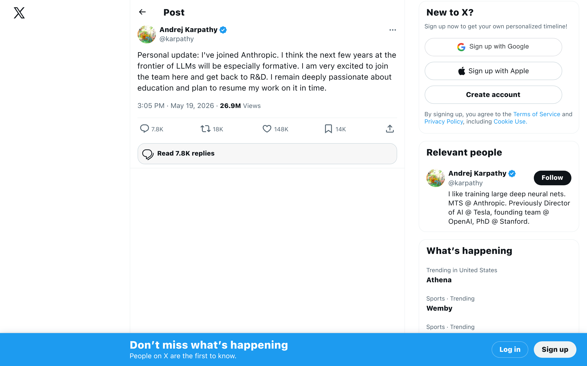
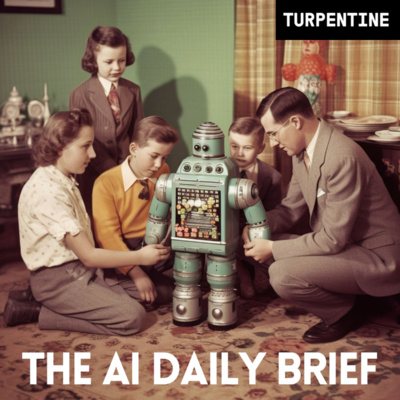
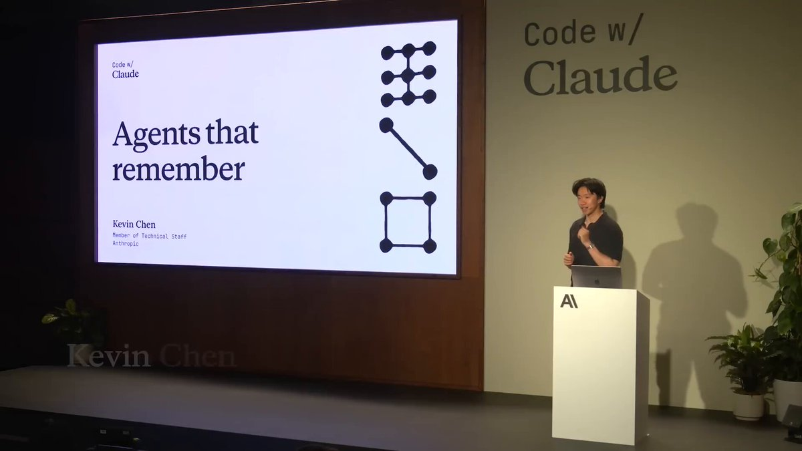
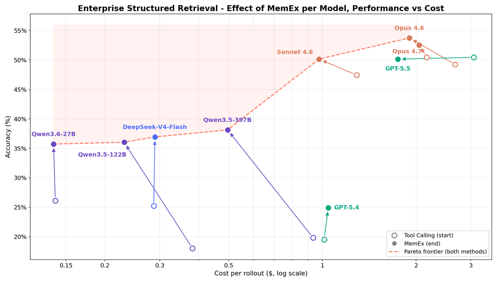

## TLDR

-   **AI labs are profitable, but the free ride is over.** Anthropic just hit its first profitable quarter, driven by a shift to usage-based billing as token-hungry agents reveal true costs.
-   **Karpathy joins Anthropic for Recursive Self-Improvement.** A major talent move signals intense focus on AI accelerating its own pre-training research.
-   **SpaceX enters the AI compute race.** Elon Musk is leasing Colossus capacity to Anthropic and plans to offer AI compute-as-a-service, potentially from orbit.
-   **Agents are gaining real, persistent memory.** Anthropic's new plugin and "dreaming" capabilities, plus Claude Code's `/goal` command, let agents remember across sessions.
-   **Context windows are flooding; new memory patterns needed.** Databricks research on "Memex" highlights the limitations of context windows for agent state, pushing for programmable scratchpads.
-   **Anthropic's enterprise self-serve scales at 54% of new logos.** A major shift in GTM for frontier models, using AI to qualify and guide enterprise buyers without human AEs.
-   **GCP plays this week:** Managed Agents on Gemini API for scalable, remote agent environments; Antigravity 2.0 and Pomelli for agentic workflows; confronting Gemini 3.5 Flash's cost-performance paradox with a focus on efficient model selection.

## The Big Picture

### The End of AI Subsidies: Labs Turn Profitable, Costs Hit Enterprise

The "AI will never be profitable" narrative is officially dead. Anthropic expects its first ever profitable quarter, a first for *any* AI lab, despite immense compute shortages [Host on AI Daily Brief (25 min, 0:03:00)](https://podcasters.spotify.com/pod/show/nlw/episodes/AIs-New-Acceleration-Phase-e3jor7l). This profitability comes as the industry shifts away from flat-rate, subsidized plans to **usage-based billing** for token-hungry agents. Enterprise CIOs are now confronting the true cost of running models at scale, and it's far higher than initially expected [Hedgy Markets on AI Daily Brief (25 min, 0:07:00)](https://podcasters.spotify.com/pod/show/nlw/episodes/AIs-New-Acceleration-Phase-e3jor7l). Uber burned its entire annual token budget in four months; Box is kicking "token strategy" to CFOs [Host on AI Daily Brief (26 min, 00:09:40)](https://podcasters.spotify.com/pod/show/nlw/episodes/Anthropic-Just-Reset-AI-Expectations-e3jngg2).

**Your angle with founders:**
1. "Your Anthropic/OpenAI usage is likely moving to usage-based billing, if it hasn't already. Have you priced out what that means for your burn rate at 2-3x your current model calls?"
2. "As token costs become a dominant topic for Fortune 500 CIOs, what's your strategy to optimize model choice and manage inference spend without compromising on performance?"
3. "Are you seeing demand for cheaper, efficient models like Cursor's Composer 2.5 (10-60x lower cost for coding tasks) as an alternative to frontier models for specific workloads?"

**Where the GCP opportunity is:** Transparent, competitive pricing on Gemini and Anthropic models on GEAP | Provisioned throughput contracts for predictable costs | Cost optimization consulting for model selection and architecture.

### Karpathy Joins Anthropic to Accelerate Recursive Self-Improvement

Andrej Karpathy, a co-founder of OpenAI and architect of Tesla Autopilot, has joined Anthropic to lead pre-training research, specifically focusing on **Recursive Self-Improvement (RSI)** [Andrej Karpathy on X (1 min read)](https://x.com/karpathy/status/2056753169888334312). This talent move underscores the industry's belief that we're entering an "especially formative" period for LLMs [Andre Karpathy on AI Daily Brief (25 min, 0:19:00)](https://podcasters.spotify.com/pod/show/nlw/episodes/AIs-New-Acceleration-Phase-e3jor7l). RSI implies AI accelerating its own learning and development, which could lead to exponential increases in model IQ and a corresponding explosion in compute demand [TMT Longshort on AI Daily Brief (26 min, 00:19:50)](https://podcasters.spotify.com/pod/show/nlw/episodes/Anthropic-Just-Reset-AI-Expectations-e3jngg2).

**Your angle with founders:**
1. "Karpathy's career has been described as the single most accurate map of AI's center of gravity. His move to focus on RSI at Anthropic suggests a new frontier. How are you thinking about the accelerating pace of model capabilities and what that means for your long-term product roadmap?"
2. "If model IQ increases non-linearly, while compute supply scales linearly, what are your hedges for long-term compute access and model optionality?"

**Where the GCP opportunity is:** GCP as a strategic partner for high-performance compute (TPUs, A3/Blackwell GPUs) needed for frontier research | Multi-model optionality on GEAP (Gemini + Anthropic) to hedge against shifts in model leadership.

### SpaceX as the New "NeoCloud" for AI Compute

Elon Musk's SpaceX is expanding its partnership with Anthropic, providing significant AI compute capacity on both Colossus 1 and Colossus 2 data centers [Elon Musk on AI Daily Brief (25 min, 0:10:00)](https://podcasters.spotify.com/pod/show/nlw/episodes/AIs-New-Acceleration-Phase-e3jor7l). Beyond this, SpaceX is actively offering **AI compute-as-a-service** to other companies, positioning itself as an "alternative NeoCloud" with plans for "orbital data centers" [Host on AI Daily Brief (25 min, 0:10:50)](https://podcasters.spotify.com/pod/show/nlw/episodes/AIs-New-Acceleration-Phase-e3jor7l). Anthropic's $45 billion, three-year contract with SpaceX equates to $15 billion annually, underscoring the massive demand and capital flow into AI compute [Host on AI Daily Brief (26 min, 00:25:50)](https://podcasters.spotify.com/pod/show/nlw/episodes/Anthropic-Just-Reset-AI-Expectations-e3jngg2).

**Your angle with founders:**
1. "The entry of SpaceX as a major compute provider validates the intense demand for AI infrastructure. If you're looking for long-term compute access, how are you evaluating the trade-offs between specialized 'NeoClouds' and globally distributed, enterprise-grade hyperscalers?"
2. "With Anthropic committing $15 billion a year to compute, how are you planning for your own future compute needs? Are you looking for long-term commitments, flexible spot capacity, or a mix?"

**Where the GCP opportunity is:** Position GCP's robust, globally distributed, and secure infrastructure as a mature, enterprise-ready alternative or complement to emerging specialized providers | Highlighting GCP's commitment to hybrid and multi-cloud strategies for long-term compute access and diversification.

## Builder's Corner

### Agents Get Real Memory: Anthropic’s Dreaming and Claude Code’s `/goal`

Anthropic engineers just unveiled how to give AI agents persistent memory across sessions, a game-changer for agent reliability [Movez on X (1 min read)](https://x.com/0xMovez/status/2058193075181089247). This "Dreaming" capability allows agents to read and write to memory stores, remembering context over time [Jouhatsu | AI Influence Operator on X (1 min read)](https://x.com/Jouhatsu_ai/status/2057152744842998122). Simultaneously, an official plugin called `claude-code-setup` transforms Claude Code into a fully-fledged AI dev environment, scanning projects and recommending hooks, skills, subagents, and automations [Nainsi Dwivedi on X (1 min read)](https://x.com/NainsiDwiv50980/status/2057038989962653805). Building on this, Claude Code now has a new `/goal` command, enabling autonomous, turn-after-turn execution on tasks until a verifiable "finish line" is met, with a "boss" agent reviewing each step [Tristen O'Brien on YouTube (8 min watch)](https://www.youtube.com/watch?v=aMfig5cKOtY).

**Why founders care:** These features move agents beyond single-turn interactions towards truly persistent, autonomous work, allowing founders to delegate complex, multi-step tasks without constant supervision and accelerate their AI development workflows.

### The Context Window Isn’t Enough: Databricks on Agent Memory

Databricks AI Research highlights a critical bottleneck in current LLM agents: the context window is the *only* persistent memory, and it "floods fast" [Databricks AI Research on X (2 min read)](https://x.com/DbrxMosaicAI/status/2056818063215878618). A single SQL query returning millions of rows can consume the context window, even if only one data point mattered, causing agents to forget previous turns or spend excessive tokens re-processing information. Their new research introduces **Memex**, a "programmable scratchpad" for LLM agents, offering a more efficient way to manage long-term state and avoid context window limitations.

**Why founders care:** Scaling agents beyond simple tasks requires dedicated memory architectures. Founders building complex, long-running agents (e.g., for data analysis or customer service) need to understand and implement solutions beyond just increasing context window size to ensure efficiency and performance.

## Founder Watch

### Anthropic’s Head of Industries on Scaling Self-Serve Enterprise AI

Eleanor Dorfman, Anthropic’s head of commercial/industries, explained how the company handled a vertical demand spike by scrapping the "sales-led vs. product-led" orthodoxy. After Opus 4.6 broke their demand curve, they launched enterprise self-serve and now **54% of new enterprise logos** come through that channel [Eleanor Dorfman on SaaStr AI (30 min watch)](https://www.youtube.com/watch?v=ra0-ZvVApGk). The thesis: don't bolt Claude on as a seventh tool, make it the connective tissue between existing tools (Salesforce, Gong, Slack, etc.), with Intercom Fin guiding the self-serve buyer journey.

**Conversation starter:** "Anthropic, a frontier model company, is seeing 54% of its new enterprise logos come through self-serve, with contracts closing without human AEs. How is your team thinking about the role of self-serve motions for high-ACV enterprise deals, and what tooling would be required to support that?"

### Solo Founder Making $1M/Year with AI Agents for "Boring Industries"

A solo founder is generating $1,000,000 a year building AI agents for real estate agents, charging $5,000 to $10,000 per client per month [starmex on X (1 min read)](https://x.com/starmexxx/status/2056686555083706690). The key insight: "boring industries pay the most. real estate, insurance, manufacturing, legal. they have money and they hate using ai." He uses Obsidian as his second brain because Notion can't run agents that perform real work.

**Conversation starter:** "You often hear about AI transforming flashy industries, but this founder is doing $1M ARR targeting 'boring industries' like real estate. What's one 'boring' workflow in your customers' businesses that you think is ripe for a $5-10K/month AI agent solution, and what's holding them back from building it?"

## Quick Hits

-   **[Perplexity open-sourced Bumblebee (1 min read)](https://x.com/VaibhavSisinty/status/2058153373740982372)** — A security tool for local laptop scanning, checking for sneaky code or plugins in agent workflows.
-   **[OpenAI introduced Guaranteed Capacity (1 min read)](https://x.com/OpenAI/status/2056823271774101907)** — A new offering for customers to guarantee long-term access to OpenAI compute, in a compute-constrained world.
-   **[Gemini 3.5 Flash tops APEX-Agents AA leaderboard (1 min read)](https://x.com/mercor_ai/status/2057244992624803864)** — Google's new model scores 47.1% on agentic tasks, nearly 10 points ahead of GPT-5.5 (37.7%).

## Try This Week

Aaron Levie noted that "token costs will become a dominant topic in enterprises going forward with AI" after a dinner with Fortune 500 CIOs, where "basically no one feels like they have the right solution" [Aaron Levie on X (1 min read)](https://x.com/levie/status/2056965292753146019). This week, pick one mid-market founder or CTO to ask: *"What's your current strategy for managing token costs as your AI usage scales? Are you actively looking at model optimization, or considering alternatives for specific workflows?"* Listen for their pain points around prediction, billing, and efficiency.

## Our Play

### Google I/O’s Agentic Arsenal: Managed Agents, Antigravity 2.0, Pomelli

Google I/O delivered new agentic tools for diverse use cases. **Managed Agents on the Gemini API** provide a one-API-call agent with a remote Linux environment, custom instructions, skills, and tools in Markdown [Google AI Studio on X (1 min read)](https://x.com/GoogleAIStudio/status/2056836824686059616). **Antigravity 2.0** is a new standalone desktop application for multi-agent teams, scheduled tasks, and native voice integration with Google products, aiming for an agent-optimized developer experience [Google Antigravity on X (1 min read)](https://x.com/antigravity/status/2056795168326754759). And for the non-technical, the new **Pomelli Agent** (part of Pomelli by Google) can instantly build a comprehensive "Business DNA" from files and docs for brand identity creation, no website needed [Jaclyn Konzelmann on X (1 min read)](https://x.com/jacalulu/status/2056802704937332809).

*Connect to this week:* These announcements expand GCP's agentic ecosystem, moving beyond core GEAP infrastructure to offer managed developer environments and application-level agents, directly addressing the market's shift toward persistent, action-oriented AI.

### The 3.5 Flash Paradox: Speed vs. Cost vs. Product Sprawl

Google released **Gemini 3.5 Flash**, topping agentic leaderboards (APEX-Agents AA) and boasting 3x faster speeds than 3.1 Pro [Sundar Pichai on X (1 min read)](https://x.com/sundarpichai/status/2056796893951426705), [Mercor on X (1 min read)](https://x.com/mercor_ai/status/2057244992624803864). However, early users and analysts point to a paradox: it's "not all that inexpensive," 3x the cost of the last Flash model, 2x more expensive than 3.1 Pro for similar tasks, and "more expensive than GPT-55 Medium" [Simon Willison on X (1 min read)](https://x.com/simonw/status/2056867815605625172), [Theo from T3 on AI Daily Brief (36 min, 0:30:54)](https://podcasters.spotify.com/pod/show/nlw/episodes/Why-Google-Isnt-Chasing-Claude-Code-e3jlltb). Compounding this, the sheer volume of Google AI product announcements (Gemini Omni, Spark, Antigravity, Pomelli, etc.) is creating significant user confusion and "OMG product sprawl" [Simon Smith on AI Daily Brief (36 min, 0:34:10)](https://podcasters.spotify.com/pod/show/nlw/episodes/Why-Google-Isnt-Chasing-Claude-Code-e3jlltb).

*Market reaction:* Developers like Tenebrus noted 3.5 Flash's speed is negated by a "huge avalanche of unnecessary tool calls" [Tenebrus on AI Daily Brief (36 min, 0:31:40)](https://podcasters.spotify.com/pod/show/nlw/episodes/Why-Google-Isnt-Chasing-Claude-Code-e3jlltb). Peter Yang observed, "Google is going to win consumer AI. It's the only US lab that's building video models and consumers love video" [Peter Yang on AI Daily Brief (36 min, 0:35:05)](https://podcasters.spotify.com/pod/show/nlw/episodes/Why-Google-Isnt-Chasing-Claude-Code-e3jlltb).

*Connect to this week:* While Google's innovation pace is undeniable, the 3.5 Flash cost-performance trade-offs and product sprawl directly reflect enterprise concerns around token costs and AI strategy clarity. This allows GCP reps to position GEAP's curated Model Garden and Agent Builder as offering a clearer, more cost-transparent path for enterprise AI development.

---

*Sources: 72 bookmarks, 7 videos, 7 podcast episodes from the AI content library. [Archive](/archive)*