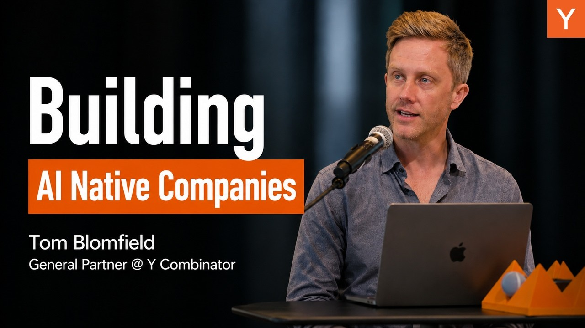
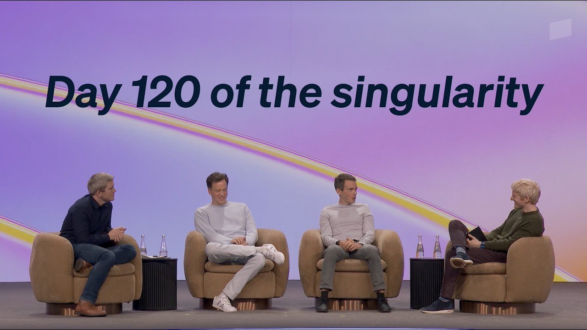
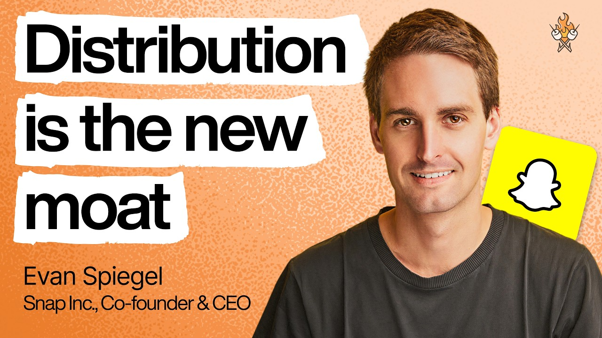

## TLDR

-   **"Burn tokens, not headcount" is now a YC thesis.** Y Combinator is telling portfolio companies the new unit of value is a recursive self-improving loop, not headcount. Demo Day cohorts hit it with 5x more revenue per employee than 18 months ago.
-   **Token-budget-per-person is the new enterprise line item.** Nat Friedman and Daniel Gross flag that individual ICs are now racking up significant AI spend across APIs — and no finance team has the right framework to attribute it. The next AI line item belongs to the CFO, not the CTO.
-   **"Software is not a moat" — now applied to AI.** Snapchat's Evan Spiegel says the 15-year-old lesson is being rediscovered: distribution, ecosystem, and hardware are the real moats. Founders racing to ship Claude wrappers should hear this.
-   **`/goal` ships autonomous Claude Code loops.** A built-in command runs Claude turn-after-turn until a verifiable finish line is met. Boss-worker pattern under the hood. The "set and walk away" agent moment, in production.

## The Big Picture

### "Burn Tokens, Not Headcount" — YC's Self-Improving Company Thesis

The hierarchical org chart — humans as information conduits between layers — is now obsolete, argues Y Combinator. The new unit of value is a **recursive self-improving loop**: sensor (emails, tickets, telemetry) → policy (rules, permissions) → tools (deterministic APIs and skills) → quality gate (evals, human review on risky calls) → learning that updates the skills and code overnight. Live example: a YC company's monitoring agent watches every internal query, identifies failures, writes a PR to fix the underlying tool, ships it — next morning the same query succeeds. The aha is *not* making humans 20–30% more productive; it's removing them from the loop on routine work. YC reports Demo Day cohorts at **5x revenue per employee** vs. 18 months ago [YC Root Access (13 min watch)](https://www.youtube.com/watch?v=t-G67yKAHBQ).

**Your angle with founders:**
1.  **Loop, not feature:** "Which of your workflows is a true closed loop today — sensor, action, eval, learning — vs. a human pasting outputs between tools?"
2.  **Where humans actually belong:** "Where is human review adding value, and where is it just slowing the loop without catching anything?"

**Where the GCP opportunity is:** Agentic Data Cloud + GEAP Agent Engine Runtime + Memory Bank are the substrate — persistent memory, IAM-isolated multi-tenancy, async fan-out. The conversation shifts from "which model" to "where does loop state live, and how does it learn overnight."

### Tokenmaxxing: The Per-Person AI Budget Becomes the Next CFO Line Item

Individual ICs can now rack up serious charges across a dozen AI APIs — and finance has no framework to attribute it. Daniel Gross on Cheeky Pint: *"What is the right way to think about attributing budget to individual people?"* Nat Friedman flagged that many of those tokens are *economically unnecessary* — a smaller model would do the same job. They also named the bottleneck: verifying AI-driven G&A work has become the slowest step in the loop. Humans are the gating function on agent throughput [Nat Friedman & Daniel Gross on Cheeky Pint (56 min, 33:00)](https://www.youtube.com/watch?v=l9wzs_QIyp0).

The enterprise AI line item is no longer "how much does the company spend on Anthropic" — it's per-seat allowance, top-spender visibility, model-tier routing, and guardrails before exploration becomes a budget event.

**Your angle with founders:**
1.  **Per-seat policy:** "Do you have a per-employee token budget today, or is everyone on a shared key? When you hit a six-figure month, how will you know which team drove it?"
2.  **Spend-as-signal:** "What does your top token-spender's workflow look like? That person is your real R&D — and your biggest unmanaged cost center."

**Where the GCP opportunity is:** GEAP's per-project IAM, per-team billing, and quota controls give finance the attribution Friedman wants. Multi-model routing (Gemini, Claude, open models on one invoice) lets customers reserve Opus for high-value loops and route the rest to Gemini Flash. Lead with billing and identity, not GPU pricing.

### "Software Is Not a Moat" — Spiegel's 15-Year-Old Lesson Hits AI

Evan Spiegel surfaced the most-overlooked founder warning of the week: "15 years ago we learned software is not a moat — which everyone is discovering today with AI." Hardened by a decade of watching Meta clone every Snap feature within weeks: features are trivially copyable; durable moats live in *distribution, ecosystems, and hardware*. Every prompt, agent loop, or RAG pipeline can be replicated in days. The winners own the buyer relationship, the platform, or the device [Evan Spiegel on Lenny's Podcast (71 min, 03:00, 20:53)](https://www.youtube.com/watch?v=-7Yol5vX5xw).

**Your angle with founders:**
1.  **Where's the actual moat?** "If a competitor could replicate your AI feature in a weekend with Claude, what's the asset they *can't* replicate — your data, distribution, integrations, or customer trust?"
2.  **Distribution before features:** "Where are you spending more time — building the next feature, or building the channel that gets it in front of customers? Spiegel says most consumer founders get this ratio backwards."

**Where the GCP opportunity is:** Ecosystem and data integrations that are hard to rip out — Agentic Data Cloud, BigQuery as system of record, marketplace + partner network. Switching costs no Claude wrapper can replicate. The conversation moves from "which model" to "which data and distribution surface are you compounding on."

## Builder's Corner

### Claude Code's New `/goal` Command for Autonomous Tasks

Claude Code's new `/goal` command runs the agent autonomously until a verifiable finish line is met — no constant human prompting. Two agents under the hood: a worker (Opus/Sonnet) and a "boss" reviewer that checks the goal after every step. Example: processing a year of bank-statement PDFs into a categorized spreadsheet, which previously required babysitting [Tristen O'Brien on YouTube (8 min watch)](https://www.youtube.com/watch?v=aMfig5cKOtY). Pair with `--dangerously-skip-permissions` or pre-approved tools for truly hands-off execution.

**Why founders care:** Multi-step, verifiable workflows (data extraction, summarization, categorization) become set-and-forget. Agent autonomy crosses a new threshold.

## Founder Watch

### Anthropic Cowork for Sales — The Skills-in-a-Session Demo

Brittany, a growth AE at Anthropic, demoed Cowork by building an "account strategy" skill live: pulls call recordings, Salesforce data, warehouse usage, Slack, email, and web in parallel, then synthesizes into a pre-meeting brief. A second skill, "call transcript processor," runs post-meeting to produce personal action items, an internal Slack update, and a customer follow-up email — each gated for human approval before sending [Anthropic Cowork demo (3 min watch)](https://www.youtube.com/watch?v=dDg7vhvtbEE). The 30-minute post-meeting wrap collapses to ~2 minutes and is more thorough than working from memory.

**Conversation starter:** "If your AE could spin up a custom prep-and-follow-up skill in 10 minutes — and approve every outbound message before send — what's the actual blocker: data connections, security review, or org muscle?"

### Dust Raises Series B — Scaling "Multiplayer AI"

Dust (Abstract, Sequoia) raised its Series B pitching the **multiplayer AI** layer: solo agent use doesn't compound across a team because the agent lacks shared company context. Their platform is a shared workspace for humans and agents to collaborate on context, artifacts, and goals. Named customers include 1Password, Datadog, and Vanta — continued investor appetite for enterprise multi-agent orchestration [Dust YouTube (1 min watch)](https://www.youtube.com/watch?v=KXwQaq7Dt24).

**Conversation starter:** "Is your team's AI use hitting a wall because agents lack shared context — and how are you thinking about that 'multiplayer' collaboration layer?"

## Quick Hits

-   **[Kimi K2.5 + Agent Swarm released as open architecture (May 24)](https://x.com/GGxBondo/status/2058550366409494785)** — Moonshot's open-weight system orchestrates 100+ parallel agents with 1,500 concurrent tool calls. Tasks that take Claude 4.5 / GPT-5.2 an hour, Kimi finishes in ~15 min at 4–5x lower cost. The China-frontier swarm pattern is now reproducible on hyperscaler GPUs.
-   **[Sam Altman: "revenge of the idea guys" (56 min watch)](https://www.youtube.com/watch?v=5eouRdDYM2c)** — Non-technical founders who deeply understand users are now fundable because they can build. The next unlock after coding: delegating computer-clicking drudgery entirely.
-   **[Dan Shipper: "I would buy SaaS stocks right now" (May 24)](https://x.com/lennysan/status/2058634599320924381)** — Counter to the SaaS-is-dead narrative and a useful tension with Spiegel's "software is not a moat." Implicit thesis: AI-augmented SaaS expands the market, doesn't collapse it.
-   **[FDE arbitrage: AI is bottlenecked by translation, not intelligence (23 min watch)](https://www.youtube.com/watch?v=wFdpflS3-3s)** — 95% of enterprise AI pilots fail in production — not because models are weak, but because of data silos, governance, and integration. FDE postings surged Jan–Sep 2025 while general SWE postings flatlined.

## Try This Week

Pull the per-team AI bill from your top three accounts and walk in with one question: *"Who's your top token-spender, and what are they actually doing with those tokens?"* That single ask surfaces the AI-native workflow the customer cares about, the team that will defend renewal, and the policy gap finance hasn't filled. Fastest path from usage line item to a strategic conversation about GEAP's per-project billing, model routing, and per-seat quotas.

## Our Play

### Agentic Data Cloud: The Substrate for Connective-Tissue AI

Google Cloud's **Agentic Data Cloud** makes a customer's existing tools (CRM, support, billing, comms) legible to agents without ripping them out. A Knowledge Catalog structures diverse data, a Data Agent Kit lets agents access and synthesize across silos, and zero-ETL via Iceberg REST and Cross-Cloud Interconnect avoids a two-quarter migration. Security and IAM hold up to a deal-desk review.

*Connect to this week:* Dust's "multiplayer AI" thesis and the Anthropic Cowork demo both depend on a shared data substrate the agent can read across — without rebuilding the data layer. Agentic Data Cloud is the GCP version of that surface.

### Agent Engine Runtime + Memory Bank for Self-Improving Loops

YC's loop (sensor → policy → tool → eval → learning) needs four things most cloud stacks don't give you in one place: a long-lived reasoning loop that survives restarts, cross-session memory per user, kernel-isolated sandboxes for model-generated code, and async fan-out. On **Gemini Enterprise Agent Platform (FKA Vertex AI)** those are **Agent Engine Runtime** (write once with open-source ADK), **Memory Bank** (IAM-layer multi-tenant isolation), **GKE Agent Sandbox** (kernel-isolated execution), and **Cloud Run Worker Pools** (async fan-out). One framework, four managed surfaces, all inside the customer's VPC.

*Connect to this week:* "Burn tokens not headcount" only works if loop state actually persists. For founders DIY-ing on Lambda + DynamoDB + ECS, lead with simplification. For multi-tenant SaaS, lead with Memory Bank's IAM-level isolation — the difference between "we filter at the application layer" and "the platform enforces it."

---

*Sources: 6 bookmarks, 8 videos, 13 podcast episodes from the AI content library. [Archive](/archive)*