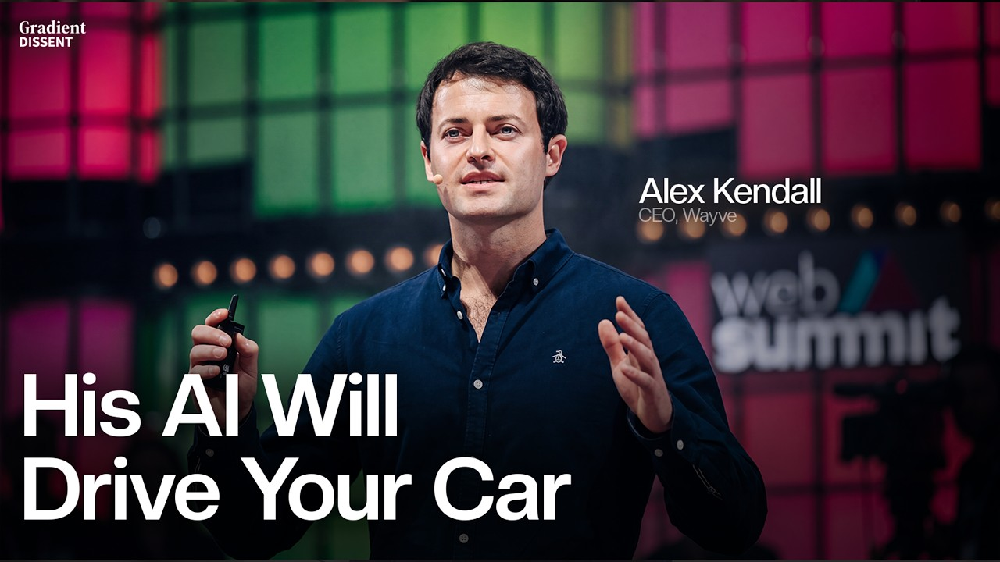
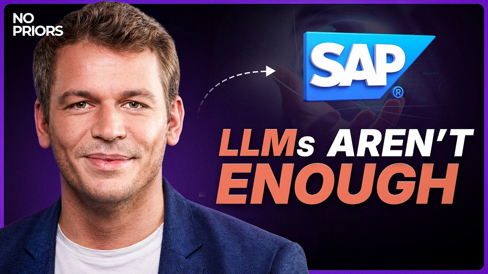
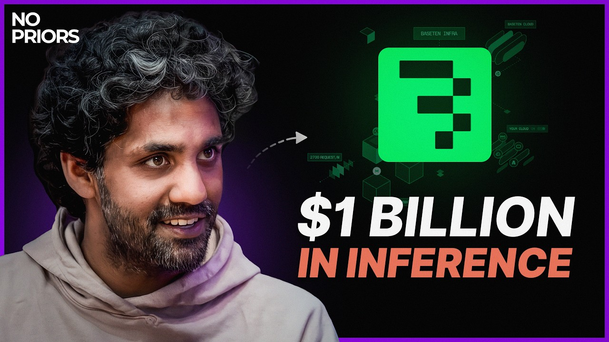
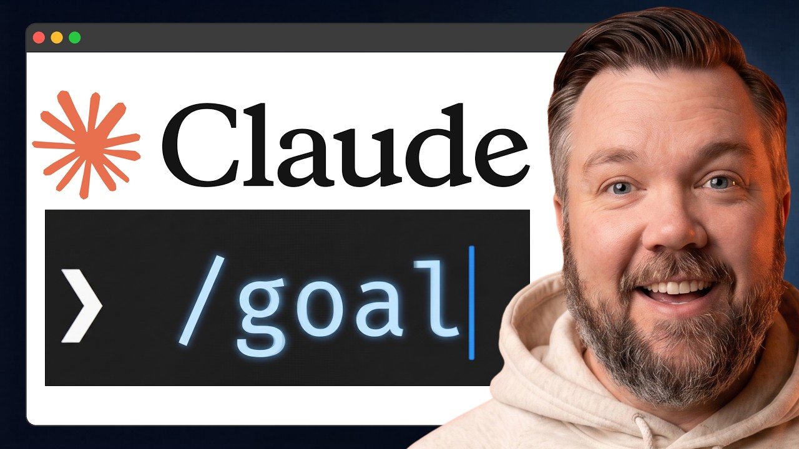

## TLDR

-   **Algorithm is 1% of AI, infra is 99%.** Self-driving AI leader Wayve admits under-investing in robust platforms, citing infrastructure as the true bottleneck for scaling deep learning.
-   **Enterprise AI still stuck in pilot purgatory.** SAP's CTO notes a widening gap between AI innovation and actual business outcomes, blocked by data silos, scale, and security.
-   **AI compute is scarcer than ever.** Baseten runs clusters at "uncomfortably high utilization," requiring 3-5 year prepaid contracts for next-gen B200 GPUs. Hyperscalers are hitting "fundamental limitations" at extreme scale.
-   **AI-native GTM is disrupting enterprise sales.** Anthropic's Head of Industries reveals 54% of new enterprise logos now come through self-serve, driven by AI as the connective tissue between existing tools.
-   **GCP plays this week:** Agentic Data Cloud for unified enterprise data and tribal knowledge; long-dated committed-capacity contracts and multi-model optionality for compute scarcity; and our FDE model for complex, last-mile deployment friction.

## The Big Picture

### "1% Algorithms, 99% Infra": Wayve's $8.6B Lesson

Wayve, the $8.6B self-driving AI company backed by Nvidia and Uber, has achieved zero-shot generalization across 500+ cities with an end-to-end learning model. Yet, CEO Alex Kendall made a stark admission: "I think I over-indexed on algorithmic innovation compared to infrastructure. And like the big learning I have with deep learning is that it's 1% algorithms, 99% infra." Wayve was "held back by a robust platform for many years," confirming that scale and performance are less about groundbreaking models and more about bulletproof data pipelines, reliability, and iteration speed [Alex Kendall on Gradient Dissent (46 min, 37:15)](https://www.youtube.com/watch?v=k5wgts8y-xU).

**Your angle with founders:**
1.  **What's the real bottleneck?** "Are you optimizing your algorithms, or are you ensuring your data, eval, and deployment loops are actually robust enough to scale?"
2.  **Beyond the model:** "What part of your AI development is most held back by infrastructure today — data cleanliness, iteration speed, or introspection tools?"
3.  **Future-proofing compute:** "If you need 10x your current compute in 12 months, where are you hedging for that capacity, and what are the contract terms you're seeing?"

**Where the GCP opportunity is:** Compute infrastructure and MLOps. Wayve's pain points (data cleanliness, reliability, iteration speed) map directly to GEAP's managed services, MLOps tools, and BigQuery. When a founder focuses solely on model benchmarks, pivot to the underlying platform that makes those benchmarks matter in production.

### AI's Enterprise Reality: From Innovation Race to Outcome Gap

Philipp Herzig, CTO of SAP, states that "the time is clearly over where you design software that requires the intelligence to sit in front of the computer" — traditional UIs are dead. Yet, he cautions that enterprise AI adoption "is still not where we want to see it." He highlights a widening gap between the "AI innovation race" and the "AI outcome race," largely due to the challenges of "teaching the AI to do the right thing at scale" across complex systems with 20,000 APIs and massively disaggregated data [Philipp Herzig on No Priors (40 min, 0:00, 8:26, 18:24, 32:51)](https://www.youtube.com/watch?v=5u7AjPardvo). Security is also a major concern, with open-source AI innovations from GitHub "not safe" to run in an organization (e.g., Light LLM vulnerability).

**Your angle with founders:**
1.  **Bridging the gap:** "Where are you seeing the biggest gap between AI's potential and your team's ability to drive tangible business outcomes today? Is it about data, security, or integrating with existing systems?"
2.  **Beyond the UI:** "How are you re-imagining core workflows now that AI can act proactively instead of just responding to clicks?"
3.  **Taming tribal knowledge:** "What percentage of your critical business knowledge still lives in Slack, email, or people's heads — and how are you planning to bring that into a secure, structured format for AI agents?"

**Where the GCP opportunity is:** Agentic Data Cloud (unified data for agents), GEAP (enterprise-grade security, MLOps for reliable scaling), and Cloud Migration services (helping large enterprises move complex landscapes to the cloud for AI adoption). Highlight GCP's strong security posture for AI (Model Armor, Confidential Computing) as critical for moving from demo to production.

### Compute is the New Gold: Hyperscalers at Max Utilization

Tuhin Srivastava, CEO of Baseten, an inference cloud company projected to hit over a billion dollars in revenue this year, reports "critical scarcity" of AI compute. His company runs its 90 clusters across 18 clouds at "uncomfortably high utilization" (mid-90s) because "there is very very little slack compute available." For B200 GPUs, 3-5 year contracts with 20-30% TCV prepaid are now standard. He also noted Baseten has encountered "fundamental limitations" with some hyperscaler products at extreme scale, and that LLM runtimes are still "pretty immature," leading to systems-level and kernel-level problems [Tuhin Srivastava on No Priors (43 min, 0:16:30, 0:22:42, 0:32:00, 0:33:50)](https://www.youtube.com/watch?v=XAbKflCncDo).

**Your angle with founders:**
1.  **Capacity hedge:** "What's your strategy for securing next-gen GPU capacity? Are you locking in multi-year contracts, or hedging across providers?"
2.  **Beyond raw GPUs:** "How are you accounting for the software layer around inference — the runtime fabric, monitoring, and MLOps — that ensures reliability across different compute environments?"
3.  **Hyperscaler limits:** "Are you seeing any 'fundamental limitations' with your current cloud provider as you push to extreme scale? Which systems-level problems are you anticipating or already hitting?"

**Where the GCP opportunity is:** Long-dated committed-capacity contracts on TPUs and next-gen GPUs. Emphasize our MLOps platform for inference (GEAP Model Serving) which provides the "sticky software layer" beyond commodity GPUs. Highlight our commitment to internal chip development (TPUs) and deep systems engineering to address runtime and kernel-level challenges at scale.

## Builder's Corner

### Claude Code's New `/goal` Command for Autonomous Tasks

Claude Code just launched a new built-in command, `/goal`, that allows the agent to run autonomously on a task until a verifiable "finish line" is met, eliminating constant human prompting. It works by having two agents under the hood: a worker (Opus/Sonnet) and a "boss" reviewer that checks the goal after every step. An example use case: processing a year of bank-statement PDFs into a categorized spreadsheet, which previously required constant human babysitting [Tristen O'Brien on YouTube (8 min watch)](https://www.youtube.com/watch?v=aMfig5cKOtY). This command can be paired with `--dangerously-skip-permissions` or pre-approved tools for truly hands-off execution.

**Why founders care:** Automating multi-step, verifiable tasks like data extraction and summarization frees up human time for higher-value work and reduces operational costs. It pushes agent autonomy to a new level, enabling truly set-and-forget workflows.

## Founder Watch

### Anthropic's Elenore Dorfman — 54% New Enterprise Logos via Self-Serve

Elenore Dorfman, Anthropic's head of commercial/industries, details how her team launched enterprise self-serve in January 2026 after the Opus 4.6 launch, and now **54% of new enterprise logos** come through this channel. Their thesis: don't bolt Claude on as a seventh tool, but make it the connective tissue between the six tools they already use (Clay, LeanData, Salesforce, Gong, Ironclad, Slack). This strategic shift means enterprise contracts *can* close without a human AE if the qualification and tooling layer is strong enough [Elenore Dorfman on SaaStr AI (30 min watch)](https://www.youtube.com/watch?v=ra0-ZvVApGk).

**Conversation starter:** "Anthropic just proved enterprise self-serve can scale by closing 54% of new logos without an AE. What would it take for *your* GTM motion to embrace AI as the connective tissue between your existing sales tools, rather than just another point solution?"

### Dust Raises Series B — Scaling "Multiplayer AI"

Dust (backed by Abstract and Sequoia) just raised its Series B, pitching itself as the **multiplayer AI** layer that addresses the limitations of "single-player AI" (individual assistant use). Dust argues that solo agent use doesn't compound across a team because the agent lacks shared company context. Their platform provides a shared workspace for humans and agents to collaborate on context, artifacts, and goals. Named customers include 1Password, Datadog, and Vanta, signaling continued investor appetite for enterprise multi-agent orchestration platforms [Dust YouTube (1 min watch)](https://www.youtube.com/watch?v=KXwQaq7Dt24).

**Conversation starter:** "The 'single-player vs. multiplayer AI' distinction is a sharp one. Are you finding your team's AI use is hitting a wall because agents lack shared context, and how are you thinking about building that 'multiplayer' collaboration layer?"

### Sam Altman — "Revenge of the Idea Guys"

In a fireside chat, Sam Altman agrees that "day 119 of the singularity" is a reasonable framing for the rapid model curve shifts. He notes the "revenge of the idea guys" — non-technical founders who deeply understand users are now fundable because they can build. For Altman, the next big unlock after coding isn't a domain; it's people realizing how much computer-clicking drudgery can be delegated entirely [Sam Altman on Stripe (56 min watch)](https://www.youtube.com/watch?v=5eouRdDYM2c).

**Conversation starter:** "Altman says the next unlock is delegating 'computer-clicking drudgery.' Where do you see the most mundane, repetitive parts of your team's workflow today, and what would it take to delegate those entirely to an agent?"

## Quick Hits

-   **[Current AI agents are unsafe and vulnerable to prompt injection (56 min watch)](https://www.youtube.com/watch?v=l9wzs_QIyp0)** — Nat Friedman warns against giving agents access to sensitive data like inboxes, as even frontier models are "trivially prompt injectable."
-   **[Expect hardware costs to rise in the next year due to AI demand (56 min watch)](https://www.youtube.com/watch?v=l9wzs_QIyp0)** — Nat Friedman advises buying computers, RAM, and disk now, anticipating price increases driven by insatiable AI compute needs.

## Try This Week

Pick one founder running an aggressive AI roadmap and ask them: *"If your compute needs 10x in 12 months, where are you securing that capacity, and what contract terms are you seeing on B200s or next-gen accelerators?"* If they don't have a clear answer, that's the opening to talk through long-dated committed-capacity deals and multi-chip optionality on GEAP.

## Our Play

### Agentic Data Cloud: Unifying Siloed Enterprise Knowledge

Google Cloud just launched **Agentic Data Cloud** — a unified platform designed to address the deep data disaggregation and "tribal knowledge" problems that Philipp Herzig flagged at SAP. It features a Knowledge Catalog for structuring diverse data, a Data Agent Kit for building agents that access and synthesize information across silos, and zero-ETL integration via Iceberg REST and Cross-Cloud Interconnect. This enables agents to tap into all enterprise data (structured, unstructured, external) without complex migrations, providing a secure foundation for generative UIs and proactive systems.

*Connect to this week:* Herzig noted that data disaggregation is the "primary problem" blocking enterprise AI outcomes. Agentic Data Cloud directly solves this, allowing customers to move from "innovation race" to "outcome race" by feeding agents with harmonized, secure enterprise context.

### Committed Capacity for Compute Scarcity + Multi-Chip Optionality

The extreme compute scarcity and multi-year prepaid contracts Baseten's Tuhin Srivastava described are the new reality. GCP's strategy is to offer customers **long-dated committed-capacity deals** for both TPUs (Ironwood, 7th-gen) and next-gen NVIDIA GPUs (GB200s, Blackwell). This ensures founders can secure the future compute needed for their aggressive AI roadmaps, framing it as a strategic commitment to their growth. Additionally, the availability of both Gemini and Anthropic Claude on **Gemini Enterprise Agent Platform (FKA Vertex AI)**, combined with our commitment to diverse compute (TPUs, custom silicon, NVIDIA GPUs), provides model and hardware optionality, reducing single-vendor lock-in in a volatile supply market.

*Connect to this week:* In a market of "very very little slack compute," GCP offers stability and strategic choice. This directly counters the "fundamental limitations" seen elsewhere and provides a reliable path to securing the B200s and other next-gen hardware required for 3-5 year growth.

### FDEs + Multi-Model GEAP for Enterprise AI Transformation

Elenore Dorfman at Anthropic highlighted how an AI-native sales org shifts to "AI as the connective tissue" across existing tools. Google Cloud is supporting this transformation through our hundreds of **Forward Deployed Engineers (FDEs)** embedded in customer accounts, plus a **$750M agentic-AI partner fund** (Cloud Next 2026 announcement) deployed through our top SIs. These FDEs act as founder-mode operators, helping customers build production AI code and integrate GEAP into complex enterprise systems. For customers wanting Anthropic models, **Claude Opus 4.7, 4.6, and Sonnet 4.6 are all GA on GEAP with 1M-token context windows**, single GCP invoice, and inside the customer's VPC-SC perimeter, same IAM as Gemini. This enables customers to run the models they need with Google Cloud's enterprise-grade security and governance.

*Market reaction:* Foundry VCs have been touting the FDE model as the way to bridge the "last mile" of enterprise AI adoption, acknowledging that integration friction is the main bottleneck. The new Google Cloud partner fund scales this model significantly.

*Connect to this week:* As Anthropic shifts to self-serve, our FDEs and partner fund fill the gap for customers needing bespoke implementation. The Anthropic-on-GEAP story gives them multi-model optionality without compromising enterprise security.

---

*Sources: 6 bookmarks, 8 videos, 13 podcast episodes from the AI content library. [Archive](/archive)*