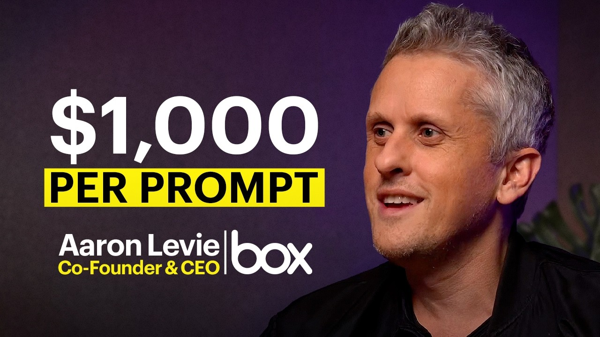

## TLDR

-   **AI spending hit a wall.** Capex forecasts keep climbing, but skeptics can't measure ROI beyond developer productivity — and some big buyers are already pulling back.
-   **Cyber warfare now moves at AI speed.** AI attackers are collapsing the time from breach to exfiltration, turning legacy and open-source codebases into massive, AI-exploitable risk.
-   **Enterprise AI deployment is slowing down.** Too much innovation, too many architectures, and too little ROI tooling are making CIOs wary of long-term lab commitments.
-   **One-person AI empires are rising fast.** Solo founders are spinning up real monthly revenue from a handful of markdown files and off-the-shelf models — or by dogfooding their own AI-powered GTM.

## The Big Picture

### AI Capex vs. ROI: The Looming $2 Trillion Question

Jensen Huang's forecast of $3-4 trillion in AI capex by 2030 (up from $100B this year) is on a collision course with growing skepticism about ROI. Uber's COO blew a year's Anthropic credits in four months with "no measurable gains," and Microsoft allegedly moved off Opus due to cost. The market is bifurcating: hyper-efficient firms "token max forever," while larger, less efficient organizations become skeptical as prices rise [Rory on 20VC (88 min, 0:06:45)](https://www.youtube.com/watch?v=jhZsQb3YvDg). Layoffs are increasingly attributed to AI-driven efficiency, not just COVID over-hiring, as companies optimize for higher-skilled, more productive employees [Jason on 20VC (88 min, 0:24:00)](https://www.youtube.com/watch?v=jhZsQb3YvDg).

**Your angle with founders:**
1.  **Where it hurts:** "What's the *actual* ROI on your current AI spend? Are you able to measure it beyond developer productivity?"
2.  **How they're hedging:** "Are you seeing a bifurcation of AI spend within your organization? Are smaller, agile teams finding more value than larger, slower ones?"
3.  **Where the GCP opportunity is:** Cost optimization services | Multi-model routing with Gemini Enterprise Agent Platform (FKA Vertex AI) to balance cost and capability | Provisioned throughput contracts for predictable spend | FinOps consulting for AI.

### AI's New Cyber Reality: Minutes to Exfil, Open Source Vulnerability Debt

AI models like Anthropic's Mythos and OpenAI's GPT 5.5 Cyber have shrunk the time from a security breach to "crown jewel exfiltration" from days to *minutes*, rendering traditional defenses obsolete [Nikesh Aurora on Hard Fork (65 min, 0:23:45)](https://www.youtube.com/watch?v=js2FCXP_KaA). This creates a "tsunami of AI-based attacks," exposing massive "vulnerability debt" in legacy and open-source codebases that "don't get patched as quickly as proprietary code" [Nikesh Aurora on Hard Fork (65 min, 0:28:50)](https://www.youtube.com/watch?v=js2FCXP_KaA). Companies are reducing headcount in some areas to hire for new AI security skills, signaling a decade-long transformation ahead [Nikesh Aurora on Hard Fork (65 min, 0:47:00)](https://www.youtube.com/watch?v=js2FCXP_KaA).

**Your angle with founders:**
1.  **Where it hurts:** "How are your existing cyber defenses holding up against AI-accelerated attacks? Are you built for minutes, or days?"
2.  **How they're hedging:** "What's your plan for managing the 'vulnerability debt' in your legacy or open-source stack, now that AI can exploit it in minutes?"
3.  **Where the GCP opportunity is:** Security Command Center Premium with AI insights | Chronicle Security Operations (SIEM/SOAR) | AI-powered vulnerability scanning on GEAP | Cloud Run/GKE Autopilot for secure, managed compute.

### Enterprise AI: The Paradox of Innovation & the One-Year Deal

Rapid AI breakthroughs are paradoxically *slowing down* enterprise deployment because "the last thing you implemented" is quickly obsolete [Aaron Levie on The MAD Podcast (74 min, 0:00)](https://www.youtube.com/watch?v=Gs2styCcwro). CIOs face a "madhouse" of 10-15 competing architectures, leading to decision paralysis and widespread reluctance to sign more than "one-year deals with the labs" [Aaron Levie on The MAD Podcast (74 min, 0:41:22)](https://www.youtube.com/watch?v=Gs2styCcwro). AI costs are shifting from central IT budgets to decentralized "line of business budgets," creating new financial and management challenges as enterprises lack tools to measure token ROI [Aaron Levie on The MAD Podcast (74 min, 0:22:42)](https://www.youtube.com/watch?v=Gs2styCcwro).

**Your angle with founders:**
1.  **Where it hurts:** "How are you de-risking your AI investments from rapid obsolescence? Are you able to commit beyond 12 months in this environment?"
2.  **How they're hedging:** "With AI costs shifting to line-of-business, how are you equipping teams to manage budgets and measure ROI on token spend?"
3.  **Where the GCP opportunity is:** GEAP's multi-model strategy for optionality | Pay-as-you-go and commitment discounts for flexible spend | FinOps tooling for AI on Cloud Billing | Agentic Data Cloud for secure access to LOB data.

## Builder's Corner

### Background Agents & The Code 'Slop' Problem

AI agents are now autonomously driving development, leading to a "7x increase" in merged PRs for Cognition with only "10% engineering headcount growth" [Walden Yan on Latent Space (70 min, 0:05:07)](https://www.youtube.com/watch?v=0fgJPhYcbVk). This necessitates a "background agent system" as critical infrastructure, where the "brain" (LLM) is separate from the "machine" (execution environment) for security and reuse [Cole Murray on Latent Space (70 min, 0:10:48)](https://www.youtube.com/watch?v=0fgJPhYcbVk). However, AI-generated code frequently exhibits "undesirable patterns" or "slop"—verbosity, backward compatibility at all costs, incorrect practices—demanding human oversight, linting, and strong architectural boundaries [Walden Yan on Latent Space (70 min, 0:61:00)](https://www.youtube.com/watch?v=0fgJPhYcbVk).

**Why founders care:** Deploying background agents for dev ops offers massive productivity gains, but controlling AI-generated code quality becomes a new, critical skill.

## Founder Watch

### "Maya": One-Person AI Business Hits $43K/Month with 4 Files

A solo AI creator, Superior, built "Maya," a stateful persona agent generating $43K/month in revenue. The architecture is deceptively simple: Claude Code for messaging, ElevenLabs for voice, Flux for photos from an $80 LoRA, and a `brain.md` file for per-user memory [Superior on X (1 min read)](https://x.com/andreysuperior/status/2050908800303915020). This demonstrates a concrete, reproducible template for one-person AI-native businesses using off-the-shelf tools and a clever approach to state management.

**Conversation starter:** "Superior's 'Maya' is generating $43K/month from just four markdown files. Are you seeing solo founders using agents and cheap LoRAs to build entire businesses in weeks?"

### Perplexity Challenges Consultants with "Computer" Benchmark

Perplexity's "Computer" agent benchmarks its performance against McKinsey, Harvard, MIT, and BCG deliverables across 16,000 queries, explicitly pricing itself to compete with junior analysts at $150/hour rather than other chat tools [Aakash Gupta on X (2 min read)](https://x.com/aakashgupta/status/2040844170999517597). This move positions Perplexity to attack "consulting workflows," not just search, highlighting a new category of AI-driven competition for traditional white-collar services.

**Conversation starter:** "Perplexity's 'Computer' is now benchmarking against McKinsey for $150/hour. Is this the shape of AI-native firms challenging traditional consulting and white-collar services?"

### Gojiberry AI Hits $2M ARR by Dogfooding Its Own Product

Romàn, a solo founder, scaled his second SaaS, Gojiberry AI, from zero to $2M ARR in months by dogfooding its core feature: finding and engaging high-intent leads [Romàn on X (3 min read)](https://x.com/romanbuildsaas/status/2047825608030494758). This classic "use your own product as a distribution engine" strategy, now augmented by AI, provides a direct template for AI-native founders to drive rapid growth and validates the power of AI-powered GTM for lean startups.

**Conversation starter:** "Gojiberry AI hit $2M ARR by using its own product to find leads. What's one key area where your AI startup could 'dogfood' its own tech for a 10x distribution advantage?"

## Quick Hits

-   **[Karpathy was right: 32 Claude Opus 4.8 skills released (1 min read)](https://x.com/polydao/status/2060964743402455212)** — Anthropic's new Opus 4.8 ships with a suite of new skills, reinforcing Karpathy's vision of LLMs as an operating system.
-   **[Meta Ray-Bans gamify running: solo dev build (2 min read)](https://x.com/stspanho/status/2061160116167033329)** — A solo developer built a web app for Meta Ray-Ban Display, loading GPX data to gamify runs with real-time feedback on the lens.
-   **[Opus 4.8 shows better judgment, catches its own mistakes (20 min watch)](https://podcasters.spotify.com/pod/show/nlw/episodes/Claude-Opus-4-8-First-Impressions-e3k36l2)** — Anthropic's latest model is a refinement focused on improved honesty and self-correction, not just raw performance.

## Try This Week

Pull the per-team AI bill from your top three accounts and walk in with one question: *"Who's your top token-spender, and what are they actually doing with those tokens?"* That single ask surfaces the AI-native workflow the customer cares about, the team that will defend renewal, and the policy gap finance hasn't filled. Fastest path from usage line item to a strategic conversation about GEAP's per-project billing, model routing, and per-seat quotas.

## Our Play

### GEAP's Integrated Suite: The Architecture for Autonomous Agents

The challenges of stateful sandboxes, background agents, and complex RL infrastructure mean founders need a robust, managed platform, not just raw compute. **GEAP** offers **Agent Engine Runtime** for long-lived loops, **Memory Bank** for persistent, multi-tenant context, and **GKE Agent Sandbox** for kernel-isolated execution. This suite is built to support the bursty, stateful, and secure demands of autonomous AI [Google Cloud Blog Post (2 min read)](https://cloud.google.com/blog/products/ai-machine-learning/gemini-enterprise-agent-platform-vertex-ai).

*Connect to this week:* Devin's background agents and self-improving dev loops need exactly this kind of managed, secure runtime — long-lived execution, per-user memory, and kernel-isolated sandboxes in one place.

### Google AI Threat Defense: Fighting AI Attacks at Machine Speed

Announced May 27, GEAP-powered **Google AI Threat Defense** is Google Cloud's direct answer to the threat Nikesh Arora describes. It runs **multiple frontier models** in a multi-pass scan to surface exploitable logic flaws, uses **CodeMender** to autonomously generate and verify patches inside the developer's IDE or CLI, and adds **agentic SOC** capabilities in Google Security Operations where a Triage and Investigation agent works alerts on its own. It folds in **Mandiant** frontline intelligence and **Wiz** exposure mapping [Google Cloud Blog (May 27, 2026)](https://cloud.google.com/blog/products/identity-security/introducing-google-ai-threat-defense).

*Connect to this week:* This is the concrete "fight AI with AI" answer to the Big Picture's vulnerability-debt problem — autonomous remediation targets exactly the unpatched open-source and legacy code that AI attackers now exploit faster than human teams can respond.

---

*Sources: 16 bookmarks, 19 videos, 14 podcast episodes from the AI content library. [Archive](/archive]*