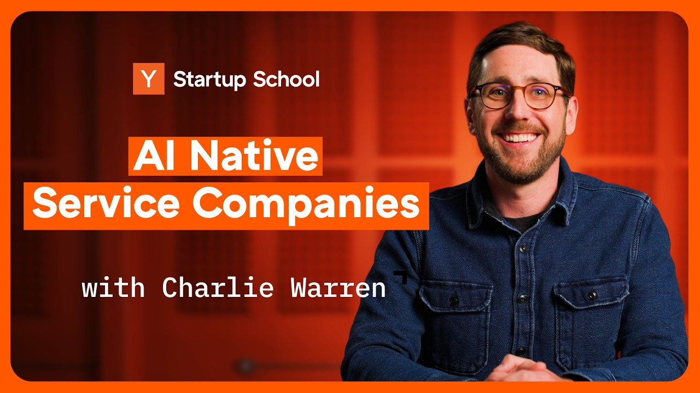

## TLDR

-   **Token budgeting panic.** Corporate America is hitting AI budget limits as token spend replaces headcount. Uber, Walmart, and others are capping AI usage.
-   **Supply crunch hits hard.** Compute, memory, and data center capacity are severely constrained, with TSMC warning a token shortage will last years.
-   **Multi-model optionality wins.** Smart routing between models and open-source fine-tuning are critical for cost-efficiency, not just raw intelligence.
-   **AI-native services take off.** A new YC playbook targets trillion-dollar services markets, using AI to achieve software-like margins in judgment-heavy fields.
-   **Engineer's job shifts.** From writing code to architectural design, reviewing AI-generated "slop," and orchestrating agentic "meta-work."
-   **GCP plays this week:** Provisioned throughput for compute predictability, Agentic Data Cloud for unified data control, Vertex AI for multi-model routing, Google Security Operations for AI-powered cyber defense.

## The Big Picture

### Token Scarcity & The Corporate Budgeting Panic

Corporate America is grappling with a "token budgeting panic" as AI spend escalates unexpectedly. Sam Altman noted that AI budgeting, which was "never a concern earlier in the year," has become a "huge issue" for some companies [Host on AI Daily Brief (26 min, 14:15)](https://podcasters.spotify.com/pod/show/nlw/episodes/How-Companies-Are-Becoming-AI-Token-Efficient-e3kbm85). Uber and Walmart are capping employee AI tool usage, while TSMC warns that the chip shortage could last until 2030, reinforcing that "the pace of chip fabrication, grid expansion, or interconnect bandwidth may be the constraint rather than the intelligence itself" [CC Wei on AI Daily Brief (32 min, 12:30)](https://podcasters.spotify.com/pod/show/nlw/episodes/What-OpenAI-and-Anthropic-Think-Happens-Next-With-AI-e3kd32n). Investors like Rory claim that by year-end, many companies will "choose tokens over humans," especially for marginal roles [Rory on 20VC (99 min, 0:01:08)](https://www.youtube.com/watch?v=jPBG1F2Y8Mw).

**Your angle with founders:**
1.  **Where it hurts:** "What's the 'token budget' conversation looking like in your leadership team? Are you seeing unexpected cost escalations for your AI workloads?"
2.  **How they're hedging:** "With chip and data center capacity scarce, what's your strategy for securing compute for the next 2-3 years, and how are you managing rising token costs?"
3.  **Where the GCP opportunity is:** Multi-model optionality on GEAP to balance cost and performance | Provisioned throughput contracts for predictable compute | FinOps consulting for AI spend optimization | Long-dated committed-capacity deals.

### AI's Verticalization: Hyperscalers Funding the Disruption

The AI ecosystem is rapidly verticalizing, and hyperscalers aren't just watching—they're funding it. Google plans to spend "$190 billion this year (2026) on AI build-out," with significant increases projected for 2027 [Host on AI Daily Brief (23 min, 16:55)](https://podcasters.spotify.com/pod/show/nlw/episodes/Should-Americans-Get-Shares-in-AI-Companies-e3k8jtv). Microsoft CEO Satya Nadella emphasizes that their job isn't just "Azure networking," but to "build the agentic system that does Azure networking," requiring extraordinary investment in Azure capacity—more in the last 15 months than the first 15 years [Satya Nadella on No Priors (43 min, 0:30)](https://www.youtube.com/watch?v=RQE8OS392dU). Thomas Laffont of All-In notes AI companies' growth rates are now "even bigger than Google Cloud and Azure," and "could be bigger than AWS by the end of the year," pushing hyperscalers to fund the disruption they face [Thomas Laffont on All-In (33 min, 0:08:20)](https://www.youtube.com/watch?v=UIoV8rG_25s).

**Your angle with founders:**
1.  **Where it hurts:** "Are you seeing your AI spend getting mixed with or even surpassed by your core cloud infrastructure costs? How are you balancing those investments?"
2.  **How they're hedging:** "Are you leveraging hyperscaler's massive investments in AI infrastructure, or building your own? What does your 'agentic system' strategy look like across your cloud stack?"
3.  **Where the GCP opportunity is:** Strategic compute commitments leveraging Google's CapEx | GEAP as the platform for agentic system development across all Google Cloud services | TPU v5p & A3/H200 GPU access for specialized AI workloads | Direct access to Google's internal AI expertise.

### AI-Native Services: The Trillion-Dollar Market You Didn't See Coming

Y Combinator has unveiled a playbook for "AI-native services companies," targeting massive, traditional services markets with a software-first approach. These companies deliver the *outcome* (e.g., tax filing, audit, FDA approval) rather than selling software the customer operates. The sweet spot: low-trust work where customers care about results, tasks with low human judgment per step, and genuinely hard overall intelligence thresholds (e.g., regulated industries). The goal is to push margins from 30% (traditional services) toward 50%+ (software-like) on markets 2-3x larger than traditional software TAMs [YC on YouTube (11 min, 0:30)](https://www.youtube.com/watch?v=gSNFJbgoaHI).

**Your angle with founders:**
1.  **Where it hurts:** "Where are you seeing unmet needs in traditional services that could be attacked with an AI-native approach? Which high-cost, low-trust services could become software-like?"
2.  **How they're hedging:** "Are you applying the 'Sam Altman test' to your business—as models get better, does your service get *stronger* (more leverage) or commoditized?"
3.  **Where the GCP opportunity is:** Agent Builder and Agent Development Kit (ADK) for building domain-specific agents | Agentic Data Cloud for securely accessing proprietary enterprise data | Vertex AI for custom model training and fine-tuning for specialized tasks.

## Builder's Corner

### The New Engineering Bottleneck: Reviewing AI-Generated Code

AI tools are boosting developer productivity, shifting the bottleneck from writing code to reviewing it. Jacob Lorentzon, CTO of Legora, notes that "AI tooling dramatically increases developer productivity," making code review the new constraint in software development [Jacob Lorentzon on 20VC (58 min, 0:13:30)](https://www.youtube.com/watch?v=UkERw3cBEAo). Figma, too, is actively focused on solving the emerging problem of reviewing AI-generated content to ensure consistency and maintain innovation speed, as "agents are capable of producing all this stuff," but humans are needed to ensure quality and alignment [Matt Colyer on AI & I (34 min, 0:28:55)](https://www.youtube.com/watch?v=kYKebKB3-d0). Human "taste-makers" and architects are now essential for maintaining robust, secure, and maintainable systems.

**Why founders care:** Scaling engineering with AI means building robust review processes and tools becomes a core competitive advantage, freeing human engineers for higher-level architectural work.

### Multi-Model Routing: The "Laziness Tax" Antidote

The era of defaulting to the most expensive frontier model for every task is ending. "Using the most expensive model for every task is not a quality strategy. It's a laziness tax," notes Patrick Oyo, as smart multi-model routing "beats brute force" in enterprise AI benchmarks [Patrick Oyo on AI Daily Brief (26 min, 20:49)](https://podcasters.spotify.com/pod/show/nlw/episodes/How-Companies-Are-Becoming-AI-Token-Efficient-e3kbm85). Microsoft is now adding "average token usage" as a standard column on its model cards, signaling a shift where "model companies will compete on intelligence per dollar" and the application layer will compete on "dollars per outcome" [Tomas Tungus on AI Daily Brief (26 min, 18:21)](https://podcasters.spotify.com/pod/show/nlw/episodes/How-Companies-Are-Becoming-AI-Token-Efficient-e3kbm85).

**Why founders care:** Implementing sophisticated model routing can drastically reduce AI operational costs, allowing your team to achieve frontier-level performance by sending each task to the right model at the right cost.

## Founder Watch

### Nat Eliason: $1-2M ARR Zero-Human Agent Company

Nat Eliason is running a "zero-human" company generating "$1-2M run rate" with FelixCraftAI, an OpenClaw bot, as CEO. For a startup cost of $1,500 and $400/month in operating expenses, Nat's voice notes to Discord trigger Felix to execute tasks, including hiring two OpenClaw subordinates. This provides hard data that agent-driven micro-companies can generate significant revenue [RYAN ADAMS on X (1 min read)](https://x.com/RyanSAdams/status/2029198636811264264).

**Conversation starter:** "Nat Eliason's 'FelixCraftAI' is proving a $1-2M ARR 'zero-human' company is possible. Are you seeing new founders treating AI agents as employees for core business functions?"

### Emergent Automates Software Engineering, Hits $100M ARR

Emergent, a YC-backed startup, has built a platform allowing anyone to build and ship software "without any programming knowledge," achieving "$100 million in annualized run rate" with "more than 8.5 million people" building "more than 10 million apps." The company claims to be "world number one on three bench" (a key coding agent benchmark) and has "rewritten our system three times" in nine months due to rapid AI model advancements, even inventing custom container technology for stateful, parallel agents [Mukun on Lightcone (YC) (30 min, 0:02:49)](https://www.youtube.com/watch?v=yyXCQHX55N4).

**Conversation starter:** "Emergent's $100M ARR from automating software engineering shows radical shifts are possible. How are you thinking about AI redefining who can 'build' and what it takes to scale?"

### Giga ML's AI Forward-Deployed Engineers

Giga ML, a YC startup, is transforming enterprise AI deployment by developing an "AI forward deployed engineer" to automate configuration and policy iteration. Working with "some of the biggest companies in the world, like DoorDash," they're seeing AI agents boost customer support deflection rates to "60 to 70%" [Varun on Lightcone (YC) (25 min, 0:00:54)](https://www.youtube.com/watch?v=2Ap1dnv-GXA). The founders emphasize that "product is the most important thing" in AI, not sales, as the low cost of building with AI tools empowers rapid validation by getting customers to pay for value.

**Conversation starter:** "Giga ML is building AI-driven 'forward-deployed engineers' for enterprise customers. Where are you seeing automation unlock the biggest bottlenecks in your own AI deployment and configuration?"

## Quick Hits

-   **[GitHub moving core services to Azure + new compute (1 min watch)](https://www.youtube.com/watch?v=LEwlSyR0cXA)** — GitHub is expanding its compute infrastructure, with a significant shift of core services to Azure and adding additional cloud capacity for Actions to handle increasing CPU demands.
-   **[NVIDIA launching CPUs for agentic AI (3 min watch)](https://www.youtube.com/watch?v=e3k8jtv)** — NVIDIA is launching new prosumer-grade CPUs (RTX Spark) to compete with Apple's M-series for local AI inference, and bringing its Vera Rubin data center chip, focused on agentic AI, into full production.
-   **[Karpathy's wiki layer for LLM Knowledge Bases (3 min read)](https://x.com/karpathy/status/2039805659525644595)** — Andrej Karpathy details his canonical architecture for LLM knowledge manipulation: raw documents go into `raw/`, distilled markdown into `wiki/`, and agents work against the wiki for token savings and automatic cross-linking.

## Try This Week

The "token budgeting panic" is real. This week, pick one key AI-native account and ask: *"What's your most token-hungry workflow, and are you sure you're using the right model for *every* step?"* This opens the door to discuss multi-model routing for cost efficiency, or GCP's provisioned throughput for predictable spend.

## Seller's Edge

**Don't sell the model. Sell the substrate.**

This week made the case better than any pitch deck could. Benedict Evans argued the leading models have "no network effects and no radical product differentiation, so no winner-take-all and no durable pricing power" — they're heading toward commodity infrastructure, like cloud itself [Benedict Evans on Lenny's Podcast (62 min, 0:45:00)](https://www.youtube.com/watch?v=BD3vLtWhT5A). If that's even half right, the rep who opens with "our model is better" is selling the one layer that's commoditizing. The durable value sits *underneath* the model — compute certainty, data gravity, governance — and *on top* of it, in the founder's own product, data, and workflow, where defensibility actually lives. **The behavior change:** stop leading with model benchmarks. Lead by helping the founder figure out where their moat is, then show how the substrate makes that moat deeper. The model is a swappable part; the platform they build their company on is not.

## Our Play

### GCP's Position in the Token Economy: Capacity, Cost, and Choice

Google is making a massive bet on AI infrastructure, planning to spend "$190 billion this year (2026) on AI build-out" alone [Host on AI Daily Brief (23 min, 16:55)](https://podcasters.spotify.com/pod/show/nlw/episodes/Should-Americans-Get-Shares-in-AI-Companies-e3k8jtv). This investment is critical as AI companies face structural token shortages. GCP provides **provisioned throughput** for predictable, long-term compute access and offers **Gemini 3.1 Flash-Lite** ($0.25/M input, $1.50/M output) for 45% faster, cost-optimized outputs on lower-value sub-tasks [Google AI on X (1 min read)](https://x.com/GoogleAI/status/2028873512203489483). This multi-model strategy, including Anthropic available on **Gemini Enterprise Agent Platform (FKA Vertex AI)**, ensures founder optionality, not vendor lock-in, in an increasingly tight compute market.

*Connect to this week:* Directly addresses the Big Picture's "token scarcity and budgeting panic"—offering predictable compute, cost-optimized models, and multi-model optionality to hedge against rising token costs and supply constraints.

### GEAP: The Common Context Layer for Enterprise Agents

Enterprises are hesitant to allow foundation model providers to retain historical agent data for training due to privacy and IP concerns [Maxim Bar Kogan on No Priors (42 min, 0:36:28)](https://www.youtube.com/watch?v=QDsbFLEt9ro). GEAP directly addresses this by providing a robust, **managed common context layer** and enabling **private evaluations (evals)** that are emerging as a key form of IP for companies to control and improve their AI models [Satya Nadella on No Priors (43 min, 20:30)](https://www.youtube.com/watch?v=RQE8OS392dU). YC's internal agent harness, for example, operates on a "unified Postgres database accessible to agents" with a "shared skill registry," demonstrating the power of a centralized, secure context layer that GEAP provides [Pete Koomen on Y Combinator (46 min, 10:49)](https://www.youtube.com/watch?v=B246K_G7mHU).

*Connect to this week:* This provides the secure, IP-protected environment that Builder's Corner highlights for managing AI-generated code, enabling founders to build and deploy complex agentic workflows without compromising data sovereignty.

---

*Sources: 34 bookmarks, 6 videos, 27 podcast episodes from the AI content library. [Archive](/archive)*