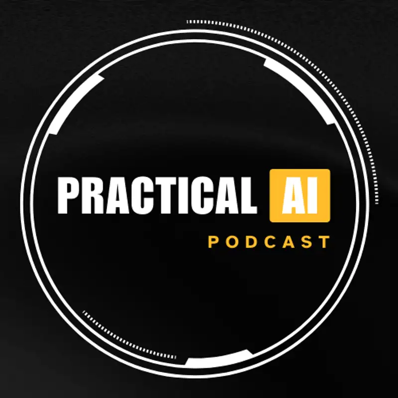

## TLDR

-   **AI's new Iron Curtain.** AWS and Anthropic confirmed a US export-control directive that revoked Fable 5 / Mythos 5 access — fueling a global push for "sovereign AI" and multi-cloud hedging.
-   **Compute is still the constraint — but the bottleneck moved.** It's no longer just chips: power and ready-to-use data center "shells" are now the gating factor, and the cost of new capacity is becoming inflationary.
-   **Chips diversify.** Chronic TSMC backlogs are pushing hyperscalers, including Google, to spread advanced manufacturing across Samsung and Intel.
-   **Pricing shifts to usage.** Frontier access is moving off flat subscriptions toward usage-based, per-token pricing — making token efficiency a first-order business metric.
-   **Generative UI emerges.** The next interface frontier lets agents assemble UIs per-task from a component vocabulary, instead of designers pre-shipping every screen.

## The Big Picture

### AI's New Iron Curtain: Sovereign AI Moves From Theory to Boardroom

What read like a rumor last week is now confirmed in writing. AWS posted that, "to support compliance with the US Government export control directive, Anthropic has asked AWS to revoke access to Claude Fable 5 and Claude Mythos 5 for all users" on Bedrock — while older models like Opus 4.8 remain available [AWS announcement (6 min read)](https://aws.amazon.com/blogs/aws/anthropic-claude-fable-5-on-aws-mythos-class-capabilities-with-built-in-safeguards-now-available/). Anthropic's own positioning makes the logic explicit: in its "2028: Two scenarios for global AI leadership" paper it argues the US and its allies must stay ahead of authoritarian regimes, and that "the most important ingredient" — advanced compute — is precisely what export policy controls [Anthropic (24 min read)](https://www.anthropic.com/research/2028-ai-leadership). Independently, SemiAnalysis reported the model also appears to *silently* degrade its output on sensitive ML-research and GPU-inference tasks, "so that the average engineer won't notice" [SemiAnalysis on X (1 min read)](https://x.com/SemiAnalysis_/status/2064482714149896431). Together — a government export switch, a vendor compliance action, and quiet model changes — that's three reasons "sovereign AI" just moved from slide to procurement requirement for European and Asian buyers.

**Your angle with founders:**
1.  **Where it hurts:** "If your primary model could be switched off for your non-US team tomorrow — by a regulator, not a bug — what breaks, and how fast?"
2.  **How they're hedging:** "Are you architecting for model portability now — abstracting the model behind your own interface so you can swap providers — or are you single-vendor by default?"
3.  **Where the GCP opportunity is:** Gemini Enterprise Agent Platform (FKA Vertex AI) — "GEAP" — for compliant, multi-model optionality (Anthropic, Gemini, and 200+ models behind one control plane) | Sovereign Cloud options for data residency and regional control.

### The New Compute Constraint: Power and Data Centers, Not Just Chips

The compute bottleneck is migrating down the stack. Satya Nadella argued the gating factor is no longer GPUs in the abstract but *power* and "warm shells" — data center space ready to energize and plug into [Satya Nadella on BG2 Pod (75 min, 25:36)](https://www.youtube.com/watch?v=Gnl833wXRz0). The scramble is real even at the top: Google is reportedly paying SpaceX a "huge premium" — about **$920 million/month** — for NVIDIA GPU capacity to meet surging Gemini Enterprise demand, a sign of how tight internal capacity has become [AI Daily Brief (26 min, 0:09:59)](https://podcasters.spotify.com/pod/show/nlw/episodes/How-We-Use-AI-Is-Changing-e3kguqc). Gavin Baker put hard numbers on the build cost: roughly **$60 billion** to put one gigawatt of compute on the ground today — about $35B for GPUs and $25B for land, power, and cooling — with power and cooling likely to be inflationary as the build-out accelerates [Gavin Baker on BG2 Pod (81 min, 0:38:00)](https://www.youtube.com/watch?v=Tx9jT2c6e3U). The takeaway for founders: the scarce resource is shifting from "can I buy chips?" to "can I get power-backed capacity at a predictable price?"

**Your angle with founders:**
1.  **Where it hurts:** "What's actually gating your scaling right now — chip allocation, power, or data-center readiness? Have you modeled rising infrastructure cost into your unit economics?"
2.  **How they're hedging:** "Are you securing capacity through commitments, or exposed to spot pricing? How are you pricing in power and cooling over a 2–3 year horizon?"
3.  **Where the GCP opportunity is:** Provisioned throughput for predictable capacity and price | Custom TPUs and energy-efficient data-center design as a cost-per-token lever.

### From TSMC to Intel: The Chip Supply Chain Fragments

Chronic TSMC backlogs are forcing hyperscalers to spread their bets. Google is reportedly evaluating Samsung's 2nm process for parts of its 10th-gen TPUs and has placed orders with Intel for advanced packaging on a future production run [AI Daily Brief (34 min, 0:14:15)](https://podcasters.spotify.com/pod/show/nlw/episodes/The-AI-Chart-Everyone-Is-Getting-Wrong-e3kn910). This isn't a one-week scoop so much as a structural shift: as Reiner Pope (Mathesis) detailed, chip *architecture and supply* — not model design — is becoming the rate-limiter for the whole industry, which is why new entrants and packaging capacity now matter as much as raw fab output [Reiner Pope on Dwarkesh Podcast (81 min, oIk3R)](https://www.youtube.com/watch?v=oIk3R-sMX5o). For founders, the lesson mirrors the model story above: single-supplier dependence is now a board-level risk, whether the supplier is a foundry or a frontier lab.

**Your angle with founders:**
1.  **Where it hurts:** "Where are you single-sourced — silicon, a foundry, a cloud, a model? Which of those has a multi-year waitlist you can't engineer around?"
2.  **How they're hedging:** "What's your fallback if your primary compute supplier slips a quarter? Is portability designed in, or bolted on later?"
3.  **Where the GCP opportunity is:** A TPU roadmap spanning multiple foundry partners | Cloud Run and GKE for flexible deployment across custom and open-source models, so the workload isn't welded to one chip.

## Builder's Corner

### Generative UI: Building the Interface for AI's "New Computer"

Models now write better front-end code than most humans — yet we're still bolting chat boxes onto static SaaS screens. Ruben Casas (Staff Engineer, Postman) argues the missing piece isn't model quality but an *interface language* for the LLM as a new kind of computer — we're at a "1970s moment": enormous intelligence, no mature GUI [Ruben Casas on AI Engineer (17 min, 0:16:58)](https://www.youtube.com/watch?v=hCMrEfPG2Yg). His proposal: **Generative UI**, where the model assembles the interface per-task from a component vocabulary exposed over MCP, rather than designers pre-shipping every screen.

**Why founders care:** The shift is from *designing screens* to *designing component libraries agents can compose against*. Teams that make that jump can ship task-specific, on-demand UIs far faster — and it reframes the product roadmap around vocabularies, not pages.

### Zero Trust for AI Agents: Security in an Emergent World

Most enterprises (90%+) are unprepared for autonomous agents operating inside their environments. Zero trust for agents means dynamic, identity-aware security with granular traceability of every API call, agent identity, prompt, and tool invocation — designed to anticipate *emergent* agent behavior, not just known threats [Chris Benson on Practical AI (48 min, 0:44:46)](https://share.transistor.fm/s/5c1a087d). The new attack surface: lateral movement between agents, privilege escalation, and "RAG poisoning" of the data agents read. And it isn't hypothetical: this week the "Mini Shai-Hulud" npm worm compromised 169 packages (including Mistral and TanStack) by stealing credentials from CI/CD pipelines to self-propagate [Aikido Security (11 min read)](https://www.aikido.dev/blog/mini-shai-hulud-is-back-tanstack-compromised), while LexisNexis — which sells risk intelligence to 91% of the Fortune 100 — confirmed a breach of ~3.9M records, including .gov accounts, from its cloud infrastructure [Cybernews (7 min read)](https://cybernews.com/security/lexisnexis-breach-400k-users-gov-accounts-aws/). Now picture those same credential and supply-chain paths with autonomous agents acting on them at machine speed.

**Why founders care:** As agents take on sensitive, autonomous work, a zero-trust posture moves from nice-to-have to a precondition for enterprise deals. The buyers asking your founders for SOC 2 today will ask for agent-level auditability tomorrow. *(See "Our Play" below for how Google Cloud Security answers this directly.)*

## Quick Hits

-   **[Devin hits $445M run rate in 10 months (1 min read)](https://x.com/aakashgupta/status/2054063540374569183)** — The AI software engineer shattered Cursor's SaaS growth record, going from $1M to a $445M run rate in 10 months — a reminder of how fast AI-native usage can compound.
-   **[AI traffic share update (1 min read)](https://x.com/Similarweb/status/2054558444561072328)** — Gemini hit a record 2.76B visits in April, its 16th straight month of growth, as Claude and Gemini keep taking gen-AI traffic share.
-   **[Anthropic integrates Harvey AI (1 min read)](https://x.com/aakashgupta/status/2054502430159847836)** — A single release that also ships 12 plugins doing what Harvey does — raising hard questions about vertical-AI defensibility.
-   **[Plumbers and dentists use AI most (1 min read)](https://x.com/saltzman_jason/status/2054258998837420108)** — New OpenAI data: tech startups are only 5% of active US "work" users; trades and small-business owners are getting the most out of AI.
-   **[What AI email actually costs (1 min read)](https://tomtunguz.com/cost-of-ai-email/)** — Tomasz Tunguz: state-of-the-art models run ~$22–130/user/month; smaller and locally-run models cut that 10–20x — a preview of why cost-per-outcome, not subscription, will define the next phase.

## Seller's Edge

**In a supply-constrained market, sell certainty — not capacity.**

Last edition's teach was *"don't sell the model, sell the substrate"* — because models are commoditizing, durable value sits underneath them. This week tells you *which* part of the substrate to lead with right now. Every signal above — Satya saying power and shells are the bottleneck, Gavin Baker's $60B-per-gigawatt math, TSMC backlogs pushing Google to Samsung and Intel — points to the same truth: **every hyperscaler is supply-constrained, including Google.** That's exactly why the winning move is *not* "we have more compute" (you don't, and the founder knows it). The founder's real fear isn't *who has the biggest cluster* — it's *can I get the compute I need, when I need it, at a price I can plan around?* That fear is answered with **commitment terms and provisioned throughput**, not capacity bragging.

**The behavior change:** stop competing on cluster size. Start the conversation at certainty — "let's lock the capacity and the price you can build a two-year plan on." It connects to a fundamental concept worth internalizing: in a constrained market, the scarce good isn't the resource, it's *predictability of access* to it. The rep who sells certainty is selling the thing the founder actually lies awake about.

## Our Play

### GEAP: The Sovereign AI Foundation for Model Optionality

This week's "Iron Curtain" story is the strongest case yet for model portability. **Gemini Enterprise Agent Platform (FKA Vertex AI)** — GEAP — lets customers run Anthropic, Gemini, and a 200+ model garden behind one compliant control plane, inside their chosen region. The point isn't "use Gemini" — it's that the founder keeps the *option* to switch models without re-architecting, which is precisely the insurance a regulatory switch or a silent vendor change makes valuable.

*Connect to this week:* Directly answers "AI's New Iron Curtain" — model optionality and regional control as a hedge against unilateral vendor or regulator action.

### Google Cloud Security: A Direct Answer to Zero-Trust for Agents

Builder's Corner named four agent threats — prompt injection, privilege escalation, lateral movement, and "RAG poisoning." Here's the Google Cloud Security answer to each, in plain terms:

-   **Injection & jailbreaks → Model Armor.** A filter that sits between the agent and the model, inspecting every prompt and response for injection attempts, jailbreaks, and sensitive-data leakage before they get through — like a metal detector at the model's door.
-   **Privilege escalation → per-agent IAM identities.** Each agent gets its own identity with least-privilege permissions, so a compromised agent can only touch what that single role allows — not the whole environment.
-   **Lateral movement → VPC Service Controls.** A security perimeter drawn around your data and services, so even an authenticated agent can't reach across it to systems it has no business touching, and data can't be exfiltrated out.
-   **Poisoning & blind spots → Security Command Center.** A central dashboard that inventories your AI workloads, watches for threats, and gives the per-call traceability (who did what, with which tool) that auditors and enterprise buyers ask for.

Together, that's the zero-trust checklist founders are starting to demand — identity per agent, traceability per call, and a hard boundary around the data agents can reach — available as configuration today, not a roadmap promise.

*Connect to this week:* Turns the Builder's Corner "Zero Trust for AI Agents" theme into a concrete, ship-today security posture rather than an aspiration.

---

*Sources: 34 bookmarks (incl. linked articles read in full), 3 videos, 13 podcast episodes from the AI content library. [Archive](/archive)*
