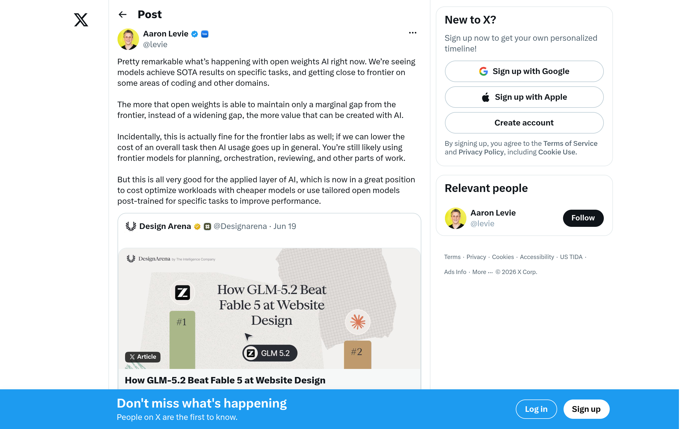
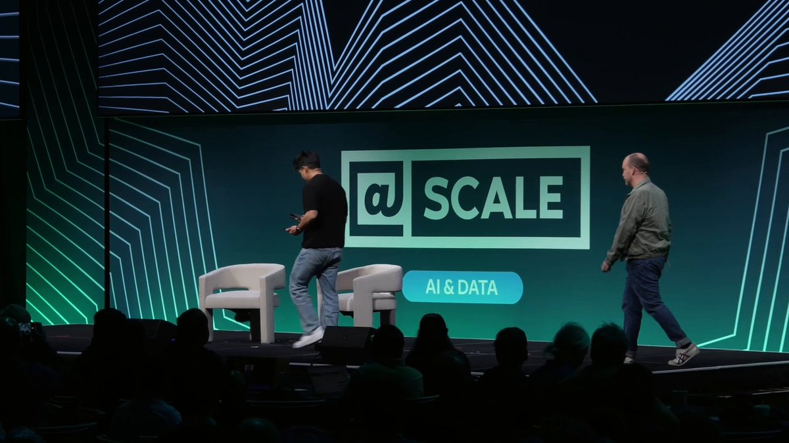
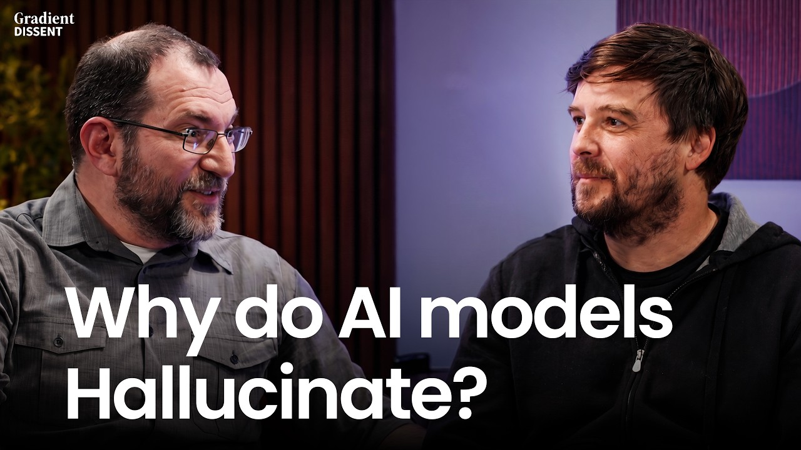

## TLDR

-   **Open weights close the gap.** Open-weight models now match the frontier on coding and specific tasks — fueling sovereign AI, custom post-training, and a model layer that is rapidly commoditizing.
-   **Loops change the cost equation.** As agents become continuous loops, token spend — not capability — becomes the constraint. The customer's question shifts from "which model?" to "what does this cost to run at scale?"
-   **From plausible to verifiable.** LLMs are "plausibility engines, not truth engines." For high-stakes work, the winning architectures ground answers in real data and verify them, rather than trusting the model's prior.
-   **Hyperscalers become gatekeepers.** Regulatory scrutiny is pushing KYC, audit trails, and identity into the model-access layer — a lane where established cloud governance is the differentiator.
-   **Noam Shazeer leaves Google for OpenAI.** A genuine talent loss for DeepMind, and the latest in a string of senior departures.

## The Big Picture: The Model Layer Commoditizes

### Open Weights Close the Frontier Gap, Fueling Sovereign AI

The gap between open-weight and proprietary frontier models is narrowing fast — open weights now hit state-of-the-art on specific tasks and near-frontier on coding. Aaron Levie's framing: the gap is "marginal, not widening," which pushes value up into the applied layer, where open weights enable sovereign AI, custom post-training, and cost optimization [Aaron Levie on X (1 min read)](https://x.com/levie/status/2068434042148782515). This week's GLM 5.2 — an MIT-licensed, 1M-context model with strong coding and agentic gains — is the proof point: a credible open-weights daily driver [Zai on X (1 min read)](https://x.com/Zai_org/status/2066938937344495629). The signal for sellers: the model itself is becoming the commodity. Durable advantage moves to the substrate beneath it — compute economics, data gravity, governance — and to helping the founder build defensibility in their own data and workflow layer.

**Your angle with founders:**
1.  **Where it hurts:** "Where are you paying frontier prices for work an open-weight model, post-trained on your data, could do at a fraction of the cost?"
2.  **How they're hedging:** "Is your architecture actually model-agnostic — can you swap a Gemini, a Claude, or an open weight per workload without re-architecting?"
3.  **Where the GCP opportunity is:** Gemini Enterprise Agent Platform (FKA Vertex AI) runs proprietary (Gemini, Claude) and 200+ open models (Model Garden) on one platform — a committed deal that gives the founder both price-performance *and* model optionality, not a lock-in.

### Hyperscalers as AI Gatekeepers: KYC and Audit Move Into the Model Layer

The Anthropic Fable 5 shutdown exposed a new dynamic: frontier-lab missteps are handing the access-control layer to the hyperscalers. Chamath Palihapitiya argued on All-In that this is "an incredible opportunity for the hyperscalers" to implement Know Your Customer requirements, audit trails for prompt data, and identity controls over who runs powerful models and why [Chamath Palihapitiya on All-In (85min, 0:41:40)](https://www.youtube.com/watch?v=3Amlu4y94Ho). Governments are pushing the same direction — mandatory reporting on jailbreaks and findings. The lane this opens isn't capacity; it's governance maturity that newer labs can't match.

**Your angle with founders:**
1.  **Where it hurts:** "If a compliance or data-provenance issue cut off access to your primary model tomorrow, what breaks — and how fast could you fail over?"
2.  **How they're hedging:** "Are identity, logging, and audit trails designed in at the model and agent level today, or is that a 2027 problem you're deferring?"
3.  **Where the GCP opportunity is:** IAM, Cloud Audit Logs, and VPC Service Controls give per-call traceability and access control at the model/agent layer — the substrate regulated workloads will need as KYC/audit requirements harden.

## Builder's Corner: From Static Code to Living Systems

### Loops Are the Next Jump After Agents — and They Reprice Everything

Boris Cherny (Claude Code) calls the move "from agents to loops" as big a jump as code to agents — his team now runs loops that autonomously do code reviews, maintenance, and fixes on a continuous basis [Boris Cherny on X (40 min watch)](https://x.com/AnatoliKopadze/status/2068750209652560159). A "Loop Library" of repeatable workflows (e.g. "the docs sweep") has already appeared [Matthew Berman on X (17 min read)](https://x.com/MatthewBerman/status/2067682870009925736). The under-discussed implication: loops invert the cost model. A one-shot agent runs once; a loop runs the same large context (a repo, a doc set) over and over. Token spend, not capability, becomes the binding constraint — and most teams are not architected for it.

**Why founders care:** Loops turn AI from a per-task expense into a continuously-running line item. The teams that win on loops are the ones that drive cost-per-iteration down without giving up quality.

**Your angle with founders:**
1.  **Where it hurts:** "Have you priced what one loop costs per run at scale — and what happens to that number when you run it across the whole codebase, nightly?"
2.  **How they're hedging:** "Are you re-sending the same context every iteration, or caching it? And are you running every step on a frontier model, or routing the cheap steps to a cheap one?"
3.  **Where the GCP opportunity is:** Three concrete cost levers for loops on GEAP — **context caching** (pay full price for the repeated context once, a fraction per iteration), **model routing** (Gemini Flash / Flash-Lite for the bulk of iterations, Pro only for hard steps), and the **Batch API** (~50% cheaper for non-interactive loops like overnight maintenance). The win isn't a better model; it's a cheaper way to run the same loop ten thousand times.

### AI's Truth Problem: From Plausibility Engines to Verifiable AI

Dan Klein (Scaled Cognition) on Gradient Dissent: LLMs are "plausibility engines, not truth engines" — optimized for next-token prediction, which structurally produces confident errors [Dan Klein on Gradient Dissent (75min, 5:17)](https://www.youtube.com/watch?v=JzETCk92Izw). Retrofitting reliability with external checks is slow and offers no hard guarantees; he argues truth has to be a design principle, not a patch. For sellers, the practical question isn't "how do we fix the model" — we can't — it's "what architecture moves an output from plausible to verifiable when the stakes demand it."

**Why founders care:** In legal, healthcare, and finance, a confident wrong answer is a liability event. The bar isn't "fewer hallucinations" — it's outputs you can trace to a source and check before they reach a customer.

**Your angle with founders:**
1.  **Where it hurts:** "For your highest-stakes outputs, are you grounding against your own governed data and verifying — or trusting the model's prior and hoping?"
2.  **How they're hedging:** "What's the gate between a model's answer and your customer — an eval, a grounding check, a human — or nothing?"
3.  **Where the GCP opportunity is:** The deterministic-when-it-matters stack on GEAP — **grounding** against Google Search and your own governed data (RAG / search grounding), a **check-grounding** API that scores how well an answer is supported by the provided context, **function calling** to route facts and math to real systems instead of guessing, **structured outputs** for schema-valid responses, and **GEAP's evaluation tooling** as the gate before anything ships. Truth designed in, not bolted on — and your data is the moat.

## Founder Watch: Talent and Tooling Signals

### Noam Shazeer Leaves Google for OpenAI

Noam Shazeer — co-inventor of the Transformer and Mixture-of-Experts — has left Google to become OpenAI's architecture research lead. Sam Altman: "It only took 10 years. I think it will be worth the wait!" [Sam Altman on X (1 min read)](https://x.com/sama/status/2067427421083652131). It follows other senior DeepMind departures, including AlphaFold lead John Jumper [Samira Manabi on X (1 min read)](https://x.com/samiramanabi/status/2068367450085998998). Read straight: this is a real loss for Google and a marker that the talent market is tilting toward OpenAI right now. The seller's move is not to spin it — founders track these moves as proxies for frontier momentum, and credibility comes from naming it honestly.

**Conversation starter:** "Senior architects are moving between frontier labs at pace. When you bet your roadmap on a model family, how much are you weighting the *lab's* trajectory versus today's benchmark — and what would make you hedge across more than one?"

### Elicit: Multi-Model Orchestration for Research Reliability

Elicit's Andreas Stuhlmüller and Jungwon Byun, on The Cognitive Revolution, described spending ~$2,000/week on tokens orchestrating ChatGPT, Claude, and sometimes Gemini against each other to push accuracy past any single model's ceiling [Andreas Stuhlmüller on The Cognitive Revolution (106min, 00:59:00)](https://www.youtube.com/watch?v=zWc9ggYhuJ4). Their thesis: reliability for high-stakes reasoning comes from external scaffolding and systematic process, because individual models are "easy to push around." It's the truth-problem story, made operational.

**Conversation starter:** "Elicit cross-verifies across models and spends real money to do it. For your high-stakes outputs, what's the unit economics of reliability — what do you pay per verified answer, and is multi-model orchestration cheaper than the cost of being wrong?"

## Quick Hits

-   **[Sundar: 93 subagents built an OS in 12 hours for <$1K (1 min read)](https://x.com/zostaff/status/2067321940302348647)** — Google's CEO said a swarm of 93 subagents built the core of a functioning OS via 15,000 model requests for under $1,000 in API credits.
-   **[Karpathy: strip everything down to basics to build faster (1 min read)](https://x.com/0xCodila/status/2067634938430591234)** — Andrej Karpathy argues for rewriting systems from scratch to truly understand AI rather than just wiring it together.
-   **[Copper emerges as a long-horizon compute bottleneck (25min, 0:12:15)](https://www.youtube.com/watch?v=xTO1aQ_m44I)** — Dan Dreyfus on All-In: a 1-GW AI factory needs ~50,000 tons of copper, and projected build-out could demand as much copper over 18 years as was mined in the last 10,000 — a slow-burning constraint to watch, not act on this quarter.

## Seller's Edge: Two-Layer Pricing

A teach to carry into every meeting, not just this week. There are two pricing layers in AI, and your founder competes on exactly one of them:

- **Intelligence-per-dollar** — the model layer. As open weights close the frontier gap, this layer commoditizes; everyone's marginal token gets cheaper and more interchangeable.
- **Dollars-per-outcome** — the application layer. This is where your founder actually makes money: cost per resolved ticket, per verified research answer, per shipped PR.

The diagnostic: *which layer does this founder compete on?* If they live on the **cost layer** (high-volume, thin-margin, loop-heavy), the conversation is Flash-Lite, context caching, batch, and routing. If they live on the **outcome layer** (high-stakes, differentiated), it's GEAP plus their own data, grounding, and eval. You can't change our models — but you can place the founder on the right layer and bring the right architecture to that layer. That's how a sophisticated rep shows up as an advisor instead of a price quote.

## Our Play

### Apple Commits to a Custom Gemini for Siri

Apple is integrating a custom 1.2-trillion-parameter Gemini model into its Siri overhaul — running queries on-device, in Apple's private cloud, and on Google's NVIDIA B200 GPUs for heavy reasoning [Scott Galloway on Pivot (69min, 01:06:10)](https://www.youtube.com/watch?v=jEGcg812iLo). It sits alongside other large Google compute commitments, including a reported ~$920M/month deal with SpaceX for NVIDIA capacity. The point isn't that Google has spare GPUs — no hyperscaler does. It's that the most demanding customer in tech committed to Google for the *full stack at once*: a custom model, the compute to run it, and the governance around it.

*Connect to this week:* As the model layer commoditizes (open weights), the durable win is being chosen as the substrate — model + compute economics + governance in one committed relationship. Apple's bet is that exact play at the largest possible scale.

### Logan Kilpatrick on the Agentic Gemini Era and "Model Eats the Harness"

Logan Kilpatrick (Google DeepMind) frames this as the "Agentic Gemini era," optimizing for customer outcomes over engagement, where "the model eats the harness" — scaffolding that starts external gets absorbed into the model over time [Logan Kilpatrick on Training Data (52min, 0:05:35)](https://www.youtube.com/watch?v=cMAs8z2dehs). It underpins Google's push to make its products agentic-native via the Antigravity agent harness.

*Connect to this week:* Ties straight to the Loops story. As loops become the default, the harness customers build today (caching, routing, grounding, eval) is exactly what the platform should absorb — and pricing that loop economically is the near-term seller conversation.

---

*Sources: 31 bookmarks (incl. linked articles read in full), 2 videos, 10 podcast episodes from the AI content library. [Archive](/archive)*
