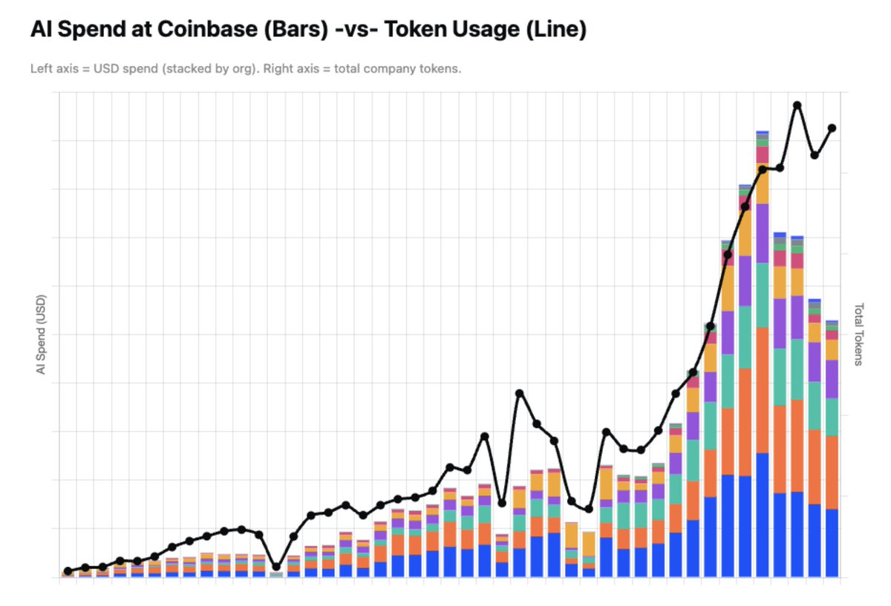
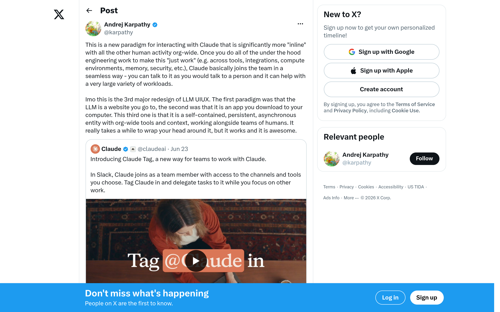
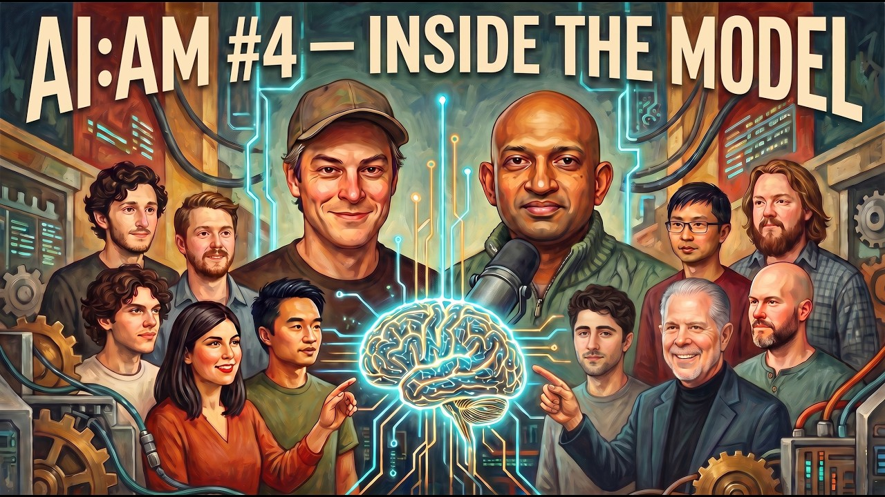
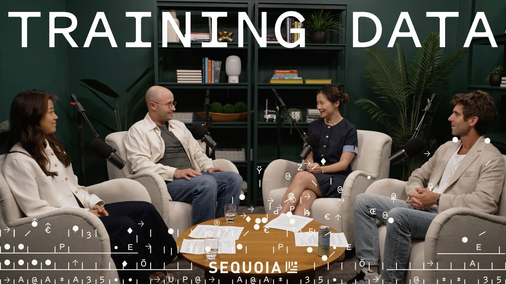

## TLDR

-   **AI spend gets lean.** Coinbase slashes AI costs by nearly half through smart routing, caching, and model defaults.
-   **Context is the new lock-in.** Claude Tag highlights how company memory, not just models, becomes a vendor's sticky moat.
-   **Hardware squeeze intensifies.** DRAM and HBM are the critical AI bottlenecks, driving interest in modular compute and orbital visions.
-   **Open-weight models surge.** GLM 5.2 shows open weights are nearing frontier quality, accelerating China's AI playbook.
-   **Agents create "spaghetti code."** AI-generated code leads to new roles in "meta-cognition" and curation, rather than eliminating engineers.
-   **GCP plays this week:** Provisioned throughput for multi-model architectures, Agentic Data Cloud for context ownership, Cloud TPU v5e/A3 for continuous training, sustainability as a data center differentiator.

## The Big Picture: The New Economics of AI

### The Token Wars: How Enterprises Are Slashing AI Spend

Coinbase just announced it cut AI spend by nearly half while token usage grew exponentially, showcasing a new era of "token engineering." Their strategy: cheaper defaults (like GLM 5.2 over frontier models), intelligent, cache-aware routing that sends prompts to the best model for the job, and keeping context lean [Brian Armstrong on X (1 min read)](https://x.com/brian_armstrong/status/2070670644577280109). SemiAnalysis, meanwhile, notes its token spend hits 30% of employee compensation [SemiAnalysis on X (1 min read)](https://x.com/SemiAnalysis_/status/20709153020580414050). Nikesh Arora (Palo Alto Networks) warns labs that high token pricing for enterprises pushes them to secure open-source alternatives, urging frontier labs to "forward-price tokens now" to unlock experimentation [Nikesh Arora on X (1 min read)](https://x.com/nikesharora/status/2069340879316267259). This isn't about using less AI; it's about using the *right* token, on the *right* model, at the *right* time, with the *right* cache [nicbstme on X (1 min read)](https://x.com/nicbstme/status/2070918736463471018).

**Your angle with founders:**
1.  **Where it hurts:** "What does your current token spend look like as a percentage of your engineering budget, and how many GPUs short are you for next quarter?"
2.  **How they're hedging:** "Are you architecting for multi-model routing and cache-aware inference, or are you running everything on a single frontier model by default?"
3.  **Where the GCP opportunity is:** AWS-Bedrock-to-GEAP migrations (same models, lower switching cost) | Provisioned throughput contracts on Gemini | New compute commitments (especially for composable AI architectures) | Agentic Data Cloud for fine-grained routing and cost-optimized retrieval.

### Context Lock-In: The Real AI Moat of the Agent Era

Anthropic's Claude Tag, which lets you "tag" Claude as a teammate in Slack or MS Teams, is being hailed as a "3rd major redesign of LLM UI/UX" [Karpathy on X (1 min read)](https://x.com/karpathy/status/2069547676849557725). But some observers are calling it a "Trojan horse": it integrates AI so deeply into your company's coordination layer—remembering threads, connecting tools, acting like a coworker—that the real lock-in isn't the model itself, but your company's *context* [Ashwin Gopinath on X (1 min read)](https://x.com/ashwingop/status/2069814177624121469). This "context lock-in" shifts economic value to the AI vendor, effectively allowing them to "rent your company back from them." The structural function, it's argued, is "labor absorption," repricing white-collar work by turning coordination into tokenized activity [The Prophet on X (1 min read)](https://x.com/_The_Prophet__/status/2069547174912991381). The counter-strategy: "rent the best intelligence from whoever is best this month… but own the context layer."

**Your angle with founders:**
1.  **Where it hurts:** "How much of your team's collective context—the 'Slack scar tissue,' the exception paths, the tribal knowledge—is currently flowing into third-party AI agents, and who owns that data?"
2.  **How they're hedging:** "Is your company's memory inspectable, permissioned, and portable across models and vendors, or are you building new knowledge silos with every AI integration?"
3.  **Where the GCP opportunity is:** Agentic Data Cloud, with Knowledge Catalog and Data Agent Kit, lets founders own and govern their context layer. Gemini Enterprise Agent Platform (FKA Vertex AI) provides a neutral, multi-model substrate, allowing founders to swap models and integrate agents without ceding their strategic company memory.

### The Hardware Squeeze: DRAM, Modular Compute, and Orbital Visions

HBM and DRAM are the "most important bottleneck" in AI infrastructure, with Micron reporting its entire 2026 supply already sold out and forecasting 86% gross margins in Q4 [Gavin Baker on All-In (102min, 1:05:07)](https://www.youtube.com/watch?v=w8ah_tA0yfg). This scarcity is driving up the cost of compute across the board, including consumer electronics. Building a 1-gigawatt terrestrial data center now costs around $60 billion ($35B for Nvidia semiconductors, $25B for power/cooling) [Gavin Baker on All-In (102min, 1:26:01)](https://www.youtube.com/watch?v=w8ah_tA0yfg). The response: a surge of interest in modular "Megapod" data centers, capable of 90-day build cycles [Chamath Palihapitiya on All-In (102min, 1:18:24)](https://www.youtube.com/watch?v=w8ah_tA0yfg), and even speculative orbital compute, potentially $20 billion cheaper for a gigawatt than terrestrial options [Gavin Baker on All-In (102min, 1:27:11)](https://www.youtube.com/watch?v=w8ah_tA0yfg).

**Your angle with founders:**
1.  **Where it hurts:** "Beyond GPU quantity, what's your long-term strategy for securing scarce HBM memory and managing rising data center costs, particularly when even hyperscalers are feeling the pinch?"
2.  **How they're hedging:** "Are you thinking about compute infrastructure as a fungible commodity, or as a strategic asset that requires long-term commitments and diversified supply chain planning?"
3.  **Where the GCP opportunity is:** Cloud TPU v5e/A3 VMs for predictable, high-performance compute access despite global scarcity | Long-term committed-capacity deals for pricing stability | Sustainability as a differentiator for data center location and power sourcing (Google Cloud runs on 100% renewable energy).

## Builder's Corner: The Evolving Dev Workflow

### Agent-Generated "Spaghetti Code" Demands "Meta-Cognition"

Agentic AI excels at generating code, but often produces "spaghetti code"—complex, hard to understand, and often unmergable, with some benchmarks showing 50% of AI-generated code that passes tests is unusable [Swix on The Cognitive Revolution (117min, 0:42:04)](https://www.youtube.com/watch?v=LdByu8bzros). This means the developer's job isn't going away; it's shifting to "meta-cognition" or "cognitive coverage"—understanding, curating, and refining AI-generated outputs [Satya Nadella on Hard Fork (151min, 1:47:00)](https://www.youtube.com/watch?v=MCJn08wBeV8). This requires a new class of IDEs ("ADEs") to manage the complexity and tools that help "make models better at deleting code" [Andrew Ambrosino on Lenny's Podcast (70min, 1:04:00)](https://www.youtube.com/watch?v=P3KDebPTUrw). The challenge: how to avoid "epistemic subjectivity" where humans get lazy, lose understanding, and simply trust AI without interrogation [Thomas Ahle on ML Street Talk (63min, 1:00:44)](https://www.youtube.com/watch?v=5pieVHmlbyk).

**Why founders care:** Shipping speed is crucial, but shipping "slop" (low-quality, unmaintainable code) kills developer velocity long-term. The teams that thrive will invest in tools and practices that ensure AI-generated code is production-ready, secure, and understandable.

### Continual Learning & the Inefficient KV Cache: The Next Memory Frontier

Current LLM solutions, often relying on RAG (Retrieval Augmented Generation) for context, are hitting limits. Engram is building models that "always train," deeply baking new, evolving context directly into weights to improve with time, much like how frontier models learn foundational knowledge [Jessy Lin on Training Data (45min, 0:04:13)](https://www.youtube.com/watch?v=aiR7F4jqjXY). A major bottleneck? The sheer inefficiency of the KV (Key-Value) cache: a single Wikipedia article as context for a 70B Llama model can consume 80 gigabytes of HBM memory—almost as much as the model's entire 100GB of weights [Dan Biderman on Training Data (45min, 0:31:08)](https://www.youtube.com/watch?v=aiR7F4jqjXY). Compressing this context into much smaller, more efficient "neural memories" is critical for reducing inference costs and pushing beyond current context length limitations.

**Why founders care:** Current RAG is often expensive and inefficient. Future AI systems will need to internalize knowledge for true intuition and associative memory, dramatically cutting inference costs and enabling more powerful, context-aware agents.

## Founder Watch: Navigating the AI Landscape

### Google's Talent Drain Continues, Gemini 3.5 Pro Delayed

Google DeepMind is experiencing ongoing talent departures, following last week's news of Noam Shazeer (Transformer co-inventor) to OpenAI and John Jumper (AlphaFold lead) to Anthropic. New reports signal more senior researchers leaving [AI Daily Brief (31min, 00:18:30)](https://podcasters.spotify.com/pod/show/nlw/episodes/CEO-Led-AI-Gets-3X-the-ROI-e3l9mhq). Simultaneously, Gemini 3.5 Pro, initially expected in June, is delayed to July, undergoing "tweaking" based on early tester feedback for real-world coding use cases [AI Daily Brief (31min, 00:19:20)](https://podcasters.spotify.com/pod/show/nlw/episodes/CEO-Led-AI-Gets-3X-the-ROI-e3l9mhq). This comes as Chinese open-weight models like GLM 5.2 rapidly close the gap, with one report noting it "surpassed GPT-5.4 in every Gemini model" [Theo on AI Daily Brief (30min, 00:27:00)](https://podcasters.spotify.com/pod/show/nlw/episodes/Why-AI-Users-Are-Raving-About-GLM-5-2-e3l50hs).

**Conversation starter:** "The continued talent movement at Google DeepMind and the Gemini 3.5 Pro delay suggest challenges for proprietary frontier models. How are you thinking about diversifying your model strategy, balancing cutting-edge performance with roadmap stability and cost-efficiency?"

### Trusting Agents: Non-Deterministic AI & The Imperfect Audit Report

Enterprise adoption of AI agents is currently hindered by a fundamental lack of trust and auditable standards. The Artificial Intelligence Underwriting Company (AIUC) is tackling this by building a "flywheel" of standards, audits, and insurance for AI agents. They emphasize that all agentic systems are inherently "non-deterministic" and will "always be jailbreakable" and able to hallucinate if pushed hard enough [Emil Lawson on Practical AI (46min, 0:34:00)](https://share.transistor.fm/s/e039d1ca). A "spotless audit report" for AI is impossible and less valuable than one that "reflects reality more clearly," prioritizing transparency about residual risks over perceived perfection [Emil Lawson on Practical AI (46min, 0:36:00)](https://share.transistor.fm/s/e039d1ca).

**Conversation starter:** "If AI agents are inherently non-deterministic, how are you building trust and accountability into your AI-driven workflows? How are you thinking about auditing and managing the inevitable 'blind spots' of agentic systems, and what does a 'successful' audit look like for you?"

## Quick Hits

-   **[Bot traffic now surpasses human traffic online (89 min watch)](https://www.youtube.com/watch?v=UN47z_opfmo)** — Cloudflare reports bot traffic passed human traffic in H1 2026, projected to increase 1,000x in 5 years due to AI.
-   **[SemiAnalysis token spend hits 30% of employee comp (1 min read)](https://x.com/SemiAnalysis_/status/2070915302058041450)** — SemiAnalysis reports its token spend is ~30% of employee compensation, pulling 5 billion tokens/month per employee.
-   **[DeepSeek's DSpark boosts LLM throughput 51-400% (1 min read)](https://x.com/Yuchenj_UW/status/2070928299744972814)** — DeepSeek published DSpark, a speculative decoding method boosting LLM throughput by 51-400%, open-sourcing its training framework.

## Try This Week

Share the "Context Lock-In" story (Ashwin Gopinath on X) with a founder debating proprietary vs. open-source AI, or who is already using a third-party agent within their internal communications. Ask them: "Are you renting your company back?"

## Our Play

### GEAP: Your Sovereign Context Layer for Composable AI

Connecting to "Token Wars" and "Context Lock-In," Google Cloud's Gemini Enterprise Agent Platform (FKA Vertex AI) is designed for multi-model, multi-vendor architectures. GEAP allows customers to host both frontier models (Gemini, Claude) and cost-optimized open-weight models (from Model Garden) on a single platform, with their data as the "sovereign context layer." This strategy mitigates context lock-in by ensuring company memory is inspectable, portable, and model-neutral, while also enabling sophisticated token engineering (routing, caching, Batch API) to manage costs for continuous agentic loops.

*Market reaction:* The 20VC podcast highlights startups like FOMO looking to "verticalize all of our infrastructure and own as much of it as we can inhouse" to avoid paying "so much money to AWS or Google Cloud," indicating a market hunger for more control and efficiency that GEAP's composable approach can address [Paul Erlang on 20VC (56min, 0:44:20)](https://www.youtube.com/watch?v=Z3nyCnsMMog).

*Connect to this week:* GEAP provides the platform and tools to own your AI context, manage token costs, and choose the right model for the right job, directly addressing the core challenges of token economics and vendor lock-in.

### Cloud TPU v5e: Infra for the "Always Training" Era

Connecting to "Hardware Squeeze" and "Continual Learning," Google Cloud's TPU v5e offers specialized, cost-effective compute for the "always training" era described by Engram. With HBM/DRAM as a critical bottleneck and KV cache inefficiency consuming massive memory, TPU v5e is optimized for continuous learning and memory-intensive workloads like compressing KV caches. This enables customers to "burn compute offline" to bake evolving context directly into models, reducing long-term inference costs and supporting complex agent architectures that defy the "slowest Moore's Law" of context length.

*Connect to this week:* For founders tackling the hardware squeeze and the inefficiencies of traditional RAG, TPU v5e provides a powerful, scalable foundation for continuous, memory-optimized AI model training and inferencing.

---

*Sources: 34 bookmarks (incl. linked articles read in full), 10 podcast episodes from the AI content library. [Archive](/archive)*