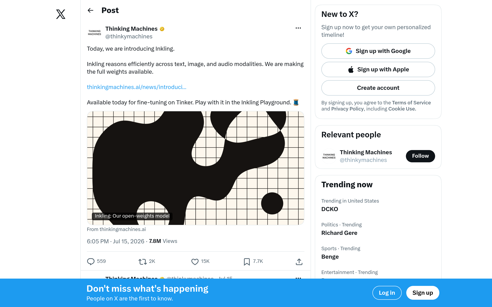
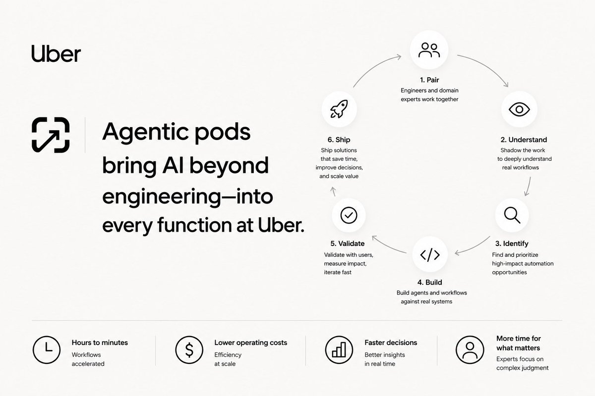

## TLDR

-   **US open weights surge.** Thinking Machines' Inkling launches a 975B-parameter Apache 2.0 model, repositioning open weights as "the free sample, the platform is the product" for fine-tuning.
-   **China's AI "Iron Curtain."** Beijing is reportedly exploring blocking overseas distribution of its leading AI models, driving enterprises to rethink trusted model sources and data sovereignty.
-   **Uber's agentic enterprise blueprint.** Uber scaled "Agentic Pods" across 16 functions, providing a repeatable template for enterprise workflow automation and the "SaaS-to-agents flip."
-   **Compute is now a traded commodity.** Kalshi launched GPU compute forward curves for Nvidia B200, H200, and A100 chips, signaling the financialization of AI infrastructure.
-   **AI bubble warning.** Veteran investor Jeremy Grantham, who called previous crashes, claims the current AI bubble is the largest in American history.

## The Big Picture: Open Weights Reshape the Supply Chain

### Inkling & the US Open-Weights Surge: Sovereignty and the Shifting Economics of AI

Just weeks after Kimi K3 leapfrogged all proprietary models (Edition #22), the open-weights narrative advanced again: Mira Murati's Thinking Machines released **Inkling**, a 975B-parameter multimodal model (41B active parameters) under Apache 2.0, with full weights available for fine-tuning on its Tinker platform [Thinking Machines (13 min read)](https://x.com/thinkymachines/status/2077454609551921208). As Aakash Gupta notes, the launch post candidly admits Inkling is *not* the strongest model available — and that "admission is the business model": the model is the free sample, Tinker (the fine-tuning platform) is the product [Aakash Gupta on X (2 min read)](https://x.com/aakashgupta/status/2077715871221580056).

This new US contender directly compounds on Edition #22's sovereignty argument by offering a clear alternative to two years of dependence on foreign open weights. Sriram Krishnan notes open weights are surging because organizations are "increasingly looking for control over how their data is used" and are "nervous about the frontier labs potentially competing with them" [Sriram Krishnan on X (1 min read)](https://x.com/sriramk/status/2077566845431779766). This also drives a "margin migration" thesis, where value moves from the frontier model layer to infrastructure, making "cheaper models, whether open-source or closed," a driver of ROI on AI spend [Gavin Baker on X (2 min read)](https://x.com/GavinSBaker/status/2076369936251851091). Maor Shlomo adds: "The chances of AGI being open are now much much higher" [Maor Shlomo on X (1 min read)](https://x.com/MaorShlomo/status/2077844032214995074).

**Your angle with founders:**
1.  **Where it hurts:** "With open models now a credible alternative, are you exploring the leverage they offer for price, data control, and avoiding lock-in — or still paying the frontier premium for every task?"
2.  **How they're hedging:** "Are you tracking your AI ROI to see where a fine-tuned open model can outperform a general frontier model for specific workloads at a fraction of the cost?"

### The New Iron Curtain: China's AI Policy & the Data Sovereignty Battle

Just as US-trained open weights are gaining ground, China is reportedly exploring blocking the overseas distribution of its leading AI models, signaling a fundamental shift in its open-source policy [AI Daily Brief (27 min watch, 0:11:00)](https://podcasters.spotify.com/pod/show/nlw/episodes/AI-Costs-Are-Surging-and-the-Cheap-Model-Fix-Might-Not-Last-e3lr0u0). This geopolitical move would fundamentally alter the global AI supply chain, compelling enterprises to reconsider data control, trusted model sources, and local deployment options. Already, Alibaba has banned employees from using Claude over "potential security risks," stating a memo that "Claude code was recently discovered to carry backdoor risks" [AI Daily Brief (25 min watch, 0:12:50)](https://podcasters.spotify.com/pod/show/nlw/episodes/AI-Is-Making-One-Person-Million-Dollar-Companies-More-Common-e3lo4bm).

This shift reinforces the idea that "AGI is already here — the bottleneck is context, not intelligence," meaning value comes from piping proprietary organizational context to the model, not just a bigger model [Ali Ghodsi on Stanford Online (39 min watch, 0:04:29)](https://www.youtube.com/watch?v=sRvrXL83N-c&t=269s). Microsoft's "Frontier Tuning," allowing enterprises to fine-tune on their data, is one response, but still "requires enterprises to trust Microsoft with their data" [AI Daily Brief (27 min watch, 0:21:40)](https://podcasters.spotify.com/pod/show/nlw/episodes/AI-Costs-Are-Surging-and-the-Cheap-Model-Fix-Might-Not-Last-e3lr0u0). Satya Nadella has noted that Microsoft's OpenAI exclusivity helped Azure gain customers from other clouds, underscoring how strategic model access and data control drive infrastructure decisions [Satya Nadella on BG2 Pod (75 min watch, 0:50:00)](https://www.youtube.com/watch?v=Gnl833wXRz0).

**Your angle with founders:**
1.  **Where it hurts:** "With geopolitical risks now shifting AI model access, how are you ensuring your data sovereignty and compliance, especially if you rely on models that could be restricted?"
2.  **How they're hedging:** "Are you strategically diversifying your model usage across Western-built options, or are you still vulnerable to single-source or region-specific dependencies?"
3.  **Where the GCP opportunity is:** Gemini Enterprise Agent Platform (GEAP) with its Model Garden and Agentic Data Cloud provides a secure, trusted, multi-model platform for Western-built foundation models (like Gemma) and open weights, enabling founders to mitigate geopolitical risk while maintaining data control.

### The Agentic Enterprise: Uber's Blueprint for Workflow Automation & the New Economics of SaaS

Uber is providing a concrete blueprint for the "SaaS-to-agents flip," scaling its "Agentic Pods" program across 16 different business functions—including Finance, Legal, Marketing, and HR. Each Pod, pairing an AI-proficient engineer with a domain expert for two weeks, has shown massive ROI: capital allocation across 150 cities compressed from 15 hours to 30 minutes, and marketing web QA from two weeks to 50 minutes [Praveen Neppalli Naga on X (1 min read)](https://x.com/praveenTweets/status/2074605343439810922). This scaling demonstrates that the "workflow becomes the unit of automation," validating the thesis that "wasted tokens are the new headcount bloat," with 90% of tokens often going to unproductive loops [a16z on X (8 min read)](https://x.com/a16z/status/2077170363000394003).

This is a significant step beyond individual "self-driving companies" like Replit and Curative (Edition #22 Quick Hits) by providing a repeatable enterprise template. Harry Stebbings highlighted how one company replaced Salesforce with a "vibe-coded" CRM, cutting a $600,000 annual bill to zero by integrating AI agents more effectively [Harry Stebbings on X (1 min read)](https://x.com/HarryStebbings/status/2078532249578815541). Y Combinator's Head of Design, Ev Bufar, shows builders embracing "one-shot tooling" and "send to an agent" features, building disposable software to tune specific details before discarding it — a new model of rapid, agent-driven development [Ev Bufar on Y Combinator (31 min watch, 0:05:46)](https://www.youtube.com/watch?v=VbqaL_eHhKY&t=346s). Scaling these agents, however, requires robust, durable cloud infrastructure that can handle long-running stateful processes [Practical AI Podcast (47 min watch, 0:03:53)](https://share.transistor.fm/s/facb92e2).

**Your angle with founders:**
1.  **Where it hurts:** "Are your teams still paying for expensive SaaS seats where an agent-driven internal workflow could deliver the same or better outcomes at a fraction of the cost, like Uber is doing?"
2.  **How they're hedging:** "Have you identified the key workflows where you can pair an AI-proficient engineer with a domain expert for two weeks to build a custom agent, rather than buying another off-the-shelf tool?"
3.  **Where the GCP opportunity is:** GEAP, alongside Cloud Run and GKE for agent deployment, provides the flexible, scalable, and cost-efficient managed AI services and infrastructure needed to build and scale agentic workflows, helping founders drive operational efficiency and unlock significant ROI.

## Quick Hits

-   **[Compute Futures Market Expands (1 min read)](https://x.com/mansourtarek_/status/2077163765020160172)** — Kalshi has launched GPU compute forward curves for Nvidia B200, H200, and A100 chips, solidifying compute's status as a traded commodity "where oil was before NYMEX."
-   **[Jeremy Grantham: "The AI bubble is the biggest bubble in American history" (24 min watch)](https://x.com/zostaff/status/2076339245598286185)** — Renowned investor Jeremy Grantham, who accurately called the dot-com and 2008 crashes, warns that the current AI bubble is the largest in American history, cautioning investors and tech workers.
-   **[Grok 4.5 Offers Cost-Efficient Engineering at 31 Cents/Task (35 min watch)](https://podcasters.spotify.com/pod/show/nlw/episodes/How-the-4-New-AI-Models-Change-How-You-Work-e3lsgnh)** — Grok 4.5, built for real-world engineering, significantly undercuts competitors at 31 cents per task on benchmarks (vs. Opus 4.8 at $1.80 and Fable 5 at $2.75), providing a Western-built, enterprise-friendly model for cost-conscious organizations.
-   **[Google's Gemma 4 Hits 200M Downloads in 2.5 Months (27 min watch)](https://podcasters.spotify.com/pod/show/nlw/episodes/AI-Costs-Are-Surging-and-the-Cheap-Model-Fix-Might-Not-Last-e3lr0u0)** — Google's Gemma 4 continues to demonstrate strong adoption, achieving 200 million downloads in just its first two and a half months, positioning it as a rapidly growing open-source alternative.

## Our Play

Every thread this edition — the open-weights business model shift, the geopolitical fracturing of the AI supply chain, and Uber's blueprint for agentic enterprise automation — points to one GCP position: **be the trusted partner that provides unparalleled choice, control, and secure infrastructure, enabling founders to navigate market shifts and build with confidence.** Three concrete motions:

-   **Lead with GEAP as the neutral multi-model hub.** When founders face geopolitical shifts or want the control of an open model like Inkling, position GEAP's Model Garden as the solution to run Google's Gemini, Anthropic's Claude, and top open weights behind one API. This offers optionality and flexibility, ensuring founders can swap models as the leaderboard (or geopolitical landscape) changes without re-platforming.
-   **Sell Agentic Data Cloud for data sovereignty.** For founders concerned about "alpha leakage" or Chinese model restrictions, emphasize that Agentic Data Cloud keeps their proprietary data—the true source of their AI's intelligence—secure and governed on their own cloud. This provides enterprise-grade control and compliance, a critical differentiator against competitors and a direct answer to data sovereignty concerns.
-   **Frame managed AI services for enterprise agent blueprints.** When discussing Uber's agentic pods, position GEAP's Agent Builder, Cloud Run, and GKE as the managed services that streamline the deployment and orchestration of durable, scalable AI agents. This enables founders to implement repeatable enterprise automation blueprints, transforming workflows and delivering significant ROI without the burden of heavy infrastructure management.

---

*Sources: 137 bookmarks (incl. linked articles read in full), 2 videos, and 11 podcast episodes from the AI content library. [Archive](/archive)*