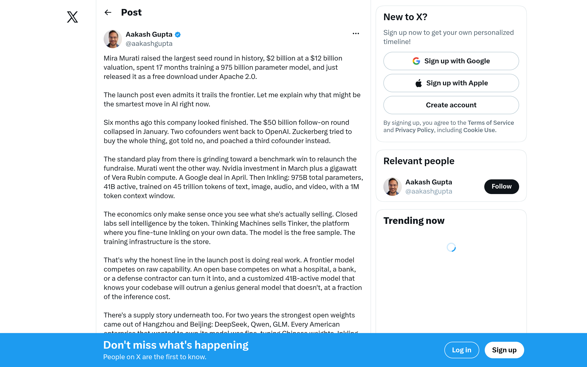
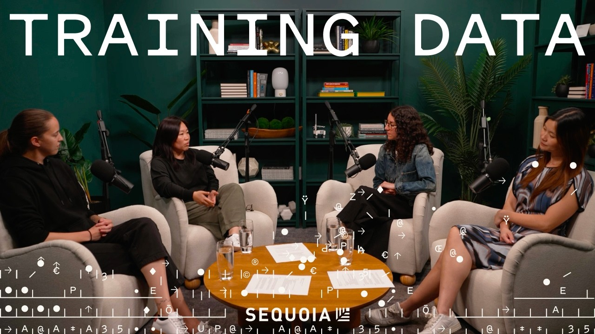

## TLDR

-   **Open weights leapfrog the frontier.** Kimi K3 topped *every* proprietary model on Vercel's web-engineering benchmark; Inkling opened a US base days earlier. The open-vs-closed gap is now weeks, not years.
-   **The fight to own the model escalates.** Enterprises spooked by "alpha leakage" want to run their own models — and labs, hyperscalers, and open-weight vendors are all racing to answer that anxiety.
-   **Compute gridlock deepens.** Up to 50% of announced AI data centers may never get built; compute is starting to trade as a commodity.
-   **"Self-driving companies" replace SaaS.** Replit tripled code output and Curative cut 80% of its SaaS spend, both swapping seven-figure tools for internal agents.
-   **GCP plays this week:** the Gemini Enterprise Agent Platform (GEAP, FKA Vertex AI) Model Garden as the neutral multi-model home, Agentic Data Cloud to own the data layer, and committed capacity to hedge the compute crunch.

## The Big Picture: Open Weights, the Model-Ownership Battle & Compute Gridlock

### Open Weights Leapfrog the Frontier: Kimi K3 Beats Proprietary, Inkling Opens a US Base

Two open-weight releases two weeks apart just reset expectations for how good "free" models can be. Moonshot's **Kimi K3** — a 2.8-trillion-parameter open model — hit an Intelligence Index of 57, third overall behind only Fable 5 and GPT-5.6 Sol, and Vercel CEO Guillermo Rauch called it **"the first time an open model is ahead of *all* proprietary ones"** on Vercel's comprehensive web-engineering benchmark [AI Daily Brief (29 min watch, 0:16:32)](https://podcasters.spotify.com/pod/show/nlw/episodes/Is-Kimi-K3-Really-Fable-Class-e3m7gee). Days earlier, Mira Murati's Thinking Machines shipped **Inkling**, a 975B-parameter (41B active) model under Apache 2.0 with full weights on its Tinker fine-tuning platform — the model is the free sample, the platform is the product [Aakash Gupta on X (2 min read)](https://x.com/aakashgupta/status/2077715871221580056). The irony is sharp: Inkling was pitched as a US base to break the two-year dependence on Chinese open weights [Thinking Machines (13 min read)](https://x.com/thinkymachines/status/2077454609551921208), yet Kimi K3 shows those same Chinese weights just leapfrogged the closed frontier. The open-vs-closed gap is now measured in weeks, not years.

The reality check matters for founders, though. Kimi's blended pricing has crept to **$5.40 per 1M tokens** — closing on Opus 4.8 ($9) and GPT-5.5 ($10), so "open" no longer means "cheap"; its cost-per-task *tripled* versus K2.6, and in real debugging it burned a dollar where GPT-5.6 Sol fixed the same bug for 30 cents [AI Daily Brief (29 min watch, 0:22:20, 0:24:00)](https://podcasters.spotify.com/pod/show/nlw/episodes/Is-Kimi-K3-Really-Fable-Class-e3m7gee). It also ships with near-zero guardrails. The signal isn't "switch to open weights" — it's that credible open models now give enterprises real leverage on price, control, and lock-in, shifting value from the model layer toward infrastructure and data [Gavin Baker on X (2 min read)](https://x.com/GavinSBaker/status/2076369936251851091).

**Your angle with founders:**
1.  **Where it hurts:** "Now that an open model can match the closed frontier on your core tasks, what's your plan for using that leverage — on price, on data control, or on avoiding lock-in?"
2.  **How they're hedging:** "Are you set up to run the best model for each job — Gemini, Claude, or an open weight like Kimi — without re-plumbing every time the leaderboard changes?"
3.  **Where the GCP opportunity is:** GEAP's Model Garden hosts Gemini, Claude, and open-weight models behind one API, so a founder can adopt Kimi or Inkling for the jobs they win and keep the closed frontier for the rest — with Agentic Data Cloud keeping the proprietary data and governance layer theirs.

### Who Owns the Model? The Enterprise Control Battle Escalates

The "alpha leakage" fear Palantir's Alex Karp put on blast last edition — that running your proprietary data through a frontier model teaches that model to replace you — is now reshaping how every vendor sells. Anthropic is answering it by explicitly repositioning as **"an ecosystem, not a walled garden"**: it will let customers run agent sandboxes and storage on their own infrastructure (or Modal, Vercel, Cloudflare, and Amazon microVMs), integrates "really closely" with hyperscalers "like AWS, Google," and supports multi-agent setups that interoperate across model families via MCP [Anthropic's Katelyn Lesse & Angela Jiang on Training Data (Sequoia) (0:25:21, 0:04:40)](https://www.youtube.com/watch?v=vPnVTHYplrQ&t=1521s). Microsoft is playing the opposite hand — arming its sales teams to compete head-on with OpenAI and Anthropic, pushing in-house MAI models plus "Frontier Tuning" so enterprises can fine-tune on their data — though, as one analyst noted, that "still requires enterprises to trust Microsoft with their data" [AI Daily Brief (29 min watch, 0:21:40)](https://podcasters.spotify.com/pod/show/nlw/episodes/The-New-Enterprise-Battle-Over-Who-Owns-the-Model-e3m65k0). And open-weight vendors like Thinking Machines are targeting exactly this nerve: investor Jeffrey Emanuel calls fine-tuning open weights on your own infra "smart and differentiated… you focus on [the labs'] weakness, which is the emerging competitive paranoia among big companies about leaking alpha" [AI Daily Brief (29 min watch, 0:19:35)](https://podcasters.spotify.com/pod/show/nlw/episodes/The-New-Enterprise-Battle-Over-Who-Owns-the-Model-e3m65k0).

Worth voicing to founders, though: the "own it yourself" path has a hidden bill. Anthropic's Simon Smith warns DIY fine-tuning is "a bet against the bitter lesson," and that teams underestimate the **fully loaded cost** — "continuously collecting and curating data, developing and maintaining pipelines, deploying and administering server infrastructure" — while general models often overtake hand-tuned ones over time [AI Daily Brief (29 min watch, 0:23:40)](https://podcasters.spotify.com/pod/show/nlw/episodes/The-New-Enterprise-Battle-Over-Who-Owns-the-Model-e3m65k0).

**Your angle with founders:**
1.  **Where it hurts:** "When you run your data and workflows through a single lab's model, what stops that vendor from learning your business and moving into it — the way founders now worry about with their model provider?"
2.  **How they're hedging:** "Are you picking a model home based on who you're willing to trust with your data and governance — or just defaulting to whoever you started with?"
3.  **Where the GCP opportunity is:** GEAP lets a founder keep data and governance on their own cloud while running Gemini, Claude, and open weights side by side — control of the alpha layer without taking on the fully-loaded cost of a DIY fine-tuning stack.

### Data Center Gridlock & Compute Futures: A Multi-Trillion Dollar Bottleneck

The AI buildout faces severe physical constraints, with estimates suggesting **50% of announced AI data centers will never be built or will be significantly delayed** due to soaring costs, labor shortages, and regulatory hurdles [Anisa on Big Technology Podcast (21 min watch, 0:00:23)](https://www.youtube.com/watch?v=1_VDhzZqbEk). OpenAI's Compute Chief, Sachin Katti, confirmed that demand "far outstrips compute supply today" and their "biggest worry" is not being able to build fast enough, citing bottlenecks across permitting, gas turbines, transformers, and skilled labor [Sachin Katti on The MAD Podcast (45 min watch, 0:00-0:19, 0:34:36)](https://www.youtube.com/watch?v=wEZBlmvxx4o). This looming deficit is leading to **compute becoming a traded commodity**: Kalshi has launched GPU compute forward curves for Nvidia B200, H200, and A100 chips, allowing mature commodity markets to form expectations and manage risk [Tarek Mansour on X (1 min read)](https://x.com/mansourtarek_/status/2077163765020160172). With AI compute demand projected to grow to $7-10 trillion by 2030, a liquid derivative market could be 10-20x larger than the underlying spot market, mirroring "where oil was before NYMEX."

**Your angle with founders:**
1.  **Where it hurts:** "If compute prices jump or supply tightens next year, does your plan survive it — or are you buying on the spot market with no committed capacity?"
2.  **How they're hedging:** "Can you shift the workloads that don't need the frontier onto cheaper models when the expensive ones get scarce?"
3.  **Where the GCP opportunity is:** Committed-use capacity buys predictable pricing and reserved supply, and GEAP routing lets a founder run smaller/cheaper models for the jobs that don't need a frontier model. The lever is capacity terms and workload mix — not raw cluster size.

## Quick Hits

-   **[Replit's "Self-Driving Company" (26 min watch)](https://podcasters.spotify.com/pod/show/nlw/episodes/The-Self-Driving-Company-e3m91l5)** — Replit nearly tripled code output (5.8x lines of code, with incidents and reversions flat) by giving AI agents access to *all* internal systems — GitHub, GCP, Notion, Slack, Zendesk — and replaced a "seven-figure SaaS solution" with an internal app. Staff went from "doers to directors."
-   **[Curative Cuts 80% of Its SaaS Spend (90 min watch)](https://www.youtube.com/watch?v=GHRuerXkHlI)** — Fred Turner's health startup canceled a $600K/year Salesforce contract for a "vibe-coded" internal CRM wired to agents (doctor credentialing dropped from ~$50 to 20¢/task) — though its Anthropic bill now runs into the millions per month, trading SaaS seats for token spend.
-   **[Token Theft is the New Fraud (1 min read)](https://x.com/emilysands/status/2075037617937989938)** — Stripe's Emily Sands warns that fraudsters are now stealing tokens, not just money or credentials, posing an existential risk to AI companies as inference costs carry a real marginal cost.
-   **[One-Person Companies Soar: AI Lowers Entry Barrier (25 min watch)](https://podcasters.spotify.com/pod/show/nlw/episodes/AI-Is-Making-One-Person-Million-Dollar-Companies-More-Common-e3lo4bm)** — AI is enabling a boom in solopreneurship, creating leaner, flatter, engineer-heavy startups that achieve equal valuations with 25% smaller teams.
-   **[Apple Sues OpenAI: Hardware Secrets & Poaching (1 min read)](https://x.com/aakashgupta/status/2075811573600575568)** — Apple has sued OpenAI, alleging trade secret theft of hardware designs and poaching over 400 employees, underscoring the escalating competitive battle for AI talent and intellectual property.

## Our Play

Every thread this edition — open weights good enough to matter, enterprises spooked about who owns their model, DIY fine-tuning's hidden bill, a tightening compute market — points to one GCP position: **be the neutral place a founder owns their AI stack, without betting the company on a single lab or a DIY pipeline.** Three concrete motions:

-   **Lead with Model Garden, not a single model.** When a founder is eyeing Kimi or Inkling, don't pitch "use Gemini instead" — pitch "run all of them on GEAP behind one API: adopt the open weight for the jobs it wins, keep Claude or Gemini for the rest, and swap models when the leaderboard changes without re-plumbing." Optionality is the product.
-   **Sell the data layer as the thing they actually own.** Agentic Data Cloud (Knowledge Catalog + governed access) keeps a founder's proprietary data — and the alpha built on it — on their own cloud. That's the concrete answer to leakage fear that a DIY fine-tune doesn't give them: they'd still be buying the whole data-and-inference pipeline, not just the control.
-   **Turn the compute crunch into a commitment conversation.** With supply tightening, committed-use capacity is a hedge, not just a discount — lock predictable pricing now, then use GEAP routing to push non-frontier work to cheaper models so that committed capacity stretches further.

---

*Sources: 137 bookmarks (incl. linked articles read in full), 2 videos, and 80+ podcast episodes from the AI content library. [Archive](/archive)*
