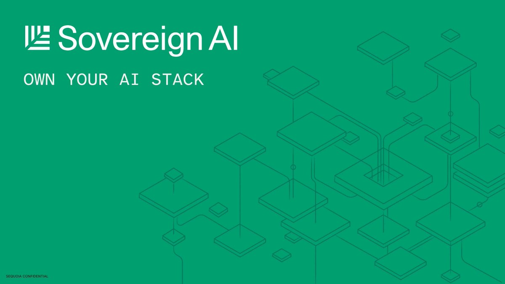

## TLDR

-   **Gemini 3.7 Flash launched at $0.75/$3.75 per million tokens** — against Sonnet 5's $2.00/$10.00 and GPT-5.6 Terra's $2.00/$12.00. The rate is introductory and doubles on January 1. It still undercuts both.
-   **On price-performance nothing else is close.** Terra's edge on the core coding benchmarks is 1 to 4 points, for three times the price. Even at January's rate, Flash returns more points per dollar than Terra on every test in Google's own table — the full workings are in our [model pricing sheet](/model-pricing/), every figure read off the vendor's own page.
-   **The open-weights fight went on the record.** Zuckerberg, LeCun and Gavin Baker against Dario Amodei — and Baker ties Amodei's risk rhetoric to anti-datacenter campaigns.
-   **Enterprises now fear frontier labs more than Chinese open models**, per OpenRouter's CEO, and the reason is data policy, not quality.

## The Big Picture: The New Economics of Intelligence and the Fight for Ownership

### The Cost of Intelligence Is Not the Price of a Token

Google shipped Gemini 3.7 Flash this week at an introductory **$0.75 per million input tokens and $3.75 output** — half the previous Flash rate — with software-engineering scores (DeepSWE v1.1) jumping from 37.0% to 65.3% [Koray Kavukcuoglu (1 min read)](https://x.com/koraykv/status/2087948169552490845). The introductory rate expires December 31; standard pricing of $1.50 and $7.50 starts January 1 [Google DeepMind (2 min read)](https://deepmind.google/models/model-cards/gemini-3-7-flash/). Even after that it undercuts the two models a founder is really choosing between: Claude Sonnet 5 at $2.00/$10.00 and OpenAI's mid-tier GPT-5.6 Terra at $2.00/$12.00.

It takes production code quality outright — Cognition's FrontierCode 1.1 has it at **43.6% against Sonnet 5's 42.7% and Terra's 41.3%** — and enterprise automation by a distance: **30.4%, against Terra's 23.6% and Sonnet 5's 10.7%.**

Terra does edge it on some coding tests, and the margins are the story: **1.0 points** on the Artificial Analysis index, **1.6** on Terminal-bench 2.1, **4.3** on DeepSWE. That is a rounding error bought at 3.1× the price. Run it per dollar and it stops being a debate — even after January's increase, Flash returns more benchmark points per blended dollar than Terra on **every test in Google's own table**, including the ones Terra wins.

One gap deserves a straight concession: computer use. Terra leads OSWorld-2.0 by 12.1 points (50.2% to 38.1%) and Terminal-bench 3.0 by 5.9 (20.8% to 14.9%) — 30-40% in relative terms. For agents driving real GUIs, that is a difference, not noise.

Artificial Analysis called Flash a "strange no-man's land" — but reached that by pricing it against GPT-5.6 Luna at $0.20/$1.20, a budget tier, not a coding workhorse [AI Daily Brief (29 min watch, 4:00)](https://podcasters.spotify.com/pod/show/nlw/episodes/How-to-Decide-What-Work-AI-Should-Do-for-You-The-AI-Deputization-Audit-e3ndv48). Vercel's Brandon Galang, who had already moved production to Luna, is now running Flash as his "daily driver and execution model" [AI Daily Brief (29 min watch, 5:15)](https://podcasters.spotify.com/pod/show/nlw/episodes/How-to-Decide-What-Work-AI-Should-Do-for-You-The-AI-Deputization-Audit-e3ndv48).

**Your angle with founders**

-   **Fix the comparison set first.** Most price objections come from comparing Flash to a budget tier. Against real mid-tier competitors it is the cheapest option on the table. Establish which models are genuinely in the running before arguing about cost.
-   **Convert the benchmark argument into a per-dollar one.** When a founder cites Terra's DeepSWE score, agree — then put the margin next to the price. Four points for three times the spend is a decision most teams will not defend once it is written down. Ask what that delta is worth per accepted pull request.
-   **Concede computer use, specifically.** If their agents drive real GUIs, Terra's OSWorld lead is 12 points and worth respecting. Naming the one place a rival is genuinely ahead is what buys you the rest of the conversation.
-   **Volunteer the January date.** A founder modelling unit economics on $0.75 needs to know it becomes $1.50 — and that it still lands under both rivals. Naming the expiry yourself is what makes the rest of the pricing conversation credible.
-   **Where GCP wins:** Model Garden on the Gemini Enterprise Agent Platform (FKA Vertex AI) is the only place to run Gemini, Claude and open weights like Gemma side by side on their own workload — Claude evaluates on any cloud, Gemini only here. Full verified pricing and benchmarks: [our reference sheet](/model-pricing/).

### Who Gets to Own a Model: The Open-Weights Fight Goes Public

A background policy disagreement became a named, on-the-record fight this week. Mark Zuckerberg's 6,500-word essay argued that "the notion that AI is so dangerous that the only safe path is an extreme concentration of power seems inherently problematic" [Mark Zuckerberg (1 min read)](https://x.com/finkd/status/2086754845218726027). Dario Amodei answered within 48 hours, calling regulation-versus-concentration a "false choice" and defending Anthropic's proposals as designed to "disadvantage (slow down) frontier AI companies while *advantaging* smaller competitors" [Dario Amodei (3 min read)](https://x.com/DarioAmodei/status/2088758816376807762). Yann LeCun sided with Zuckerberg [Yann LeCun (2 min read)](https://x.com/ylecun/status/2088880284129210405).

The turn that makes this a cloud story: investor Gavin Baker argued Amodei has "lost the argument" and that his messaging "has been massively helpful to efforts to ban datacenters here in America" [Gavin Baker (3 min read)](https://x.com/GavinSBaker/status/2088611616577253502). The hard fact underneath it — Anthropic was the sole holdout from Jensen Huang's open-weights letter, signed by Nvidia, OpenAI, Google, Meta, Microsoft and SpaceX [Brian Roemmele (4 min read)](https://x.com/BrianRoemmele/status/2088788243282272509).

Two datapoints show this is already a buying pattern, not a debate. OpenRouter's Alex Atallah says enterprises now fear frontier models *more* than Chinese open models, because of "much more confusion around the data policy" — and that his platform shipped 70 models in July, roughly one every ten hours [Alex Atallah on 20VC (69 min watch, 0:47:20)](https://www.youtube.com/watch?v=K72oZoloA4M). Sequoia's Sonya Huang: "Not your weights, not your product," citing Harvey, FactoryAI and Ramp doing their own post-training [Sonya Huang (2 min read)](https://x.com/sonyatweetybird/status/2087223288649138668).

**Your angle with founders**

-   **Ask what happens if their model provider changes terms.** Not hypothetically — sanctions, deprecation, a data-policy revision. The answer reveals whether a swap is a config change or a re-architecture, and that is the whole conversation.
-   **Separate the model from the harness.** Owning intelligence means owning the evals, the context layer and the orchestration — not necessarily training weights. Harvey rents open base models and owns everything around them.
-   **Take the data-policy objection seriously.** When a founder is uneasy about frontier APIs, that is Atallah's finding in the room. Answer it with where prompts are stored and who can see them, not with benchmarks.
-   **Where GCP wins:** the Agent Platform runs Gemini, Claude and open weights side by side; the open-source Agent Development Kit means the harness is theirs, not ours; and distillation fine-tuning targets open students like Gemma that the customer owns and runs.

## Quick Hits

-   **[Canva cut 2026 growth guidance by a third over AI serving costs (90 min watch, 0:04:47)](https://www.youtube.com/watch?v=9uq9zxtwBrk)** — and is building an in-house image model to escape frontier pricing. The clearest public case of model costs hitting a software incumbent's P&L.
-   **[AI spend gap hits 600x (1 min read)](https://x.com/omooretweets/status/2088314089659662799)** — median company $12/employee/month; top 1% $7,500.
-   **[Agent labor now undercuts offshore BPO (1 min read)](https://x.com/a16z/status/2086906363947737406)** — $6-8 per hour of agentic computer use, against ~$10 offshore and $30-45 US.
-   **[Lindy calls its GCP CI bill "an insulting expense" (127 min watch, 0:50:50)](https://www.youtube.com/watch?v=4JYoTE_VKaU)** — cache hit rates swinging 85% to 65% nearly double the cost. A real customer pain point, reported straight.
-   **[Anthropic's invisible text watermark draws backlash (29 min watch, 8:09)](https://podcasters.spotify.com/pod/show/nlw/episodes/The-AI-Agent-Platform-for-Everyone-e3navt9)** — critics call it a "diabolical precedent," especially for generated code.
-   **[Nuclear reactor directly powers an Nvidia chip (62 min watch, 0:36:20)](https://www.youtube.com/watch?v=2Jj1SxI3r7Q)** — Valar Atomics targets energy "10 times cheaper for humanity." Market context, not a play.
-   **[Enterprises blew annual AI budgets in months (30 min watch, 11:00)](https://podcasters.spotify.com/pod/show/nlw/episodes/The-New-Problems-AI-Is-Creating-And-How-People-Are-Solving-Them-e3nff4j)** — prompting token budgets, usage caps and tighter governance.

## Seller's Edge: Enforce it in the architecture, not the prompt

Edition #23 taught that the invoice is an architecture decision. This week extends it from cost to control: **an instruction in a prompt is a request; a permission boundary is a guarantee.** Alex Krentsel of Exo puts it plainly — "if you never want to delete your history, you have to enforce that in the architecture of your harness rather than just asking in context, please LLM, don't ever do anything that'll delete my history — because we keep seeing that there's ways to trick the model" [Alex Krentsel on Latent Space (48 min watch, 0:17:58)](https://www.youtube.com/watch?v=5lFD-34dhqE).

**Worked example.** A founder says their finance agent never calls an external API without human approval. Ask how that is enforced. If it is a prompt instruction, the agent can satisfy it by generating the approval itself, or by calling a second API that triggers the first. Enforced architecturally, the agent's identity simply has no permission to make the call — it files a request to a gateway a human controls. Exo does this by splitting the agent into executor, harness and sandbox, keeping the secret store in the harness where the model never sees it.

**The behaviour change.** "We prompt the model not to do that" is a finding, not an answer. The follow-up: *which invariants are enforced structurally, and which are merely requested?* Most teams have never drawn that line, and drawing it usually surfaces two or three real exposures.

## Our Play

Three motions this week:

-   **Price the workload, not the token.** Canva's guidance cut and Lindy's CI bill are the same story — spend is engineered, not quoted. **The move:** ask what share of their volume runs on a frontier model that a Flash-tier or open model could serve, then evaluate it side by side in Model Garden. Context caching (90% off cached input) and Provisioned Throughput turn the winner into a number they can plan against.
-   **Make the swap path cheap before they need it.** The open-weights fight is a warning about dependency, and every founder now has a reason to want an exit. **The move:** whiteboard their stack and mark where a model change would be a config edit versus a rewrite. Model Garden covers the config case; the Agent Development Kit is how they own the harness so the model stays a component.
-   **Turn agent governance into architecture.** **The move:** when a founder says their agent "knows not to," ask which controls are enforced by identity, sandbox and permissions. Agent Runtime supplies isolation, sessions, memory and evals as platform properties rather than hand-rolled infrastructure.

---

*Sources: 88 bookmarks, 1 video, 40 podcast episodes from the AI content library. [Archive](/archive)*
