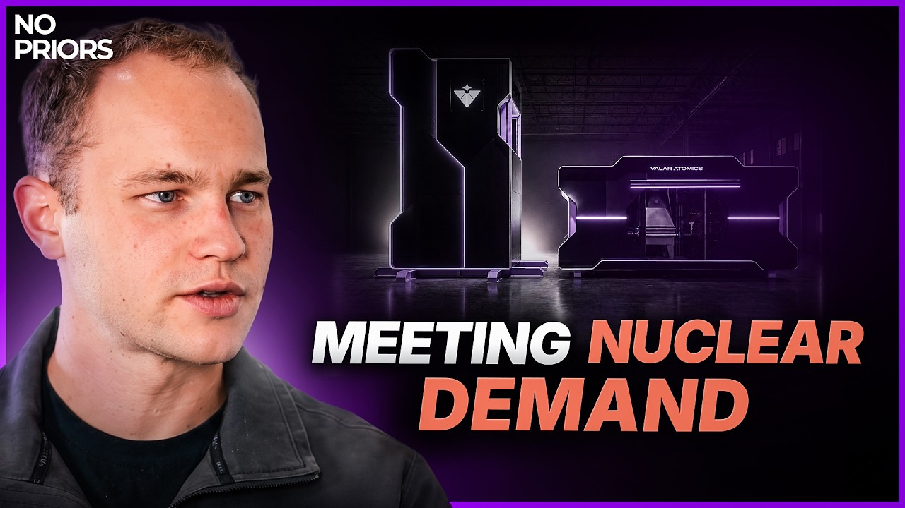
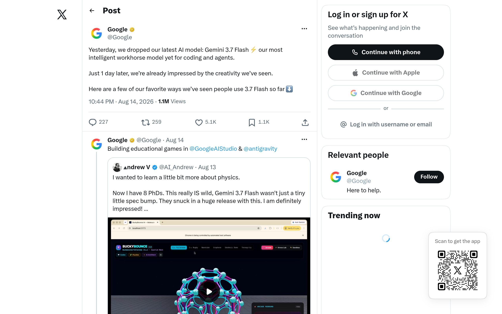
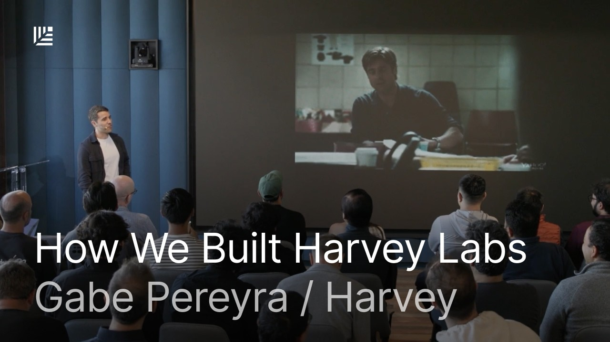

## TLDR

-   **Nuclear power fuels AI compute:** Valor Atomics demonstrated a nuclear reactor directly powering an Nvidia Blackwell chip, aiming for 10x cheaper energy with an aggressive timeline.
-   **Gemini 3.7 Flash redefines coding economics:** Google's new model ties Claude Sonnet 5 on coding benchmarks at less than half the cost.
-   **App-layer startups "own their intelligence":** Legal AI firm Harvey detailed its "Moneyball" playbook for building frontier AI on open weights, synthetic data, and multi-model serving.
-   **AI spend surges, but with governance:** Some enterprises exhausted annual AI budgets within months, prompting new token management policies and tighter governance.
-   **Your GCP plays this week:** Lead with multi-model routing for cost/performance, secure foundational AI infrastructure, and utilize financing for scalable compute.

## The Big Picture: Compute's New Frontier, Cost-Efficiency, and Model Sovereignty

### Nuclear Dawn: Valor Atomics Powers Nvidia Chip, Aims for 10x Cheaper Energy

The ultimate bottleneck for scaling AI — reliable, abundant power — saw a bold new contender this week. Valor Atomics, a startup aiming to industrialize nuclear fission, demonstrated its nuclear reactor directly powering an Nvidia Blackwell AI chip [Isaiah Taylor on No Priors (62 min watch, 0:36:20)](https://www.youtube.com/watch?v=2Jj1SxI3r7Q). Valor's founder, Isaiah Taylor, asserted his company is in the business of "making energy 10 times cheaper for humanity" with a "tick rate" goal of a new reactor every few minutes. He sharply contrasted Valor's hardware-first approach with the traditional nuclear industry, which he characterized as stagnant, slow, and overly reliant on "modeling and simulation" rather than execution [Isaiah Taylor on No Priors (62 min watch, 0:14:10)].

This pushes against the prevailing timeline from large compute buyers, who expect at-scale nuclear power no sooner than 2031-2032. Taylor argued this pessimism stems from a "wrong mindset" that underestimates exponential progress when new players embrace speed, vertical integration, and intrinsic safety [Isaiah Taylor on No Priors (62 min watch, 0:40:20)]. Valor’s vision of “gigasites” with gigawatt-scale power, confident that compute will follow if the power is cheap and available, could fundamentally reshape future data center siting and the economics of hyperscale AI.

**Your angle with founders**

-   **Acknowledge the macro reality:** AI is driving unprecedented demand for compute, and power is the ultimate bottleneck. Compute buyers are wrestling with securing multi-gigawatt supplies, often resorting to temporary solutions like diesel until new energy sources come online.
-   **Frame long-term planning:** This isn't about *selling* power, but *planning* for future energy abundance as a foundation for compute. If energy is 10x cheaper, what does that enable for their models, data, and distributed agentic workloads? A rep who sees a future where power is nearly free can shift the conversation from today’s scarcity to tomorrow’s opportunity.
-   **Position for the transition:** While nuclear fusion and advanced fission are coming, current AI workloads need reliable, scalable infrastructure today. This is where Google Cloud's globally distributed, high-performance compute and sustainable data center strategy provides the stability and flexibility to bridge the gap and integrate with future energy innovations.
-   **Where GCP wins:** scalable, adaptable infrastructure that helps founders meet immediate compute demands while positioning them to capitalize on the coming era of energy abundance.

### Gemini 3.7 Flash Resets Coding Benchmarks: Half the Cost, Ties Claude Sonnet 5

Google this week launched Gemini 3.7 Flash, its "most intelligent workhorse model yet for coding and agents" [Google (1 min read)](https://x.com/Google/status/2088396439198089236). DeepMind's Koray Kavukcuoglu confirmed the new model ships at half the price of 3.6 Flash, with significant jumps in software engineering (DeepSWE v1.1 from 37.0% to 65.3%) and enterprise automation [Koray Kavukcuoglu (1 min read)](https://x.com/koraykv/status/2087948169552490845). Crucially, independent benchmarks from Cognition's FrontierCode 1.1 — which evaluates models on real engineering tasks by quality and mergeability — show Gemini 3.7 Flash scoring 56.3, essentially tied with Claude Sonnet 5's 56.2, at less than half the cost [CodeByPoonam (1 min read)](https://x.com/CodeByPoonam/status/2088098456246304781).

This re-establishes a strong cost-performance benchmark for Google in the competitive AI model landscape. While OpenAI also pushed its GPT-5.6 Sol with an "Ultra Fast Mode" at 750 tokens per second [OpenAI (1 min read)](https://openai.com/index/previewing-ultrafast), Gemini 3.7 Flash's balance of speed (340 tokens/sec), multimodal understanding, and value has drawn attention. Brandon Galang of Vercel noted that Gemini 3.7 Flash "sits on the Pareto Frontier" and is being adopted as a "daily driver and execution model" for production coding workflows, countering competitive FUD [Brandon Galang on AI Daily Brief (29 min watch, 5:15)](https://podcasters.spotify.com/pod/show/nlw/episodes/How-to-Decide-What-Work-AI-Should-Do-for-You-The-AI-Deputization-Audit-e3ndv48). This underscores Google's bet on speed and efficiency as critical differentiators.

**Your angle with founders**

-   **Concede what's true:** Claude Sonnet 5 and GPT-5.6 Sol are strong, widely-used models, and founders are constantly seeking the best price-performance for their coding and agentic tasks. Leaderboard scores are important for initial comparisons.
-   **Reframe the decision to their workload:** A public benchmark is not their workload. The critical question for a founder is: "How does this model perform on *your* specific codebase, with *your* agentic workflows, and *your* desired latency for human interaction?" Only a real-world evaluation on their data will determine the true cost-per-outcome.
-   **Compete on a full-stack value proposition:** Google's rapid iteration on the Flash series, its full-stack economics (designing both models and custom silicon like TPUs), and its multimodal capabilities mean Gemini 3.7 Flash offers a unique blend of performance, speed, and cost-efficiency. This goes beyond raw per-token price to total value.
-   **Where GCP wins:** Model Garden on the Gemini Enterprise Agent Platform (FKA Vertex AI) allows founders to A/B test Gemini 3.7 Flash against Claude, open weights like Gemma, and other models side-by-side, quickly routing traffic to the model that delivers the best cost-per-outcome for each specific task without re-architecting.

### 'Own Your Intelligence': Harvey's Playbook for Building Frontier AI on Open Weights

The debate over "build vs. rent" in AI shifted from theory to a concrete playbook this week. Harvey, a leading legal AI startup, detailed its "Moneyball" strategy for application-layer companies to build frontier-grade research labs on a budget. Harvey co-founder Gabe Pereyra explained how they compete by "renting the frontier ecosystem," utilizing open weights, synthetic data, and multi-model serving infrastructure [Gabe Pereyra on Sequoia Capital (29 min watch)](https://www.youtube.com/watch?v=MGouk8W51v0). Sonya Huang of Sequoia underscored the trend: "Intelligence is the product. Companies want to shape it and own it and let it compound within their own walls. Not your weights, not your product" [Sonya Huang (2 min read)](https://x.com/sonyatweetybird/status/2087223288649138668).

Harvey's playbook includes: 1) building and open-sourcing proprietary benchmarks and expert-guided synthetic datasets (critical for sensitive legal data where customer data cannot be used); 2) post-training strong open-source base models like Kimi 3, GLM 5.2, or Inkling in partnership with multiple "neo labs" and in-house tools; and 3) implementing a robust, cross-provider model serving infrastructure for routing, fallbacks, and continuous evaluation across 60 countries [Gabe Pereyra on Sequoia Capital (29 min watch)]. Matt Bornstein of a16z echoed this, stating that open source is how "AI companies stop being wrappers" on closed APIs and start owning their mid-training, post-training, and inference [Matt Bornstein (1 min read)](https://x.com/a16z/status/2087202387903889442). This signals a strategic shift from simply consuming models to deeply embedding unique intelligence and data into a company's own AI product.

**Your angle with founders**

-   **Open with the existential question:** Many founders default to renting intelligence via API for speed, but the market is shifting. "Not your weights, not your product" is a strong sentiment being expressed by leading VCs and AI startups like Harvey.
-   **Reframe the decision to long-term ownership and differentiation:** Relying solely on frontier APIs risks commoditization and alignment issues if the API provider's incentives diverge. Owning the model and data layer allows a founder to bake in unique product "taste," maintain data privacy, and control their destiny, which is increasingly essential for building a durable competitive moat.
-   **Deconstruct the "build-vs-buy" false dilemma:** Harvey shows it's not a binary choice. It's about strategically choosing what to own (benchmarks, synthetic data, post-training, serving harness) and what to rent (open-source base models, compute from neo-labs or cloud providers). The model itself becomes a component, not the core product.
-   **Where GCP wins:** Google Cloud's Agent Platform, with its robust fine-tuning services (including distillation for open-weight students like Gemma), comprehensive data governance, and multi-model support (Gemini, Claude, open weights), provides the infrastructure for founders to implement Harvey's playbook, enabling them to own and bake their unique intelligence into their products.

## Quick Hits

-   **[AI spend gap hits 600x:](https://x.com/omooretweets/status/2088314089659662799) (1 min read)** The median company spends $12/employee/month on AI, while the top 1% spend $7,500, indicating a massive adoption and investment disparity driven by architectural differences.
-   **[Agent labor cheaper than human BPO:](https://x.com/a16z/status/2086906363947737406) (1 min read)** An hour of agentic computer use now costs $6-8, undercutting offshore outsourced talent at ~$10/hour and US talent at $30-45/hour as inference costs continue to fall.
-   **[Lindy reports "insulting" GCP CI costs:](https://www.youtube.com/watch?v=4JYoTE_VKaU) (127 min watch, 0:50:50)** The Lindy Teammate project reports its CI pipeline on GCP runners is "extremely expensive" and "an insulting expense," highlighting a significant operational pain point for agentic workloads despite caching and optimizations.
-   **[Anthropic's invisible watermark sparks backlash:](https://podcasters.spotify.com/pod/show/nlw/episodes/The-AI-Agent-Platform-for-Everyone-e3navt9) (29 min watch, 8:09)** Anthropic's new invisible text watermarking policy for Claude draws strong criticism, particularly for code, with critics calling it a "diabolical precedent."
-   **[GrokBot users report memory & cost issues:](https://podcasters.spotify.com/pod/show/nlw/episodes/The-AI-Agent-Platform-for-Everyone-e3navt9) (29 min watch, 24:02)** Early users of GrokBot complain about its high token burn, memory issues (losing context), and "bot blockages" due to data center IP addresses.
-   **[AI budget overruns trigger governance:](https://podcasters.spotify.com/pod/show/nlw/episodes/The-New-Problems-AI-Is-Creating-And-How-People-Are-Solving-Them-e3nff4j) (30 min watch, 11:00)** Several firms reported exhausting annual AI budgets within months as employee usage exceeded expectations, prompting new token budgets, usage caps, and tighter governance.

## Seller's Edge: The True Cost of AI — Beyond the Token Price

Edition #23 taught "The invoice is an architecture decision," highlighting how agentic systems' cost is engineered, not just priced. This week's signal, particularly the stories of enterprises blowing through AI budgets and Lindy's "insulting" GCP CI costs, adds a critical nuance: **the true cost of AI extends far beyond the price-per-token.** It's a holistic sum of data acquisition and curation, the complexity and optimization of the agent harness, evaluation infrastructure, re-optimization loops, and the hidden costs of managing a rapidly evolving stack. Relying on raw token prices alone can lead to "scaling into bankruptcy" and failing to deliver actual business value. This is a fundamental difference from traditional SaaS, where marginal usage costs were often negligible.

**Worked example:** Take Lindy's experience. They run their CI pipeline on GCP, have implemented caching, and are using cheap models like DeepSeek, yet still find it "extremely expensive" [Flo Crivello on The Cognitive Revolution (127 min watch, 0:50:50)]. Why? Because "finicky" caching (a major component of cost optimization) can suddenly drop from 85% to 65% hit rates, nearly doubling costs. This is not a direct charge for tokens; it's an architectural and engineering cost. Similarly, enterprises burning through annual budgets in months aren't just paying more per token; they're incurring costs for unoptimized prompt usage, redundant model calls, and a lack of granular control over where intelligence is being consumed [EY quoted on AI Daily Brief (30 min watch, 11:00)]. The cost of *not* optimizing the architecture and engineering effort far outweighs any per-token discount.

**The behavior change:** When talking to founders, shift the conversation from "what's your price per token?" to "what's your *total cost per accepted outcome*?" This means probing their data strategy (how are they acquiring, curating, and grounding data?), their agent harness design (how are they building memory, tool use, and routing?), and their evaluation pipeline (how do they measure efficiency and quality?). Instead of just offering a discount on tokens, help them identify the architectural and engineering levers that will reduce their overall AI spend by orders of magnitude.

## Our Play

Every thread this edition—from a nuclear energy future to new cost-performance benchmarks and the strategic imperative to own your intelligence—points to one GCP position: **the foundation for AI value is predictable, secure, and cost-optimized infrastructure that empowers builders to own their intelligence, not just rent it.** Three concrete motions:

-   **Optimize for cost-per-outcome, not just token price.** The Gemini 3.7 Flash shows that a model can be both high-performance and cost-efficient for specific tasks like coding, challenging the idea that highest performance always means highest cost. **The move:** Offer a side-by-side evaluation of their coding or agentic workloads on the Agent Platform's Model Garden, running Gemini 3.7 Flash against other models. Use cost-tracking and monitoring to demonstrate how flexible routing, Flash tiers, Batch/Flex discounts, and context caching (which offers a 90% discount on cached input tokens and applies to different pools than Batch/Flex for a combined saving effect, though they do not stack on the same token) can deliver a lower *total cost per accepted outcome*, not just a cheaper list price.
-   **Enable 'Own Your Intelligence' with open-weights mastery.** Harvey's "Moneyball" playbook demonstrates how application-layer companies can build frontier AI by post-training open weights with proprietary data. **The move:** Engage founders on their "build vs. rent" strategy, specifically for domain-specific intelligence. Highlight GCP's Agent Platform fine-tuning services (including distillation fine-tuning for open-weight students like Gemma, not 3.1 Pro) and the Agentic Data Cloud, which allows them to securely bake their unique data and judgment into models they own, creating a durable competitive moat without competing for frontier lab compute.
-   **Future-proof for energy abundance with scalable, adaptable infrastructure.** The Valor Atomics story points to a radical shift in energy supply for AI compute, with large industrial-scale power becoming available on aggressive timelines. **The move:** Position Google Cloud's globally distributed, high-performance compute and sustainable data center strategy as the adaptable foundation that can harness these new energy sources as they come online. Emphasize GCP's existing commitment to 100% renewable energy and how our flexible infrastructure, global fiber network, and multi-year capacity commitment deals ensure customers have predictable, scalable compute to meet future energy-intensive AI workloads.

---

*Sources: 88 bookmarks, 1 video, 40 podcast episodes from the AI content library. [Archive](/archive)*