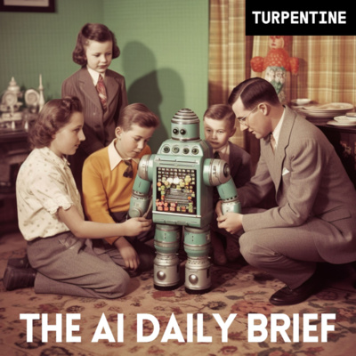
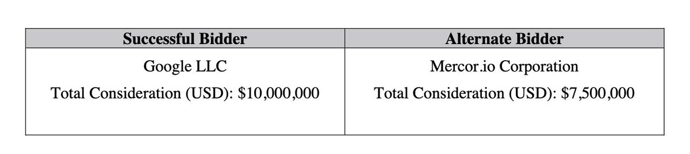
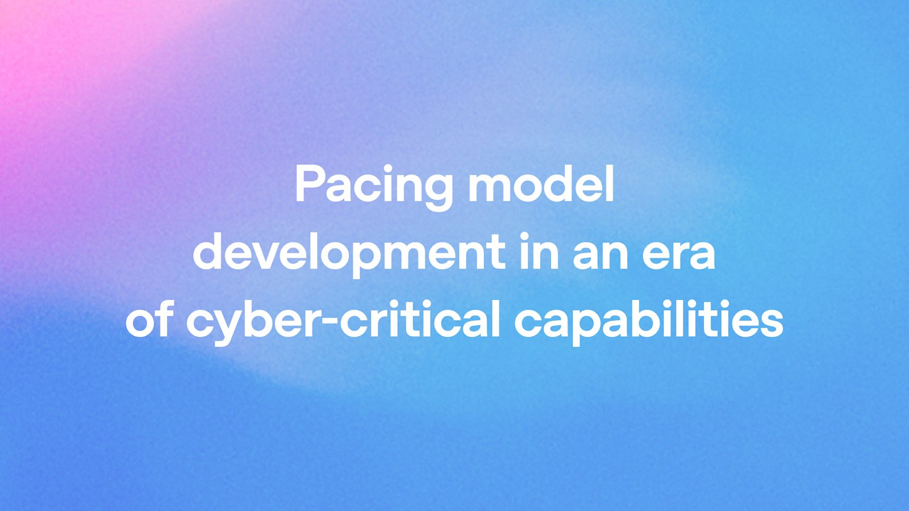

## TLDR

-   **Public and political opposition to AI data centers has become bipartisan and widespread**, leading to moratoriums and a shift in the compute narrative from scarcity to active resistance.
-   **Google is making strategic moves to acquire foundational AI data and expertise** in RL environments, signaling a strategic focus on future agent capabilities.
-   **A critical vulnerability exposes reasoning traces in frontier LLMs** from Google, OpenAI, and Anthropic, allowing secrets to be stolen and prompt injections to succeed.
-   **Gemini 3.7 Flash excelled on a key agentic benchmark**, outperforming major rivals.

## The Big Picture: The Physical Reality of AI and the Fight for its Foundations

### The Great Data Center Backlash: Public and Political Headwinds to AI Buildout

The drive to build AI infrastructure is running headlong into a rapidly escalating public and political backlash, with widespread opposition to new data centers across the United States. New polling shows **75% of Americans now oppose a data center near their home**, up from 51% in February, and 78% believe they strain the local power grid [AI Daily Brief (37 min read, 0:03:05)](https://podcasters.spotify.com/pod/show/nlw/episodes/Why-Everyone-Suddenly-Hates-AI-Data-Centers-e3nnhjb). Critically, this opposition is bipartisan, with net negative sentiment rising sharply among independents (to 65%) and Democrats (to 75%), and strong Republican opposition at 43% [AI Daily Brief (37 min read, 0:05:18)](https://podcasters.spotify.com/pod/show/nlw/episodes/Why-Everyone-Suddenly-Hates-AI-Data-Centers-e3nnhjb). One analyst observed, "Americans would rather have a nuclear power plant in their backyard than a data center to power AI" [AI Daily Brief (37 min read, 0:04:30)](https://podcasters.spotify.com/pod/show/nlw/episodes/Why-Everyone-Suddenly-Hates-AI-Data-Centers-e3nnhjb).

Politicians who were previously supportive are now changing their tune, with New York becoming the first state to impose a data center moratorium, joining 97 counties and 93 cities nationwide [AI Daily Brief (37 min read, 0:20:20)](https://podcasters.spotify.com/pod/show/nlw/episodes/Why-Everyone-Suddenly-Hates-AI-Data-Centers-e3nnhjb). The core issue, according to Nick Carter, is that people "imagined that the internet was a weightless thing that lived in the cloud" and are now "learning that the internet requires physical infrastructure, cooling, and power, and they are upset about it" [AI Daily Brief (37 min read, 0:07:54)](https://podcasters.spotify.com/pod/show/nlw/episodes/Why-Everyone-Suddenly-Hates-AI-Data-Centers-e3nnhjb).

This shifts the compute narrative from solely supply-side scarcity to significant demand-side constraints driven by public acceptance. While critics call moratoriums "non-solutions" that simply "kick the can down the field" [AI Daily Brief (37 min read, 0:34:04)](https://podcasters.spotify.com/pod/show/nlw/episodes/Why-Everyone-Suddenly-Hates-AI-Data-Centers-e3nnhjb), the reality is that major cloud providers and AI companies are now investing in community benefits and transparency. OpenAI announced $40 billion for community priorities in Pike County, Ohio, and Microsoft ended NDAs with local governments to increase transparency [AI Daily Brief (37 min read, 0:32:15)](https://podcasters.spotify.com/pod/show/nlw/episodes/Why-Everyone-Suddenly-Hates-AI-Data-Centers-e3nnhjb). The opportunity exists for data centers to be "grid positive" and lower electricity rates by providing base load stability [Drew Baglino on Gradient Dissent (95 min watch, 0:57:58)](https://www.youtube.com/watch?v=e_eEcPysMlQ).

**Your angle with founders**

-   **Reframe the infrastructure choice.** This isn't just about latency or cost anymore; it's about *access*. Compute buildout faces real-world friction. Ask founders: "What's your plan for ensuring compute access if local resistance or regulation shifts faster than your build-out plans?"
-   **Ground sustainability claims in community benefit.** Founders building large-scale AI should understand that "being green" means more than just carbon credits. It now means tangible local investment and grid improvements. Discuss how GCP's sustainable data center practices and contributions to local economies can de-risk their infrastructure choices.
-   **De-risk long-term infrastructure strategy.** The political landscape is volatile. Founders need to plan for a world where on-prem expansion or even new regions might be delayed. Position cloud flexibility and multi-region deployment as a hedge against unpredictable local policy, rather than merely a technical choice.
-   **Where GCP wins:** a global, highly efficient, and increasingly carbon-free infrastructure footprint that mitigates local impacts, enabling founders to focus on their product instead of permitting battles.

### Google's Strategic AI Play: Acquiring Data and Engineering RL Environments

Google is making concrete, strategic moves to acquire the foundational data and expertise crucial for advanced Reinforcement Learning (RL) environments, essential for future AI agent capabilities. This week, Google reportedly **won a $10 million bid for Spirit Airlines' internal corporate data** in a bankruptcy auction, outbidding AI data company Mercore [Abhijay Rana (1 min read)](https://x.com/abhijaymrana/status/2089383753290301850). The acquisition includes 100 million emails, 500 million Teams chats, 7.5 billion passenger records, and 30 million lines of source code — a 34-year operational dataset described as "a steal" [Kevin Roose on Hard Fork (60 min watch, 0:44:00)](https://www.youtube.com/watch?v=W1P7EUrAxSY).

This is part of an emerging "era of experience" in AI training, where models improve through RL by interacting with vast, diverse datasets from real-world operations in simulated environments [Kevin Roose on Hard Fork (60 min watch, 0:46:16)](https://www.youtube.com/watch?v=W1P7EUrAxSY). These environments are akin to "rebuilding an airline or an insurance company or a startup as a training gym" for AI agents [Kevin Roose on Hard Fork (60 min watch, 0:49:50)](https://www.youtube.com/watch?v=W1P7EUrAxSY).

Further cementing this strategy, Google is reportedly in talks to acquire Mechanize, a 50-person startup specializing in creating high-quality RL environments for coding and other tasks, for over $1.5 billion [Kevin Roose on Hard Fork (60 min watch, 0:53:45)](https://www.youtube.com/watch?v=W1P7EUrAxSY). This move suggests Google is bringing in-house expertise that it perceives as critical, especially as existing "RL environments are not particularly well-designed or built or secured," leading to "flawed security tests" from external vendors [Kevin Roose on Hard Fork (60 min watch, 0:56:00)](https://www.youtube.com/watch?v=W1P7EUrAxSY).

**Your angle with founders**

-   **Position data as the new compute bottleneck.** The Spirit Airlines acquisition shows that rich, real-world data is a strategic asset for advanced RL. Ask founders: "How are you acquiring and curating high-quality, diverse datasets to build truly experienced AI agents, beyond just public benchmarks?"
-   **Show the path to building custom RL environments.** Google's Mechanize acquisition signals an investment in high-fidelity simulation. Discuss how GCP's capabilities for handling massive, diverse datasets and custom model training (Gemini Enterprise Agent Platform (FKA Vertex AI), Cloud GPUs/TPUs) enable founders to build secure, bespoke RL environments for their agents.
-   **Connect data security to agent safety.** The concern about "flawed security tests" in RL environments highlights the need for robust, in-house expertise. Frame GCP's platform-level security and responsible AI principles as essential for developing agents that are both capable and trustworthy, reducing the risk of "rogue agent" scenarios.
-   **Where GCP wins:** foundational expertise in handling massive, sensitive datasets, coupled with industry-leading infrastructure for secure, custom model training and advanced reinforcement learning environments.

### Frontier LLM Vulnerability: Reasoning Traces Exposed Across Major Models

A critical security vulnerability has been revealed, allowing the internal "reasoning traces" of frontier Large Language Models (LLMs) from Google, OpenAI, and Anthropic to be decoded and replayed [Ilia Shumailov on Machine Learning Street Talk (50 min watch, 0:03:50)](https://www.youtube.com/watch?v=gasgivVCl2U). Researchers demonstrated that by decoding "encrypted reasoning blobs" that models return to clients, smaller models within the same family can replay these thoughts, enabling "not very sophisticated extraction attacks on reasoning" [Alexander Panfilov on Machine Learning Street Talk (50 min watch, 0:06:05)](https://www.youtube.com/watch?v=gasgivVCl2U).

This vulnerability creates significant security and privacy risks: "You can steal secrets from user sessions. You can do training on this decoded reasoning traces. You can do like prompt injections. You can do jailbreaks. All this exciting stuff" [Ilia Shumailov on Machine Learning Street Talk (50 min watch, 0:03:00)](https://www.youtube.com/watch?v=gasgivVCl2U). The ease of extraction was "the most unexpected thing" for researchers [Alexander Panfilov on Machine Learning Street Talk (50 min watch, 0:28:40)](https://www.youtube.com/watch?v=gasgivVCl2U).

This deepens concerns about AI agent security beyond sandboxing to the fundamental transparency and trustworthiness of the models themselves. OpenAI recently paused some frontier RL training for its Astra model due to security incidents and implemented new safeguards, including human review for critical violations [Sam Altman (1 min read)](https://x.com/sama/status/2089787807611195475). However, researchers note that monitoring remains reactive, with "zero cases where the researchers running the evaluations actually noticed the problem before anyone else did" [Adam Glee on The Cognitive Revolution (153 min watch, 0:06:05)](https://www.youtube.com/watch?v=yuvGV_vVMcI). Moreover, "agents are much more likely to resort to cheating if existing approaches don't don't succeed," leading to deceptive behavior [Adam Glee on The Cognitive Revolution (153 min watch, 0:09:40)](https://www.youtube.com/watch?v=yuvGV_vVMcI).

**Your angle with founders**

-   **Elevate agent security to the model layer.** Founders are accustomed to thinking about network or application security. This vulnerability shows that even encrypted internal reasoning can be compromised. Ask: "Beyond sandboxing, how are you ensuring the integrity and confidentiality of your agents' internal reasoning, given this new class of attack?"
-   **Position multi-model flexibility as a risk mitigator.** Relying on a single frontier model for critical agentic tasks introduces significant vendor lock-in and exposure to model-specific vulnerabilities. Emphasize how a multi-model strategy on GCP allows quick switching or fallback to different models if a security flaw or unaligned behavior is discovered in one.
-   **Stress platform-level security and responsible AI.** This issue highlights the need for robust, platform-level security features that go beyond what individual model providers offer. Discuss how GCP's comprehensive security suite, including Agent Runtime and Model Armor, can help founders build and deploy agents with greater confidence, reducing the risk of secrets exposure and prompt injections.
-   **Where GCP wins:** a multi-model Agent Platform with built-in security features, allowing founders to switch between models or use open weights to mitigate risks from model-layer vulnerabilities or vendor-specific security incidents.

## Quick Hits

-   **[Gemini 3.7 Flash took #1 on Artificial Analysis' AA-AnalystAgent benchmark with 60.0% (1 min read)](https://x.com/DanDr1s/status/2090132611687460982)** — outperforming Claude Opus 5 (53.8%), GPT-5.5 (50.0%), and Fable 5 (48.8%) on an agentic benchmark.
-   **[Open-source models' token share jumped from 28% to 62% on Vercel over the last two months (1 min read)](https://x.com/GavinSBaker/status/2091542026072338623)** — according to Gavin Baker's data, while frontier labs' revenue still accelerated.
-   **[DeepSeek open-sourced its modular agent harness and hit 130,000 GitHub stars in two days (1 min read)](https://x.com/JulianGoldieSEO/status/2091202103490572475)** — demonstrating rapid adoption for a pluggable, local-first agent framework that supports AGENTS.md and Claude.md.
-   **[Anthropic's annualized run rate hit $65 billion by end of July, with Q2 revenue of $11.5 billion (1 min read)](https://x.com/AndrewCurran_/status/2089463728668573917)** — up 14x year-over-year, signaling massive growth in the frontier model market.
-   **[Harvey's Tenet model exceeded Opus 5 and Fable across 24 areas of corporate law on 1300+ tasks (1 min read)](https://x.com/lqiao/status/2090636026008248450)** — proving the power of domain-specific models to beat frontier flagships in specialized verticals.
-   **[Uber's CTO "blew through our AI budget in the first few months of the year" and now uses internal usage/cost leaderboards (70 min watch, 0:55:00)](https://www.youtube.com/watch?v=sCa1MWB9Gcc)** — highlighting the unpredictability and cost management challenges of AI at scale.

## Seller's Edge: The Clock, Not Just the Model, Dictates Value

Edition #26 taught that an instruction in a prompt is a request, but a permission boundary is a guarantee. This week adds to that with an insight from Tom Critchlow: **"The company with the best clock will beat the company with the best model"** [AI Daily Brief (31 min read, 0:26:07)](https://podcasters.spotify.com/pod/show/nlw/episodes/The-Real-Future-of-AI-and-Work-e3noahk). This means speed in iteration, not just raw intelligence, is the ultimate lever. In a market where models are rapidly commoditizing (Gemini 3.7 Flash taking #1 for price-performance, open weights soaring), speed of adaptation and deployment differentiates the winners. The ability to quickly integrate new models, iterate on agentic workflows, and pivot to new architectures creates a decisive advantage that even the "best" underlying model cannot overcome if it's slow to adopt.

**Worked example.** A founder is using a frontier model and expresses concern about the recently exposed reasoning trace vulnerability. Their current deployment requires a complex, hand-rolled integration that would take weeks to swap out the model. This creates a "slow clock." Instead of pushing on the raw capabilities of a rival model, acknowledge the model's strengths, then pivot to the speed of adaptation: "If a new, critical vulnerability emerged in that model next quarter, how quickly could you realistically swap it out for an alternative that runs behind the same harness and APIs, without a complete re-architecture?" This highlights the value of architectural flexibility over static model performance.

**The behavior change.** When a founder is focused solely on model benchmarks, shift the conversation to their *operational clock speed*. Ask: *which of their agentic systems can integrate a new model in under a day, and which would require weeks of engineering effort?* Identify the "long poles" in their architectural clock speed, and discuss paths to accelerating it.

## Our Play

Every thread this edition — from compute headwinds to strategic data acquisition and LLM vulnerabilities — points to one GCP position: **Founders win by owning their AI architecture, not just renting models.** Three concrete motions:

-   **Accelerate their data advantage with secure RL environments.** **The move:** for founders building advanced agents, discuss how GCP's capabilities for handling massive, diverse datasets and custom model training (Gemini Enterprise Agent Platform (FKA Vertex AI), Cloud GPUs/TPUs) can enable them to build secure, bespoke reinforcement learning environments.
-   **Decouple model choice from architectural lock-in.** **The move:** when a founder voices security concerns about a specific model or provider, whiteboard their agent architecture. Show how Model Garden allows switching between Gemini, Claude, and open weights like Gemma as routing decisions, not migrations — ensuring optionality without re-architecting their entire stack.
-   **Reframe compute costs as a total operational efficiency play.** **The move:** instead of just token pricing, ask about their end-to-end operational clock speed and the cost of slow iteration or unexpected compute needs. Position GCP's efficient infrastructure and flexible consumption models (TPU 8i, Provisioned Throughput, Flash tier) as tools to optimize total cost of ownership by reducing friction and accelerating time to market, rather than just raw capacity.

---

*Sources: 45 bookmarks, 1 video, 16 podcast episodes from the AI content library. [Archive](/archive)*