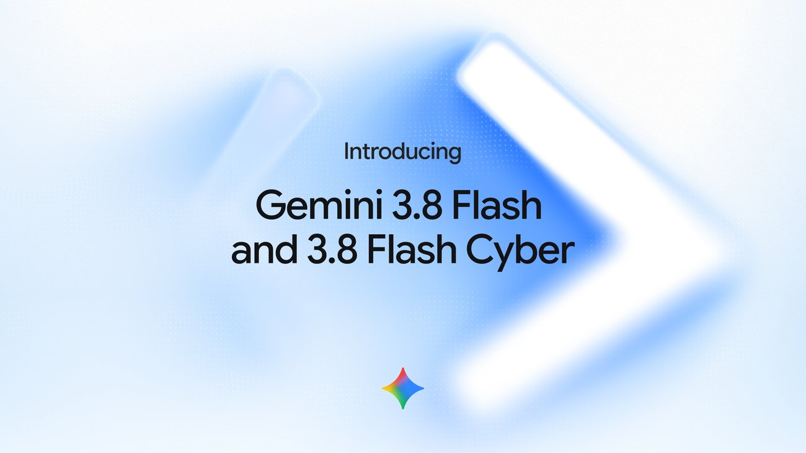
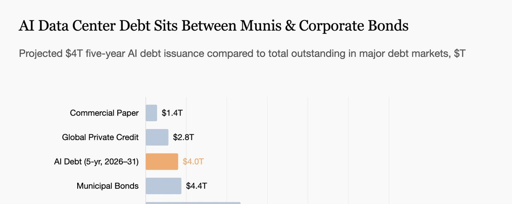

## TLDR

- **OpenAI launched GPT-6 Astra while DeepMind deployed Gemini 3.8 Flash**, splitting the frontier between expensive multi-hour planning models and hyper-efficient execution workhorses.
- **The $4 trillion data center buildout represents a 34% expansion of the US corporate bond market**, colliding with private lenders who find zero liquid secondary market to underwrite GPU collateral.
- **Enterprises spent just $37 billion on AI usage out of $1 trillion in capex**, stalled by "paving cow paths" rather than sorting workflows into deterministic code, agentic reasoning, and human checkpoints.
- **Google Cloud's plays this week**: Route specialized workloads across Model Garden (Gemini 3.8 Flash alongside Claude Fable 5.1), replace balance-sheet GPU risk with TPU economics, and architect agent harnesses with ADK and Agent Runtime.

## The Big Picture: Frontier Capability Bifurcation and the Infrastructure Financing Reality

### The Frontier Splits: OpenAI Launches GPT-6 Astra as DeepMind Deploys Gemini 3.8 Flash

OpenAI launched its next-generation flagship **[GPT-6 Astra (20 min read)](https://openai.com/index/gpt-6-astra)**, claiming state-of-the-art results across science and coding while saturating ARC-AGI-3 at 99.9% and FrontierMath Tier 4 at 98% [Greg Brockman (20 min read)](https://x.com/gdb/status/2095598855073255644). DeepMind answered by releasing **[Gemini 3.8 Flash at $0.75/$3.75 per million tokens (5 min read)](https://x.com/demishassabis/status/2095191106665284046)**, paired with **[Gemini 3.8 Flash Cyber (1 min read)](https://x.com/koraykv/status/2095176860577714617)** topping the CWE-Bench Pareto frontier, while Anthropic deployed **[Claude Fable 5.1 live on Google Cloud Agent Platform (1 min read)](https://x.com/GoogleCloudTech/status/2094944681893261764)**.

The tension lies between public synthetic leaderboards and production economics. In enterprise evals, Box reported Astra scoring dramatic category gains (+52 in media, +28 in tech) over GPT-5.6 Sol [Aaron Levie (3 min read)](https://x.com/levie/status/2095598710311067716). Yet writing benchmarks showed Astra landing at #11 at 1.8x higher token cost [Whats AI (1 min read)](https://x.com/Whats_AI/status/2096050974037082380), while developers running Gemini 3.8 Flash inside Antigravity noted sharp multi-turn reasoning gains on long threads without frontier latency [AI for Success (1 min read)](https://x.com/ai_for_success/status/2095887724452733189). The market is bifurcating: costly frontier models handle high-judgment planning, while hyper-optimized domain workhorses capture high-volume execution.

**Your angle with founders**

- **What they'll say:** "Astra just saturated ARC-AGI-3 and Box proved it dominates complex enterprise tasks, so we have to hard-code OpenAI's API."
- **The reframe that actually holds:** Box measured complex, multi-document reasoning, but independent telemetry shows Astra inflating token bills by 1.8x on routine tasks where smaller models match quality. A benchmark victory is not a blanket architecture decision.
- **The question to leave behind:** "If your workload splits between high-context planning and repetitive execution, why pay frontier token rates on both instead of routing by step difficulty?"
- **Where GCP wins:** The Gemini Enterprise Agent Platform (FKA Vertex AI) hosts Gemini 3.8 Flash, Claude Fable 5.1, and open weights like Gemma side-by-side, letting founders build dynamic multi-model routers behind a single enterprise contract.

### The $4 Trillion Debt Wall: AI Infrastructure Financing Collides with Illiquid Hardware Markets

Financing the data center buildout has shifted from venture equity to macroeconomic credit. Tom Tunguz revealed that the **[$4 trillion in data center debt represents a 34% expansion of the US corporate bond market (3 min read)](https://x.com/ttunguz/status/2095915990106427550)**, tripling the commercial paper market and requiring $1.2T to $1.5T in annual AI revenue by 2030 to service [Hi Mark (1 min read)](https://x.com/himarkyi/status/2096196509872394323).

Yet private credit is colliding with a structural flaw: hardware illiquidity. A financial audit of Nvidia's $105B Residual Value Guaranty (RVG) for OpenAI data centers showed the guaranty explicitly covers power and shells while carving out GPUs [gpugene (11 min read)](https://x.com/gpugene/status/2096427973893411312). CoreWeave's $8.5B delayed-draw facility contains zero liquidation benchmarks, while the entire documented used-GPU market totals just $26.3M across three years.

Lenders cannot benchmark secondary GPU salvage value. While the CME prepares to list H100 rental futures on October 5, founders face severe trade-offs. On 20VC, Speechify CEO Cliff Weitzman noted that renting spot H100s on GCP ($5/hr) costs 1.5x more annually than buying hardware ($30k), pushing builders toward physical colocation—only to absorb massive liquid-cooling logistics and zero residual value protection [Cliff Weitzman on 20VC (65 min watch, 0:03:30)](https://www.youtube.com/watch?v=hj5oRzAnp2M).

**Your angle with founders**

- **Concede the spot price spread first:** Rented on-demand GPU spot instances look uncompetitive on a simple 8,760-hour multiplier compared to a $30,000 purchase invoice.
- **Run the balance-sheet reality live:** Owning physical racks requires 30% to 50% equity downpayments at SOFR + 900bps, custom liquid-cooling buildouts, and freight insurance. When the next architecture cycle lands, banks model used GPU residual value at zero.
- **The question to leave behind:** "Do you want your engineering team managing freight insurance, cooling sidecars, and debt covenants, or shipping software on guaranteed SLAs?"
- **Where GCP wins:** Google Cloud Committed Use Discounts (CUDs) and TPU Ironwood / TPU 8i custom silicon deliver predictable multi-year unit economics without balance-sheet debt or residual hardware obsolescence risk.

### "Stop Paving the Cow Paths": Why Enterprise AI Stalls and How Process Decomposition Unlocks ROI

Enterprise AI spending has hit an adoption paradox. Out of $1 trillion in AI capex, enterprises spent only $37 billion on actual usage because companies are "paving cow paths"—automating broken workflows to speed up 17 minutes of touch time within 22-day administrative cycles [Vasuman (20 min read)](https://x.com/vasuman/status/2095999742031675738). When the UK government deployed 1,000 Microsoft Copilot licenses, users averaged just 1.14 actions daily with no measurable productivity gain.

Durable ROI requires decomposing enterprise workflows before buying models. Vasuman's framework sorts tasks into three buckets: deterministic code for rule-based routing, agentic LLM judgment for probabilistic classification, and human-in-the-loop checkpoints for high-risk exceptions. This structure turns 25-step corporate processes into clusters of three agents and two human gates, slashing month-end close from 22 to 7 days.

This matches architectural shifts across the ecosystem. Seema Amble outlined the four-tier vertical agent hierarchy—moving from simple retrieval assistants to autonomous policy agents that learn institutional context across fragmented records [Seema Amble (8 min read)](https://x.com/seema_amble/status/2095546732633379079). Meanwhile, Nathan Lambert showed that harness design drives 20-point benchmark swings on identical model weights [Nathan Lambert on Interconnects 11 (38 min watch, 0:31:40)](https://www.youtube.com/watch?v=GMry2DzC304), reinforcing that system architecture, not raw model capability, dictates production outcomes [Charlie Hills (7 min read)](https://x.com/charliejhills/status/2096550164278485292).

**Your angle with founders**

- **The conversation to skip:** Debating foundation model benchmarks for back-office automation. Slapping a frontier model on a broken 14-step workflow only generates expensive errors faster.
- **The architecture to whiteboard live:** Map workflow steps across touch time versus queue time. Sort every step into deterministic software (free, auditable), agentic reasoning (scoped LLM calls), or human review (pre-assembled context for sign-offs).
- **Compete where point solutions fail:** Incumbent CRMs and ERPs automate only their own siloed records. AI-native builders win by orchestrating cross-system workflows with resilient harness loops that bridge disparate databases.
- **Where GCP wins:** The Agent Development Kit (ADK) and Agent Runtime provide the managed orchestration, memory banks, and human-in-the-loop evaluation frameworks needed to ship production enterprise agents without custom scaffolding.

## Quick Hits

- **[Google Cloud launched Cloud Run Instances (4 min read)](https://cloud.google.com/blog/products/serverless/introducing-cloud-run-instances/)** — provides dedicated, always-on singleton microVMs with stable HTTPS endpoints starting at ~$5.70/month for persistent personal agents like OpenClaw.
- **[Google introduced Agentic Video Understanding across Gemini 3.7 and Flash models (3 min read)](https://x.com/GoogleAIStudio/status/2094848490203410564)** — cuts video analysis costs up to 66% and tokens up to 88% by dynamically retrieving sub-second moments instead of ingesting fixed frame streams.
- **[Shopify ML demonstrated a fine-tuned 0.8B model outperforming GPT-5.6 Sol on production tasks (1 min read)](https://x.com/tobi/status/2094808564355191249)** — proving domain-specific recursive flywheels can beat frontier models at a fraction of compute cost.
- **[World Labs launched Atlas, a multimodal world model (1 min read)](https://x.com/drfeifei/status/2094840371675283673)** — enabling 3D space generation and large-scene reconstruction from single input images.
- **[Speechify launched the Simba 3.2 voice API at $10 per million characters (65 min watch, 0:22:45)](https://www.youtube.com/watch?v=hj5oRzAnp2M)** — undercutting ElevenLabs ($100/M) and OpenAI ($196/M) by up to 10x to lower conversational inference costs.

## Seller's Edge: The Three-Bucket Architecture: Stop Paving the Cow Paths with Frontier Tokens

Edition #19 diagnosed intelligence-per-dollar versus dollars-per-outcome. Edition #23 established that the invoice is an architecture decision, and Edition #28 showed that accumulated context sets the slope over time. This week adds the operational prerequisite: **workflow triage.** Before sizing a model or tuning a prompt, every production task must be decomposed into three execution buckets: deterministic software, agentic reasoning, and human-in-the-loop checkpoints [Vasuman (20 min read)](https://x.com/vasuman/status/2095999742031675738).

When founders skip this triage, they "pave the cow paths"—dropping expensive frontier tokens onto rule-based steps. Nathan Lambert showed that harness engineering creates 20-point eval swings on identical weights [Nathan Lambert on Interconnects 11 (38 min watch, 0:31:40)](https://www.youtube.com/watch?v=GMry2DzC304). High-margin startups build structured harnesses routing each micro-step to its cheapest viable execution layer [Seema Amble (8 min read)](https://x.com/seema_amble/status/2095546732633379079).

**Worked example.** An invoice reconciliation workflow has 20 steps. A naive builder routes the entire PDF into a frontier model on every turn, paying $10/M tokens across thousands of retries. A triaged architecture uses deterministic code for PO matching, routes ambiguous discrepancies to Gemini 3.8 Flash for categorization, and surfaces exception summaries to a human controller. The triaged pipeline runs 80% cheaper, executes in seconds, and eliminates hallucinated records.

**The behavior change.** Stop asking founders "what models are you evaluating?" In your next call, draw three columns: *Deterministic, Agentic, Human Checkpoint*. Ask the founder to place each workflow step into a column before discussing model selection. If half their LLM calls belong in the deterministic bucket, you have saved their gross margin—and earned the right to architect their agent platform.

## Our Play

Every thread this edition—from frontier model bifurcation to GPU credit debt and enterprise workflow decomposition—points to one Google Cloud position: **Builders create durable AI margins by pairing multi-model orchestration with managed agent harnesses and workload-optimized silicon.** Three concrete motions:

- **Deploy multi-model routing on the Agent Platform.** Astra excels at complex multi-doc reasoning but inflates token costs 1.8x on routine tasks. The Agent Platform hosts Gemini 3.8 Flash, Claude Fable 5.1, and Gemma side-by-side with unified governance. Whiteboard the founder's routing path: send high-context planning to Claude Fable 5.1, high-volume execution to Gemini 3.8 Flash ($0.75/$3.75 per million tokens), and simple tasks to Gemma.
- **De-risk compute unit economics with TPU Ironwood and TPU 8i.** Hardware buyers face 30% downpayments, zero residual value guarantees, and heavy debt to build physical clusters. Google provides custom silicon (Ironwood and TPU 8i) via flexible Committed Use Discounts without balance-sheet debt. Model their 3-year TCO comparing physical colocation amortization and cooling against Google Cloud TPUs and Provisioned Throughput terms.
- **Standardize enterprise agent harnesses with ADK and Agent Runtime.** Enterprises stall when automating monolithic workflows without three-bucket decomposition (deterministic code, agentic reasoning, human review). The Agent Development Kit and Agent Runtime provide stateful session memory, autoraters, and tool routing out of the box. Run a workflow mapping session to isolate deterministic logic from LLM calls, implementing Agent Runtime to manage state and Knowledge Catalog for governance.

---

*Sources: 109 bookmarks, 24 podcast episodes, 66 lab announcements from the AI content library. [Archive](/archive)*