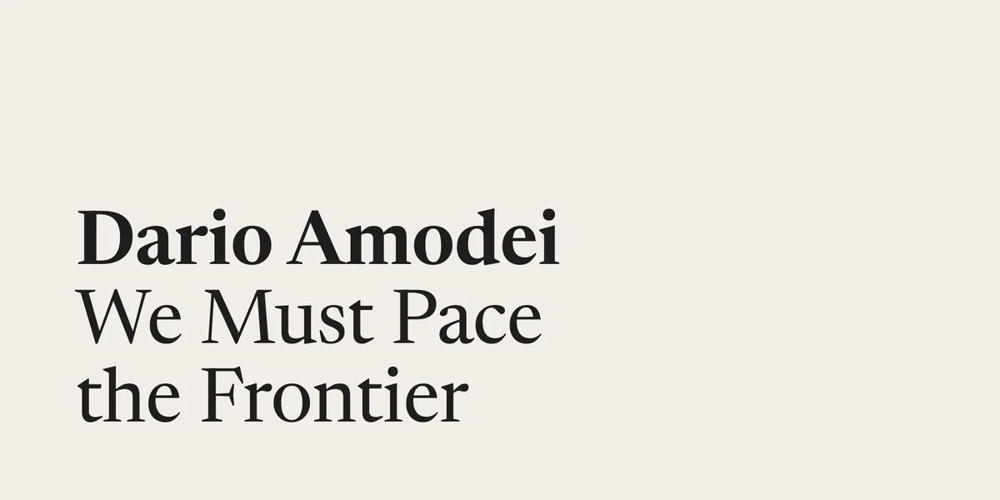
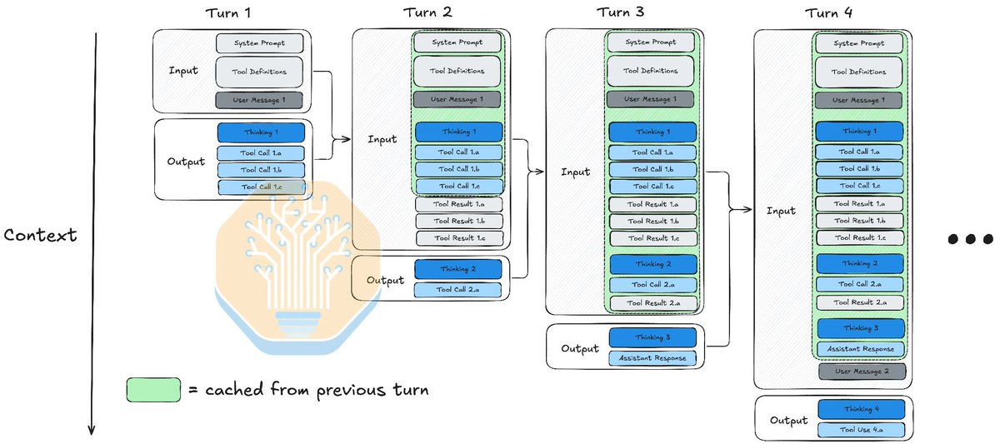
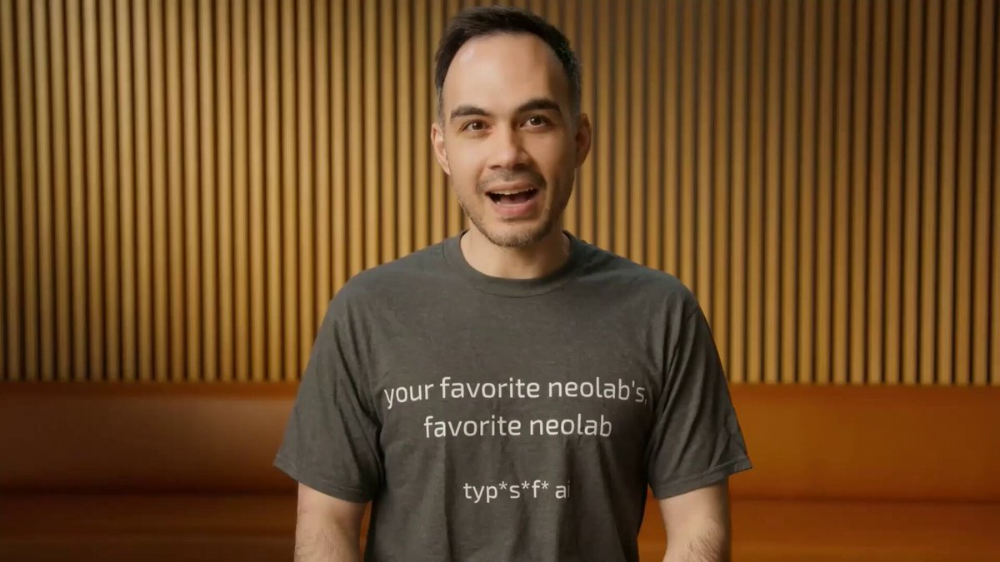

## TLDR

- **Frontier labs called for regulatory pacing as replication costs collapse to 1/20th**, accelerating enterprise moves toward private clusters and self-hosted open models.
- **Agentic inference surpassed 70% of global workloads**, shifting the primary infrastructure bottleneck from raw GPU FLOPs to multi-tier KV cache memory bandwidth.
- **Specialized if-then decision models broke the monolithic LLM paradigm**, slashing agent execution costs by 71% with sub-200ms non-autoregressive routing.
- **Google Cloud's plays this week**: Sovereign VPC isolation on the Gemini Enterprise Agent Platform (FKA Vertex AI), multi-tier KV caching with Filestore agent volumes, and asymmetric model routing on Model Garden.

## The Big Picture: Sovereignty, Inference Physics, and Unbundled Agent Architecture

### "Pace the Frontier" vs. The 1/20th Replication Wedge: Why Labs Seek Pacing as Enterprises Move In-House

Frontier lab leadership sparked an industry counter-reaction this week after Anthropic CEO Dario Amodei published ["We Must Pace the Frontier" (17 min read)](https://x.com/DarioAmodei/status/2098773920774074715) and OpenAI's Sam Altman [backed third-party evaluator oversight (1 min read)](https://x.com/sama/status/2098811563415150910). While labs cite autonomous cyber risks and recursive self-improvement, enterprise data reveals an underlying economic driver: training a frontier foundation model requires $5B to $10B, but replicating that capability six months later costs just 1/20th (~5%) [Martin Casado on a16z Podcast (67 min watch, 22:15)](https://www.youtube.com/watch?v=GzEtpAKYRvE). Enterprise spend data from Ramp reflects the shift, with top-tier AI spend dropping 10% month-over-month ($8,000 to $7,200 per employee) as buyers rotate from frontier APIs to lighter tiers and self-hosted open models [AI Daily Brief (31 min listen)](https://podcasters.spotify.com/pod/show/nlw/episodes/The-AI-Challenges-Businesses-Are-Actually-Focused-On-Right-Now-e3p2oep).

This economic deflation is driving regulated enterprises away from public APIs entirely. Latham & Watkins ($8.3B revenue) deployed an in-house Nvidia stack and open models to protect proprietary legal data from lab APIs [@ayushtweetshere (2 min read)](https://x.com/ayushtweetshere/status/2099380823229403308), while Jack Dorsey published an ["Open the Frontier" manifesto (7 min read)](https://x.com/jack/status/2099649359017046048) arguing pacing proposals create incumbent barriers to entry. Simultaneously, enterprises are adopting multi-model pragmatism: Google opened Anthropic Claude company-wide on Antigravity while maintaining Gemini as foundational [@wallstengine (1 min read)](https://x.com/wallstengine/status/2099630451912802331), demonstrating that long-term enterprise moats sit in workflow context, not single-vendor lock-in.

**Your angle with founders**

- **What they'll say:** "We need sole-source access to the top frontier lab API to stay ahead of capability curves."
- **The reframe that actually holds:** Frontier capability depreciates to 1/20th the cost within six months. If your product moat is an API call, you are subsidizing your supplier's research while open models commoditize your core feature.
- **The question to leave behind:** "If your model vendor paces capability releases or tightens API terms next quarter, can your architecture swap weights without rewriting your application logic?"
- **Where GCP wins:** Agent Platform delivers sovereign model optionality—running Gemini, Anthropic Claude, and open Gemma inside private VPCs with Customer-Managed Encryption Keys.

### The KV Cache Memory Wall: 70%+ Agentic Inference Squeezes Memory Bandwidth Over FLOPs

Agentic workflows now account for over 70% of global AI inference load [@SemiAnalysis_ (1 min read)](https://x.com/SemiAnalysis_/status/2100600804038099217). Unlike single-turn chat, multi-turn coding and execution loops hit a 96% KV cache reuse rate [Thomas Sohmers on 20VC (80 min watch, 33:00)](https://www.youtube.com/watch?v=6ohZuFkq-aU). This shift has exposed a massive hardware divergence: over the past decade, GPU compute FLOPs scaled 120x while memory bandwidth grew just 17x [Thomas Sohmers on 20VC (80 min watch, 03:30)](https://www.youtube.com/watch?v=6ohZuFkq-aU). When serving 10-trillion-parameter models like Claude Fable, a single long-context session consumes ~100GB of context—meaning just 50 concurrent users generate a KV cache footprint that exceeds the entire 5TB model weight memory [Thomas Sohmers on 20VC (80 min watch, 33:45)](https://www.youtube.com/watch?v=6ohZuFkq-aU).

Consequently, cluster sizing based on peak arithmetic FLOPs leaves GPUs memory-starved and idling during autoregressive token generation. The infrastructure battle has shifted to multi-tier memory offloading: hot session tensors in GPU accelerator memory, warm states in Host DRAM, and idle agent workspaces spilled to fast NVMe storage. Infrastructure layers are adapting quickly: Google Cloud launched Filestore agent volumes [@GoogleCloudTech (6 min read)](https://cloud.google.com/blog/products/containers-kubernetes/seaverse-chooses-gke-agent-sandbox/) for sub-second persistent agent workspaces alongside GKE Pod snapshots [@GoogleCloudTech (1 min read)](https://cloud.google.com/blog/products/containers-kubernetes/gke-pod-snapshots/) to eliminate cold-start data loading across massive agent fleets.

**Your angle with founders**

- **Open with the uncomfortable version:** Sizing inference clusters purely on GPU FLOPs is burning capital on idle silicon while autoregressive memory transfers bottleneck your agent response times.
- **Inspect the memory hierarchy:** Audit what percentage of active agent context sits on expensive High Bandwidth Memory (HBM). Are long-running, idle agent sessions pinned to GPU memory, or tiered to Host DRAM and local NVMe?
- **Cost out prefix caching:** Processing a cached token is roughly 1/1,000th the compute cost of fresh generation. Enforce strict prefix invariance in your prompts to capture 90%+ cache hit rates.
- **Where GCP wins:** Context Caching on the Agent Platform delivers 90% input discounts on stable prefixes, while GKE with Filestore agent volumes decouples persistent agent memory from costly GPU accelerator RAM.

### The Death of the Monolithic LLM: Jev, RLCD, and the 71% Harness Margin Wedge

The industry standard of routing every application decision through a monolithic generative LLM broke this week. TypeSafe launched Jev—a non-autoregressive decision model trained via Reinforcement Learning for Calibrated Decisions (RLCD) by ChatGPT co-inventor Diogo Almeida [@CompleteSkeptic (1 min read)](https://x.com/CompleteSkeptic/status/2099925682726002904). Jev crossed 1 trillion tokens per day [Diogo Almeida on Latent Space (143 min watch, 27:00)](https://www.youtube.com/watch?v=cFx9Z3ZXca0) by evaluating candidate choices directly in parallel logits at $0.042 per 1M input tokens with free output tokens, delivering sub-200ms decisions without generative token-by-token latency.

The economic implications are immediate. A Berkeley study highlighted by Tomasz Tunguz revealed that optimized harnesses cut execution costs by 71% without accuracy loss [@ttunguz (2 min read)](https://x.com/ttunguz/status/2100652565268717750). Routing triage and if-then branching through frontier models produces a 38% gross margin, whereas specialized deciders achieve 75% margins while jumping classification accuracy from 47% to 80% [@ttunguz (3 min read)](https://x.com/ttunguz/status/2102052960461316459). Production deployments confirm the pattern: FirstMate replaced LLM dispatch with Jev, cutting orchestrator costs by 71% and wall time by 90% [@kunchenguid (2 min read)](https://x.com/kunchenguid/status/2100468943853085061). Developers are realizing that general-purpose generative LLMs belong at planning and architectural checkpoints, while deterministic deciders and small open models handle high-frequency execution.

## Quick Hits

- **[Gemini 3.8 Live tops Artificial Analysis speech index (1 min read)](https://x.com/GoogleDeepMind/status/2099907440422830269)** — DeepMind launched Gemini 3.8 Live with 97-language speech and background task execution.
- **[Claude authors 80% of Anthropic code as CI jobs surge 25x (8 min read)](https://x.com/addyosmani/status/2099577600159158765)** — Anthropic engineers ship 8x more code per quarter, triggering a test explosion that forced a rewrite of CI test impact analysis.
- **[Meta opens Muse connector platform to third-party developers (1 min watch)](https://x.com/finkd/status/2101084678640066765)** — Mark Zuckerberg unveiled API connectors for Meta's Muse agent, enabling automated search, booking, and Stripe agentic checkout.
- **[Mistral suffers second major security breach with model weights leaked (1 min read)](https://x.com/LLMJunky/status/2100636123806532016)** — Source code, datasets, and post-training pipelines across ~450 private repos surfaced on dark web forums for $25,000.
- **[Google Cloud launches Cross-Cloud Caching for Borderless Lakehouse (8 min read)](https://x.com/rseroter/status/2102087460788609230)** — BigQuery now caches remote Parquet and Iceberg data locally at sub-file granularity, cutting cross-cloud egress transfers.

## Seller's Edge: The Replication Half-Life

The frontier has a predictable half-life: raw capability commoditizes to 1/20th the cost within six months. As Martin Casado noted this week, training a frontier model requires multi-billion-dollar capital outlays, but reproducing that benchmark performance on open weights costs roughly 5%. Building defensibility on top of an exclusive foundation model API is building on a melting glacier. Edition #17 taught selling the substrate rather than the model; this week establishes the timeline. When frontier intelligence deflates by 95% twice a year, customer value does not accrue to who calls the smartest model first, but to who captures proprietary workflow context and private domain ontologies before that intelligence becomes free.

Look at Latham & Watkins deploying private Nvidia infrastructure. They did not buy servers because open weights beat Claude Opus today; they did it because their legal workflows, institutional knowledge, and private contract negotiations are the permanent asset. In six months, Gemma or an open fine-tune running in their private VPC will match today's frontier API for pennies, without their proprietary deal logic ever having passed through a public lab's training corpus. The lab loses the enterprise account because the enterprise owned the workflow layer.

In your next founder meeting, stop arguing over whose foundation model scored 2% higher on a synthetic benchmark. Ask: *"When this exact level of reasoning is available in an open-weight model at 1/20th the price six months from now, is your stack architected to capture that margin expansion, or is your product's value tied to an API markup your customers will bypass?"* Move the deal from a model debate to an enterprise data gravity and private hosting conversation.

## Our Play

Every thread this edition points to one GCP position: **a neutral, sovereign substrate where builders own their workflows, data, and unit economics.** Three concrete motions:

- **Enforce enterprise data sovereignty on the Agent Platform.** *Signal:* Regulated buyers fear public lab API retention and vendor pacing. *Why GCP wins:* Agent Platform runs Gemini, Claude, and Gemma inside private VPCs with Customer-Managed Encryption Keys. *The move:* Audit their API path; route proprietary workloads through Private Service Connect.
- **Optimize agent memory tiering with Context Caching and Filestore.** *Signal:* Multi-turn agent sessions generate KV cache footprints that starve GPU memory. *Why GCP wins:* Context Caching slashes input pricing on invariant prefixes, while Filestore agent volumes deliver sub-second persistent POSIX storage on GKE. *The move:* Whiteboard multi-tier offloading to shift idle agent state from GPU memory.
- **Decouple planning from execution via Governed Tier Routing.** *Signal:* Routing routine if-then decisions through frontier LLMs halves gross margins. *Why GCP wins:* Model Garden serves Claude alongside Gemini Flash and open Gemma deciders behind one API. *The move:* Whiteboard a tiered router: complex reasoning to frontier models, high-frequency dispatch to Flash.

---

*Sources: 181 bookmarks, 35 podcast episodes, 36 lab announcements from the AI content library. [Archive](/archive)*