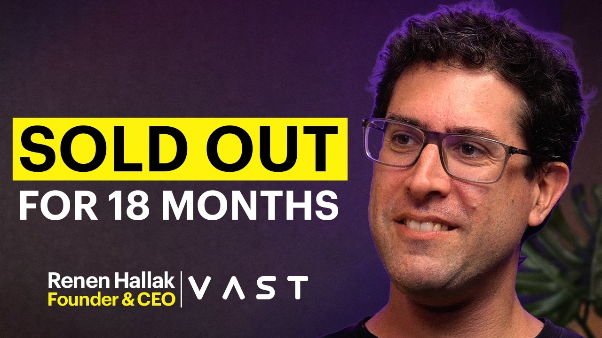

## TLDR

- **Open weights went from 20% of routed tokens to 80% in twelve weeks.** Jane Street is paying billions to run its own models rather than rent someone else's.
- **Harvey shows the trap: engagement can bankrupt a wrapper.** When lawyers finally used the product, the API bill outran the seat price.
- **Compute is sold out, so the edge is output per chip.** Idle GPUs and untuned software now cost more than new hardware saves.
- **Meta gave every Muse user an isolated cloud computer for their agent.** Agent security now means containment, not better prompts.
- **Our play:** tier models to fix margins, benchmark open models on TPUs, and contain agents with Model Armor and Cloud Run Sandboxes.

## The Big Picture: Sovereignty, Physical Infrastructure, and Cloud Agent Runtimes

### The 80/20 Token Flip: Jane Street’s $19B Compute Shift and the Closed-Model Margin Squeeze

Open weights crossed a commercial tipping point this week. Router telemetry reveals that production token flow flipped from 80/20 closed-vs-open to 80/20 open-vs-closed over the last 12 weeks [David Friedberg on All-In (95 min watch, 55:05)](https://www.youtube.com/watch?v=cvP_1jmnkmM). Quantitative trading powerhouse Jane Street accelerated the shift, locking in $19B in cloud capacity contracts—$6B with CoreWeave and $13B with Crusoe—to self-host open models on private clusters and protect trading alpha [Jason Calacanis on All-In (95 min watch, 62:30)](https://www.youtube.com/watch?v=cvP_1jmnkmM). 

Frontier labs responded with aggressive price cuts. Anthropic dropped Claude Opus 5.5 to $5/$20 per million tokens [@claudeai (1 min read)](https://x.com/claudeai/status/2102435522190717210), pulling enterprise coding tokens back from OpenAI Codex [@danshipper (2 min read)](https://x.com/danshipper/status/2102435870309769352), while OpenAI introduced GPT-6 Sol and Luna at 50% price cuts [@levie (1 min read)](https://x.com/levie/status/2102477253070430322). Yet for vertical AI applications, the cuts arrived too late. Harvey is the cautionary case: The Information reported its gross margin at minus 50% once lawyers started actually using the product, so each engaged seat cost more in API fees than it paid [Jason Lemkin on 20VC (81 min watch, 56:30)](https://www.youtube.com/watch?v=5FnXlCQxV5o). Lemkin's own read was closer to breakeven, thanks to Harvey post-training its own models: that is the fix. Enterprise builders are realizing that relying solely on closed APIs turns customer usage growth into balance-sheet burn.

**Your angle with founders**

- **The margin conversation to run live:** If you bill customers on fixed SaaS seats while paying variable token fees to a closed API, every power user degrades your gross margins. Sponsoring your supplier's research is not a business model.
- **Decompose the token stack on a whiteboard:** Sort their calls into the few that need frontier reasoning and the many that are extraction, classification, or routing. Move the 80% high-frequency workload to an open model running in your own VPC.
- **The question to leave behind:** "If your primary API provider hikes prices or throttles throughput during peak volatility, does your product stay profitable and online?"
- **Where GCP wins:** Gemini Enterprise Agent Platform (FKA Vertex AI) delivers sovereign optionality—route commoditized volume to open Gemma on TPUs at predictable cost while querying Claude or Gemini for frontier steps via Model Garden.

### The Efficiency Squeeze: Compute Is Sold Out, So the Win Is More Tokens per Chip

Nobody can buy their way out of this shortage. Neoclouds are sold out 18 months forward, and Anthropic reportedly paid spot premiums of $50M per megawatt to rent capacity from xAI, against build costs of $15M–$20M/MW [Prakash on The Cognitive Revolution (107 min watch, 46:15)](https://www.youtube.com/watch?v=WPHfPiz6kkk). Blackstone's Jon Gray puts all-in capex at $55B per gigawatt [@qasar (1 min read)](https://x.com/qasar/status/2102048454092652822). At those prices, the cheapest compute is the idle time inside clusters people already pay for.

That idle time is real. VAST Data CEO Renen Hallak says one AI cloud customer grew its storage commitment from 500PB to 2.5EB because GPUs sat starved for data once clusters passed 100 nodes [Renen Hallak on The MAD Podcast (71 min watch, 00:00)](https://www.youtube.com/watch?v=awoR908Yu5Y). Software is the other lever: vLLM maintainers showed a single Pallas megakernel on Google TPUv7 serving Kimi K3 at 700 tokens/second, 56% faster than Nvidia's GB200 NVL72 on decode [@SemiAnalysis_ (1 min read)](https://x.com/SemiAnalysis_/status/2102833399475879977). Same silicon, more output.

### The Dedicated Cloud Agent Runtime: Meta Muse’s Secure VM Blueprint and Shift-Left Harnesses

Production agent architectures are moving execution off developer laptops into dedicated cloud computers. Meta launched its Muse personal assistant (surpassing 3M downloads in 10 days), publishing its Secure VM architecture [@dps (3 min read)](https://x.com/dps/status/2103161493722419334). Every user receives an isolated Ubuntu cloud computer where the agent executes in an unprivileged runtime cell, while an out-of-band Sentinel supervises sensitive tools and credential vaults to block prompt injections.

This runtime isolation aligns with an industry shift toward "shift-left" harness engineering. Google Cloud software engineer Ryan Lopopolo explained that durable agent autonomy requires embedding deterministic guardrails directly into the environment—via linters, unit tests, and AGENTS.md files—rather than repeatedly tweaking prompts [@GoogleCloudTech (10 min read)](https://cloud.google.com/blog/topics/developers-practitioners/agent-factory-recap-agent-harnesses-shifting-left-and-autonomous-coding/). High-velocity engineering teams are proving the pattern: Artemis CTO Dan Shiebler noted their engineers merged 30,000 pull requests in eight months by structuring agents around automated verification loops [@ttunguz (2 min read)](https://x.com/ttunguz/status/2103145763098566858). Following Hugging Face’s disclosure of an autonomous agent cyberattack, sandboxed execution and deterministic environments have become core requirements [@ClementDelangue (3 min read)](https://x.com/ClementDelangue/status/2103144463279276146).

**Your angle with founders**

- **Open with the uncomfortable security reality:** Running autonomous agents with terminal access on local developer laptops or shared containers is an inevitable compliance failure. Once an agent accesses third-party web tools or external content, prompt injection cannot be stopped by model instructions alone.
- **Inspect three architectural controls:** Ensure each agent executes inside an isolated runtime boundary, isolate production credentials out-of-band so model context never sees them, and pipe failed tool calls into deterministic verification harnesses.
- **Cost out deterministic verifiers:** Checks in linters, tests, and skill files are cheaper than multi-turn reasoning retries.
- **Where GCP wins:** Model Armor screens prompts and responses for injection, jailbreaks, and data leakage; Agent Runtime (FKA Agent Engine) holds state; Cloud Run Sandboxes (gVisor) contain execution. Say the limit out loud: screening lowers injection odds but cannot guarantee it, so containment is the second layer.

## Quick Hits

- **[Anthropic Claude discovers potential novel gene-editing enzyme system (4 min read)](https://x.com/DarioAmodei/status/2102831170299834652)** — Dario Amodei announced Claude identified an uncharacterized reverse-transcriptase molecular machine verified in laboratory experiments.
- **[Google Cloud introduces AlloyDB PostgreSQL for agents hitting 3M QPS (1 min read)](https://x.com/andigutmans/status/2103192870018511297)** — Andi Gutmans unveiled managed PostgreSQL capabilities for agentic architectures delivering 8M IOPS with complete operational workload isolation.
- **[Google launches Project Suncatcher to test TPUs in orbit (4 min read)](https://x.com/Google/status/2103239433809961276)** — A prototype satellite hitching a ride on SpaceX’s Transporter-18 mission will evaluate TPU radiation hardening and thermal dissipation in space.
- **[Google launches Gemini 3.8 Flash and Flash-Lite TTS with 2,000+ voices (1 min read)](https://x.com/OfficialLoganK/status/2102785495726219305)** — DeepMind introduced expressive text-to-speech models topping Hume AI benchmarks with line-by-line conversational steering across 100 languages.
- **[TypeSafe scales JEV judgment model as enterprises cut evaluation overhead (26 min listen)](https://podcasters.spotify.com/pod/show/nlw/episodes/How-People-Are-Actually-Using-Jev-e3pd0rj)** — Nathaniel Whittemore highlighted how developers use sub-cent classification models to eliminate expensive LLM calls from agent loops.

## Seller's Edge: The Pass-Through Margin Inversion

Product adoption is an existential risk for AI startups that lack an infrastructure tiering strategy. Edition #19 diagnosed intelligence-per-dollar versus dollars-per-outcome, and Edition #31 proved the six-month replication half-life; this week reveals what happens when user engagement spikes on an untiered architecture. When an application passes every user interaction straight through to a closed frontier API, higher usage does not create economies of scale—it destroys gross margin.

Look at vertical AI wrappers navigating deeply negative gross margins. In a classic SaaS model, revenue scales linearly with seats while server hosting costs remain a small fraction of the bill. In an agentic application, power users run continuous loops, processing millions of tokens across long context windows. If the underlying unit cost is pegged to a frontier API's per-token rate, the founder’s cost of goods sold (COGS) accelerates faster than subscription revenue. Contrast that with quantitative trading firms securing tens of billions in private cloud capacity: they recognized that high-volume inference must run on owned or committed compute, where each additional token gets cheaper as volume grows instead of costing the same list price.

In your next founder meeting, do not ask which frontier model has the best benchmark score. Ask: *"When your user engagement jumps 10x next quarter, does your gross margin expand or does your API bill flip you into negative unit economics?"* Whiteboard an asymmetric architecture: route high-volume context parsing and tool selection to open-weight models on private accelerators, and reserve frontier APIs for complex multi-step reasoning.

## Our Play

Every thread this edition points to one GCP position: **a sovereign, high-throughput platform where builders eliminate API margin traps and isolate autonomous agent execution.** Three concrete motions:

- **Fix token margins via Asymmetric Model Garden Tiering.** Audit prompt volume to identify routine routing and classification steps. Route high-frequency workloads to open Gemma on Cloud Run or Gemini 3.8 Flash via Model Garden, cutting API burn while reserving Claude or Gemini Pro for top-tier reasoning.
- **Get more tokens per chip on TPUs.** Every cloud is short on capacity, Google included, so sell output per chip, not more chips. Run the founder's highest-volume open-model workload on Ironwood with vLLM (SemiAnalysis puts Ironwood roughly 30% below GB200 cost) and compare against their GPU bill. Budget porting time; leaving CUDA isn't free.
- **Screen and contain agents with Model Armor and Cloud Run Sandboxes.** Run an architecture review for autonomous agents. Put Model Armor in front of every model call that touches web content or tool output, deploy on Agent Runtime, and run untrusted tool calls inside Cloud Run Sandboxes with credentials held outside the sandbox.

---

*Sources: 95 bookmarks, 39 podcast episodes, 41 lab announcements from the AI content library. [Archive](/archive)*