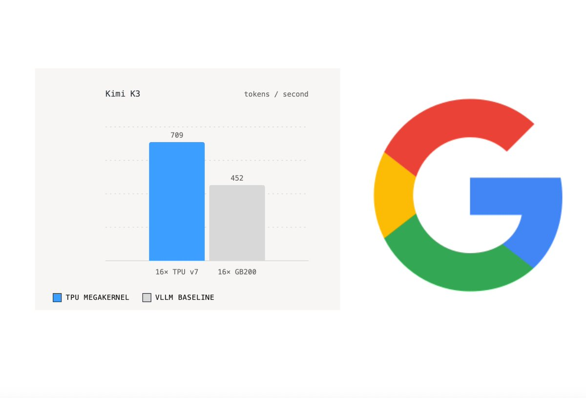
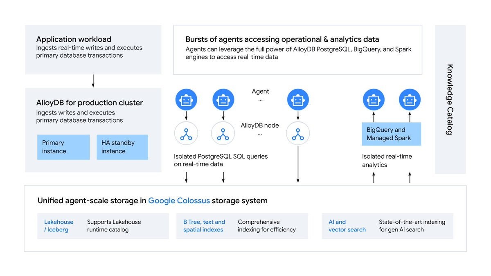

## TLDR

- **Frontier labs slashed token pricing on the exact same day**, but vertical AI startups still face deeply negative gross margins unless they decouple planning from execution.
- **An open-source Pallas megakernel on TPUv7 outperformed Nvidia's flagship GB200**, shattering the assumption that Nvidia silicon holds an unassailable software moat for open weights.
- **Parallel Web Systems natively integrated into Google Cloud agent APIs**, shipping sub-second Turbo search as agent query volume surges orders of magnitude beyond human web traffic.
- **GCP plays this week**: Asymmetric model routing on the Gemini Enterprise Agent Platform (FKA Vertex AI), open-weight TPU Ironwood serving on Google Kubernetes Engine (GKE), and dual-engine agent grounding via Parallel and Google Search.

## The Big Picture: Token Economics, Silicon Disruption, and the Agentic Web

### The Frontier Price War Meets the -50% Margin Trap: Opus 5.5, GPT-6, and Asymmetric Routing

Frontier labs triggered an explicit price war this week when Anthropic launched [Claude Opus 5.5 (1 min read)](https://x.com/claudeai/status/2102435511222890900)—cutting run costs 40% at $5 input and $20 output per million tokens [@danshipper (2 min read)](https://x.com/danshipper/status/2102435870309769352)—on the exact day OpenAI introduced [GPT-6 Sol and Luna (1 min read)](https://openai.com/index/introducing-gpt-6-sol-and-luna) with 50% price cuts. Aaron Levie noted this price collapse accelerates Jevons paradox across enterprise agent workflows [@levie (1 min read)](https://x.com/levie/status/2102477253070430322). 

Yet, public price cuts cannot rescue flawed application unit economics. On 20VC, Jason Lemkin revealed that vertical AI leader Harvey faces negative 50% gross margins as user engagement surges, because repetitive legal workflows repeatedly query premium frontier APIs [20VC (81 min watch, 56:30)](https://www.youtube.com/watch?v=5FnXlCQxV5o)—validating industry satire that usage growth turns un-routed AI wrappers into loss-making businesses [@Allinallnotbad (1 min read)](https://x.com/Allinallnotbad/status/2102247748724469906). On Stripe's Cheeky Pint, Canva COO Cliff Obrecht explained that serving hundreds of millions of users required Canva to manage its own inference and in-source models, slashing AI serving costs by 90% [Cheeky Pint (41 min watch)](https://www.youtube.com/watch?v=4GmHpHyoKmo). Relying on a single frontier model API for both high-level planning and multi-hop execution is a margin trap.

**Your angle with founders**

- **The conversation to skip:** Don't debate whether a price drop from Anthropic or OpenAI rescues their unit economics. When agents execute 20 to 60 sequential tool hops per task, API consumption outpaces token discounts every time.
- **Decompose the bill live:** Audit their agent execution loop. What fraction of tokens goes to high-level reasoning versus routine file parsing, classification, and test evaluation? Routing the high-frequency execution loops to a fast workhorse model stops the margin bleed immediately.
- **The question to leave behind:** "If customer usage triples next month, will your gross margins expand, or will your API bill invert your unit economics?"
- **Where GCP wins:** The Agent Platform lets founders route complex planning to Claude Opus 5.5 while offloading high-frequency execution to Gemini 3.8 Flash ($0.75/$3.75) and open Gemma—protecting 70%+ software margins behind one managed endpoint.

### TPU Inference Breakthrough: Open-Source Pallas Megakernel Beats Nvidia GB200 by 56% on Kimi K3

The consensus that Nvidia GPUs hold an untouchable software moat for open-weight inference broke this week. vLLM maintainers open-sourced a single Pallas inference megakernel for Google Tensor Processing Unit (TPU) v7 that runs Kimi K3 at 709 tokens per second per user—beating Nvidia's flagship GB200 NVL72 by 56% [@SemiAnalysis_ (1 min read)](https://x.com/SemiAnalysis_/status/2102833399475879977), [@yifandotqiao (1 min read)](https://x.com/yifandotqiao/status/2102830917513593124). For the first time in open source, TPU decode throughput decisively eclipsed Nvidia Blackwell on top-tier open weights.

Simultaneously, Google unveiled Project Suncatcher, partnering with Planet to launch prototype TPUs into low Earth orbit aboard SpaceX Transporter-18 [@sundarpichai (1 min watch)](https://x.com/sundarpichai/status/2103209164072010051), [@Google (4 min read)](https://x.com/Google/status/2103239433809961276). Proton-beam stress testing at UC Davis proved Google's Trillium TPUs can withstand radiation doses exceeding a five-year space mission. While orbital data centers remain a long-term research moonshot, the terrestrial reality is clear: open-source megakernels have eliminated the historical software friction of TPU inference serving.

**Your angle with founders**

- **Concede the ecosystem baseline:** Nvidia GPUs still maintain the broadest library of legacy CUDA kernels and off-the-shelf framework bindings.
- **Insist on the decode benchmark:** On modern frontier open weights like Kimi K3, token generation is memory-bandwidth bound. Sizing clusters purely around GPU rental availability leaves money on the table when TPUs deliver substantially higher token decode speeds per user.
- **Compete where hardware lead times bite:** GPU allocation waitlists and neocloud debt premiums are forcing startups into multi-year commitments. Custom Google silicon offers predictable economics and immediate cluster provisioning.
- **Where GCP wins:** GKE running TPU Ironwood provides founders with superior price-performance on open-weight inference clusters without waiting in multi-quarter GPU allocation lines.

### The Agentic Web Shift: Parallel Integrates with Google Cloud as Agent Search Surges 1,000x

Former Twitter CEO Parag Agrawal announced that Parallel Web Systems has natively integrated into Google Cloud enterprise agent APIs as a search and grounding provider alongside Google Search [Training Data (56 min watch, 24:45)](https://www.youtube.com/watch?v=fUcnE6pjq5w). Parallel's 200ms Turbo search API is engineered specifically for autonomous agent loops, cutting LLM token consumption by over 50% by extracting authoritative context while stripping out human SEO bloat and slow JavaScript payloads [Training Data (56 min watch, 15:00)](https://www.youtube.com/watch?v=fUcnE6pjq5w). 

Agrawal noted that autonomous background agents will generate 100x to 1,000x the search query volume of historical human browsing, breaking traditional ad-funded click models and legacy data infrastructure. To support this operational load, Google Cloud launched PostgreSQL for agents in AlloyDB—delivering 3 million Queries Per Second (QPS) and 8 million Input/Output Operations Per Second (IOPS) with full workload isolation [@andigutmans (1 min read)](https://x.com/andigutmans/status/2103192870018511297), [@GoogleCloudTech (5 min read)](https://cloud.google.com/blog/products/databases/announcing-postgresql-for-agents-in-alloydb/). Combined with non-blocking tool calls and double-check verification patterns in the Agent Development Kit (ADK) [@GoogleCloudTech (5 min read)](https://x.com/GoogleCloudTech/status/2103247689768947994), Google Cloud is establishing the high-throughput, low-latency data and grounding foundation required as web interactions transition from human browsing to background agent execution.

## Quick Hits

- **[Anthropic’s Claude discovers novel CRISPR-like enzyme system (4 min read)](https://x.com/DarioAmodei/status/2102831170299834652)** — Claude analyzed genomic datasets to design lab-validated experiments discovering a novel reverse-transcriptase gene editing mechanism.
- **[Gemini 3.8 Live with Live Avatar reaches General Availability (1 min read)](https://x.com/GoogleCloudTech/status/2103157502988746877)** — Synchronized video avatars with 97-language real-time dialogue and background tool calling launched in Gemini Enterprise.
- **[Meta reveals Muse agent executes inside dedicated Ubuntu cloud VMs (3 min read)](https://x.com/dps/status/2103161493722419334)** — Meta detailed Muse's architecture, isolating user runtime cells while gating credentials and high-risk actions behind a Sentinel.
- **[Hugging Face CEO shares lessons from disclosing first agent cyberattack (3 min read)](https://x.com/ClementDelangue/status/2103144463279276146)** — Closed lab APIs blocked remediation prompts during an active breach, forcing defenders to rely on open-source weights.
- **[Blackstone reports portfolio spend with Anthropic surged 21x in one year (1 min read)](https://x.com/qasar/status/2102048454092652822)** — Blackstone-linked companies grew annualized Anthropic spend from $25M to $525M as hyperscaler capex expanded rapidly.

## Seller's Edge: The Execution Asymmetry Trap

Founders intuitively assume that as frontier labs slash token prices, their application gross margins will naturally recover. That is the execution asymmetry trap. In an agentic architecture, planning happens once, but execution loops—reading files, running shell commands, executing tests, querying live indices, and verifying outputs—trigger dozens of sequential hops per task [@GoogleCloudTech (10 min read)](https://x.com/GoogleCloudTech/status/2102800514379350234). Because Jevons paradox multiplies usage as agents become more capable [@levie (1 min read)](https://x.com/levie/status/2102477253070430322), total token volume scales far faster than lab price cuts. If an application routes every high-frequency execution hop through a monolithic frontier API, cost-of-goods-sold (COGS) explodes, turning gross margins deeply negative for vertical leaders.

Look at Canva’s transition on Cheeky Pint [Cheeky Pint (41 min watch)](https://www.youtube.com/watch?v=4GmHpHyoKmo). Serving hundreds of millions of users on fixed-fee plans was economically fatal on third-party frontier APIs. Canva dramatically slashed serving costs not by waiting for provider price cuts, but by decoupling their stack: owning the execution loops, managing their own inference, and routing tasks to dedicated, right-sized models. Edition #19 taught distinguishing intelligence-per-dollar from dollars-per-outcome; this week teaches the architectural consequence: **an agent's margin is dictated by its execution tier, not its orchestrator.**

In your next founder meeting, whiteboard their execution loop before discussing foundation models. Ask: *"What percentage of your token consumption is high-level reasoning versus repetitive tool execution and verification? If customer usage triples tomorrow, does your multi-hop loop preserve gross margin, or does it scale your API bill directly into negative unit economics?"* Then show them how asymmetric tier routing isolates frontier calls to architectural planning while offloading execution loops to right-sized fast models.

## Our Play

Every thread this edition—token price wars, negative wrapper gross margins, and high-throughput agent search—points to one GCP position: **a multi-model execution substrate where founders control their unit economics.** Three concrete motions:

- **Recover margins with Asymmetric Tier Routing.** *Signal:* Founders face inverted unit economics when routing repetitive multi-hop agent loops through frontier APIs. *Why GCP wins:* Model Garden serves Claude Opus 5.5, sub-$1 Gemini 3.8 Flash, and Gemma behind one unified API. *The move:* Whiteboard a tiered architecture reserving Claude Opus for planning while offloading high-frequency execution to Gemini Flash.
- **Scale open weights on TPU Ironwood with GKE.** *Signal:* Startups face GPU allocation waitlists when serving large open models like Kimi K3. *Why GCP wins:* TPU Ironwood on GKE with open-source Pallas megakernels delivers substantially higher decode throughput per user than Nvidia GB200 NVL72. *The move:* Propose a side-by-side decode throughput benchmark on TPU Ironwood.
- **Eliminate grounding bottlenecks with Parallel and AlloyDB.** *Signal:* Autonomous agent loops choke on slow, bloated web search and database locks. *Why GCP wins:* Agent Platform integrates Parallel Turbo search alongside Google Search, backed by isolated PostgreSQL in AlloyDB. *The move:* Configure dual search grounding in Agent Platform and connect high-throughput state to AlloyDB.

---

*Sources: 95 bookmarks, 16 podcast episodes, 41 lab announcements from the AI content library. [Archive](/archive)*