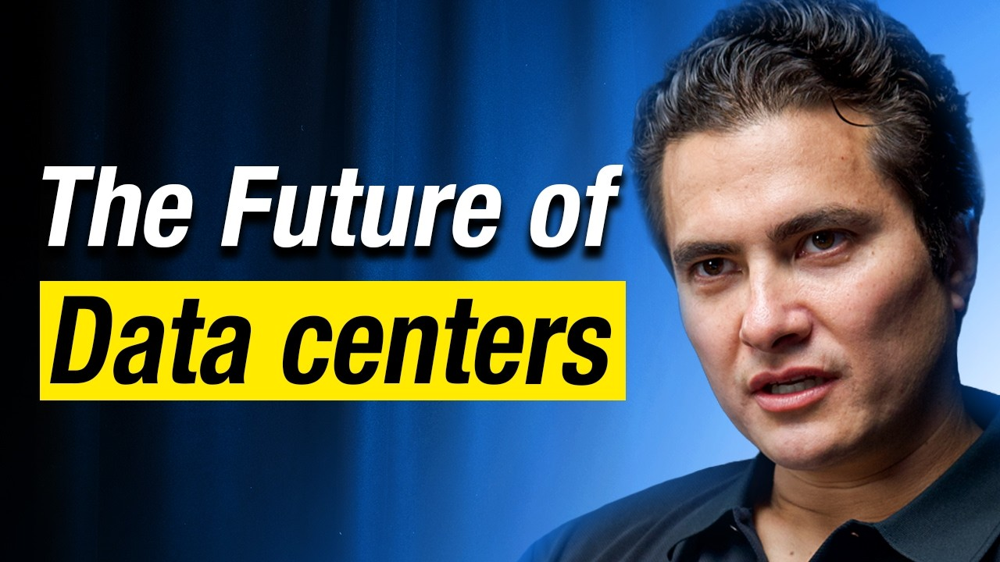
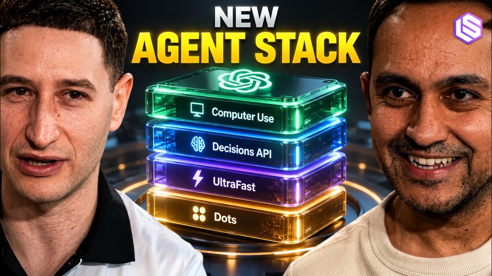

## TLDR

- **Data center attrition and multi-year backlogs are driving the compute trap,** pushing startups into rigid take-or-pay contracts while SemiAnalysis rates Google GPU clusters Gold tier.
- **OpenAI DevDay launched persistent VMs and Space to capture enterprise state,** accelerating the platform battle over whether agent memory lives in closed vendor vaults or customer-governed cloud storage.
- **Higgsfield proved the open-weight margin blueprint at unicorn scale,** routing routine inference to self-hosted models to achieve software-grade gross margins that closed frontier APIs cannot match.
- **Our play:** size compute commitments in stages, keep agent state customer-owned with Agent Runtime, and route routine inference to open models the founder owns.

## The Big Picture: Compute Scarcity, Token Economics, and Stateful Agent Infrastructure

### The 2028 Compute Trap: Crusoe’s 1GW Buildout, 50% Data Center Attrition, and the Hyperscaler TCO Defense

Crusoe Energy closed a $3.9B Series F at a $30.9B valuation to scale its 1GW campus in Abilene, Texas [Chase Lockmiller on 20VC (66 min watch, 14:45)](https://www.youtube.com/watch?v=Ko7nU1Img40). But behind the mega-round lies a severe physical reality: Lockmiller estimates roughly half of planned AI data center capacity won't get built because of permitting and utility interconnection queues, while power distribution equipment carries 100-week vendor backlogs. That execution risk flows downstream: early-stage startups are being asked to commit to take-or-pay compute in 2028 [Chase Lockmiller on 20VC (66 min watch, 34:20)](https://www.youtube.com/watch?v=Ko7nU1Img40).

That puts the hyperscaler price premium under scrutiny. Hyperscalers charge "at least two to three times, sometimes more" than a typical neocloud for GPUs, says Steve Ho, because compliance, security, and analytics come in the same bill [Steve Ho on The Cognitive Revolution (89 min watch, 38:15)](https://www.youtube.com/watch?v=4Sc8dSezPa4). The quality gap shows up in audits too: SemiAnalysis's ClusterMAX 3.0 moved Google Cloud GPU clusters to Gold, behind Platinum-rated CoreWeave and Nebius [@SemiAnalysis_ (1 min read)](https://x.com/SemiAnalysis_/status/2106038582234185737), and its team says most neoclouds are "terrible at security" [Dylan on Latent Space (58 min watch)](https://www.youtube.com/watch?v=MWX36ZYnsm0). And a cheap rate only counts if the data center gets built — Lockmiller's own estimate is that half won't.

**Your angle with founders**

- **Concede the headline price gap:** for throwaway batch compute with no compliance needs, the neocloud discount is real — take it.
- **Price the hidden bill:** ask what it costs in engineering salary to hand-roll SOC2 compliance, access controls, and node-failure recovery on bare metal.
- **Challenge the 2028 commitment:** "You're being asked to sign for 2028 compute today. What does the contract say if the provider's data center slips — and what's your exit if you end up needing half as much?"
- **Where GCP wins:** commitments that grow in steps. Book GPU or TPU blocks of up to 90 days (calendar mode, no long-term contract), then move to 1- or 3-year committed-use discounts once usage is steady. Every hyperscaler is supply-constrained, Google included — sell the terms, never the availability.

### The Battle for Agent State: OpenAI DevDay (Dots, Space, Decisions API) vs. Enterprise Context Gravity

OpenAI expanded from a stateless API provider into a stateful enterprise platform at DevDay 2026 [OpenAI DevDay Recap (1 min read)](https://openai.com/index/devday-2026-recap). The lab introduced "Dots"—proactive, always-on background agents provisioned with dedicated cloud Linux virtual machines to execute code and browser tasks [Ari Weinstein & Nikunj Handa on Latent Space (41 min watch, 04:40)](https://www.youtube.com/watch?v=z9OkBD2-MDU). Alongside Dots, OpenAI debuted "Space," an agent-native collaboration suite featuring native documents, spreadsheets, and slides directly inside ChatGPT to eliminate the latency of browser-based agent automation in external tools [@danshipper (1 min read)](https://x.com/danshipper/status/2104982021626007885), plus the Decisions API for sub-cent routing [@kunchenguid (2 min read)](https://x.com/kunchenguid/status/2104998134279762141).

This launch accelerates a fundamental architectural battle over where enterprise memory and context live [@JayaGup10 (8 min read)](https://x.com/JayaGup10/status/2043505841127760066). Frontier labs want to host the execution runtime, persistent episodic memory, and organizational documents behind proprietary APIs, effectively capturing enterprise state [@yashhsm (10 min read)](https://x.com/yashhsm/status/2105380670688346335). But for enterprise buyers, locking institutional knowledge and agent memory inside a single model vendor's vault recreates legacy SaaS lock-in with higher stakes. Durable moats are forming in the customer-governed data layers that manage agent state across models.

**Your angle with founders**

- **Concede the convenience:** Dots is turnkey — OpenAI hosts the VM, the memory, and the model. Google's equivalent is a platform the founder builds on.
- **Say the limit out loud:** Memory Bank is a Google-managed store with no one-click export, and it uses Gemini to extract memories. The pitch isn't zero lock-in.
- **The question to leave behind:** "If you switched model vendors next quarter, would your agents keep what they've learned about your customers?"
- **Where GCP wins:** memory decoupled from the model. Agent Runtime (FKA Agent Engine) runs long-lived agents with managed Sessions and Memory Bank, stored in the region the founder picks and encryptable with their own keys (regional endpoints only), while the agent runs on Gemini, Claude, or an open model.

### The 80% Margin Blueprint: Higgsfield’s $1B Run-Rate, Anthropic’s $518B Deficit, and the Open-Weight Routing Engine

Generative video platform Higgsfield scaled to a $1B revenue run-rate in 18 months by rewriting generative AI unit economics. CEO Alex Mashrabov puts margins above 80% on the open-weight models Higgsfield post-trains and runs itself, versus 20% to 30% when it passes a request through to a closed frontier API [Alex Mashrabov on 20VC (76 min watch, 34:10)](https://www.youtube.com/watch?v=jszn8rFtxm4). The lever is who picks the model: when customers build automated ad workflows, they leave the choice to Higgsfield, and it now picks the model in more than 40% of requests — work it can send to its own models. He calls this "tokenomics." Routing, not the model, is the margin lever.

This margin blueprint lands as a leaked draft S-1 reveals the financial reality facing frontier labs: Anthropic logged an $8B operating loss on $4.66B revenue in 2025 and committed to a staggering $518B in future compute obligations [Harry Stebbings on 20VC (81 min watch, 04:15)](https://www.youtube.com/watch?v=UNH5YtuK5UE). Meanwhile, the Ramp AI Index showed business AI spend fell 5.2% as frontier price cuts and cheaper lite models push costs down [@arakharazian (1 min read)](https://x.com/arakharazian/status/2105740752886309163). As high-volume builders shift routine tasks to open models like DeepSeek and GLM on OpenRouter [@nicbstme (1 min read)](https://x.com/nicbstme/status/2105464782811697542), application winners are escaping the single-lab margin squeeze [@dharosaurus (1 min read)](https://x.com/dharosaurus/status/2105453525849518421).

## Quick Hits

- **[Google DeepMind introduces Gemini 4 Argon for coding and cyber defense (1 min read)](https://x.com/GoogleDeepMind/status/2105388084154056939)** — Sundar Pichai previewed benchmarks for Google's next flagship frontier model, rolling out via the Fairwind Program.
- **[Perplexity open-sources pplx-decider-27b alongside Decisions API at $0.04/M input (1 min read)](https://x.com/AravSrinivas/status/2105774153903268288)** — Aravind Srinivas launched a multimodal decision model with free output tokens to aggressively undercut routing costs.
- **[AMD acquires Fei-Fei Li's World Labs for $8.2B to scale spatial intelligence (2 min read)](https://x.com/aakashgupta/status/2104824751588012455)** — Lisa Su brought the spatial AI pioneer into AMD as Chief Scientist to consolidate physical world modeling compute.
- **[Google DeepMind unveils SynthID Bio to watermark AI-designed proteins (1 min read)](https://x.com/GoogleDeepMind/status/2105624656170643854)** — Researchers demonstrated watermarking embedded directly into synthetic protein sequences without compromising biological binding function.
- **[Anthropic launches automated eval generation and hillclimbing in Claude Code (1 min read)](https://x.com/ClaudeDevs/status/2104676099083190435)** — New `/claude-api build-eval` and `hillclimb` commands enable agents to generate validation test suites and systematically optimize codebases.

## Seller's Edge: The State Gravity Moat (Why Intelligence Commoditizes but State Compounds)

In enterprise AI, raw model intelligence is deflating while organizational state compounds. Edition #17 taught selling the substrate beneath commoditizing models, and Edition #32 diagnosed the pass-through margin trap; this week reveals where durable platform lock-in actually forms. Reasoning capabilities are matched across frontier labs and open weights within months. But state—episodic agent memory, execution history, permission graphs, and business context—accumulates over time and creates real switching costs.

Look at OpenAI DevDay launching Space and Dots to capture workspace files and persistent agent VMs behind proprietary endpoints [@danshipper (1 min read)](https://x.com/danshipper/status/2104982021626007885), contrasted with Anthropic's massive forward compute obligations. Model vendors are racing to capture state because they know stateless API token revenue suffers from relentless price erosion [@arakharazian (1 min read)](https://x.com/arakharazian/status/2105740752886309163) [@JayaGup10 (8 min read)](https://x.com/JayaGup10/status/2043505841127760066). When an enterprise lets its agent memory and operational context accumulate inside a closed proprietary API, switching models stops being a procurement choice and becomes an institutional crisis.

In your next meeting, stop debating benchmark point differences between models. Ask: *"Where does your agent's accumulated memory and organizational state live—inside a model provider's proprietary vault, or inside storage you govern, where any model can read it?"* Help the founder architect a decoupled stack: persistent state kept in their own cloud project, treating foundation models as interchangeable, stateless reasoning engines.

## Our Play

Every thread this edition points to one GCP position: **the platform where builders control their margins, their commitments, and their agent state.** Three motions:

- **Size commitments in steps, not 2028 bets.** *Signal:* startups are asked to sign for compute that isn't built yet. *Why GCP wins:* 90-day GPU/TPU blocks, then 1- or 3-year commitments; Provisioned Throughput (1-week to 1-year) for model serving. *The move:* map the founder's 12-month compute curve to those steps.
- **Keep agent state decoupled from the model.** *Signal:* OpenAI's Dots run agents on vendor-hosted VMs with vendor-held memory. *Why GCP wins:* Memory Bank keeps memory in the founder's region under their keys; the agent can run on Gemini, Claude, or an open model. *The move:* ask where agent memory lives today.
- **Route for margin on Agent Platform.** *Signal:* closed-API pass-through caps gross margin at 20–30% (Higgsfield). *Why GCP wins:* fine-tuned open models sit next to Gemini and Claude on one bill; the founder's own router picks per request. *The move:* find the highest-volume step where the founder picks the model, and benchmark it on a fine-tuned open model.

---

*Sources: 110 bookmarks, 49 podcast episodes, 41 lab announcements from the AI content library. [Archive](/archive)*