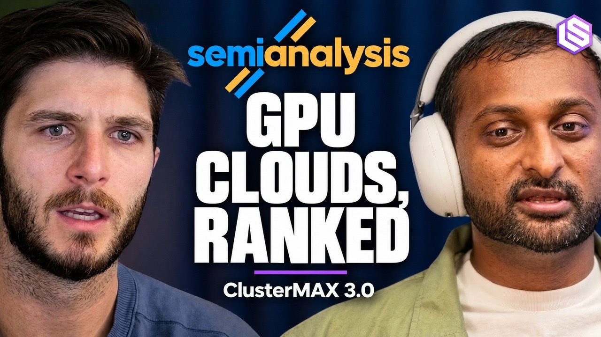
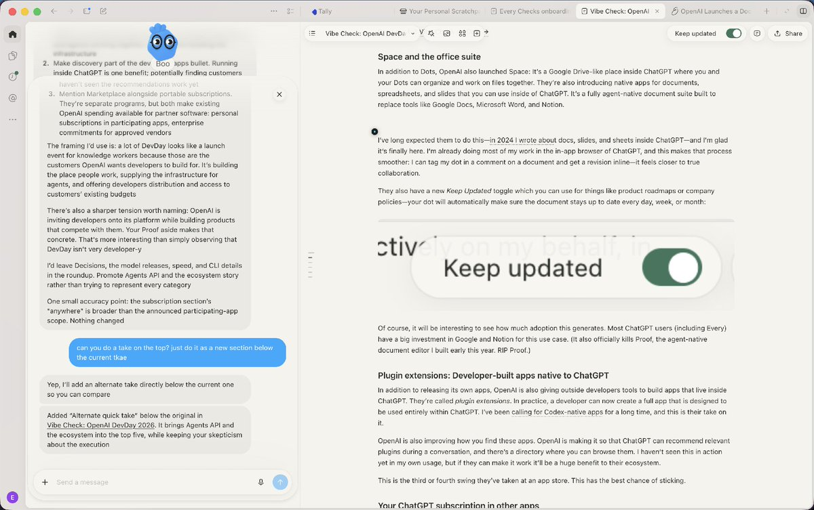

## TLDR

- **Anthropic's leaked S-1 and Higgsfield's margins expose the closed-API margin squeeze**, pushing production builders toward hybrid routing on self-hosted open weights.
- **SemiAnalysis upgraded Google Cloud to Gold in ClusterMAX 3.0**, highlighting TPU training scale while exposing multi-tenant isolation risks on neoclouds.
- **OpenAI launched Space and Dots to capture enterprise state**, shifting the AI moat from stateless foundation models to accumulated organizational context.
- **DeepMind previewed Gemini 4 Argon alongside Perplexity's low-cost routing model**, continuing the rapid pace of specialized frontier tooling.
- **Our play:** audit API margin traps with Model Garden tiering, benchmark training on TPU Ironwood, and anchor persistent agent state in BigQuery.

## The Big Picture: AI Spend Economics, Cloud Substrates, and Enterprise State

### The Anthropic S-1 Reality Check and Higgsfield's Margin Blueprint

Leaked draft S-1 filings reveal Anthropic faces $518B in forward compute obligations against an $8B operating loss on $4.66B in 2025 revenue [Harry Stebbings on 20VC (81 min watch, 04:15)](https://www.youtube.com/watch?v=UNH5YtuK5UE), with 47% of sales concentrated in Google and Amazon cloud channels [Scott Galloway on Pivot (58 min watch, 00:00)](https://www.youtube.com/watch?v=zsOTuGaa1hk). While frontier labs sign half-trillion-dollar infrastructure commitments to protect API pricing power, production AI startups are aggressively routing away from closed APIs to protect their own unit economics.

Higgsfield is the operational blueprint. CEO Alex Mashrabov disclosed burning $4M monthly on internal model compute ($10K–$30K weekly per engineer) and proved that relying purely on closed APIs caps SaaS gross margins at 20%–30% [Alex Mashrabov on 20VC (76 min watch, 34:10)](https://www.youtube.com/watch?v=jszn8rFtxm4). By fine-tuning and hosting open weights on private clusters, Higgsfield pushed gross margins past 80% while scaling to a $1B run-rate. The broader market is following: the Ramp AI Index shows business AI spend fell 5.2% WoW despite surging token volumes [@arakharazian (1 min read)](https://x.com/arakharazian/status/2105740752886309163), and OpenRouter telemetry shows DeepSeek Flash processing 22.7T weekly tokens as developers implement multi-model routing [@nicbstme (1 min read)](https://x.com/nicbstme/status/2105464782811697542) to avoid single-lab lock-in [@dharosaurus (1 min read)](https://x.com/dharosaurus/status/2105453525849518421).

**Your angle with founders**

- **The margin audit to run live:** If customer usage growth passes straight through to closed frontier APIs, your gross margin hits a hard ceiling. Sponsoring a frontier lab's compute obligations destroys SaaS unit economics.
- **Decompose the token stack by step difficulty:** Move high-volume context extraction, classification, and deterministic routing to self-hosted open models (like Gemma), reserving frontier closed models strictly for complex multi-step reasoning.
- **The question to leave behind:** "What percentage of your token bill is paying frontier reasoning prices for tasks an open-weight model could resolve at a fraction of the cost?"
- **Where GCP wins:** Gemini Enterprise Agent Platform (FKA Vertex AI) gives founders seamless model optionality—route commoditized volume to Gemma on TPUs or GPUs while querying Claude and Gemini Pro via Model Garden under one unified billing and governance layer.

### ClusterMAX 3.0 Upgrades Google Cloud to Gold: Neocloud Isolation Flaws and the TPU Advantage

SemiAnalysis and Latent Space released the ClusterMAX 3.0 GPU cloud rankings, officially upgrading Google Cloud from Bronze to Gold tier [Dylan Patel on Latent Space (58 min watch, 00:00)](https://www.youtube.com/watch?v=MWX36ZYnsm0). While second-tier neoclouds captured early developer attention with streamlined web consoles, the report exposed severe security isolation vulnerabilities across multi-tenant neoclouds, alongside multi-week node recovery delays during large-scale cluster outages.

The hardware reality is shifting toward enterprise-grade orchestration and custom silicon. Dylan Patel disclosed that Claude 5 pre-training was conducted on Google TPUs [Dylan Patel on Latent Space (58 min watch, 00:00)](https://www.youtube.com/watch?v=MWX36ZYnsm0), cementing TPU price-performance for continuous frontier training. Third-party testing confirmed Google's GPU infrastructure is Gold tier, though SemiAnalysis noted GCP's console and CLI friction can feel like the DMV compared to younger neoclouds [@SemiAnalysis_ (1 min read)](https://x.com/SemiAnalysis_/status/2106038582234185737). As the battle intensifies between hyperscalers, model providers, and data warehouses over customer commitments [@kolencherry (1 min read)](https://x.com/kolencherry/status/2105000552790933584), growth-stage builders spending tens of millions on compute are discovering that UI simplicity cannot compensate for cluster instability and multi-tenant security risks.

**Your angle with founders**

- **Concede the UI friction upfront:** Younger neoclouds have slicker web consoles and faster initial onboarding. If an engineer wants two raw GPUs for a weekend prototype, a neocloud UI feels lighter.
- **Compete on production reliability and security isolation:** When scaling to hundreds of nodes, multi-tenant isolation flaws and two-week hardware replacement delays kill training runs. Enterprise buyers require hardened VPC controls, kernel isolation, and automated node recovery.
- **Highlight silicon optionality:** Point to third-party verification that frontier labs pre-train flagship models on Google TPUs for proven price-performance.
- **Where GCP wins:** AI Hypercomputer pairs TPU Ironwood and NVIDIA GPUs with enterprise-grade GKE orchestration, SLA-backed node replacement, and VPC Service Controls that pass CISO security reviews.

### The State Moat: OpenAI Launches Space as Enterprise Value Shifts to Context

OpenAI unveiled Space—an agent-native office suite with native Docs, Sheets, and Slides built directly into ChatGPT—alongside Dots, proactive background agents designed to execute across applications [@danshipper (1 min read)](https://x.com/danshipper/status/2104982021626007885). Concurrently, Microsoft introduced its largest Copilot update with Autopilot, reaching 30M paid M365 seats [@satyanadella (1 min read)](https://x.com/satyanadella/status/2103455884366188544).

OpenAI designed Space specifically to eliminate the execution latency of agents manipulating external tools like Google Docs via browser automation [@danshipper (1 min read)](https://x.com/danshipper/status/2104982021626007885). This product clash accelerates a critical architectural transition: enterprise AI moats are moving away from stateless foundation models toward accumulated organizational state [@JayaGup10 (8 min read)](https://x.com/JayaGup10/status/2043505841127760066). As base intelligence commoditizes, durable value forms in behavioral calibration, episodic memory, and business context. Frontier labs are attempting to capture this layer by bundling execution environments and agent memory behind closed APIs. For enterprise builders, the architectural choice is no longer just selecting a model endpoint—it is deciding whether their company's operational intelligence accumulates inside a closed vendor interface or within an open, customer-governed data platform.

## Quick Hits

- **[Sundar Pichai previews Gemini 4 Argon for coding and cyber defense (1 min read)](https://x.com/sundarpichai/status/2105387952478277979)** — Google DeepMind rolled out its next-generation frontier model to enterprise testers via the Fairwind Program [@GoogleDeepMind (1 min read)](https://x.com/GoogleDeepMind/status/2105388084154056939).
- **[Perplexity open-sources pplx-decider-27b with a $0.04/M input Decisions API (1 min read)](https://x.com/AravSrinivas/status/2105774153903268288)** — Aravind Srinivas launched a 27B multimodal model engineered as an ultra-low-cost routing engine.
- **[Google DeepMind introduces SynthID Bio to watermark AI-designed proteins (1 min read)](https://x.com/GoogleDeepMind/status/2105624656170643854)** — Researchers embedded imperceptible provenance signatures directly into synthetic biological sequences without degrading protein function [Pushmeet Kohli on Google DeepMind Podcast (39 min watch, 06:00)](https://www.youtube.com/watch?v=HIUzrxQxTtw).
- **[Anthropic adds automated eval building and hillclimbing to Claude Code (12 min read)](https://x.com/ClaudeDevs/status/2104676099083190435)** — New `/build-eval` and `/hillclimb` commands allow coding agents to autonomously generate test suites and iterate against codebases.
- **[AMD acquires Fei-Fei Li's World Labs for $8.2B to scale physical AI simulation (2 min read)](https://x.com/aakashgupta/status/2104824751588012455)** — Lisa Su brought Dr. Fei-Fei Li into AMD as Chief Scientist to challenge Nvidia's physical AI simulation ecosystem [@martin_casado (2 min read)](https://x.com/martin_casado/status/2104666454054580602).

## Seller's Edge: The State Custody Trap

In early AI deployments, changing a model provider was a trivial API endpoint swap. Edition #17 taught sellers to pitch the substrate beneath commoditizing models; this week reveals the battle above them. As agents evolve from stateless chatbots into persistent workers, enterprise defensibility is shifting entirely to accumulated state: episodic memory, procedural workflows, and organizational context [@JayaGup10 (8 min read)](https://x.com/JayaGup10/status/2043505841127760066). Frontier labs recognize this and are actively coupling reasoning engines to proprietary state stores to convert temporary model leads into permanent data lock-in.

Look at OpenAI Space and Dots. By embedding document authoring, execution traces, and agent memory directly inside ChatGPT, OpenAI ensures that even if a rival model leapfrogs GPT-6 in reasoning next quarter, a customer cannot switch without abandoning months of operational context [@danshipper (1 min read)](https://x.com/danshipper/status/2104982021626007885). An AI founder who builds on closed agent workspaces is surrendering their core intellectual property—the precise behavioral history of how their enterprise operates—to an upstream vendor whose long-term incentives conflict with theirs.

In your next founder meeting, do not debate leaderboard benchmarks. Reframe the decision around state custody: *"If a faster, cheaper model launches next month, can you repoint your agent’s memory and tool history with a single configuration change, or is your organizational context trapped in your vendor's proprietary runtime?"* Guide them to decouple intelligence from state: store memory, session context, and business data in customer-governed data lakes and enterprise databases, treating LLMs as interchangeable, stateless execution engines.

## Our Play

Every thread this edition—massive frontier compute liabilities, neocloud isolation risks, and proprietary workspace lock-in—points to one GCP position: **an enterprise cloud protecting margins, cluster reliability, and sovereign data state.** Three concrete motions:

- **Reclaim software margins with Model Garden tiering.** *Signal:* passing all queries through closed APIs destroys margins. *Why GCP wins:* Model Garden enables hybrid routing, placing routine extraction on self-hosted Gemma while reserving Claude or Gemini for reasoning. *The move:* audit call traces and benchmark high-volume steps on Gemma.
- **Compete on cluster reliability and TPU economics.** *Signal:* neoclouds suffer multi-tenant isolation flaws and multi-week node outages. *Why GCP wins:* ClusterMAX Gold-rated infrastructure pairs GKE orchestration and VPC Service Controls with TPU Ironwood price-performance. *The move:* whiteboard automated node recovery and run a TPU Ironwood eval.
- **Decouple enterprise state from model silos.** *Signal:* proprietary workspaces attempt to trap agent memory and workflows behind closed APIs. *Why GCP wins:* Agentic Data Cloud and BigQuery keep organizational state customer-governed and model-agnostic. *The move:* demonstrate how Agent Runtime and BigQuery store persistent memory without vendor lock-in.

---

*Sources: 110 bookmarks, 14 podcast episodes, 41 lab announcements from the AI content library. [Archive](/archive)*