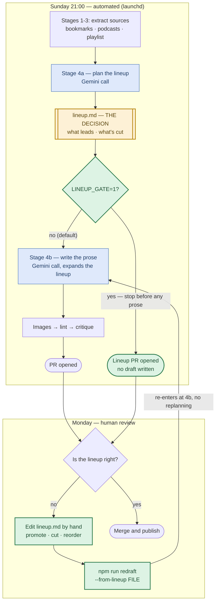

# Brief Signal — Editorial Process (the order of operations)

The single human-readable map of how an edition gets made. The *rules* live in
the files the machine actually reads (right column) — this doc explains the
sequence and links each step to its enforcement. If this doc and an encoded
rule ever disagree, the encoded rule is what runs: fix one to match the other.

**The core principle: event-first, theme-informed.** We do not pick themes
and hunt for stories to fit them (that recycles stale arcs). Standing themes
are memory; each week's *events* compete for slots; winners get placed on the
arc they advance. The registry informs selection — it never gates it.

**One-line version: themes are memory, events are selection, braiding is
construction.**

## The Editorial Gate

`lineup.md` **is** the editorial decision — what leads, what merges, what's
cut. The draft is only its execution. So the lineup, not the prose, is the
thing to review and the thing to correct: `npm run redraft -- <lineup file>`
re-enters at Stage 4b and rewrites the prose from an edited lineup, without
replanning. The Sunday path is unchanged; the gate costs nothing on the weeks
the lineup is right.

### Reviewing before the edition exists (`LINEUP_GATE=1`)

By default Stage 4b expands the lineup moments after 4a writes it, so the review
above happens with the prose already written. To review the *selection* first:

```bash
LINEUP_GATE=1 ./scripts/generate-weekly.sh    # extracts, plans, stops, opens a lineup PR
npm run redraft -- content/briefings/drafts/<date>-lineup.md   # after you approve/edit
```

Or, without the pipeline: `npm run lineup` runs Stage 4a alone against the
newest KBs and writes nothing else.

Under the gate no draft is written, so images, lint, critique and the repair pass
are all skipped, and the signal digest sweeps against the **lineup** instead of a
draft — answering "what did Stage 4a leave on the floor?" while acting on the
answer is still cheap. Promoting a recommended read is the cheapest correction
there is: move it into the lineup's Quick Hits and redraft.

**It defaults off.** A gated Sunday produces no edition until a human acts, so a
busy Monday costs the week's briefing. Off by default means the unattended run
still ships a draft; the gate is opt-in for weeks with time to use it.

### What the PR body leads with

The PR body opens with **the editorial decision** — rendered by
`scripts/lineup-digest.js` out of the lineup — then the **left-on-the-floor
summary**, then the critique, then the full signal digest collapsed behind a
`<details>`. That order is deliberate: the editorial decision leads and the
mechanical sweeps support it. It used to be reversed, which put the registry diff
at line ~329 behind a ~270-line ratings table — present, but unreachable.

The editorial section answers three questions in order:

| Question | Section | Source |
|---|---|---|
| What got in, and on what grounds? | ✅ Selected — Big Picture / Quick Hits | every field Stage 4a wrote per story: event, what changed, arc, gravity, seller play, merges, braid |
| What's worth reading that didn't run? | 📚 Recommended reads | Stage 4a nominates 3-5 high-value items that earned no slot |
| What got cut, and was any of it good? | ✂️ Cut | the cut ledger, sorted by Stage 4a's own `quality:` rating, HIGH first |

**Two views of the same exclusion, deliberately kept apart.** The ✂️ Cut ledger
is Stage 4a rating its own rejects — a claim, not a check, and this repo has been
burned by model self-audits before (see the note above `lineupTask`). It earns
its place because it is the only signal that exists for bookmarks, which carry no
grades. The 🔎 **Left on the floor** block underneath is the independent one:
`signal-digest.js --summary` reads the KBs' own grades against the lineup's own
URLs with no model in the loop, and lists only the misses. Where the two
disagree — something in the sweep that the ledger never mentions — the
disagreement is the finding.

Everything under `## Editorial review notes` in the lineup file is stripped
before Stage 4b sees it. It is written for the human reviewing the selection, and
paying to feed it back into the prose pass is the exact waste the removed
HIGH-signal disposition block used to cause.

Diagram source: [`docs/diagrams/editorial-gate.mmd`](diagrams/editorial-gate.mmd)
(edit that, not the exported `.svg`).



| # | Step | What happens | Where it's encoded |
|---|------|--------------|--------------------|
| 0 | Themes already exist | Durable arcs with status + history ("the show's ongoing storylines"). Updated only by Simon's approval via per-edition proposals. | `content/themes.md` |
| 1 | Extract (Sun eve) | Bookmarks (incl. full X Articles), playlist, podcasts → 3 KB files; freshness-checked. | `scripts/generate-weekly.sh` Stages 1-3; `scripts/fetch-bookmarks.py`; extraction skills |
| 2 | Event sweep | Model-release scan across ALL KBs; HIGH-signal disposition — every HIGH episode gets a landing spot or a stated cut ("silence is not a disposition"). | Lead-Story Doctrine in `scripts/briefing-prompt.md`; `lineupTask` in `scripts/generate-briefing.js` (Stage 4a) |
| 3 | Merge + score | Same-thesis items become ONE story (name the tension). Score: datable event × counted gravity (KBs × shows) × changed-this-week × seller play. | Lead-Story Doctrine, Steps 2-4 |
| 4 | Tag to arcs | Each candidate: `advances: {arc}` or NEW THREAD. Registry updates *proposed*, never auto-applied. | `lineupTask`; `drafts/{date}-themes-proposed.md` |
| 5 | Pick the braid | Per story, `braids in:` names the X-bookmark voices to weave (target 2-3 per story) alongside podcast anchors. | `lineupTask`; braiding rule in prompt's Section assignment |
| 5a | Dispose of the rest | Every loser is written down: 3-5 as **recommended reads** (high value, no slot), the remainder in the **cut ledger** with a `quality:` rating that is about the item's merit, not about whether it won. Nothing leaves the lineup unaccounted for. | `lineupTask`, under `## Editorial review notes` |
| 5b | **Gate (optional)** | `LINEUP_GATE=1` stops here: the lineup + proposed registry are committed and a PR is opened with no draft. Steps 6-8 are skipped; the signal digest sweeps against the lineup. Resume with `npm run redraft`. Defaults **off**. | `scripts/generate-weekly.sh`; `--lineup-only` in `scripts/generate-briefing.js` |
| 6 | Draft | Stage 4b expands the approved lineup: stories braided, angle blocks + Our Play grounded ONLY in the GCP playbook + week's KBs, Seller's Edge teach (~300-350 words, worked example). | `scripts/briefing-prompt.md` template; `content/gcp-playbook.md` (fed to Stage 4b) |
| 7 | Verify | Images fetched (YouTube-thumb fallback) → deterministic lint (URLs, hooks, angle lines, source overlap, banned words, naming, image validity, cross-edition lead repeat) + LLM critique (editorial judgment + coverage check). | `fetch-og.js`; `scripts/lint-briefing.js`; `scripts/critique-briefing.js` |
| 8 | Repair (one shot) | Hard failures → ONE targeted Gemini revision; fabrication guard (no new URLs ever); image failures excluded (disk problems). Residual failures go in the PR body. | `scripts/repair-briefing.js` |
| 9 | Human review (Mon) | Simon reviews the PR, which opens with the full editorial decision — what was selected and why, the recommended reads, the cut ledger with a quality rating per reject, then the proposed registry: right events? right arcs? right braid? anything good in the reject pile? Then prose; approves/rejects the themes-proposed update; merges → deploy → audio pipeline. | PR body (`scripts/lineup-digest.js` + `signal-digest.js --summary`) + `drafts/{date}-lineup.md` |

## Standing sections & their specs
- **TLDR** — 4-5 bold-hook bullets. (prompt template)
- **Big Picture** — 2-3 theme-led, source-braided stories; angle blocks only
  where a seller can act. (prompt: template + Section Voice Guide)
- **Quick Hits** — 3-6 one-liners; HIGH-rated episodes have presumptive first
  claim on slots. (prompt: Section assignment)
- **Seller's Edge** — one teach per edition, compounds on `/sellers-edge`.
  (prompt: Voice Guide + used-so-far ledger; `build.js` compiles the page)
- **Our Play** — 3 motions, Signal → Why GCP wins → The move, claims only
  from `content/gcp-playbook.md`. (prompt: Our Play rules; playbook refresh:
  `/refresh-gcp-playbook` skill + 90-day staleness warning in the pipeline)

## Related docs
- `FOR_SIMON.md` — the narrative history and war stories behind these rules
- `tasks/lessons.md` — correction rules (review at session start)
- `docs/internal/gcp-playbook-internal.md` (gitignored) — objection bank +
  Simon's input checklist
