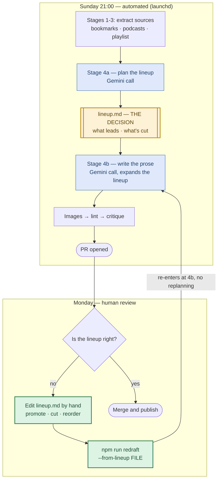

# Brief Signal — Editorial Process (the order of operations)

The single human-readable map of how an edition gets made. The *rules* live in
the files the machine actually reads (right column) — this doc explains the
sequence and links each step to its enforcement. If this doc and an encoded
rule ever disagree, the encoded rule is what runs: fix one to match the other.

**The core principle: event-first, theme-informed.** We do not pick themes
and hunt for stories to fit them (that recycles stale arcs). Standing themes
are memory; each week's *events* compete for slots; winners get placed on the
arc they advance. The registry informs selection — it never gates it.

**One-line version: themes are memory, events are selection, braiding is
construction.**

## The Editorial Gate

`lineup.md` **is** the editorial decision — what leads, what merges, what's
cut. The draft is only its execution. So the lineup, not the prose, is the
thing to review and the thing to correct: `npm run redraft -- <lineup file>`
re-enters at Stage 4b and rewrites the prose from an edited lineup, without
replanning. The Sunday path is unchanged; the gate costs nothing on the weeks
the lineup is right.

Diagram source: [`docs/diagrams/editorial-gate.mmd`](diagrams/editorial-gate.mmd)
(edit that, not the exported `.svg`).

| # | Step | What happens | Where it's encoded |
|---|------|--------------|--------------------|
| 0 | Themes already exist | Durable arcs with status + history ("the show's ongoing storylines"). Updated only by Simon's approval via per-edition proposals. | `content/themes.md` |
| 1 | Extract (Sun eve) | Bookmarks (incl. full X Articles), playlist, podcasts → 3 KB files; freshness-checked. | `scripts/generate-weekly.sh` Stages 1-3; `scripts/fetch-bookmarks.py`; extraction skills |
| 2 | Event sweep | Model-release scan across ALL KBs; HIGH-signal disposition — every HIGH episode gets a landing spot or a stated cut ("silence is not a disposition"). | Lead-Story Doctrine in `scripts/briefing-prompt.md`; `lineupTask` in `scripts/generate-briefing.js` (Stage 4a) |
| 3 | Merge + score | Same-thesis items become ONE story (name the tension). Score: datable event × counted gravity (KBs × shows) × changed-this-week × seller play. | Lead-Story Doctrine, Steps 2-4 |
| 4 | Tag to arcs | Each candidate: `advances: {arc}` or NEW THREAD. Registry updates *proposed*, never auto-applied. | `lineupTask`; `drafts/{date}-themes-proposed.md` |
| 5 | Pick the braid | Per story, `braids in:` names the X-bookmark voices to weave (target 2-3 per story) alongside podcast anchors. | `lineupTask`; braiding rule in prompt's Section assignment |
| 6 | Draft | Stage 4b expands the approved lineup: stories braided, angle blocks + Our Play grounded ONLY in the GCP playbook + week's KBs, Seller's Edge teach (~300-350 words, worked example). | `scripts/briefing-prompt.md` template; `content/gcp-playbook.md` (fed to Stage 4b) |
| 7 | Verify | Images fetched (YouTube-thumb fallback) → deterministic lint (URLs, hooks, angle lines, source overlap, banned words, naming, image validity, cross-edition lead repeat) + LLM critique (editorial judgment + coverage check). | `fetch-og.js`; `scripts/lint-briefing.js`; `scripts/critique-briefing.js` |
| 8 | Repair (one shot) | Hard failures → ONE targeted Gemini revision; fabrication guard (no new URLs ever); image failures excluded (disk problems). Residual failures go in the PR body. | `scripts/repair-briefing.js` |
| 9 | Human review (Mon) | Simon reviews the PR: lineup file first (right events? right arcs? right braid?), then prose; approves/rejects the themes-proposed update; merges → deploy → audio pipeline. | PR body + `drafts/{date}-lineup.md` |

## Standing sections & their specs
- **TLDR** — 4-5 bold-hook bullets. (prompt template)
- **Big Picture** — 2-3 theme-led, source-braided stories; angle blocks only
  where a seller can act. (prompt: template + Section Voice Guide)
- **Quick Hits** — 3-6 one-liners; HIGH-rated episodes have presumptive first
  claim on slots. (prompt: Section assignment)
- **Seller's Edge** — one teach per edition, compounds on `/sellers-edge`.
  (prompt: Voice Guide + used-so-far ledger; `build.js` compiles the page)
- **Our Play** — 3 motions, Signal → Why GCP wins → The move, claims only
  from `content/gcp-playbook.md`. (prompt: Our Play rules; playbook refresh:
  `/refresh-gcp-playbook` skill + 90-day staleness warning in the pipeline)

## Related docs
- `FOR_SIMON.md` — the narrative history and war stories behind these rules
- `tasks/lessons.md` — correction rules (review at session start)
- `docs/internal/gcp-playbook-internal.md` (gitignored) — objection bank +
  Simon's input checklist
